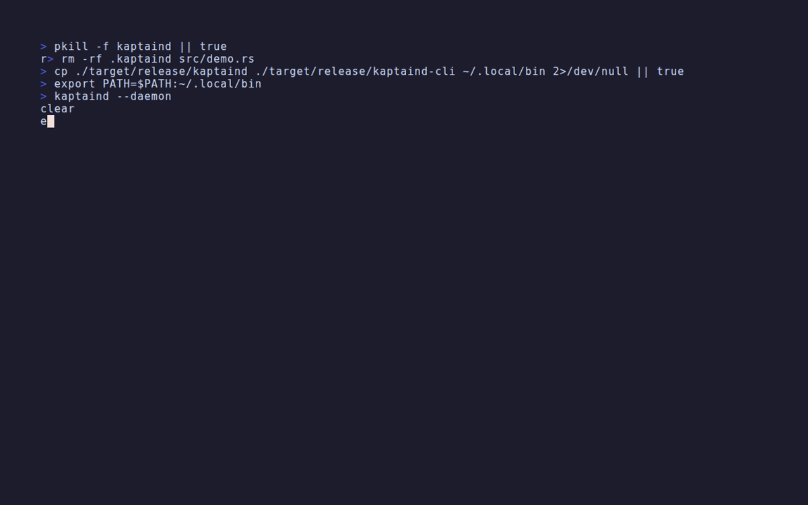

# kaptaind

<p align="center">
  
</p>

`kaptaind` is an automated, daemon-based semantic versioning tool. It actively watches a repository for changes, batches those changes into logical clusters based on time windows, analyzes the impact of those changes, computes a semantic-version bump, writes the new `VERSION`, persists analysis artifacts, and automatically produces rich `git` commits on your behalf.

It eliminates manual version bumping and subjective commit messages by replacing them with deterministic, rule-based Git operations.

## Table of Contents

- [Features](#features)
- [Getting Started](#getting-started)
  - [Installation](#installation)
  - [Runtime Requirements](#runtime-requirements)
  - [Quick Start](#quick-start)
- [Quick Reference](#quick-reference)
- [How It Works](#how-it-works)
- [CLI Commands](#cli-commands)
- [Configuration](#configuration)
- [Security & Access Control](#security--access-control)
- [Monitoring & Observability](#monitoring--observability)
- [Performance Tuning](#performance-tuning)
- [Troubleshooting](#troubleshooting)
- [Man Pages](#man-pages)
- [Contributing](#contributing)

## Features

- **Filesystem watcher:** Native, OS-level filesystem event watching using `notify`.
- **Change clustering:** Automatically batches grouped sequences of fast file changes (default window: 5 seconds).
- **Intelligent Project Discovery (Trawler):** Bulk-discover codebases across directory trees with 99% accuracy. Supports 19 languages with confidence-scored detection, monorepo awareness, and smart directory filtering.
- **Multi-language diff analysis** with dedicated adapters for 19 languages/frameworks:
  - **Core:** Rust, Go, Swift, Kotlin, Java, TypeScript, JavaScript, Python, Ruby, Elixir, PHP, .NET, C++
  - **Extended:** Lua, Scala, Clojure, Haskell, Julia, R, Perl
  - Framework detection: React hooks (`useX`), Next.js routes, SvelteKit routes, Astro, Vue, Svelte
  - Design tokens: Tailwind, theme files, CSS custom properties
- **Intelligent Diff Scoring** across five dimensions:
  - *Structural:* Scores the amount of code churn and file spread.
  - *API Analysis:* Detects new, modified, and removed API surface via language adapters and fallback line scanning. Recognizes framework route files (Next.js `app/`, `pages/`, SvelteKit `routes/`), design token files (`tailwind.config`, `theme`, `tokens`), and CSS custom properties as API surface.
  - *Dependency Tracking:* Parses `Cargo.toml`, `package.json`, `requirements.txt`. Recognizes `yarn.lock`, `bun.lockb`, `pnpm-lock.yaml`, `Podfile`, `build.gradle(.kts)`, and `gradle.lockfile`.
  - *Runtime Impact:* Triggers high severity when deployment configs (`docker`, `k8s`, `.service`), web configs (`next.config.*`, `vite.config.*`, `vercel.json`, `tsconfig.*`), or mobile configs (`Info.plist`, `AndroidManifest.xml`, `*.xcconfig`) are modified.
  - *Bundle Size (opt-in):* Runs a configurable build command, measures output directory size, and scores based on delta from previous build.
- **Adaptive Clustering:** Optionally expands the clustering window during bursts. When `adaptive = true`, the window interpolates linearly from `base_window` toward `max_window` as the event count approaches `burst_threshold`, giving burst protection without sacrificing normal responsiveness.
- **Language Version Syntax Contextualization (LV-SCL):** Version-aware parsing for all 12 adapters with **confidence-based reliability scoring**. Language versions are detected from project manifests (`Cargo.toml` edition, `go.mod`, `.python-version`, `tsconfig.json` target, `package.json` engines, etc.) and cached with a 1-hour TTL. Version source is tracked (Runtime > Manifest > Inferred > Unknown) for adaptive confidence scoring. Version-specific syntax (Python 3.10+ `match`/`case`, Go 1.18+ generics, TypeScript 3.8+ `export type`, Svelte 5 runes) is recognized automatically. Per-file parse metadata (language, detected version, parser used, **confidence 0–1, version source**) is emitted into every analysis artifact.
- **Plugin Architecture:** Extend kaptaind to any language with an external script or binary. Plugins use a simple JSON stdio protocol (`stdin: {"file":"<path>"}` → `stdout: {"symbols":[...]}`). Configure one or more plugin adapters under `[plugins]`. Plugins are loaded into the adapter registry alongside built-in adapters and receive the same cache, version detection, and scoring pipeline.
- **Semantic Auto-versioning:**
  - **Major:** Automatically bumped on breaking API removals.
  - **Minor:** Automatically bumped when new APIs are added, or diff scores reach the configurable `[version_thresholds].minor` cutoff (default `0.6`).
  - **Patch:** Bumped for standard structural churn and minor improvements above the `[version_thresholds].patch` cutoff (default `0.1`).
- **Post-Commit Qualification & Release Pipeline (opt-in):** After every successful commit, kaptaind can run a build, update a stability score, evaluate release qualification, package a `.tar.gz` artifact with a SHA-256 manifest, and distribute it — all automatically. Gated by `[qualification].enabled = true`. Qualification checks include: minimum stability score, minimum pass streak, diff-spike guard, cooldown, test gate, and build gate.
- **Confidence-Aware Stability Scoring:** Tracks a per-commit stability score with **parser confidence penalty**: `Sₙ = clamp(Sₙ₋₁ + w₁·T + w₂·B − w₃·Δ − w₄·R − w₅·(1−C) − λ·Δt, 0, 1)` where C is mean parse confidence (0–1) across all files. This prevents false stability inflation from unreliable parsing. Scores persist to `.kaptaind/stability.json` and are surfaced in the dashboard and CI hint.
- **Incremental LLM Gate:** Inference is skipped automatically when `weight.score < config.inference.min_score_for_inference`, saving API quota on trivial changes.
- **Automated Commit Formatting:** Git commits are generated for each bump, summarizing what changed semantically (e.g., `kaptaind: Minor -> v0.2.0 [api-added; paths=4; api_touches=2; deps=0; runtime=0; score=0.62]`).
- **Test Hook Gating:** Automatically runs a configurable test hook (like `cargo test`) before committing; fails block the commit entirely.
- **Configurable staging:** Choose between staging all files (default), only cluster-touched files, or pattern-matched files. Exclude patterns prevent sensitive files from being committed.
- **Aim of Change (AoC) sessions:** Group related changes into named sessions with full trace history, agent interception, and shipped manifests.
- **Visual Asset Channel Saturation (VACS):** A capacity-aware background generation system that converts surplus inference capacity into high-value visual/documentation assets (like diagrams and architecture maps) linked directly to code changes. VACS operates opportunistically and surfaces assets in the CLI.
- **Multi-Provider Inference Routing:** Intelligently routes commit message generation to the best available inference provider. Automatically detects and prioritizes: **Anthropic Claude** → **OpenAI GPT-4o** → **Local Ollama** fallback. No API keys needed; works offline with Ollama.
- **Commit Validation Modes:** Choose between **Fast Mode** (single provider, lowest latency) or **Consensus Mode** (multiple local models with semantic cross-comparison, lowest hallucination risk). Developer-selected via config.
- **Nautical Notifications:** Real-time commit, push, start/stop, and error alerts through native desktop notifications, configurable shell hooks, and Discord/Slack webhooks. Optional nautical theme renders maritime emoji titles like "⚓ Ahoy!" and "🚢 Ship's log updated".
- **🎣 Angler Hook & Selective Capture System:** A comprehensive four-part system for advanced automation:
  - *Git Hooks Integration:* Manage client-side git hooks (pre-commit, post-commit, pre-push, etc.) with configurable commands, timeouts, and file pattern matching.
  - *Enhanced Webhooks:* Send HTTP webhooks with HMAC signature verification, exponential backoff retries, rate limiting, and event filtering.
  - *Selective Change Capture:* Pattern-based filtering and capture of file changes with actions (Pass, Block, Quarantine, Tag, Webhook, Execute). Includes security-sensitive file detection and predefined templates.
  - *Bait Plugin System:* External plugin system allowing custom scripts and webhooks to respond to kaptaind lifecycle events. Auto-discovers plugins from `.kaptaind/baits/`.

## Getting Started

### Installation

Three ways to install kaptaind:

#### 🚀 Quick Install (CLI Installer) — Recommended

One-liner installer for Linux, macOS, and WSL:

```bash
curl -fsSL https://raw.githubusercontent.com/elci-group/kaptaind/main/install.sh | bash
```

Or clone and run:

```bash
git clone https://github.com/elci-group/kaptaind.git
cd kaptaind
bash install.sh
```

See `install.sh --help` for options (custom path, system-wide, debug build, etc.).

### Runtime Requirements

- **Git executable in `PATH`**: Kaptaind uses the system `git` command for repository status, staging, commits, and commit hash lookup. Startup fails with a clear error if `git` is unavailable.
- **Unix-like daemon mode**: `kaptaind --daemon` uses Kaptaind's internal Unix process detachment helper. On non-Unix environments, run in foreground mode or through a platform service manager.

#### 💻 GUI Installer

For a graphical installation experience:

```bash
cargo build --release --features gui --bin kaptaind-installer
./target/release/kaptaind-installer
```

Walks you through dependency checks, installation path selection, and build options with a friendly interface.

#### 📦 Manual Installation

Build and install manually:

```bash
git clone https://github.com/elci-group/kaptaind.git
cd kaptaind
cargo build --release
mkdir -p ~/.local/bin
cp target/release/{kaptaind,kaptaind-cli} ~/.local/bin/
chmod +x ~/.local/bin/kaptaind*
```

**For detailed installation instructions**, see [INSTALL.md](INSTALL.md).

### Running

To run `kaptaind` against your current directory in the foreground:

```bash
kaptaind
```

To securely run it as a detached background daemon:

```bash
kaptaind --daemon
```


### Quick Setup

Generate a `kaptaind.toml` and `.kaptainignore` tuned to your project type:

```bash
kaptaind-cli init
```

Supported project types: Rust, Node, Python, Go, Swift, Kotlin. The command auto-detects by looking for `Cargo.toml`, `package.json`, `Package.swift`, `build.gradle.kts`, etc.

### CLI Inspection (`kaptaind-cli`)

Kaptaind comes with a secondary binary to inspect the daemon's state:

```bash
# Bulk discover codebases (99% accuracy across 19 languages)
kaptaind-cli trawl                       # Discover all projects in current directory
kaptaind-cli trawl --path ~/projects     # Trawl specific directory
kaptaind-cli trawl --max-depth 3         # Limit recursion depth
kaptaind-cli trawl --type rust,node      # Only Rust and Node.js projects
kaptaind-cli trawl --require-git         # Only git repositories

# View live daemon health and current version
kaptaind-cli status

# View recent automated commits, scores, and bump reasons
kaptaind-cli log

# Dry-run an analysis on the current uncommitted working tree
kaptaind-cli analyze

# Manage Aim of Change sessions
kaptaind-cli aoc start "feature: auth flow"
kaptaind-cli aoc status
kaptaind-cli aoc ship

# Intercept agent operations for contextual tracing
kaptaind-cli aoc intercept --model claude-3-5-sonnet --intent "refactor auth" -- npm test

# View and manage Visual Asset Channel Saturation (VACS) assets
kaptaind-cli vacs show
kaptaind-cli vacs generate --asset-type diagram

# Live dashboard: version, daemon state, stability bar, releases, recent analyses
kaptaind-cli dashboard

# CI/CD hint: release or hold recommendation based on stability and qualification
kaptaind-cli ci-hint                  # plain text
kaptaind-cli ci-hint --format json    # machine-readable JSON
kaptaind-cli ci-hint --format github  # GitHub Actions annotations + set-output

# Ship release binaries, installers, and distribution channels
kaptaind-cli ship plan                # Preview what would ship
kaptaind-cli ship plan --format json  # Machine-readable dry-run plan
kaptaind-cli ship run                 # Execute the ship pipeline
kaptaind-cli ship run --force         # Skip qualification gates
kaptaind-cli ship stable              # Ship a stable release from VERSION
kaptaind-cli ship stable --force      # Skip qualification gates
kaptaind-cli ship stable --dry-run    # Preview the stable release
kaptaind-cli ship nightly             # Ship a nightly prerelease
kaptaind-cli ship nightly --no-force  # Enforce qualification gates
kaptaind-cli ship nightly --dry-run   # Preview the nightly version
kaptaind-cli ship status              # Show the last ship run
kaptaind-cli ship status --auto       # Show last run + next auto-ship fires
kaptaind-cli ship status --format json
```

## Quick Reference

| Command | Purpose | Config section |
|---------|---------|----------------|
| `kaptaind` | Run daemon in foreground | — |
| `kaptaind --daemon` | Run daemon detached | `[watch]`, `[cluster]`, `[ratelimit]` |
| `kaptaind-cli init` | Generate `kaptaind.toml` and `.kaptainignore` | — |
| `kaptaind-cli status` | Daemon health and version | — |
| `kaptaind-cli validate` | Validate `kaptaind.toml` | — |
| `kaptaind-cli log` | Recent automated commits | — |
| `kaptaind-cli analyze` | Dry-run diff analysis | `[weights]`, `[inference]` |
| `kaptaind-cli dashboard` | Live terminal dashboard | — |
| `kaptaind-cli aoc start` | Start Aim-of-Change session | `[aoc]` |
| `kaptaind-cli ship plan` | Preview release | `[ship]` |
| `kaptaind-cli ship run` | Build and publish release | `[ship]`, `[distribution]` |
| `kaptaind-cli ci-hint` | Release/hold recommendation | `[qualification]` |
| `kaptaind-cli shark status` | HA leadership state | `[shark]` |

| File / Directory | Purpose |
|------------------|---------|
| `kaptaind.toml` | Main configuration |
| `.kaptainignore` | Paths ignored by the watcher |
| `.kaptaind/status.json` | Daemon state |
| `.kaptaind/analysis/` | Per-cluster analysis artifacts |
| `.kaptaind/audit.jsonl` | Structured audit log |
| `.kaptaind/releases/` | Packaged release artifacts |
| `.kaptaind/ship/` | Ship artifacts, SBOMs, provenance |

The `ship stable` and `ship nightly` commands automate release versioning and
publishing semantics. `stable` uses the current `VERSION`, creates a `v{VERSION}`
git tag, publishes a non-prerelease GitHub release, and generates release notes
from commits since the previous stable release. `nightly` computes a prerelease
version such as `0.1.2-nightly.20260707.abc1234`, marks the GitHub release as a
prerelease, skips qualification gates by default, refuses to ship the same
date+commit twice (unless `--force` is used), and can automatically prune old
builds via `retain_count` in `[ship.nightly]`.

The daemon can also run these releases automatically on a cron schedule via
`[ship.auto_nightly]` and `[ship.auto_stable]`. When enabled, the scheduler
computes the next fire time, runs the ship pipeline, logs to the audit log, and
sends nautical release notifications. Use `kaptaind-cli ship status --auto` to
preview the next scheduled fires.

Release artifacts can be hardened with GPG-signed SHA256 checksums and signed
git tags by setting `sign = true` under `[ship]`. SBOM generation (`[ship.sbom]`)
produces an SPDX 2.3 JSON bill of materials from `Cargo.lock` or
`package-lock.json` and attaches it to the release. The stability engine also
tracks per-test outcomes and emits a nautical "flaky tests" notification when a
test flips between pass and fail within the recent window.



You can also use special `kaptaind` flags to see system indices:
- `kaptaind --dock`: View watched static projects.
- `kaptaind --radar`: View active projects and their event rates.
- `kaptaind --lanes`: View the load states of internal analysis engines.


### Background Architecture & Daemon Lifecycle

Kaptaind operates entirely in the background, minimizing developer friction while maintaining deep contextual awareness of codebase changes. Here is how the internal architecture flows:

1. **Daemonization & Persistence (`src/main.rs`, `src/daemon/process.rs`)**: 
   When executed with `--daemon`, the process uses Kaptaind's internal Unix daemonization helper to fork, detach from the current shell, redirect stdio, and write `daemon.pid`, `daemon.out`, and `daemon.err` files in the `.kaptaind/` directory.

2. **Filesystem Watcher (`src/watcher/`)**: 
   A dedicated OS thread runs the `notify` watcher. It translates low-level `inotify`/`FSEvents` into abstract `FsEvent` models and pushes them across a cross-thread `tokio::mpsc` channel. 

3. **Temporal Clustering (`src/cluster/`)**: 
   As file events stream in, the `ClusterEngine` groups them based on the `[cluster].window` (default 5s). This prevents rapid saves (e.g., from an IDE format-on-save) from triggering dozens of distinct commits.

4. **Analysis Pipeline (`src/diff/`)**: 
   Once a cluster window closes, the diff is scored across five engines:
   - *Structural (`text.rs`):* Counts raw path touches, path spread, and churn.
   - *AST/API (`ast.rs` + `lang/`):* Language-aware adapters extract exported symbols for Rust, Go, Swift, Kotlin, TypeScript, JavaScript, Vue, Svelte, Astro, SCSS, HTML/CSS, and Python. A fallback line scanner handles unrecognized files.
   - *Dependencies (`api.rs`):* Parses `Cargo.toml`, `package.json`, `requirements.txt`; recognizes lock files for npm, Yarn, pnpm, Bun, Cargo, Poetry, CocoaPods, and Gradle.
   - *Runtime (`api.rs`):* Detects changes to deployment orchestration files (Docker, k8s, Helm), web framework configs (Next.js, Vite, Nuxt, Svelte, Astro, Tailwind, PostCSS, webpack), and mobile platform configs (Xcode, Gradle, Android).
   - *Bundle Size (`bundle.rs`, opt-in):* Runs a build command, measures output size, and scores the delta against the previous build.

5. **Test Hook & Telemetry Gating (`src/daemon/scheduler.rs`)**: 
   Before any commit, the daemon updates `.kaptaind/status.json` and runs the pre-configured test hook (`cargo test` by default). If tests fail, the workflow aborts. It also tracks the "token cost" of the diff size and commit message size, writing to `.kaptaind/telemetry.json`.

6. **Version Bump & Git Orchestration (`src/version/`, `src/commit/`, `src/git/`)**: 
   The weights are aggregated. Breaking APIs trigger `Major` bumps; new APIs trigger `Minor`; standard churn triggers `Patch`. The new version is flushed to the `VERSION` file (and `Cargo.toml` if present), a rich commit message is generated, and a JSON artifact is stored in `.kaptaind/analysis/` before Kaptaind's internal Git command adapter creates the commit via the system `git` executable. Staging is configurable: stage all files (default), only cluster-touched files, or pattern-matched files with optional excludes. Commits can be GPG-signed with `[commit] sign = true`. Pushes can enforce required CI status checks via `[push.protection]`. Notifications are dispatched via shell hooks, Discord/Slack webhooks, or both.

7. **Access Control (`src/rbac/`)**: 
   On shared machines, `[rbac]` restricts privileged CLI commands and daemon startup to configured OS users and groups.

## Monitoring & Observability

The daemon exposes a health/metrics server on `localhost:9090` (configurable via `health_port`):

- `GET /health` — JSON health check including daemon version and Shark HA role.
- `GET /metrics` — JSON counter snapshot (clusters processed, commits made, artifacts pruned, etc.).
- `GET /metrics/prometheus` — Prometheus-compatible text exposition format including counters, stability score, release count, and version labels.
- `GET /events` — Server-sent events stream of daemon lifecycle events.

Example Prometheus scrape config:

```yaml
scrape_configs:
  - job_name: kaptaind
    static_configs:
      - targets: ['localhost:9090']
    metrics_path: /metrics/prometheus
```

## Configuration

`kaptaind` looks for an optional configuration file `kaptaind.toml` in the repository root, or at the path supplied via `--config`. If the file is missing, sensible defaults are used.

### Core

Controls filesystem watching, clustering, rate limits, and the test hook.

```toml
repo_path = "."

[watch]
path = "."
recursive = true
ignore_file = ".kaptainignore"

[cluster]
window = 5            # Events within 5 seconds belong to the same cluster
# Adaptive clustering (opt-in) — expands window during event bursts
# adaptive = true
# min_window_secs = 2
# max_window_secs = 30
# burst_threshold = 10

[ratelimit]
min_commit_interval = 10 # Seconds

[test]
command = "cargo test"
required = true

[weights]
s = 0.35 # Structural weight
a = 0.3  # API weight
d = 0.2  # Dependency weight
r = 0.15 # Runtime weight
b = 0.0  # Bundle size weight (opt-in, increase to enable)
```

### Notifications

Desktop, webhook, audit, and nautical-themed alerts.

```toml
[notify]
nautical_theme = true
rate_limit_seconds = 5

# Shell hooks are executed with `sh -c`. Available env vars depend on the event:
#   Commit:     KAPTAIND_EVENT=commit, KAPTAIND_VERSION, KAPTAIND_SCORE, KAPTAIND_MSG, KAPTAIND_FILES
#   Push:       KAPTAIND_EVENT=push_success|push_failure, KAPTAIND_VERSION, KAPTAIND_BRANCH, KAPTAIND_REMOTE, KAPTAIND_ERROR
#   Start/Stop: KAPTAIND_EVENT=start|stop, KAPTAIND_REPO_PATH
#   Error:      KAPTAIND_EVENT=error, KAPTAIND_ERROR, KAPTAIND_CONTEXT
# on_commit = 'notify-send "Kaptaind Bump" "Version $KAPTAIND_VERSION"'
# on_push = 'notify-send "Kaptaind Push" "Shipped $KAPTAIND_VERSION to $KAPTAIND_REMOTE/$KAPTAIND_BRANCH"'
# on_error = 'notify-send -u critical "Kaptaind Error" "$KAPTAIND_ERROR"'
# on_start = 'notify-send "Kaptaind" "On watch for $KAPTAIND_REPO_PATH"'
# on_shutdown = 'notify-send "Kaptaind" "Dropping anchor"'

# webhook_url = "https://discord.com/api/webhooks/..."

# [audit]
# enabled = true
```

### Staging

Controls what is included in each automatic commit.

```toml
[staging]
mode = "all"                 # "all", "cluster", or "pattern"
include = ["src/**"]         # Only used in "pattern" mode
exclude = ["*.log", ".env*"]

[push]
enabled = false
branch = "main"

# [push.protection]
# require_ci_pass = false
# required_status_checks = ["ci/tests", "ci/lint"]
# github_token_env = "GITHUB_TOKEN"
```

### Inference

Optional LLM-powered summary and scoring refinement.

```toml
[inference]
enabled = true
provider = "auto"              # "auto", "anthropic", "openai", or "ollama"
model = "auto"
timeout_secs = 15
ollama_base_url = "http://localhost:11434"
min_score_for_inference = 0.0  # Skip LLM when score is below this threshold

# Kimi-specific overrides
# kimi_endpoint = "global"      # "global", "china", "coding", or omit for auto
# kimi_model = "kimi-k2.5"
# kimi_thinking = false
```

### Ship / Releases

Automated stable and nightly release pipeline, plus artifact distribution.

```toml
[ship]
enabled = false
require_qualification = true

[ship.stable]
targets = ["x86_64-unknown-linux-gnu", "aarch64-apple-darwin"]
channels = ["binaries", "github-releases"]
push_tag = true
require_qualification = true
release_notes = true

[ship.nightly]
targets = ["x86_64-unknown-linux-gnu"]
channels = ["binaries", "github-releases"]
draft = true
push_tag = false
require_qualification = false

[ship.auto_nightly]
enabled = false
schedule = "0 2 * * *"
cron_timezone = "local"

[ship.auto_stable]
enabled = false
schedule = "0 9 * * 1"
cron_timezone = "local"
```

### Security

Capability flags, commit signing, and role-based access control for locked-down environments.

```toml
[capabilities]
network_push = true
network_webhooks = true
network_inference = true
bundle_scoring = true
external_plugins = true

[commit]
# sign = false
# gpg_key_id = "..."

# [[rbac.roles]]
# name = "release-engineers"
# permissions = ["ship.run", "shark.upgrade", "push.force"]
# users = ["alice", "bob"]
# groups = ["kaptaind-admins"]
```

### High Availability

Leader election for zero-downtime upgrades.

```toml
[shark]
enabled = false
arbiter_path = ".kaptaind/shark"
heartbeat_interval_ms = 1000
heartbeat_timeout_ms = 5000
lease_ttl_ms = 10000
upgrade_handoff_timeout_ms = 30000
mode = "auto"              # "auto", "leader", "standby", "observer"
```

### Other Features

Additional opt-in modules: bundle scoring, storage hygiene, code discovery, plugins, and visual assets.

```toml
[version_thresholds]
minor = 0.6   # Score above this triggers a Minor bump
patch = 0.1   # Score above this triggers a Patch bump

[bundle]
command = "npm run build"
output_dir = "dist"

[deckhand]
enabled = false
interval_minutes = 360
sweep_keep_days = 30

[trawl]
auto_trawl = false
max_depth = 3

[vacs]
enabled = false
mode = "balanced"
allowed_assets = ["diagram", "chart"]
```

### .kaptainignore

You can configure what files `kaptaind` ignores by placing a `.kaptainignore` file in the root directory.

It supports:
- Blank lines and `#` comments
- Glob patterns matching relative paths (e.g. `**/*.tmp`)
- Exact paths or directory prefixes (e.g. `target`)

## Security & Access Control

### GPG-Signed Commits

Enable `[commit] sign = true` to make every automated commit GPG-signed. This
works with `git commit -S` and honors `gpg_key_id` if set.

### Branch Protection / Required CI

`[push.protection]` blocks pushes when required GitHub status checks are not
passing. Configure the check names and the environment variable holding a GitHub
PAT; kaptaind queries the GitHub API before executing `git push`.

### RBAC

`[rbac]` maps OS users and groups to permissions such as `ship.run`,
`shark.upgrade`, and `config.edit`. When enabled, privileged CLI commands and
daemon startup check the current user against the role allowlist.

### SLSA Provenance

`[ship.provenance]` generates an in-toto/SLSA v1.0 provenance attestation for
every release, listing artifact SHA256 digests, builder ID, build type, and
external parameters. When ship signing is enabled, the attestation is also
GPG-signed.

## Performance Tuning

### Adaptive Clustering

For repositories with irregular save patterns (e.g. large IDE reformats), enable adaptive clustering to automatically extend the window during bursts:

```toml
[cluster]
window = 5           # Base window in seconds
adaptive = true
min_window_secs = 2  # Floor: never shrink below this
max_window_secs = 30 # Ceiling: never extend beyond this
burst_threshold = 10 # Events at which the window reaches max_window
```

With `adaptive = true`, the effective window interpolates linearly from `window` → `max_window_secs` as the event count in the current cluster grows toward `burst_threshold`. At `burst_threshold` events, the window locks at `max_window_secs` for the duration of the burst.

### Filesystem Watcher

The watcher performance varies by operating system:
- **Linux (inotify)**: Efficient for large repositories; scales well to thousands of files.
- **macOS (FSEvents)**: Coarse-grained events; may batch multiple file changes together.
- **Windows (ReadDirectoryChangesW)**: Works but can lag on very large directory trees.

To avoid excessive clustering on rapid saves (e.g., format-on-save), adjust the cluster window:

```toml
[cluster]
window = 5  # Default: groups events within 5 seconds
# Increase to 10 for slower feedback; decrease to 2 for snappier responsiveness
```

### Caching & AST Parsing

Kaptaind uses SHA256 file-hash caching to skip re-parsing unchanged files:
- **Cache hit**: File hash matches → reuse cached AST, skip `syn::parse_file()`
- **Cache miss**: File hash differs → parse with language adapter, update cache

Cache files live in `.kaptaind/ast_cache.json`. On large repositories, expect 70-90% cache hit ratios across commits.

If the cache becomes stale or corrupted, safely delete `.kaptaind/ast_cache.json`; it will be regenerated on the next analysis.

### Staging Mode Performance

Three staging modes trade off safety vs. speed:

- **`all` (default)**: Stages everything, then removes `exclude` patterns. Safest; minimal overhead.
- **`cluster`**: Stages only changed files + `VERSION` + `Cargo.toml`. Fastest for large repos; excludes unrelated changes.
- **`pattern`**: Stages files matching `include` globs, removes `exclude` patterns. Useful for monorepos with strict file boundaries.

For monorepos with 1000+ files, `cluster` staging can reduce staging time by 10-20x.

### Test Hook Performance

Required test hooks block commits on failure, which can be expensive:

```toml
[test]
command = "cargo test"
required = false  # Set to false to make hook optional; failures don't block
```

If tests are slow, consider running a fast smoke test in `kaptaind` and a full suite in CI/CD:

```toml
[test]
command = "cargo test --lib"  # Skip integration tests for speed
```

## Troubleshooting

### Daemon won’t start

1. Check that `kaptaind.toml` exists in the working directory or pass `--config`:
   ```bash
   cargo run -- --config /path/to/kaptaind.toml
   ```
2. Verify no other instance is bound to the same `[daemon].port` (default `3000`):
   ```bash
   lsof -i :3000
   ```
3. Inspect logs; by default they are emitted via `tracing` to stderr. Increase verbosity with `RUST_LOG=kaptaind=debug`.

### Push blocked by CI / branch protection

- Kaptaind pushes to `origin` with `refs/heads/<branch>`. If your remote rejects pushes due to required status checks, either:
  - Disable `push.enabled` and rely on CI to publish:
    ```toml
    [push]
    enabled = false
    ```
  - Use `ship plan` to verify the release locally before pushing manually.

### GPG signing fails

- Ensure `[commit] signing_key` matches a key available in `gpg --list-secret-keys`.
- If the gpg binary is not on `PATH`, set `[commit] gpg_program` explicitly.
- For batch/daemon operation, configure a GPG agent so the key does not prompt for a passphrase on every commit.

### Qualification rejected

A release can be blocked by a qualification gate:

- **Stability**: recent commits have a low stability score; wait for more green runs.
- **Streak**: required consecutive successful releases not met.
- **Cooldown**: last release was too recent; adjust `[qualification].cooldown_hours`.
- **Diff spike**: API or structural score exceeded `[qualification].max_diff_score`.

Run `cargo run --bin kaptaind-cli -- ship plan` to see which gate is failing.

### Stale AST cache

Symptoms include incorrect API detection or missing symbol changes. Delete the cache and let it rebuild:

```bash
rm .kaptaind/ast_cache.json
```

### Large repo is slow

- Use `[staging] mode = "cluster"` to avoid scanning the whole index.
- Disable bundle scoring if not needed (omit `[bundle]` or set `b = 0.0` in `[weights]`).
- Increase `[cluster].window` to reduce commit frequency.

## Bundle Size Scoring

Bundle size scoring measures the impact of changes on your output artifact (JavaScript bundles, compiled binaries, etc.). This is useful for teams shipping to bandwidth-constrained environments or tracking performance regressions.

### Setup

First, enable bundle weight in your config:

```toml
[weights]
s = 0.35  # Structural
a = 0.3   # API
d = 0.2   # Dependencies
r = 0.15  # Runtime
b = 0.05  # Bundle (opt-in; increase to prioritize bundle size)

[bundle]
command = "npm run build"    # Your build command
output_dir = "dist"          # Output directory (optional; auto-detects dist, build, .next, out)
```

### How It Works

1. On first analysis, kaptaind runs your build command and measures the total size of files in `output_dir`.
2. It stores the size in `.kaptaind/bundle.json`.
3. On subsequent analyses, it measures the new size and computes: `score = |new - old| / old`, clamped to `[0, 1]`.
4. This score is weighted by `b` (default `0.0`, meaning disabled) and included in the overall diff score.

### Example: Next.js Project

```toml
[bundle]
command = "npm run build"
output_dir = ".next"  # Next.js default output

[weights]
b = 0.1  # Bundle size contributes 10% to overall score; score > 0.6 triggers Minor version bump
```

After a change that increases the bundle by 5%, you might see:
```
kaptaind: Minor -> v0.2.0 [api-stable; paths=3; api_touches=0; deps=0; runtime=0; bundle=0.05; score=0.58]
```

### Troubleshooting Bundle Scoring

- **Build fails**: If `command` fails, bundle scoring is skipped (score `0.0`). Check `.kaptaind/status.json` for error details.
- **No output directory**: If `output_dir` doesn't exist after build, bundle score is `0.0`.
- **Stale size**: Delete `.kaptaind/bundle.json` to force a full re-baseline on the next analysis.

## 🎣 Angler Hook & Selective Capture System

Angler provides a comprehensive four-part system for advanced automation and selective change handling.

### Git Hooks Integration

Manage client-side git hooks with configurable commands:

```toml
[angler.git_hooks]
enabled = true

[angler.git_hooks.pre_commit]
command = "cargo fmt --check"
required = true
timeout_secs = 30
file_patterns = ["**/*.rs"]  # Only run on Rust files

[angler.git_hooks.pre_push]
command = "cargo test"
required = true
timeout_secs = 300
```

### Enhanced Webhooks

Send HTTP webhooks with signature verification and retry logic:

```toml
[angler.webhooks]
enabled = true

[[angler.webhooks.endpoints]]
id = "slack"
url = "https://hooks.slack.com/services/..."
events = ["commit", "error"]
verify_signature = true
secret = "your_webhook_secret"
rate_limit_per_min = 60

[angler.webhooks.endpoints.retry]
max_attempts = 3
initial_delay_ms = 1000
```

### Selective Change Capture

Pattern-based filtering with actions (Pass, Block, Quarantine, Tag, Webhook, Execute):

```toml
[angler.selective]
enabled = true

[[angler.selective.rules]]
id = "security"
name = "Security Sensitive Files"
patterns = ["**/.env*", "**/secrets*", "**/id_rsa*"]
action = "block"  # Block commits containing these files
priority = 100

[[angler.selective.rules]]
id = "docs"
name = "Documentation"
patterns = ["**/*.md", "**/README*"]
action = { tag = { tags = ["documentation"] } }
```

Pre-defined templates available:
- `security_sensitive_rule()` - Blocks secrets and sensitive files
- `documentation_rule()` - Tags documentation files
- `test_files_rule()` - Tags test files
- `config_files_rule()` - Tags configuration files

### Bait Plugin System

External plugins that respond to lifecycle events:

```toml
[angler.bait]
enabled = true
auto_discover = true  # Auto-discover from .kaptaind/baits/

[[angler.bait.baits]]
id = "notify"
name = "Notification"
type = "webhook"
command = "https://example.com/webhook"
events = ["post_commit"]
```

## Aim of Change (AoC) Sessions

Aim of Change sessions group related changes into named, intent-driven clusters with full traceability. This is useful for tracking feature work, refactoring, or coordinated multi-file changes.

### Starting a Session

```bash
kaptaind-cli aoc start "feature: authentication flow"
```

From this point forward, all commits will be tagged with this session and linked in `.kaptaind/aoc/active.json`.

### Checking Status

```bash
kaptaind-cli aoc status
```

Shows the active session name and commit count so far.

### Shipping the Session

```bash
kaptaind-cli aoc ship
```

Finalizes the session and moves the summary to `.kaptaind/aoc/manifests/<id>.json`. Useful for generating release notes or linking to deploy events.

### Agent Interception

For enhanced observability, pair AoC with agent-assisted change validation:

```bash
kaptaind-cli aoc intercept --model claude-3-5-sonnet --intent "refactor auth" -- npm test
```

This runs `npm test`, captures the output, and stores it alongside the AoC trace. Useful for audit trails in regulated environments.

## Dashboard

`kaptaind-cli dashboard` renders a live, color-coded terminal view of the entire system at a glance:

```
╔══════════════════════════════════════════════╗
║          kaptaind  ·  Live Dashboard         ║
╚══════════════════════════════════════════════╝

── Project ─────────────────────────────────────
  Version:  9.2.587
  Repo:     /home/you/myproject
  Daemon:   Idle

── Stability ───────────────────────────────────
  Score:  [████████████████░░░░]  0.821  (47 commits tracked)

── Telemetry ───────────────────────────────────
  LLM cost:  $0.0031  ($0.000012 this session)
  Releases:  3  failed: 0

── Releases ────────────────────────────────────
  ▸ v9.2.580  2025-03-12 14:22  S=0.831

── Recent Analyses ─────────────────────────────
  🩹 9.2.587  score=0.142  bump=Patch  paths=4
```

No flags required — reads all `.kaptaind/` state files and renders them in one view.

## CI/CD Integration

`kaptaind-cli ci-hint` emits a release/hold recommendation based on the current stability score and qualification policy. Designed to be called from a CI pipeline step:

```bash
# Text (human-readable, default)
kaptaind-cli ci-hint

# Machine-readable JSON
kaptaind-cli ci-hint --format json
# {
#   "qualified": true,
#   "stability_score": 0.871,
#   "pass_streak": 5,
#   "threshold": 0.85,
#   "current_version": "9.2.587",
#   "recommendation": "release"
# }

# GitHub Actions (annotations + set-output)
kaptaind-cli ci-hint --format github
# ::notice title=kaptaind::Release qualified — v9.2.587 (stability=0.871, streak=5)
# ::set-output name=qualified::true
# ::set-output name=version::9.2.587
```

### Example GitHub Actions workflow

```yaml
- name: kaptaind CI hint
  id: kaptaind
  run: kaptaind-cli ci-hint --format github

- name: Release
  if: steps.kaptaind.outputs.qualified == 'true'
  run: ./scripts/release.sh ${{ steps.kaptaind.outputs.version }}
```

## Multi-Provider Inference Routing

Kaptaind and its web dashboard intelligently route inference requests to the best available LLM provider. No manual configuration needed—the system auto-detects from environment variables.

### Quick Setup

Set environment variables for any provider you have API access to:

```bash
# Anthropic (recommended for best performance)
export ANTHROPIC_API_KEY="sk-ant-..."

# Or OpenAI
export OPENAI_API_KEY="sk-..."

# Or run Ollama locally (default fallback, always available)
ollama run llama3.2
```

### Provider Priority

1. **Anthropic** (if `ANTHROPIC_API_KEY` set) → Claude Haiku
2. **OpenAI** (if `OPENAI_API_KEY` set) → GPT-4o mini
3. **Ollama** (local fallback) → Llama 3.2

### Configuration

In `kaptaind.toml`:

```toml
[inference]
enabled = true              # Disable to skip AI-generated commits
provider = "auto"           # Auto-detect from env vars
model = "auto"              # Auto-select best model for provider
timeout_secs = 15           # HTTP timeout
ollama_base_url = "http://localhost:11434"  # When using Ollama
```

### Examples

**Scenario 1: Both Anthropic & OpenAI keys set**
→ Anthropic wins (best quality). Set `provider = "openai"` in config to override.

**Scenario 2: Only OpenAI key set**
→ Uses GPT-4o mini automatically.

**Scenario 3: No cloud keys, Ollama running locally**
→ Falls back to Ollama silently (zero latency).

**Scenario 4: No keys, no Ollama, inference enabled**
→ Falls back to deterministic commit messages (no AI).

### Web Dashboard Inference

The web dashboard (`/dashboard/ai-commits`, `/dashboard/bump-reasoning`, `/dashboard/changelog`) uses the same multi-provider routing:

```typescript
// web/.env.local (optional — auto-detected)
ANTHROPIC_API_KEY=sk-ant-...
OPENAI_API_KEY=sk-...
OLLAMA_BASE_URL=http://localhost:11434
```

See the **[Multi-Provider Inference Routing Tutorial](./tutorial_inference_routing.md)** for advanced configuration and troubleshooting.

## Commit Validation: Fast vs. Consensus Modes

Kaptaind offers two strategies for AI-generated commit messages, tradingoff latency against hallucination risk:

### Fast Mode (Default)

Single inference call with the best available provider (Anthropic → OpenAI → Ollama). Lowest latency (~500ms–2s), acceptable risk for teams prioritizing speed.

```toml
[inference]
enabled = true
validation_mode = "fast"      # Single provider
```

### Consensus Mode

Multiple Ollama models polled in parallel; semantic cross-comparison (Jaccard similarity) elects the best candidate. Higher latency (~1–3s), lower hallucination risk for teams prioritizing accuracy.

```toml
[inference]
enabled = true
validation_mode = "consensus"
consensus_models = ["llama3.2", "mistral", "codellama"]
consensus_threshold = 0.6     # Min mean similarity to elect
consensus_min_agreement = 2   # Min responding models
```

**When models disagree** or quorum isn't reached, kaptaind gracefully falls back to deterministic metadata-only messages. Both modes are fully optional (inference disabled by default).

See the **[Commit Validation Tutorial](./tutorial_commit_validation.md)** for detailed comparison, configuration examples, and decision guidance.

## Migration Guide: Existing Projects

If your repo already has a version history (even irregular), you can safely adopt kaptaind:

### Step 1: Generate Config

```bash
cd /path/to/existing/repo
kaptaind-cli init
```

This creates `kaptaind.toml` and `.kaptainignore` based on your project type.

### Step 2: Verify Current VERSION

Check if a `VERSION` file exists:

```bash
cat VERSION    # If it exists, kaptaind will continue from here
# or
cat Cargo.toml | grep -A1 "\[package\]" | grep version  # Rust: falls back to Cargo.toml
```

If neither exists, kaptaind defaults to `0.1.0` on first commit.

### Step 3: Backfill Analysis Artifacts (Optional)

To preserve your version history, manually create a `.kaptaind/analysis/` directory:

```bash
mkdir -p .kaptaind/analysis
```

Existing commits won't be re-analyzed, but kaptaind will start producing analysis JSONs for new commits.

### Step 4: Dry-Run

Test the configuration without committing:

```bash
kaptaind-cli analyze
```

Review the output. If the score seems off, adjust weights in `kaptaind.toml`.

### Step 5: Enable Daemon

When confident:

```bash
kaptaind --daemon
```

The daemon will pick up on the next file change.

### Notes

- **Existing CI/CD**: Kaptaind doesn't interfere with GitHub Actions, GitLab CI, etc. It commits independently, and CI runs normally on those commits.
- **Push conflicts**: If you have `[push].enabled = true`, ensure your CI doesn't also push to the same branch, or use different branches.
- **Test hooks**: The configured `[test].command` will run before every kaptaind-triggered commit. If you want a lightweight check, use a fast smoke test here and full tests in CI.

## Troubleshooting

### "Kaptaind is committing too frequently"

**Symptom**: A new commit appears every few seconds.

**Cause**: Cluster window is too small, or your editor is saving files very rapidly.

**Fix**:
```toml
[cluster]
window = 10  # Increase from default 5 to 10 seconds
```

Or configure your editor to debounce saves (e.g., VS Code: `files.autoSaveDelay = 2000`).

### "Kaptaind is never committing"

**Symptom**: You make changes but no commits appear.

**Cause**: Either the watcher isn't active, or `[test].required = true` and tests are failing.

**Fix**:
```bash
# Check daemon is running
ps aux | grep kaptaind

# Check test command manually
cargo test  # or your configured test command

# Check status
kaptaind-cli status
```

### "Test hook is blocking every commit"

**Symptom**: Tests fail, and kaptaind refuses to commit.

**Cause**: `[test].required = true` (default).

**Fix**:
```toml
[test]
required = false  # Tests won't block, but will still be logged
```

Or fix the failing tests.

### "Daemon won't start on Linux"

**Symptom**: `kaptaind --daemon` hangs or exits immediately.

**Cause**: Daemonization requires write permissions to `.kaptaind/` and parent directories.

**Fix**:
```bash
mkdir -p /path/to/repo/.kaptaind
chmod 755 /path/to/repo/.kaptaind
kaptaind --daemon
```

Check logs:
```bash
tail -50 .kaptaind/daemon.err
```

### "Cache is stale or giving wrong results"

**Symptom**: AST detection seems off after a code change.

**Cause**: Cache file mismatch or corruption.

**Fix**:
```bash
rm .kaptaind/ast_cache.json
# Next analysis will regenerate
```

### "Git status is dirty after kaptaind commit"

**Symptom**: `git status` shows staged or unstaged changes after kaptaind commits.

**Cause**: Staging mode is `pattern` or `cluster`, and some files weren't staged.

**Fix**: Either change to `all` (default, stage everything) or intentionally stage the remaining files separately.

### "Version bumps seem wrong"

**Symptom**: Minor changes bump the version more than expected.

**Cause**: Weights are imbalanced, or a single dimension scores high.

**Fix**: Review the analysis artifact:
```bash
cat .kaptaind/analysis/*.json | jq '.api, .deps, .runtime, .structural'
```

Adjust weights in `kaptaind.toml` if needed:
```toml
[weights]
a = 0.5  # Increase API weight if API changes matter most to you
```

## Artifacts

As `kaptaind` runs, it drops critical artifacts:
- `VERSION`: Contains the authoritative, dynamically-managed semantic version (e.g. `0.1.2`).
- `.kaptaind/analysis/<uuid>.json`: Full structured evidence of *why* a semantic bump occurred for every cluster that resulted in a commit. Includes per-file LV-SCL parse metadata (language, detected version, parser kind).
- `.kaptaind/status.json`: Real-time daemon state (`Idle`, `Clustering`, `Testing`, `Committing`, `Failed`), useful for integration with `i3status` or `polybar`.
- `.kaptaind/telemetry.json`: Token usage, cost tracking, stability score, and release counters.
- `.kaptaind/stability.json`: Full stability history with per-commit score deltas, test/build outcomes, and regression timestamps.
- `.kaptaind/ast_cache.json`: SHA-256 file-hash cache for parsed ASTs (70-90% hit ratio on large repos).
- `.kaptaind/version_cache.json`: Detected language versions from project manifests, cached with a 1-hour TTL.
- `.kaptaind/bundle.json`: Previous bundle size state (when bundle scoring is enabled).
- `.kaptaind/releases/index.json`: Index of all releases emitted by the qualification pipeline (version, commit, stability, timestamp, tarball path).
- `.kaptaind/release_version`: Plain-text file holding the last successfully released version.
- `.kaptaind/releases/<version>.tar.gz`: Packaged release artifact with SHA-256 manifest (when qualification is enabled).
- `.kaptaind/traces/<uuid>.json`: Per-cluster trace records linked to AoC sessions.
- `.kaptaind/aoc/active.json`: Currently active Aim of Change session.
- `.kaptaind/aoc/manifests/<id>.json`: Shipped AoC session summaries.

## License

Standard open-source MIT License.
