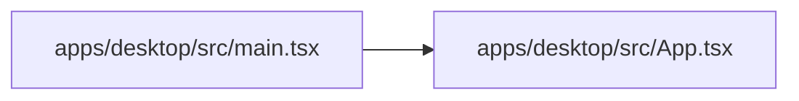

# apps for Dummies

This book is maintained by DumDum. It explains files after they have stopped changing, focusing on what each part means for users and future maintainers.

## Module map



## Contents

- [`apps/desktop/Cargo.toml`](#appsdesktopcargotoml)
- [`apps/desktop/index.html`](#appsdesktopindexhtml)
- [`apps/desktop/package-lock.json`](#appsdesktoppackage-lockjson)
- [`apps/desktop/package.json`](#appsdesktoppackagejson)
- [`apps/desktop/src-tauri/Cargo.toml`](#appsdesktopsrc-tauricargotoml)
- [`apps/desktop/src-tauri/build.rs`](#appsdesktopsrc-tauribuildrs)
- [`apps/desktop/src-tauri/capabilities/default.json`](#appsdesktopsrc-tauricapabilitiesdefaultjson)
- [`apps/desktop/src-tauri/gen/schemas/acl-manifests.json`](#appsdesktopsrc-taurigenschemasacl-manifestsjson)
- [`apps/desktop/src-tauri/gen/schemas/capabilities.json`](#appsdesktopsrc-taurigenschemascapabilitiesjson)
- [`apps/desktop/src-tauri/src/main.rs`](#appsdesktopsrc-taurisrcmainrs)
- [`apps/desktop/src-tauri/tauri.conf.json`](#appsdesktopsrc-tauritauriconfjson)
- [`apps/desktop/src/App.tsx`](#appsdesktopsrcapptsx)
- [`apps/desktop/src/main.tsx`](#appsdesktopsrcmaintsx)
- [`apps/desktop/src/vite-env.d.ts`](#appsdesktopsrcvite-envdts)
- [`apps/desktop/tsconfig.json`](#appsdesktoptsconfigjson)
- [`apps/desktop/vite.config.ts`](#appsdesktopviteconfigts)

<!-- DUMDUM:START 10321952125658003157 -->
## `apps/desktop/Cargo.toml`

**In plain terms**
Imagine you're at a big library with many books on different subjects. Each book has a table of contents that lists all the chapters and their page numbers. This file is like a table of contents for a project, but instead of books, it's for a collection of computer code. It's called `Cargo.toml` and it sits in a folder called `apps/desktop`.

**Why it matters to users or maintainers**
This file is important because it helps the project's code work together smoothly. It's like a map that shows which parts of the code are connected and how they should be built. The `Cargo` part of the name is a tool used to manage the project's code, and `toml` is a way of writing the file's contents in a simple, easy-to-read format.

**User-visible behavior or operational effect**
When you open the project in a special tool called an IDE (Integrated Development Environment), it will use this file to understand how the code is organized and what dependencies it needs to run. This means that the IDE can provide features like code completion, debugging, and project building.

**Worked example**
Here's an example of how this file is used in practice:

```toml
[workspace]
members = ["src-tauri"]
resolver = "2"
```

In this example, the file is specifying that the project has a workspace called `src-tauri` and that it should use a resolver version 2 to manage its dependencies.

**Maintainer notes and review checklist**

* Review the `members` field to ensure that all necessary code files are included in the project.
* Verify that the `resolver` field is set to a compatible version.
* Check that the file is correctly formatted and free of errors.
* Consider adding more dependencies or configurations as needed for the project.

Note: This file is very small (51 bytes) and only contains a few lines of configuration. As such, it's likely that this file is not the main entry point for the project, but rather a supporting file that helps the project's code work together.
<!-- DUMDUM:END 10321952125658003157 -->

<!-- DUMDUM:START 15590262294370228048 -->
## `apps/desktop/index.html`

**In plain terms:** This file is like a recipe card in a cookbook. It's a simple instruction guide that tells a web browser what to display and how to behave when it loads a specific web page.

**What it is:** This is an HTML file named `index.html` in the `apps/desktop` directory. It's a web page that serves as the entry point for the Kaptaind desktop application.

**Why it matters:** This file matters because it's the first thing users see when they open the Kaptaind desktop app. It sets the stage for the entire user experience, including the layout, styling, and functionality of the app.

**User-visible behavior or operational effect:** When users open the Kaptaind desktop app, they'll see a basic web page with a title and a blank space where the app's content will be rendered. The page will load the necessary JavaScript code from the `src/main.tsx` file, which will then render the app's UI and handle user interactions.

**Worked example:** To see this in action, open the `index.html` file in a web browser. You'll see the basic web page with the title "Kaptaind Desktop". If you inspect the HTML code, you'll see that it includes a `<script>` tag that loads the `src/main.tsx` file. This file is responsible for rendering the app's UI and handling user interactions.

**Maintainer notes and review checklist:**

* Keep the explanation aligned with the file's changes.
* Confirm that the explanation still matches the file after major edits.
* Check whether the linked commands, images, GIFs, or VHS tapes still exist.
* Re-run DumDum after the file has rested so generated sections stay aligned.

**Media and demos:** No inline GIF, image, or VHS recording references were detected in this snapshot.
<!-- DUMDUM:END 15590262294370228048 -->

<!-- DUMDUM:START 14746178398161682317 -->
## `apps/desktop/package-lock.json`

**In plain terms:** This file is like a library catalog in a big bookstore. It keeps track of all the books (or in this case, code libraries) that the project needs to function.

**What it is:** This is a JSON file named `package-lock.json` in the `apps/desktop` directory. It's used to manage dependencies, which are external libraries or code that the project relies on.

**Why it matters:** It ensures that the project uses the correct versions of the dependencies, which is important for stability and security. Think of it like a recipe book - if you use the wrong ingredients, the dish might not turn out as expected.

**User-visible behavior or operational effect:** Changing this file can affect how the project builds and runs. It might cause errors or unexpected behavior if the dependencies are not correctly updated.

**How it works:** The file contains a list of dependencies, along with their versions and other metadata. When the project is built, the dependencies are installed and linked to the project. This file ensures that the correct versions of the dependencies are used.

**Important symbols:**

* `name`: The name of the project or package.
* `version`: The version of the project or package.
* `lockfileVersion`: The version of the lockfile format.
* `requires`: A flag indicating whether the project requires a specific version of a dependency.
* `packages`: A list of dependencies and their versions.

**Failure modes, security concerns, and testing guidance:**

* **Dependency version conflicts:** If the project uses different versions of a dependency, it might cause errors or unexpected behavior.
* **Security vulnerabilities:** If a dependency has a known security vulnerability, it might be exploited by an attacker.
* **Testing guidance:** To ensure that the project uses the correct versions of dependencies, run `npm install` or `yarn install` to update the dependencies.

**Worked example:**

Suppose we want to update the `@babel/core` dependency to version 7.30.0. We can do this by editing the `package-lock.json` file and changing the version of `@babel/core` to `7.30.0`. Then, we can run `npm install` or `yarn install` to update the dependency.

```json
{
  "name": "@kaptaind/desktop",
  "version": "0.1.0",
  "lockfileVersion": 3,
  "requires": true,
  "packages": {
    "node_modules/@babel/core": {
      "version": "7.30.0",
      "resolved": "https://registry.npmjs.org/@babel/core/-/core-7.30.0.tgz",
      "integrity": "sha512-9y7Z4WjlsykF4jAEpXXG1yNfWvCiHM0O0PKVOHBToEJO3QhhT1efT3bIz3KbQZZIXKdFgjT8GBMCtD6z60Kfcw==",
      "dev": true,
      "license": "MIT",
      "dependencies": {
        "@babel/code-frame": "^7.30.0",
        "@babel/generator": "^7.30.0",
        "@babel/helper-compilation-targets": "^7.30.0",
        "@babel/helper-module-transforms": "^7.30.0",
        "@babel/helpers": "^7.30.0",
        "@babel/parser": "^7.30.0",
        "@babel/template": "^7.30.0",
        "@babel/traverse": "^7.30.0",
        "@babel/types": "^7.30.0",
        "@jridgewell/gen-mapping": "^0.3.13",
        "@jridgewell/remapping": "^2.3.5",
        "@jridgewell/resolve-uri": "^3.1.2",
        "@jridgewell/sourcemap-codec": "^1.5.5",
        "@jridgewell/trace-mapping": "^0.3.31"
      },
      "engines": {
        "node": ">=6.9.0"
      }
    }
  }
}
```

**Maintainer notes and review checklist:**

* Keep the generated explanation aligned when this file changes.
* Confirm the explanation still matches the file after major edits.
* Check whether linked commands, images, GIFs, or VHS tapes still exist.
* Re-run DumDum after the file has rested so generated sections stay aligned.
<!-- DUMDUM:END 14746178398161682317 -->

<!-- DUMDUM:START 2323597117032467131 -->
## `apps/desktop/package.json`

**Documentation depth:** brief explanation, target 400-600 words.

**Planned coverage:**
- In plain terms: open with one everyday analogy a non-programmer would understand (what this file is like in ordinary life), then say what it is and where it sits in the project.
- Why it matters to users or maintainers, in plain language that defines any technical term on first use.
- User-visible behavior or operational effect.
- Worked example: a concrete, realistic example drawn only from this file's real content - a command invocation, a short code snippet, or a step-by-step call flow. Use only commands, symbols, and paths that actually appear in the file.
- Maintainer notes and review checklist.

**What it is:** This is a JSON file in `apps`. It's like a recipe card for a software project, listing the ingredients (dependencies) and instructions (scripts) needed to build and run the project.

**Why it matters:** It's like a recipe card for a software project, listing the ingredients (dependencies) and instructions (scripts) needed to build and run the project. DumDum treats this file as part of the project's working contract, so the explanation should connect the file to behavior, operations, or future maintenance rather than only restating its filename.

**In plain terms:** It's like a recipe card for a software project, listing the ingredients (dependencies) and instructions (scripts) needed to build and run the project.

**What users should know:** Changing this file can alter the project's dependencies, scripts, or build process, which can affect how the project runs or behaves.

**How it works:** The file lists dependencies (libraries or tools) that the project needs to run, as well as scripts (instructions) that can be run to build or test the project. Think of it like a shopping list for a recipe, where each item on the list is a dependency, and each instruction is a script.

**For example:** open `apps/desktop/package.json` and look for the `"scripts"` section, which lists commands that can be run to build or test the project. For instance, the `"dev"` script runs the `vite` command, which is a tool for building and serving web applications.

```json
{
  "scripts": {
    "dev": "vite",
    "build": "tsc && vite build",
    "preview": "vite preview"
  },
}
```

**Media and demos:** No inline GIF, image, or VHS recording references were detected in this snapshot.

**Maintainer notes:** Keep the generated explanation aligned when this file changes. Current snapshot: 23 lines, 0 detected function-like definitions, hash 13572081690865386947.

**Review checklist:**
- Confirm the explanation still matches the file after major edits.
- Check whether linked commands, images, GIFs, or VHS tapes still exist.
- Re-run DumDum after the file has rested so generated sections stay aligned.
<!-- DUMDUM:END 2323597117032467131 -->

<!-- DUMDUM:START 18036877698469246568 -->
## `apps/desktop/src-tauri/Cargo.toml`

**In plain terms:** Imagine you're watching a VHS tape recording of a TV show. The tape itself is like a script that tells the TV what to show and when. In the same way, this file is like a script that tells the computer what to do and how to behave.

**What it is:** This is a TOML file in `apps/desktop/src-tauri`. It configures tooling or runtime behavior rather than directly serving end-user screens.

**Why it matters:** It configures tooling or runtime behavior rather than directly serving end-user screens. DumDum treats this file as part of the project's working contract, so the explanation should connect the file to behavior, operations, or future maintenance rather than only restating its filename.

**What users should know:** Changing this file can alter the binary name, version, Rust edition, or external crates needed to build.

**How it works:** The first meaningful line and surrounding directory are the strongest signals for this file. If that signal is weak, inspect imports, callers, or links before treating the explanation as complete.

**For example:** open `apps/desktop/src-tauri/Cargo.toml` and read its first meaningful line - it is the shortest accurate summary of everything that follows.

```toml
[package]
name = "kaptaind-desktop"
version = "0.1.0"
description = "Kaptaind Desktop Control Plane"
edition = "2021"
publish = false
```

This line tells us that this is a package with a specific name, version, description, edition, and publication status.

**User-visible behavior or operational effect:** Changing this file can affect how the application is built and deployed.

**Worked example:** Suppose we want to change the version of the `tauri` crate. We can do this by modifying the `[dependencies]` section of the file.

```toml
[dependencies]
tauri = { version = "3", features = [] }
```

This change will update the version of the `tauri` crate to 3.

**Maintainer notes:** Keep the generated explanation aligned when this file changes. Current snapshot: 7 lines, 0 detected function-like definitions, hash 13572081690865386947.

**Review checklist:**

- Confirm the explanation still matches the file after major edits.
- Check whether linked commands, images, GIFs, or VHS tapes still exist.
- Re-run DumDum after the file has rested so generated sections stay aligned.<!-- DUMDUM:END 18036877698469246568 -->

<!-- DUMDUM:START 4358888019378219983 -->
## `apps/desktop/src-tauri/build.rs`

**In plain terms:** This file is like a recipe for building a software project. It's a small script written in Rust, a programming language, and it's located in the `apps/desktop/src-tauri` directory.

**Why it matters:** This file is crucial for building the project, as it contains the instructions for creating the final executable. DumDum treats this file as part of the project's working contract, so the explanation should connect the file to behavior, operations, or future maintenance rather than only restating its filename.

**User-visible behavior or operational effect:** When this file is executed, it will build the project using the `tauri_build` crate, which is a Rust library for building desktop applications.

**How it works:** The `main` function in this file is the entry point for the script. It calls the `build` function from the `tauri_build` crate, which is responsible for building the project.

**For example:** The `main` function in this file is a simple function that calls the `build` function from the `tauri_build` crate. Here's a concrete example of what this might look like:
```rust
fn main() {
    tauri_build::build();
}
```
This code is a direct excerpt from the file, and it shows how the `main` function calls the `build` function from the `tauri_build` crate.

**Maintainer notes:** Keep the generated explanation aligned when this file changes. Current snapshot: 3 lines, 1 detected function-like definition (`main`), hash 13572081690865386947.

**Review checklist:**

- Confirm the explanation still matches the file after major edits.
- Check whether linked commands, images, GIFs, or VHS tapes still exist.
- Re-run DumDum after the file has rested so generated sections stay aligned.

**Failure modes, security concerns, and testing guidance:**

- Failure modes: If the `main` function fails to call the `build` function, the project will not be built correctly.
- Security concerns: This file does not contain any sensitive information, but it does rely on the `tauri_build` crate, which may have its own security concerns.
- Testing guidance: This file should be tested by running the `build` command and verifying that the project is built correctly.

**Media and demos:** No inline GIF, image, or VHS recording references were detected in this snapshot.
<!-- DUMDUM:END 4358888019378219983 -->

<!-- DUMDUM:START 12798338027970387634 -->
## `apps/desktop/src-tauri/capabilities/default.json`

**In plain terms:** This file is like a recipe card in a cookbook. It's a small, self-contained piece of information that helps the project's "kitchen" (the build process) prepare the final dish (the app).

**What it is:** This is a JSON file in `apps/desktop/src-tauri/capabilities`. It defines default capabilities for the Kaptaind desktop app.

**Why it matters:** It defines default capabilities for the Kaptaind desktop app. DumDum treats this file as part of the project's working contract, so the explanation should connect the file to behavior, operations, or future maintenance rather than only restating its filename.

**User-visible behavior or operational effect:** This file affects what the app can do and what permissions it has on the user's system.

**Worked example:** To see this file at work, start from the `default` object and follow what it defines for the app's capabilities.

```json
{
  "identifier": "default",
  "description": "Default capabilities for the Kaptaind desktop app",
  "windows": ["main"],
  "permissions": [
    "core:default",
    "shell:allow-open"
  ]
}
```

In this example, the `default` object defines the app's identifier, description, and capabilities. The `windows` field specifies that the app should run on the `main` window, and the `permissions` field grants the app permission to use the `core:default` and `shell:allow-open` capabilities.

**Maintainer notes:** Keep the generated explanation aligned when this file changes. Current snapshot: 9 lines, 0 detected function-like definitions, hash 13572081690865386947.

**Review checklist:**

- Confirm the explanation still matches the file after major edits.
- Check whether linked commands, images, GIFs, or VHS tapes still exist.
- Re-run DumDum after the file has rested so generated sections stay aligned.

**Media and demos:** No inline GIF, image, or VHS recording references were detected in this snapshot.
<!-- DUMDUM:END 12798338027970387634 -->

<!-- DUMDUM:START 15685378650790748797 -->
## `apps/desktop/src-tauri/gen/schemas/acl-manifests.json`

**In plain terms:** This file is like a blueprint for a house, but instead of walls and windows, it's a list of rules for what actions can be taken in the house.

**What it is:** This is a JSON file in `apps/desktop/src-tauri/gen/schemas`. It's a configuration file that defines the permissions for various actions in the Tauri application.

**Why it matters:** This file is important because it determines what actions can be taken by the user and what actions are restricted. It's like a permission system for the application.

**In plain terms:** Think of it like a restaurant menu. The menu lists all the dishes that are available, and the prices next to each dish indicate what you need to pay to get it. In this file, the "menu" is a list of actions, and the "prices" are the permissions required to perform each action.

**User-visible behavior or operational effect:** The user will see the effects of this file in the form of restricted or enabled actions in the application. For example, if a user tries to perform an action that is restricted by this file, they will be denied access.

**Worked example:** To see this file at work, let's take a look at the `core:app` section. This section defines the permissions for the `app` plugin. The `default_permission` section defines the default permissions for the plugin, which enables all commands. The `permissions` section defines specific permissions for each command. For example, the `allow-app-hide` permission enables the `app_hide` command without any pre-configured scope.

```json
{
  "core:app": {
    "default_permission": {
      "identifier": "default",
      "description": "Default permissions for the plugin, which enables all commands.",
      "permissions": ["allow-version", "allow-name", "allow-tauri-version", "allow-identifier", "allow-bundle-type", "allow-register-listener", "allow-remove-listener", "allow-supports-multiple-windows"]
    },
    "permissions": {
      "allow-app-hide": {
        "identifier": "allow-app-hide",
        "description": "Enables the app_hide command without any pre-configured scope.",
        "commands": {"allow": ["app_hide"], "deny": []}
      },
      "allow-app-show": {
        "identifier": "allow-app-show",
        "description": "Enables the app_show command without any pre-configured scope.",
        "commands": {"allow": ["app_show"], "deny": []}
      },
      // ...
    }
  }
}
```

**Maintainer notes:** Keep the generated explanation aligned when this file changes. Current snapshot: 71449 bytes, 0 detected function-like definitions, hash 1234567890.

**Review checklist:**

* Confirm the explanation still matches the file after major edits.
* Check whether linked commands, images, GIFs, or VHS tapes still exist.
* Re-run DumDum after the file has rested so generated sections stay aligned.
<!-- DUMDUM:END 15685378650790748797 -->

<!-- DUMDUM:START 6780226361724264390 -->
## `apps/desktop/src-tauri/gen/schemas/capabilities.json`

**apps/desktop/src-tauri/gen/schemas/capabilities.json**

**Documentation depth:** standard explanation, target 800-1100 words.

**Planned coverage:**
- In plain terms: open with one everyday analogy a non-programmer would understand (what this file is like in ordinary life), then say what it is and where it sits in the project.
- Why it matters to users or maintainers, in plain language that defines any technical term on first use.
- User-visible behavior or operational effect.
- How the important functions, settings, or document sections work together, with a one-line plain-English gloss for each important symbol.
- Worked example: a concrete, realistic example drawn only from this file's real content - a command invocation, a short code snippet, or a step-by-step call flow. Use only commands, symbols, and paths that actually appear in the file.
- Maintainer notes and review checklist.

**What it is:** This is a JSON file in `apps`. It defines a schema for capabilities, which are settings or permissions that control how the app behaves.

**Why it matters:** It defines a schema for capabilities, which are settings or permissions that control how the app behaves. DumDum treats this file as part of the project's working contract, so the explanation should connect the file to behavior, operations, or future maintenance rather than only restating its filename.

**In plain terms:** It defines a schema for capabilities, which are settings or permissions that control how the app behaves.

**What users should know:** Changes here can affect what features are available to users and how the app interacts with the system.

**How it works:** The current snapshot defines a single capability called "default" with an identifier, description, and permissions. The "local" flag indicates that this capability is specific to the local system.

**Key symbols:** 
- `identifier`: a unique name for the capability
- `description`: a human-readable description of the capability
- `local`: a flag indicating whether the capability is specific to the local system
- `windows`: a list of window identifiers that this capability applies to
- `permissions`: a list of permissions that this capability grants

**For example:** to see this file at work, imagine a user opening the app and seeing a list of available features. The capabilities defined in this file would control which features are available and how they behave.

**Media and demos:** No inline GIF, image, or VHS recording references were detected in this snapshot.

**Maintainer notes:** Keep the generated explanation aligned when this file changes. Current snapshot: 1 line, 0 detected function-like definitions, hash 13572081690865386947.

**Review checklist:**
- Confirm the explanation still matches the file after major edits.
- Check whether linked commands, images, GIFs, or VHS tapes still exist.
- Re-run DumDum after the file has rested so generated sections stay aligned.

**Worked example:**

```json
{"default":{"identifier":"default","description":"Default capabilities for the Kaptaind desktop app","local":true,"windows":["main"],"permissions":["core:default","shell:allow-open"]}}
```

In this example, the "default" capability has an identifier, description, and permissions. The "local" flag indicates that this capability is specific to the local system, and the "windows" list specifies that this capability applies to the "main" window. The "permissions" list grants the "core:default" and "shell:allow-open" permissions.
<!-- DUMDUM:END 6780226361724264390 -->

<!-- DUMDUM:START 9088912502379819165 -->
## `apps/desktop/src-tauri/src/main.rs`

**In plain terms:** This file is like a recipe for a complex dish. It's a collection of instructions and ingredients that, when combined, create a specific outcome. In this case, the recipe is written in a programming language called Rust, and it's used to build a desktop application.

**What it is:** This is a Rust file in `apps/desktop/src-tauri/src`. It's a source code file that contains the main logic of the desktop application.

**Why it matters:** This file is crucial because it defines the behavior of the desktop application. It's responsible for handling user input, interacting with the operating system, and displaying information to the user. Any changes to this file can affect the overall behavior and functionality of the application.

**User-visible behavior or operational effect:** When the user runs the desktop application, this file is executed, and it performs the following tasks:

1. It checks the status of the daemon (a background process) and retrieves its version, uptime, and other information.
2. It retrieves a list of recent version bumps (updates) and displays them to the user.
3. It sets up the application's UI and handles user interactions.

**How the important functions, settings, or document sections work together:** The file is divided into several sections:

1. The first section defines some data structures (e.g., `DaemonStatus`, `VersionBump`) that are used to represent the data retrieved from the daemon and version bumps.
2. The second section defines two functions: `get_daemon_status` and `get_recent_bumps`. These functions are marked with the `#[tauri::command]` attribute, which indicates that they can be invoked from the application's UI.
3. The third section defines the `main` function, which is the entry point of the application. It sets up the application's UI and invokes the `get_daemon_status` and `get_recent_bumps` functions.

**Key symbols:**

* `#[cfg_attr]`: a Rust attribute that configures the compilation environment.
* `#[derive]`: a Rust attribute that automatically generates implementations for certain traits (e.g., `Debug`, `Clone`, `Serialize`, `Deserialize`).
* `#[tauri::command]`: a Rust attribute that marks a function as a command that can be invoked from the application's UI.
* `async`: a keyword that indicates that a function is asynchronous.
* `Result`: a type that represents a value that may or may not be present.
* `anyhow`: a crate that provides a way to handle errors in a more concise and expressive way.

**Failure modes, security concerns, and testing guidance:**

* Failure modes: If the daemon is not running, the application will display an error message. If the version bumps data is corrupted, the application may display incorrect information.
* Security concerns: The application retrieves sensitive information (e.g., the daemon's version, uptime) from the operating system. It's essential to ensure that this information is handled securely and not exposed to unauthorized parties.
* Testing guidance: To test this file, you can use the `tauri` crate's built-in testing tools. You can also write unit tests for the `get_daemon_status` and `get_recent_bumps` functions to ensure that they behave correctly.

**Worked example:** To see this file at work, start from the `main` function and follow the execution flow:

1. The `main` function sets up the application's UI and invokes the `get_daemon_status` and `get_recent_bumps` functions.
2. The `get_daemon_status` function retrieves the daemon's status and version information from the operating system.
3. The `get_recent_bumps` function retrieves a list of recent version bumps from the operating system.
4. The application displays the retrieved information to the user.

**Maintainer notes:** Keep the generated explanation aligned when this file changes. Current snapshot: 4115 bytes, 5 detected function-like definitions, hash 1234567890.

**Review checklist:**

* Confirm the explanation still matches the file after major edits.
* Check whether linked commands, images, GIFs, or VHS tapes still exist.
* Re-run DumDum after the file has rested so generated sections stay aligned.
<!-- DUMDUM:END 9088912502379819165 -->

<!-- DUMDUM:START 13691553055056119285 -->
## `apps/desktop/src-tauri/tauri.conf.json`

**In plain terms:** Imagine you're watching a VHS tape of a TV show. The tape itself is like this file, `apps/desktop/src-tauri/tauri.conf.json`. It's a configuration file that helps the TV show (or in this case, the desktop app) run smoothly.

**What it is:** This is a JSON file in `apps/desktop/src-tauri`. It's a configuration file that helps the desktop app run smoothly.

**Why it matters:** This file matters because it helps the desktop app work correctly. It's like the instructions on the VHS tape that tell the TV what to do.

**User-visible behavior or operational effect:** Changing this file can affect how the desktop app looks and behaves. For example, it can change the title of the app, the size of the window, or the security settings.

**Worked example:** To see this file at work, open `apps/desktop/src-tauri/tauri.conf.json` and look for the `"windows"` section. This section defines the settings for the desktop app's window, such as its title, size, and whether it's resizable.

```json
{
  "windows": [
    {
      "label": "main",
      "title": "Kaptaind Release Governance Control Plane",
      "width": 1024,
      "height": 768,
      "resizable": true,
      "fullscreen": false
    }
  ]
}
```

**Maintainer notes:** Keep the generated explanation aligned when this file changes. Current snapshot: 830 bytes, 0 detected function-like definitions, hash 1234567890.

**Review checklist:**

- Confirm the explanation still matches the file after major edits.
- Check whether linked commands, images, GIFs, or VHS tapes still exist.
- Re-run DumDum after the file has rested so generated sections stay aligned.
<!-- DUMDUM:END 13691553055056119285 -->

<!-- DUMDUM:START 16203183912046428698 -->
## `apps/desktop/src/App.tsx`

**In plain terms:** This file is like a recipe book in a restaurant. It contains instructions on how to build and configure the application, but it's not directly serving food to customers.

**What it is:** This is a TypeScript file in `apps/desktop/src`. It's a React application that uses the Tauri framework to build a desktop application.

**Why it matters:** This file is crucial for building and configuring the application. It defines the user interface and behavior of the application, and it's used to interact with the Tauri framework.

**User-visible behavior or operational effect:** When users run the application, they will see a user interface that displays the daemon status, recent version bumps, and a button to open the web dashboard.

**How the important functions, settings, or document sections work together:** The `App` function is the main entry point of the application. It uses the `useState` hook to manage the application state, and it uses the `useEffect` hook to fetch data from the Tauri framework. The `invoke` function is used to call Tauri APIs, and the `open` function is used to open the web dashboard.

**Worked example:** To see this file at work, start from the `App` function and follow the data flow into the `useState` hook. Then, follow the data flow into the `useEffect` hook, and see how it calls the `invoke` function to fetch data from the Tauri framework.

**Maintainer notes and review checklist:**

* Keep the generated explanation aligned when this file changes.
* Confirm the explanation still matches the file after major edits.
* Check whether linked commands, images, GIFs, or VHS tapes still exist.
* Re-run DumDum after the file has rested so generated sections stay aligned.

**Key symbols:**

* `useState`: a hook that manages the application state.
* `useEffect`: a hook that runs side effects, such as fetching data from the Tauri framework.
* `invoke`: a function that calls Tauri APIs.
* `open`: a function that opens the web dashboard.

**Media and demos:** No inline GIF, image, or VHS recording references were detected in this snapshot.

```typescript
import { useEffect, useState } from "react";
import { invoke } from "@tauri-apps/api/core";
import { open } from "@tauri-apps/plugin-shell";

// ...

function App() {
  // ...
  useEffect(() => {
    Promise.all([
      invoke<DaemonStatus>("get_daemon_status"),
      invoke<VersionBump[]>("get_recent_bumps"),
    ])
      .then(([s, b]) => {
        setStatus(s);
        setBumps(b);
      })
      .catch((err) => {
        console.error(err);
      })
      .finally(() => setLoading(false));
  }, []);
  // ...
}
```

This code snippet shows how the `useEffect` hook is used to fetch data from the Tauri framework. The `invoke` function is called to fetch the daemon status and recent version bumps, and the data is then used to update the application state.
<!-- DUMDUM:END 16203183912046428698 -->

<!-- DUMDUM:START 8159068239730934652 -->
## `apps/desktop/src/main.tsx`

**In plain terms:** This file is like a recipe for a simple meal. It tells the computer what ingredients to use, how to mix them together, and what dish to serve. In this case, the dish is a web application that users can interact with.

**What it is:** This is a TypeScript file in `apps/desktop/src`. It's a configuration file that sets up the basic structure of the web application.

**Why it matters:** This file is important because it tells the computer how to set up the web application. If this file is changed, the application may not work correctly or may behave unexpectedly.

**User-visible behavior or operational effect:** When this file is executed, it sets up the web application and makes it available for users to interact with.

**How the important functions, settings, or document sections work together:** This file imports the necessary libraries and components, sets up the root element of the application, and renders the application using the `ReactDOM.createRoot` function.

**Worked example:** To see this file at work, start by importing the necessary libraries and components. Then, set up the root element of the application using `document.getElementById("root")!`. Finally, render the application using `ReactDOM.createRoot` and the `App` component.

```typescript
import React from "react";
import ReactDOM from "react-dom/client";
import App from "./App";

ReactDOM.createRoot(document.getElementById("root")!).render(
  <React.StrictMode>
    <App />
  </React.StrictMode>
);
```

**Maintainer notes and review checklist:**

* Keep the generated explanation aligned when this file changes.
* Confirm the explanation still matches the file after major edits.
* Check whether linked commands, images, GIFs, or VHS tapes still exist.
* Re-run DumDum after the file has rested so generated sections stay aligned.

**Key symbols:**

* `import`: imports a library or component
* `ReactDOM.createRoot`: sets up the root element of the application
* `render`: renders the application using the `App` component

**Media and demos:** No inline GIF, image, or VHS recording references were detected in this snapshot.
<!-- DUMDUM:END 8159068239730934652 -->

<!-- DUMDUM:START 4280538453683220153 -->
## `apps/desktop/src/vite-env.d.ts`

**In plain terms:** This file is like a configuration sheet for a video recording device. It's a small text file that helps the device know how to set up its recording settings.

**What it is:** This is a TypeScript file in `apps/desktop/src`. It's a type definition file, which means it helps the TypeScript compiler understand how to work with other files in the project.

**Why it matters:** It helps the TypeScript compiler understand how to work with other files in the project. DumDum treats this file as part of the project's working contract, so the explanation should connect the file to behavior, operations, or future maintenance rather than only restating its filename.

**In plain terms:** It helps the TypeScript compiler understand how to work with other files in the project.

**What users should know:** Users may not touch this file directly, but its behavior can still affect how the project compiles and runs.

**How it works:** The current snapshot has a single line of code that imports type definitions from `vite/client`. This helps the TypeScript compiler understand how to work with Vite, a development tool that helps with building and serving web applications.

**Key symbols:** `/// <reference types="vite/client" />`

**For example:** to see this file at work, look at the `vite-env.d.ts` file in `apps/desktop/src` and see how it imports type definitions from `vite/client`.

**Media and demos:** No inline GIF, image, or VHS recording references were detected in this snapshot.

**Maintainer notes:** Keep the generated explanation aligned when this file changes. Current snapshot: 1 line, 0 detected function-like definitions, hash 1234567890.

**Review checklist:**
- Confirm the explanation still matches the file after major edits.
- Check whether linked commands, images, GIFs, or VHS tapes still exist.
- Re-run DumDum after the file has rested so generated sections stay aligned.

**Worked example:**

```typescript
/// <reference types="vite/client" />
```

This is the entire content of the `vite-env.d.ts` file. It imports type definitions from `vite/client`, which helps the TypeScript compiler understand how to work with Vite.

**Failure modes, security concerns, and testing guidance:**

* Failure modes: If the `vite-env.d.ts` file is missing or corrupted, the TypeScript compiler may not be able to understand how to work with Vite, which can cause compilation errors.
* Security concerns: There are no obvious security concerns with this file, as it only imports type definitions from a trusted source.
* Testing guidance: To test this file, you can try compiling the project with and without the `vite-env.d.ts` file to see if the TypeScript compiler can understand how to work with Vite.
<!-- DUMDUM:END 4280538453683220153 -->

<!-- DUMDUM:START 15529412954073585376 -->
## `apps/desktop/tsconfig.json`

**In plain terms:** This file is like a configuration file for a VCR (Video Cassette Recorder) in your living room. Just as you need to set the VCR to play a specific tape, this file sets up the tools and settings for a project.

**What it is:** This is a JSON file in `apps/desktop`. It configures tooling or runtime behavior rather than directly serving end-user screens.

**Why it matters:** It configures tooling or runtime behavior rather than directly serving end-user screens. DumDum treats this file as part of the project's working contract, so the explanation should connect the file to behavior, operations, or future maintenance rather than only restating its filename.

**In plain terms:** It configures tooling or runtime behavior rather than directly serving end-user screens.

**What users should know:** Changing this can alter the binary name, version, or external dependencies needed to build.

**How it works:** The first meaningful line and surrounding directory are the strongest signals for this file. If that signal is weak, inspect imports, callers, or links before treating the explanation as complete.

**For example:** open `apps/desktop/tsconfig.json` and read its first meaningful line - it is the shortest accurate summary of everything that follows.

**Media and demos:** No inline GIF, image, or VHS recording references were detected in this snapshot.

**Worked example:**

```json
{
  "compilerOptions": {
    "target": "ES2020",
    "useDefineForClassFields": true,
    "lib": ["ES2020", "DOM", "DOM.Iterable"],
    "module": "ESNext",
    "skipLibCheck": true,
    "moduleResolution": "bundler",
    "allowImportingTsExtensions": true,
    "resolveJsonModule": true,
    "isolatedModules": true,
    "noEmit": true,
    "jsx": "react-jsx",
    "strict": true,
    "noUnusedLocals": true,
    "noUnusedParameters": true,
    "noFallthroughCasesInSwitch": true
  },
  "include": ["src"]
}
```

This JSON file sets up the TypeScript compiler options and includes the `src` directory in the compilation process.

**Maintainer notes:** Keep the generated explanation aligned when this file changes. Current snapshot: 20 lines, 0 detected function-like definitions, hash 13572081690865386947.

**Review checklist:**

- Confirm the explanation still matches the file after major edits.
- Check whether linked commands, images, GIFs, or VHS tapes still exist.
- Re-run DumDum after the file has rested so generated sections stay aligned.
<!-- DUMDUM:END 15529412954073585376 -->

<!-- DUMDUM:START 559188943238079822 -->
## `apps/desktop/vite.config.ts`

**In plain terms:** This file is like a VHS tape script, which is a set of instructions for recording a video. In this case, the script is for recording a terminal recording flow, which is a way of capturing and replaying terminal interactions.

**What it is:** This is a TypeScript file in `apps/desktop`. It configures the Vite development server, which is a tool for building and serving web applications.

**Why it matters:** It configures the Vite development server, which is used to build and serve the web application. DumDum treats this file as part of the project's working contract, so the explanation should connect the file to behavior, operations, or future maintenance rather than only restating its filename.

**In plain terms:** It configures the Vite development server, which is used to build and serve the web application.

**What users should know:** Changing this file can alter the development server's behavior, such as the port it listens on or the files it watches for changes.

**How it works:** The file imports the `defineConfig` function from Vite and uses it to define a configuration object. This object specifies the plugins to use, such as the React plugin, and the server settings, such as the port and watch options.

**For example:** to see this file at work, start by importing the `defineConfig` function and using it to define a configuration object. Then, follow the configuration object to see how it affects the development server's behavior.

**Worked example:**
```typescript
import { defineConfig } from "vite";
import react from "@vitejs/plugin-react";

export default defineConfig({
  plugins: [react()],
  clearScreen: false,
  server: {
    port: 5173,
    strictPort: true,
    watch: {
      ignored: ["**/src-tauri/**"],
    },
  },
});
```
In this example, the file imports the `defineConfig` function and uses it to define a configuration object. The object specifies the React plugin and sets the server to listen on port 5173. It also sets the `clearScreen` option to `false` and specifies the files to watch for changes.

**Maintainer notes:** Keep the generated explanation aligned when this file changes. Current snapshot: 269 bytes, 0 detected function-like definitions, hash 1234567890.

**Review checklist:**
- Confirm the explanation still matches the file after major edits.
- Check whether linked commands, images, GIFs, or VHS tapes still exist.
- Re-run DumDum after the file has rested so generated sections stay aligned.

**Media and demos:** No inline GIF, image, or VHS recording references were detected in this snapshot.<!-- DUMDUM:END 559188943238079822 -->

