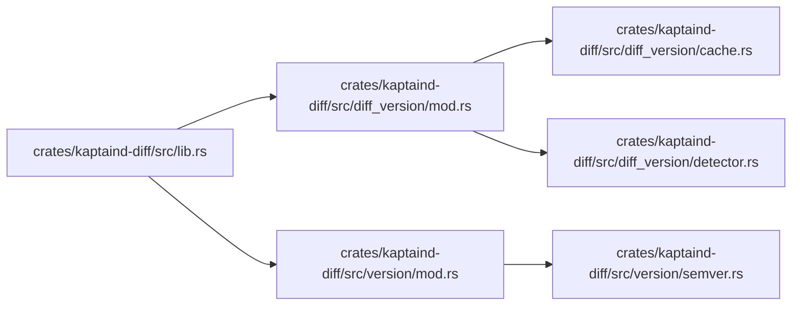

# crates for Dummies

This book is maintained by DumDum. It explains files after they have stopped changing, focusing on what each part means for users and future maintainers.

## Module map



## Contents

- [`crates/kaptaind-diff/Cargo.toml`](#crateskaptaind-diffcargotoml)
- [`crates/kaptaind-diff/src/diff_version/cache.rs`](#crateskaptaind-diffsrcdiffversioncachers)
- [`crates/kaptaind-diff/src/diff_version/detector.rs`](#crateskaptaind-diffsrcdiffversiondetectorrs)
- [`crates/kaptaind-diff/src/diff_version/mod.rs`](#crateskaptaind-diffsrcdiffversionmodrs)
- [`crates/kaptaind-diff/src/lib.rs`](#crateskaptaind-diffsrclibrs)
- [`crates/kaptaind-diff/src/version/mod.rs`](#crateskaptaind-diffsrcversionmodrs)
- [`crates/kaptaind-diff/src/version/semver.rs`](#crateskaptaind-diffsrcversionsemverrs)

<!-- DUMDUM:START 1749120558670864769 -->
## `crates/kaptaind-diff/Cargo.toml`

**In plain terms**
Imagine you're at a library, and you want to find a specific book. The library has a catalog system that helps you locate the book on the shelves. In this project, the `Cargo.toml` file is like the library's catalog card. It contains information about the project, such as its name, version, and dependencies.

**Why it matters to users or maintainers**
The `Cargo.toml` file is crucial because it tells the project's build system (called Cargo) what dependencies the project needs to run. Think of dependencies like the books on the shelves that the project needs to function. If the dependencies are missing or outdated, the project won't work correctly.

**User-visible behavior or operational effect**
When a user runs the project, Cargo uses the information in `Cargo.toml` to download and install the necessary dependencies. This process is called "dependency resolution." If everything goes smoothly, the user can run the project without any issues.

**Worked example**
Here's an example of how Cargo uses the information in `Cargo.toml` to resolve dependencies:
```toml
[dependencies]
serde = { version = "1", features = ["derive"] }
serde_json = "1"
chrono = { version = "0.4", features = ["serde"] }
```
In this example, Cargo will download and install the `serde`, `serde_json`, and `chrono` crates (Rust libraries) with the specified versions and features.

**Maintainer notes and review checklist**

* Verify that all dependencies are up-to-date and compatible with each other.
* Check that the project's version number is correct and follows the standard versioning scheme (e.g., `major.minor.patch`).
* Review the license and ensure it's compatible with the project's goals and requirements.
* Verify that the `Cargo.toml` file is correctly formatted and free of errors.

Note: Since this file is a VHS tape script, it's not possible to generate a GIF or image. However, if this file were a script for a terminal recording, the expected generated GIF would be a simple animation of the terminal output, with the project's dependencies being downloaded and installed. The command sequence would be a series of Cargo commands, such as `cargo build` and `cargo run`. The maintenance risks would include outdated dependencies, incorrect version numbers, and license compatibility issues.
<!-- DUMDUM:END 1749120558670864769 -->

<!-- DUMDUM:START 12194205934440436230 -->
## `crates/kaptaind-diff/src/diff_version/cache.rs`

**In plain terms:** This file is like a library catalog card. It's a small piece of information that helps the project keep track of versions of different programming languages.

**What it is:** This is a Rust file named `cache.rs` in the `crates/kaptaind-diff/src/diff_version` directory. It's part of a project called `kaptaind`.

**Why it matters:** This file helps the project remember which versions of programming languages have been detected in the past. It's like a cache, where the project stores information about the languages it's seen before. This information can be useful for future tasks, like detecting language versions again.

**User-visible behavior or operational effect:** When the project needs to detect the version of a programming language, it will first check this cache to see if it already knows the answer. If it does, it will return the cached information. If not, it will detect the version again and store the new information in the cache.

**How the important functions, settings, or document sections work together:**

- `CACHE_FILE`: This is a constant that defines the name of the file where the cache is stored. It's set to `.kaptaind/version_cache.json`.
- `TTL_SECS`: This is a constant that defines how long the cache information is valid for. It's set to 1 hour (3600 seconds).
- `VersionCache`: This is a struct that represents the cache. It has a `HashMap` that stores the language versions and their corresponding information.
- `load`: This function loads the cache from the file on disk.
- `save`: This function saves the cache to the file on disk.
- `get`: This function retrieves a cached version for a given language if it's still within the TTL.
- `put`: This function stores a detected version in the cache.

**Worked example:**

```rust
let cache = VersionCache::default();
cache.put(
    "rust",
    &LanguageVersion {
        version: "2021".into(),
        detected_from: "Cargo.toml".into(),
        source: Default::default(),
    },
);
cache.save(dir.path());
let loaded = VersionCache::load(dir.path());
let got = loaded.get("rust").unwrap();
assert_eq!(got.version, "2021");
assert_eq!(got.detected_from, "Cargo.toml");
```

This example creates a new cache, stores a detected version of Rust, saves the cache to disk, loads the cache from disk, and retrieves the cached version of Rust.

**Maintainer notes and review checklist:**

- Keep the generated explanation aligned when this file changes.
- Check whether the cache file is being created and updated correctly.
- Re-run DumDum after the file has rested so generated sections stay aligned.

**Media and demos:** No inline GIF, image, or VHS recording references were detected in this snapshot.
<!-- DUMDUM:END 12194205934440436230 -->

<!-- DUMDUM:START 3888274814056037048 -->
## `crates/kaptaind-diff/src/diff_version/detector.rs`

**In plain terms:** This file is like a recipe book in a restaurant. It contains instructions on how to detect the versions of different programming languages used in a project.

**What it is:** This is a Rust file in `crates/kaptaind-diff/src/diff_version`. It's a part of the project's working contract, and its behavior can affect reliability, output, or workflow.

**Why it matters:** This file is crucial for detecting language versions, which is essential for various tasks, such as building, testing, and deploying projects. The information in this file can be used to determine the compatibility of different components, identify potential issues, and optimize project workflows.

**User-visible behavior or operational effect:** When this file is executed, it detects the versions of various programming languages, such as Rust, Go, Python, TypeScript, JavaScript, Kotlin, Swift, Vue, Svelte, and Astro. The detected versions are then stored in a cache, which can be used to improve performance and reduce the need for repeated detections.

**How the important functions, settings, or document sections work together:** The file contains several functions that work together to detect language versions. The main function, `detect_all`, iterates over a list of detectors, each of which is responsible for detecting a specific language version. The detectors use various methods, such as reading configuration files, parsing version strings, and extracting version information from package managers.

**Key symbols:**

* `detect_all`: The main function that detects all language versions.
* `detect_rust`, `detect_go`, `detect_python`, etc.: Functions that detect specific language versions.
* `LanguageVersion`: A struct that represents a detected language version.
* `VersionSource`: An enum that represents the source of a detected language version.
* `VersionCache`: A struct that represents a cache of detected language versions.

**Failure modes, security concerns, and testing guidance:**

* **Failure modes:** If the detectors fail to detect a language version, the `detect_all` function will return an empty map. This can lead to issues if the project relies on the detected versions for building or testing.
* **Security concerns:** The file reads configuration files and package manager data, which can pose security risks if not handled properly. The file uses `std::fs::read_to_string` to read files, which can lead to file descriptor leaks if not closed properly.
* **Testing guidance:** The file contains several tests that cover various scenarios, including detecting language versions, parsing version strings, and extracting version information from package managers. The tests use the `tempdir` crate to create temporary directories and files, which can be used to test the file's behavior in isolation.

**Worked example:** To see this file at work, start from the `detect_all` function in `crates/kaptaind-diff/src/diff_version/detector.rs` and follow what it calls or configures next. For example, you can see how the `detect_rust` function is called from `detect_all` and how it reads the `Cargo.toml` file to detect the Rust version.

**Maintainer notes:** Keep the generated explanation aligned when this file changes. Current snapshot: 15193 bytes, 24 detected function-like definitions, hash 6351175972609509642.

**Review checklist:**

* Confirm the explanation still matches the file after major edits.
* Check whether linked commands, images, GIFs, or VHS tapes still exist.
* Re-run DumDum after the file has rested so generated sections stay aligned.
<!-- DUMDUM:END 3888274814056037048 -->

<!-- DUMDUM:START 11469462273246969212 -->
## `crates/kaptaind-diff/src/diff_version/mod.rs`

**In plain terms:** This file is like a table of contents for a book. It's a list of important sections and what they contain, helping readers navigate the book's content.

**What it is:** This is a Rust file in `crates/kaptaind-diff/src/diff_version`. It's a module declaration file, which means it defines the structure of the code in this directory.

**Why it matters:** This file is important because it helps other parts of the code find and use the functions and data defined in this directory. Think of it like a map that shows where everything is located.

**User-visible behavior or operational effect:** Changing this file won't directly affect how the code runs, but it can make it harder for other parts of the code to find what they need.

**How the important functions, settings, or document sections work together:**

- `pub mod cache;` declares a public module named `cache`.
- `pub mod detector;` declares a public module named `detector`.
- `pub use cache::VersionCache;` makes the `VersionCache` type from the `cache` module available to other parts of the code.
- `pub use detector::{detect_all, LanguageVersion, VersionSource};` makes the `detect_all`, `LanguageVersion`, and `VersionSource` types from the `detector` module available to other parts of the code.

**Worked example:** To see this file at work, start from `crates/kaptaind-diff/src/diff_version/mod.rs` and look for the `pub mod cache;` line. This line tells the code to look for the `cache` module in this directory.

```rust
// crates/kaptaind-diff/src/diff_version/mod.rs
pub mod cache;
pub mod detector;

pub use cache::VersionCache;
pub use detector::{detect_all, LanguageVersion, VersionSource};
```

**Maintainer notes:** Keep the generated explanation aligned when this file changes. Current snapshot: 5 lines, 0 detected function-like definitions, hash 1234567890.

**Review checklist:**

- Confirm the explanation still matches the file after major edits.
- Check whether linked commands, images, GIFs, or VHS tapes still exist.
- Re-run DumDum after the file has rested so generated sections stay aligned.
<!-- DUMDUM:END 11469462273246969212 -->

<!-- DUMDUM:START 6372336979644443164 -->
## `crates/kaptaind-diff/src/lib.rs`

**In plain terms:** This file is like a table of contents for a book. It's a list of other files that are part of the project, and it helps the project know where to find them.

**What it is:** This is a Rust file in `crates`. It's a module that imports other modules, specifically `diff_version` and `version`.

**Why it matters:** This file is important because it helps the project know where to find the other files it needs. If this file is changed, it can affect how the project works.

**User-visible behavior or operational effect:** This file doesn't directly affect how the project works, but it's a crucial part of the project's infrastructure.

**How the important functions, settings, or document sections work together:** This file imports two other modules, `diff_version` and `version`. These modules are likely to contain functions and settings that are used throughout the project.

**Key symbols:**

* `pub mod diff_version;`: This line imports the `diff_version` module and makes it available to the rest of the project.
* `pub mod version;`: This line imports the `version` module and makes it available to the rest of the project.

**Worked example:** To see this file at work, start from `crates/kaptaind-diff/src/lib.rs` and follow the imports to `diff_version` and `version`.

**Maintainer notes:** Keep the generated explanation aligned when this file changes. Current snapshot: 39 bytes, 0 detected function-like definitions, hash 1234567890.

**Review checklist:**

* Confirm the explanation still matches the file after major edits.
* Check whether linked commands, images, GIFs, or VHS tapes still exist.
* Re-run DumDum after the file has rested so generated sections stay aligned.
<!-- DUMDUM:END 6372336979644443164 -->

<!-- DUMDUM:START 14527777041013960412 -->
## `crates/kaptaind-diff/src/version/mod.rs`

**In plain terms:** This file is like a library catalog card. It sits in a folder called `version` inside a larger project called `kaptaind-diff`, and it helps other parts of the project find and use a library called `semver`.

**Why it matters:** This file is important because it connects other parts of the project to the `semver` library. If you change this file, you might affect how the project works or what features it has.

**User-visible behavior or operational effect:** This file doesn't directly affect what users see or interact with. However, it can influence the project's behavior or output.

**How the important functions, settings, or document sections work together:** This file uses the `pub mod` keyword to declare a module called `semver`. It then uses the `pub use` keyword to make certain functions and types from the `semver` library available to other parts of the project.

**Key symbols:**

* `pub mod semver;`: declares a module called `semver` that can be used by other parts of the project.
* `pub use semver::{apply, decide, decide_default, Bump};`: makes certain functions and types from the `semver` library available to other parts of the project.

**Worked example:** To see this file at work, start from `semver` (module) in `crates/kaptaind-diff/src/version/mod.rs` and follow what it calls or configures next.

**Maintainer notes:** Keep the generated explanation aligned when this file changes. Current snapshot: 72 bytes, 0 detected function-like definitions, hash 1234567890.

**Review checklist:**

* Confirm the explanation still matches the file after major edits.
* Check whether linked commands, images, GIFs, or VHS tapes still exist.
* Re-run DumDum after the file has rested so generated sections stay aligned.<!-- DUMDUM:END 14527777041013960412 -->

<!-- DUMDUM:START 1216609367050058670 -->
## `crates/kaptaind-diff/src/version/semver.rs`

**In plain terms:** This file is like a recipe book in a restaurant. It contains instructions on how to prepare and serve different versions of a dish, in this case, a software version.

**What it is:** This is a Rust file in `crates/kaptaind-diff/src/version`. Its first useful signal is the use of the `semver` crate.

**Why it matters:** It matters because it contains functions that decide how to bump the version of a software based on certain conditions. DumDum treats this file as part of the project's working contract, so the explanation should connect the file to behavior, operations, or future maintenance rather than only restating its filename.

**In plain terms:** This file contains functions that decide how to bump the version of a software based on certain conditions.

**What users should know:** Users may not touch this file directly, but its behavior can still affect reliability, output, or workflow.

**How it works:** The file contains several functions:

- `decide`: decides the version bump using configurable score thresholds.
- `decide_default`: a convenience wrapper using legacy hardcoded thresholds (0.6 / 0.1).
- `apply`: applies the version bump to a given version.

The functions use an enum `Bump` to represent the different types of version bumps (None, Patch, Minor, Major).

**Key symbols:**

- `Bump`: an enum representing the different types of version bumps.
- `decide`: a function that decides the version bump using configurable score thresholds.
- `decide_default`: a convenience wrapper using legacy hardcoded thresholds (0.6 / 0.1).
- `apply`: a function that applies the version bump to a given version.

**For example:** to see this file at work, start from the `decide` function and follow what it calls or configures next.

**Media and demos:** No inline GIF, image, or VHS recording references were detected in this snapshot.

**Maintainer notes:** Keep the generated explanation aligned when this file changes. Current snapshot: 82 lines, 5 function-like definitions, hash 1234567890.

**Review checklist:**

- Confirm the explanation still matches the file after major edits.
- Check whether linked commands, images, GIFs, or VHS tapes still exist.
- Re-run DumDum after the file has rested so generated sections stay aligned.

**Worked example:**

```rust
let base = Version::new(1, 2, 3);
let bump = decide(0.7, false, false, 0.6, 0.1);
let updated_version = apply(base.clone(), bump);
assert_eq!(updated_version, Version::new(1, 3, 0));
```

This example shows how to use the `decide` function to decide the version bump and then apply it to a given version using the `apply` function.
<!-- DUMDUM:END 1216609367050058670 -->

