# src for Dummies

This book is maintained by DumDum. It explains files after they have stopped changing, focusing on what each part means for users and future maintainers.

## Module map

```mermaid
graph LR
    f2["src/angler/git_hooks.rs"] --> f1["src/angler/config.rs"]
    f3["src/angler/mod.rs"] --> f0["src/angler/bait.rs"]
    f3["src/angler/mod.rs"] --> f1["src/angler/config.rs"]
    f3["src/angler/mod.rs"] --> f2["src/angler/git_hooks.rs"]
    f3["src/angler/mod.rs"] --> f4["src/angler/selective.rs"]
    f3["src/angler/mod.rs"] --> f5["src/angler/webhooks.rs"]
    f4["src/angler/selective.rs"] --> f1["src/angler/config.rs"]
    f6["src/aoc/db.rs"] --> f10["src/aoc/tracer.rs"]
    f7["src/aoc/interceptor.rs"] --> f10["src/aoc/tracer.rs"]
    f7["src/aoc/interceptor.rs"] --> f163["src/util/file_lock.rs"]
    f8["src/aoc/mod.rs"] --> f6["src/aoc/db.rs"]
    f8["src/aoc/mod.rs"] --> f7["src/aoc/interceptor.rs"]
    f8["src/aoc/mod.rs"] --> f9["src/aoc/session.rs"]
    f8["src/aoc/mod.rs"] --> f10["src/aoc/tracer.rs"]
    f24["src/cli/commands/mod.rs"] --> f14["src/cli/commands/aoc.rs"]
    f24["src/cli/commands/mod.rs"] --> f15["src/cli/commands/audit.rs"]
    f24["src/cli/commands/mod.rs"] --> f16["src/cli/commands/autostart.rs"]
    f24["src/cli/commands/mod.rs"] --> f17["src/cli/commands/cihint.rs"]
    f24["src/cli/commands/mod.rs"] --> f18["src/cli/commands/dashboard.rs"]
    f24["src/cli/commands/mod.rs"] --> f19["src/cli/commands/doctor.rs"]
    f24["src/cli/commands/mod.rs"] --> f20["src/cli/commands/explain.rs"]
    f24["src/cli/commands/mod.rs"] --> f21["src/cli/commands/init.rs"]
    f24["src/cli/commands/mod.rs"] --> f22["src/cli/commands/log.rs"]
    f24["src/cli/commands/mod.rs"] --> f23["src/cli/commands/logs.rs"]
    f24["src/cli/commands/mod.rs"] --> f25["src/cli/commands/monitor.rs"]
    f24["src/cli/commands/mod.rs"] --> f26["src/cli/commands/probe.rs"]
    f24["src/cli/commands/mod.rs"] --> f27["src/cli/commands/report.rs"]
    f24["src/cli/commands/mod.rs"] --> f28["src/cli/commands/rollback.rs"]
    f24["src/cli/commands/mod.rs"] --> f29["src/cli/commands/service.rs"]
    f24["src/cli/commands/mod.rs"] --> f30["src/cli/commands/shark.rs"]
    f24["src/cli/commands/mod.rs"] --> f31["src/cli/commands/ship.rs"]
    f24["src/cli/commands/mod.rs"] --> f32["src/cli/commands/status.rs"]
    f24["src/cli/commands/mod.rs"] --> f33["src/cli/commands/storage.rs"]
    f24["src/cli/commands/mod.rs"] --> f34["src/cli/commands/stress.rs"]
    f24["src/cli/commands/mod.rs"] --> f35["src/cli/commands/trace.rs"]
    f24["src/cli/commands/mod.rs"] --> f36["src/cli/commands/trawl.rs"]
    f24["src/cli/commands/mod.rs"] --> f37["src/cli/commands/vacs.rs"]
    f38["src/cli/main.rs"] --> f12["src/cli/analyze.rs"]
    f38["src/cli/main.rs"] --> f13["src/cli/autostart.rs"]
    f38["src/cli/main.rs"] --> f24["src/cli/commands/mod.rs"]
```



## Contents

- [`src/angler/bait.rs`](#srcanglerbaitrs)
- [`src/angler/config.rs`](#srcanglerconfigrs)
- [`src/angler/git_hooks.rs`](#srcanglergithooksrs)
- [`src/angler/mod.rs`](#srcanglermodrs)
- [`src/angler/selective.rs`](#srcanglerselectivers)
- [`src/angler/webhooks.rs`](#srcanglerwebhooksrs)
- [`src/aoc/db.rs`](#srcaocdbrs)
- [`src/aoc/interceptor.rs`](#srcaocinterceptorrs)
- [`src/aoc/mod.rs`](#srcaocmodrs)
- [`src/aoc/session.rs`](#srcaocsessionrs)
- [`src/aoc/tracer.rs`](#srcaoctracerrs)
- [`src/audit.rs`](#srcauditrs)
- [`src/cli/analyze.rs`](#srcclianalyzers)
- [`src/cli/autostart.rs`](#srccliautostartrs)
- [`src/cli/commands/aoc.rs`](#srcclicommandsaocrs)
- [`src/cli/commands/audit.rs`](#srcclicommandsauditrs)
- [`src/cli/commands/autostart.rs`](#srcclicommandsautostartrs)
- [`src/cli/commands/cihint.rs`](#srcclicommandscihintrs)
- [`src/cli/commands/dashboard.rs`](#srcclicommandsdashboardrs)
- [`src/cli/commands/doctor.rs`](#srcclicommandsdoctorrs)
- [`src/cli/commands/explain.rs`](#srcclicommandsexplainrs)
- [`src/cli/commands/init.rs`](#srcclicommandsinitrs)
- [`src/cli/commands/log.rs`](#srcclicommandslogrs)
- [`src/cli/commands/logs.rs`](#srcclicommandslogsrs)
- [`src/cli/commands/mod.rs`](#srcclicommandsmodrs)
- [`src/cli/commands/monitor.rs`](#srcclicommandsmonitorrs)
- [`src/cli/commands/probe.rs`](#srcclicommandsprobers)
- [`src/cli/commands/report.rs`](#srcclicommandsreportrs)
- [`src/cli/commands/rollback.rs`](#srcclicommandsrollbackrs)
- [`src/cli/commands/service.rs`](#srcclicommandsservicers)
- [`src/cli/commands/shark.rs`](#srcclicommandssharkrs)
- [`src/cli/commands/ship.rs`](#srcclicommandsshiprs)
- [`src/cli/commands/status.rs`](#srcclicommandsstatusrs)
- [`src/cli/commands/storage.rs`](#srcclicommandsstoragers)
- [`src/cli/commands/stress.rs`](#srcclicommandsstressrs)
- [`src/cli/commands/trace.rs`](#srcclicommandstracers)
- [`src/cli/commands/trawl.rs`](#srcclicommandstrawlrs)
- [`src/cli/commands/vacs.rs`](#srcclicommandsvacsrs)
- [`src/cli/main.rs`](#srcclimainrs)
- [`src/cli/monitor.rs`](#srcclimonitorrs)
- [`src/cli/table.rs`](#srcclitablers)
- [`src/cluster/engine.rs`](#srcclusterenginers)
- [`src/cluster/mod.rs`](#srcclustermodrs)
- [`src/commit/message.rs`](#srccommitmessagers)
- [`src/commit/mod.rs`](#srccommitmodrs)
- [`src/commit/orchestrator.rs`](#srccommitorchestratorrs)
- [`src/compliance.rs`](#srccompliancers)
- [`src/config/mod.rs`](#srcconfigmodrs)
- [`src/daemon/decisions.rs`](#srcdaemondecisionsrs)
- [`src/daemon/deckhand.rs`](#srcdaemondeckhandrs)
- [`src/daemon/health.rs`](#srcdaemonhealthrs)
- [`src/daemon/mod.rs`](#srcdaemonmodrs)
- [`src/daemon/notification.rs`](#srcdaemonnotificationrs)
- [`src/daemon/pidfile.rs`](#srcdaemonpidfilers)
- [`src/daemon/policy.rs`](#srcdaemonpolicyrs)
- [`src/daemon/process.rs`](#srcdaemonprocessrs)
- [`src/daemon/prune.rs`](#srcdaemonpruners)
- [`src/daemon/runtime.rs`](#srcdaemonruntimers)
- [`src/daemon/shark.rs`](#srcdaemonsharkrs)
- [`src/daemon/shutdown.rs`](#srcdaemonshutdownrs)
- [`src/daemon/status.rs`](#srcdaemonstatusrs)
- [`src/daemon/telemetry.rs`](#srcdaemontelemetryrs)
- [`src/daemon/trace.rs`](#srcdaemontracers)
- [`src/daemon/web.rs`](#srcdaemonwebrs)
- [`src/daemon/web_ui.html`](#srcdaemonwebuihtml)
- [`src/diff/api.rs`](#srcdiffapirs)
- [`src/diff/ast.rs`](#srcdiffastrs)
- [`src/diff/bundle.rs`](#srcdiffbundlers)
- [`src/diff/cache.rs`](#srcdiffcachers)
- [`src/diff/lang/adapter.rs`](#srcdifflangadapterrs)
- [`src/diff/lang/adapters/TEMPLATE.rs.txt`](#srcdifflangadapterstemplaterstxt)
- [`src/diff/lang/adapters/astro.rs`](#srcdifflangadaptersastrors)
- [`src/diff/lang/adapters/c.rs`](#srcdifflangadapterscrs)
- [`src/diff/lang/adapters/clojure.rs`](#srcdifflangadaptersclojurers)
- [`src/diff/lang/adapters/common.rs`](#srcdifflangadapterscommonrs)
- [`src/diff/lang/adapters/cpp.rs`](#srcdifflangadapterscpprs)
- [`src/diff/lang/adapters/csharp.rs`](#srcdifflangadapterscsharprs)
- [`src/diff/lang/adapters/dart.rs`](#srcdifflangadaptersdartrs)
- [`src/diff/lang/adapters/elixir.rs`](#srcdifflangadapterselixirrs)
- [`src/diff/lang/adapters/erlang.rs`](#srcdifflangadapterserlangrs)
- [`src/diff/lang/adapters/fsharp.rs`](#srcdifflangadaptersfsharprs)
- [`src/diff/lang/adapters/go.rs`](#srcdifflangadaptersgors)
- [`src/diff/lang/adapters/groovy.rs`](#srcdifflangadaptersgroovyrs)
- [`src/diff/lang/adapters/haskell.rs`](#srcdifflangadaptershaskellrs)
- [`src/diff/lang/adapters/hcl.rs`](#srcdifflangadaptershclrs)
- [`src/diff/lang/adapters/htmlcss.rs`](#srcdifflangadaptershtmlcssrs)
- [`src/diff/lang/adapters/java.rs`](#srcdifflangadaptersjavars)
- [`src/diff/lang/adapters/javascript.rs`](#srcdifflangadaptersjavascriptrs)
- [`src/diff/lang/adapters/julia.rs`](#srcdifflangadaptersjuliars)
- [`src/diff/lang/adapters/kotlin.rs`](#srcdifflangadapterskotlinrs)
- [`src/diff/lang/adapters/lua.rs`](#srcdifflangadaptersluars)
- [`src/diff/lang/adapters/mod.rs`](#srcdifflangadaptersmodrs)
- [`src/diff/lang/adapters/objc.rs`](#srcdifflangadaptersobjcrs)
- [`src/diff/lang/adapters/ocaml.rs`](#srcdifflangadaptersocamlrs)
- [`src/diff/lang/adapters/perl.rs`](#srcdifflangadaptersperlrs)
- [`src/diff/lang/adapters/php.rs`](#srcdifflangadaptersphprs)
- [`src/diff/lang/adapters/python.rs`](#srcdifflangadapterspythonrs)
- [`src/diff/lang/adapters/r.rs`](#srcdifflangadaptersrrs)
- [`src/diff/lang/adapters/ruby.rs`](#srcdifflangadaptersrubyrs)
- [`src/diff/lang/adapters/rust.rs`](#srcdifflangadaptersrustrs)
- [`src/diff/lang/adapters/scala.rs`](#srcdifflangadaptersscalars)
- [`src/diff/lang/adapters/scss.rs`](#srcdifflangadaptersscssrs)
- [`src/diff/lang/adapters/solidity.rs`](#srcdifflangadapterssolidityrs)
- [`src/diff/lang/adapters/sql.rs`](#srcdifflangadapterssqlrs)
- [`src/diff/lang/adapters/svelte.rs`](#srcdifflangadapterssvelters)
- [`src/diff/lang/adapters/swift.rs`](#srcdifflangadaptersswiftrs)
- [`src/diff/lang/adapters/typescript.rs`](#srcdifflangadapterstypescriptrs)
- [`src/diff/lang/adapters/vue.rs`](#srcdifflangadaptersvuers)
- [`src/diff/lang/adapters/zig.rs`](#srcdifflangadapterszigrs)
- [`src/diff/lang/mod.rs`](#srcdifflangmodrs)
- [`src/diff/lang/plugin.rs`](#srcdifflangpluginrs)
- [`src/diff/lang/registry.rs`](#srcdifflangregistryrs)
- [`src/diff/mod.rs`](#srcdiffmodrs)
- [`src/diff/text.rs`](#srcdifftextrs)
- [`src/diff/version/mod.rs`](#srcdiffversionmodrs)
- [`src/dryrun.rs`](#srcdryrunrs)
- [`src/evidence.rs`](#srcevidencers)
- [`src/git/mod.rs`](#srcgitmodrs)
- [`src/git/repo.rs`](#srcgitrepors)
- [`src/icon.rs`](#srciconrs)
- [`src/inference/anthropic.rs`](#srcinferenceanthropicrs)
- [`src/inference/consensus.rs`](#srcinferenceconsensusrs)
- [`src/inference/cosine.rs`](#srcinferencecosiners)
- [`src/inference/kimi.rs`](#srcinferencekimirs)
- [`src/inference/mod.rs`](#srcinferencemodrs)
- [`src/inference/ollama.rs`](#srcinferenceollamars)
- [`src/inference/openai.rs`](#srcinferenceopenairs)
- [`src/installer/gui.rs`](#srcinstallerguirs)
- [`src/installer/mod.rs`](#srcinstallermodrs)
- [`src/lib.rs`](#srclibrs)
- [`src/main.rs`](#srcmainrs)
- [`src/monitor.rs`](#srcmonitorrs)
- [`src/notify/audio.rs`](#srcnotifyaudiors)
- [`src/notify/mod.rs`](#srcnotifymodrs)
- [`src/push/controller.rs`](#srcpushcontrollerrs)
- [`src/push/mod.rs`](#srcpushmodrs)
- [`src/qualification/engine.rs`](#srcqualificationenginers)
- [`src/qualification/mod.rs`](#srcqualificationmodrs)
- [`src/qualification/policy.rs`](#srcqualificationpolicyrs)
- [`src/rbac.rs`](#srcrbacrs)
- [`src/release/builder.rs`](#srcreleasebuilderrs)
- [`src/release/distributor.rs`](#srcreleasedistributorrs)
- [`src/release/index.rs`](#srcreleaseindexrs)
- [`src/release/mod.rs`](#srcreleasemodrs)
- [`src/release/orchestrator.rs`](#srcreleaseorchestratorrs)
- [`src/release/packager.rs`](#srcreleasepackagerrs)
- [`src/release/provenance.rs`](#srcreleaseprovenancers)
- [`src/release/registry.rs`](#srcreleaseregistryrs)
- [`src/release/s3.rs`](#srcreleases3rs)
- [`src/release/sbom.rs`](#srcreleasesbomrs)
- [`src/release/ship.rs`](#srcreleaseshiprs)
- [`src/schedule/cron.rs`](#srcschedulecronrs)
- [`src/schedule/mod.rs`](#srcschedulemodrs)
- [`src/stability/engine.rs`](#srcstabilityenginers)
- [`src/stability/mod.rs`](#srcstabilitymodrs)
- [`src/stability/model.rs`](#srcstabilitymodelrs)
- [`src/trawler/engine.rs`](#srctrawlerenginers)
- [`src/trawler/mod.rs`](#srctrawlermodrs)
- [`src/trawler/project.rs`](#srctrawlerprojectrs)
- [`src/util/base64.rs`](#srcutilbase64rs)
- [`src/util/constant_time.rs`](#srcutilconstanttimers)
- [`src/util/disk.rs`](#srcutildiskrs)
- [`src/util/dotenv.rs`](#srcutildotenvrs)
- [`src/util/file_lock.rs`](#srcutilfilelockrs)
- [`src/util/hex.rs`](#srcutilhexrs)
- [`src/util/http.rs`](#srcutilhttprs)
- [`src/util/mod.rs`](#srcutilmodrs)
- [`src/util/shell_validation.rs`](#srcutilshellvalidationrs)
- [`src/util/style.rs`](#srcutilstylers)
- [`src/vacs/asset.rs`](#srcvacsassetrs)
- [`src/vacs/engine.rs`](#srcvacsenginers)
- [`src/vacs/extractor.rs`](#srcvacsextractorrs)
- [`src/vacs/mod.rs`](#srcvacsmodrs)
- [`src/vacs/scheduler.rs`](#srcvacsschedulerrs)
- [`src/vacs/scoring.rs`](#srcvacsscoringrs)
- [`src/version/mod.rs`](#srcversionmodrs)
- [`src/version/workspace.rs`](#srcversionworkspacers)
- [`src/version/writeback.rs`](#srcversionwritebackrs)
- [`src/watcher/fs.rs`](#srcwatcherfsrs)
- [`src/watcher/mod.rs`](#srcwatchermodrs)
- [`src/weight/calculator.rs`](#srcweightcalculatorrs)
- [`src/weight/mod.rs`](#srcweightmodrs)

<!-- DUMDUM:START 11570508060075230351 -->
## `src/angler/bait.rs`

**In plain terms**

Imagine you're at a fishing pier, and you've got a bunch of different lures (or "baits") that you can use to catch fish. Each lure has its own special way of attracting fish, and you need to choose the right one for the right situation. That's kind of like what this file, `src/angler/bait.rs`, does. It's a system for managing different "baits" that can be used to respond to specific events in a software project.

**Why it matters to users or maintainers**

This file is important because it allows users to create and manage custom "baits" that can be triggered by specific events in the project. For example, a user might create a bait that sends a notification when a commit is made, or another bait that runs a specific command when a file is changed. This file provides a way for users to define and manage these custom baits, which can be really useful for automating tasks and responding to specific events in the project.

**User-visible behavior or operational effect**

When a user creates a new bait, they can specify the event that triggers it, as well as any custom commands or scripts that should be run when the event occurs. The bait system will then execute the specified commands or scripts when the event occurs, and provide feedback to the user about the outcome.

**How the important functions, settings, or document sections work together**

The bait system is made up of several key components, including:

* **Bait definitions**: These are the custom "baits" that users can create and manage. Each bait definition specifies the event that triggers it, as well as any custom commands or scripts that should be run when the event occurs.
* **Bait manager**: This is the component that manages the bait definitions and executes the specified commands or scripts when the event occurs.
* **Event triggers**: These are the specific events that can trigger a bait, such as a commit being made or a file being changed.
* **Command execution**: This is the process of running the custom commands or scripts specified in the bait definition.

Some of the important symbols and functions in this file include:

* `BaitDefinition`: This is the struct that represents a custom bait definition.
* `BaitManager`: This is the struct that manages the bait definitions and executes the specified commands or scripts when the event occurs.
* `trigger_event`: This is the function that triggers a bait when the specified event occurs.
* `execute_bait`: This is the function that executes the specified commands or scripts when the event occurs.

**Failure modes, security concerns, and testing guidance**

Some potential failure modes and security concerns to be aware of when using this file include:

* **Incorrect bait definitions**: If a user creates a bait definition with incorrect or malicious commands or scripts, it could potentially cause problems or security issues.
* **Unintended event triggers**: If a user creates a bait that is triggered by an unintended event, it could potentially cause problems or security issues.
* **Command execution errors**: If a user creates a bait that executes a command or script that fails or produces an error, it could potentially cause problems or security issues.

To mitigate these risks, it's a good idea to:

* **Test baits thoroughly**: Before deploying a new bait, make sure to test it thoroughly to ensure that it works as expected and doesn't cause any problems.
* **Use secure commands and scripts**: When creating a bait, make sure to use secure commands and scripts that are designed to handle sensitive data and avoid security issues.
* **Monitor bait execution**: Keep an eye on bait execution to ensure that it's working as expected and doesn't cause any problems.

**Worked example**

Here's an example of how to create a new bait that sends a notification when a commit is made:
```rust
let bait = BaitDefinition {
    id: "notify".to_string(),
    name: "Notification".to_string(),
    description: "Send notification when commit is made".to_string(),
    bait_type: BaitType::Webhook,
    command: "https://example.com/webhook".to_string(),
    file_patterns: vec![],
    events: vec![BaitEvent::PostCommit],
    enabled: true,
    timeout_secs: 10,
    env: HashMap::new(),
};

let manager = BaitManager::new(&config, temp_dir.path()).unwrap();
manager.add_bait(bait);
```
This code creates a new bait definition that sends a notification when a commit is made, and then adds it to the bait manager.

**Maintainer notes and review checklist**

When reviewing this file, make sure to:

* **Check for correct bait definitions**: Verify that all bait definitions are correct and don't contain any malicious or incorrect commands or scripts.
* **Verify event triggers**: Verify that all event triggers are correct and don't cause any problems or security issues.
* **Test baits thoroughly**: Test all baits thoroughly to ensure that they work as expected and don't cause any problems.
* **Monitor bait execution**: Keep an eye on bait execution to ensure that it's working as expected and doesn't cause any problems.

By following these guidelines and best practices, you can ensure that the bait system is working correctly and securely, and that users can create and manage custom baits with confidence.
<!-- DUMDUM:END 11570508060075230351 -->

<!-- DUMDUM:START 872778342998092461 -->
## `src/angler/config.rs`

**In plain terms:** This file is like a blueprint for a house. It contains all the settings and configurations that determine how the house (or in this case, the Angler system) will be built and how it will function.

**What it is:** This is a Rust file in `src/angler/config.rs`. It's a configuration file for the Angler system, which is a part of the kaptaind project.

**Why it matters:** This file matters because it determines how the Angler system will behave and how it will interact with other systems. It's like a set of instructions that tells the system what to do in different situations.

**User-visible behavior or operational effect:** The Angler system will use the configurations in this file to determine how to handle different events, such as Git hooks, webhooks, and selective change capture. The system will also use these configurations to decide how to interact with other systems, such as webhooks and bait plugins.

**How the important functions, settings, or document sections work together:** The file is divided into several sections, each of which deals with a different aspect of the Angler system. The sections are:

* Git Hooks Configuration: This section deals with the configuration of Git hooks, which are scripts that run automatically when certain events occur in a Git repository.
* Webhooks Configuration: This section deals with the configuration of webhooks, which are notifications that are sent to other systems when certain events occur.
* Selective Change Capture Configuration: This section deals with the configuration of selective change capture, which is a feature that allows the system to capture only certain changes to a repository.
* Bait Plugin Configuration: This section deals with the configuration of bait plugins, which are external plugins that can be used to extend the functionality of the Angler system.

**Failure modes, security concerns, and testing guidance:** The file contains several settings that can affect the security and reliability of the Angler system. For example, the `verify_signature` setting determines whether the system will verify the signatures of incoming webhooks. If this setting is disabled, the system may be vulnerable to attacks.

**Worked example:** To see this file at work, start from the `AnglerConfig` struct and follow the data flow into the different sections of the file. For example, you can see how the `git_hooks` section is configured and how it interacts with the `webhooks` section.

**Maintainer notes and review checklist:**

* Keep the generated explanation aligned when this file changes.
* Check whether linked commands, images, GIFs, or VHS tapes still exist.
* Re-run DumDum after the file has rested so generated sections stay aligned.

**Important symbols and settings:**

* `AnglerConfig`: The top-level configuration struct for the Angler system.
* `git_hooks`: The section of the file that deals with the configuration of Git hooks.
* `webhooks`: The section of the file that deals with the configuration of webhooks.
* `selective`: The section of the file that deals with the configuration of selective change capture.
* `bait`: The section of the file that deals with the configuration of bait plugins.
* `verify_signature`: A setting that determines whether the system will verify the signatures of incoming webhooks.
* `default_retry_attempts`: A setting that determines the maximum number of retry attempts for webhooks.
* `default_retry_delay`: A setting that determines the initial delay between retries for webhooks.
* `default_backoff`: A setting that determines the backoff multiplier for webhooks.
* `default_max_delay`: A setting that determines the maximum delay between retries for webhooks.
* `default_signature_header`: A setting that determines the name of the signature header.
* `default_signature_algo`: A setting that determines the signature algorithm to use.
* `default_bait_dir`: A setting that determines the directory where bait plugins are stored.

**Technical terms explained:**

* **Git hooks**: Scripts that run automatically when certain events occur in a Git repository.
* **Webhooks**: Notifications that are sent to other systems when certain events occur.
* **Selective change capture**: A feature that allows the system to capture only certain changes to a repository.
* **Bait plugins**: External plugins that can be used to extend the functionality of the Angler system.
* **Signature verification**: A process that checks the authenticity of incoming webhooks.
* **Retry attempts**: The number of times the system will try to send a webhook before giving up.
* **Backoff multiplier**: A value that determines how long to wait between retries.
* **Maximum delay**: The maximum amount of time the system will wait between retries.
* **Signature header**: A header that contains the signature of an incoming webhook.
* **Signature algorithm**: A method used to generate a signature for an incoming webhook.
* **Bait directory**: The directory where bait plugins are stored.
<!-- DUMDUM:END 872778342998092461 -->

<!-- DUMDUM:START 9754696212033338962 -->
## `src/angler/git_hooks.rs`

**In plain terms:** This file is like a VHS tape script for a Git client-side hook manager. It defines how to install, update, and execute hooks at specific lifecycle points in a Git repository.

**Why it matters:** This file is part of the project's working contract, and its behavior can affect reliability, output, or workflow. It's essential to understand how it works to maintain and troubleshoot the project.

**User-visible behavior or operational effect:** When a Git repository is initialized or updated, this file's script is executed to install and configure client-side hooks. These hooks are then executed at specific points in the Git lifecycle, such as when a commit is made or a push is attempted.

**How the important functions, settings, or document sections work together:**

*   `GitHookManager`: This struct manages the installation and execution of client-side hooks. It takes a `GitHooksConfig` object and a repository path as input and provides methods for installing, uninstalling, and executing hooks.
*   `GitHooksConfig`: This struct defines the configuration for client-side hooks. It includes settings for enabling or disabling hooks, specifying hook scripts, and configuring environment variables.
*   `HookResult`: This struct represents the result of executing a hook. It includes fields for the hook's success status, exit code, standard output, standard error, execution duration, and timeout status.
*   `HookConfig`: This struct defines the configuration for a specific hook. It includes settings for the hook's command, required status, timeout duration, environment variables, and working directory.

**Failure modes, security concerns, and testing guidance:**

*   **Failure modes:** If a hook fails to execute or times out, the `HookResult` struct will indicate the failure. However, if a hook is required and fails, the project may not function correctly.
*   **Security concerns:** The `HookConfig` struct allows for the specification of environment variables, which can be used to inject malicious data into the hook's execution environment. It's essential to ensure that only trusted environment variables are specified.
*   **Testing guidance:** To test this file, you can use the `test` module, which includes test cases for various scenarios, such as hook execution, hook failure, and hook timeout.

**Worked example:** To see this file at work, start from the `success` function in `src/angler/git_hooks.rs` and follow what it calls or configures next.

```rust
// src/angler/git_hooks.rs
// ...

impl GitHookManager {
    // ...

    /// Execute a specific hook.
    pub async fn execute_hook(
        &self,
        hook_name: &str,
        args: &[String],
        file_changes: &[PathBuf],
    ) -> Result<HookResult> {
        // ...

        self.run_hook_command(hook_name, config, args).await
    }

    // ...
}

// ...
```

In this example, the `execute_hook` method is called with a specific hook name, arguments, and file changes. The method then calls the `run_hook_command` method to execute the hook.

```rust
// src/angler/git_hooks.rs
// ...

impl GitHookManager {
    // ...

    /// Run hook command.
    async fn run_hook_command(
        &self,
        hook_name: &str,
        config: &HookConfig,
        args: &[String],
    ) -> Result<HookResult> {
        // ...

        let mut cmd = Command::new("sh");
        cmd.arg("-c")
            .arg(&config.command)
            .args(args)
            .current_dir(&working_dir)
            .stdout(Stdio::piped())
            .stderr(Stdio::piped())
            .env("KAPTAIND_HOOK_NAME", hook_name)
            .env("KAPTAIND_HOOK_REQUIRED", config.required.to_string());

        // ...

        let timeout_duration = Duration::from_secs(config.timeout_secs);

        // Spawn the process
        let child = match cmd.spawn() {
            Ok(child) => child,
            Err(e) => {
                error!("Failed to spawn hook {}: {}", hook_name, e);
                return Ok(HookResult::failure(format!("Spawn error: {}", e)));
            }
        };

        let result = match timeout(timeout_duration, child.wait_with_output()).await {
            Ok(Ok(output)) => HookResult {
                success: output.status.success(),
                exit_code: output.status.code(),
                stdout: String::from_utf8_lossy(&output.stdout).to_string(),
                stderr: String::from_utf8_lossy(&output.stderr).to_string(),
                duration_ms: start.elapsed().as_millis() as u64,
                timed_out: false,
            },
            Ok(Err(e)) => {
                error!("Hook {} process error: {}", hook_name, e);
                HookResult::failure(format!("Process error: {}", e))
            }
            Err(_) => {
                warn!(
                    "Hook {} timed out after {}s",
                    hook_name, config.timeout_secs
                );
                HookResult::timeout()
            }
        };

        // ...
    }

    // ...
}
```

In this example, the `run_hook_command` method is called with a specific hook name, configuration, and arguments. The method then spawns a new process to execute the hook and waits for the process to complete. If the process times out or fails, the method returns a `HookResult` object indicating the failure.

**Maintainer notes:** Keep the generated explanation aligned when this file changes. Current snapshot: 23924 bytes, 34 detected function-like definitions, hash 13204195801883127724.

**Review checklist:**

*   Confirm the explanation still matches the file after major edits.
*   Check whether linked commands, images, GIFs, or VHS tapes still exist.
*   Re-run DumDum after the file has rested so generated sections stay aligned.
<!-- DUMDUM:END 9754696212033338962 -->

<!-- DUMDUM:START 5249595868297946967 -->
## `src/angler/mod.rs`

**In plain terms:** This file is like a blueprint for a house. It describes how different rooms (modules) in the house should be built and connected. Just as a house has a foundation, walls, and a roof, this file has a foundation (the Angler system), walls (the modules), and a roof (the configuration).

**What it is:** This is a Rust file in `src`. It's the main entry point for the Angler system, which is a hook and selective capture system for kaptaind.

**Why it matters:** This file is important because it defines how the Angler system works. It's like the instruction manual for the system. Users may not touch this file directly, but its behavior can still affect reliability, output, or workflow.

**User-visible behavior or operational effect:** The Angler system provides four main capabilities:

1. **Git Hooks Integration**: Manage client-side git hooks with configurable commands, timeouts, and pattern matching.
2. **Webhook Enhancement System**: Send HTTP webhooks with HMAC signature verification, exponential backoff retries, rate limiting, and event filtering.
3. **Selective Change Capture**: Pattern-based filtering and capture of file changes, allowing fine-grained control over which changes trigger specific actions.
4. **Bait Plugin System**: External plugin system allowing custom scripts and webhooks to respond to kaptaind lifecycle events.

**How the important functions, settings, or document sections work together:** The Angler system is composed of four main modules: Git Hooks, Webhooks, Selective, and Bait. Each module has its own configuration and behavior. The system uses a configuration object to store the settings for each module. The configuration object is used to initialize the system and to determine which modules are enabled.

**Failure modes, security concerns, and testing guidance:** Failure modes:

* If the configuration is invalid, the system may not work correctly.
* If a module is not enabled, it may not be initialized correctly.
* If a hook or webhook fails, it may not be executed correctly.

Security concerns:

* The system uses HMAC signature verification for webhooks, which helps prevent tampering.
* The system uses exponential backoff retries for webhooks, which helps prevent abuse.
* The system uses rate limiting for webhooks, which helps prevent abuse.

Testing guidance:

* Test the system with different configurations to ensure it works correctly.
* Test the system with different inputs to ensure it handles errors correctly.
* Test the system with different security settings to ensure it is secure.

**Worked example:** To see this file at work, start from the `new` function in `src/angler/mod.rs` and follow what it calls or configures next.

```rust
pub fn new(config: &AnglerConfig, repo_path: &Path) -> Result<Self> {
    let mut system = Self {
        git_hooks: None,
        webhooks: None,
        selective: None,
        bait: None,
        config: config.clone(),
    };

    // Initialize git hooks
    if config.git_hooks.enabled {
        match GitHookManager::new(&config.git_hooks, repo_path) {
            Ok(manager) => {
                // Install hooks
                if let Err(e) = manager.install_hooks() {
                    error!("Failed to install git hooks: {}", e);
                } else {
                    info!("Git hooks installed successfully");
                }
                system.git_hooks = Some(manager);
            }
            Err(e) => {
                error!("Failed to create git hook manager: {}", e);
            }
        }
    }

    // Initialize webhooks
    if config.webhooks.enabled {
        match WebhookManager::new(&config.webhooks) {
            Ok(manager) => {
                info!("Webhook manager initialized");
                system.webhooks = Some(manager);
            }
            Err(e) => {
                error!("Failed to create webhook manager: {}", e);
            }
        }
    }

    // Initialize selective capture
    if config.selective.enabled {
        match SelectiveEngine::new(&config.selective) {
            Ok(engine) => {
                info!(
                    "Selective capture engine initialized with {} rules",
                    engine.list_rules().len()
                );
                system.selective = Some(engine);
            }
            Err(e) => {
                error!("Failed to create selective engine: {}", e);
            }
        }
    }

    // Initialize bait system
    if config.bait.enabled {
        match BaitManager::new(&config.bait, repo_path) {
            Ok(manager) => {
                info!(
                    "Bait manager initialized with {} baits",
                    manager.list_baits().len()
                );
                system.bait = Some(manager);
            }
            Err(e) => {
                error!("Failed to create bait manager: {}", e);
            }
        }
    }

    Ok(system)
}
```

**Maintainer notes:** Keep the generated explanation aligned when this file changes. Current snapshot: 15740 bytes, 24 detected function-like definitions, hash 13204195801883127724.

**Review checklist:**

* Confirm the explanation still matches the file after major edits.
* Check whether linked commands, images, GIFs, or VHS tapes still exist.
* Re-run DumDum after the file has rested so generated sections stay aligned.
<!-- DUMDUM:END 5249595868297946967 -->

<!-- DUMDUM:START 10022713061715908617 -->
## `src/angler/selective.rs`

**In plain terms:** This file is like a recipe book for a chef who wants to catch specific types of fish in a river. The recipe book contains instructions on how to prepare the fish, but also has rules for which fish to catch and when. In this case, the "fish" are file changes in a repository, and the "recipe book" is this file, which contains rules for capturing specific types of file changes.

**What it is:** This is a Rust file in `src/angler/selective.rs`. It's part of the Angler project, which is a tool for monitoring and managing file changes in a repository.

**Why it matters:** This file is important because it contains the logic for selectively capturing file changes based on configurable rules. This means that users can define specific rules for which file changes to capture, and the tool will only capture those changes. This is useful for a variety of tasks, such as monitoring security-sensitive files or detecting large file changes.

**User-visible behavior or operational effect:** When this file is used, it will selectively capture file changes based on the rules defined in the file. This means that users will only see the file changes that match the rules, and can take action on those changes as needed.

**How the important functions, settings, or document sections work together:** The file contains several important functions and settings that work together to selectively capture file changes. These include:

* `CaptureResult`: a struct that represents the result of evaluating a capture rule against a file change.
* `FileChange`: a struct that represents a file change event.
* `SelectiveEngine`: a struct that represents the selective capture engine.
* `CompiledRule`: a struct that represents a compiled capture rule.
* `CaptureRule`: a struct that represents a capture rule.
* `SelectiveConfig`: a struct that represents the selective capture configuration.

The important functions in this file include:

* `evaluate`: a function that evaluates a capture rule against a file change and returns a `CaptureResult`.
* `evaluate_batch`: a function that evaluates multiple file changes against a set of capture rules and returns a vector of `CaptureResult`s.
* `has_matching_changes`: a function that checks if any file changes match a specific action type.
* `filter_by_action`: a function that gets all file changes that match a specific action type.
* `get_blocked_changes`: a function that gets all blocked file changes.
* `get_quarantined_changes`: a function that gets all quarantined file changes.
* `get_tagged_changes`: a function that gets changes grouped by their tags.

**Failure modes, security concerns, and testing guidance:** There are several potential failure modes and security concerns to be aware of when using this file:

* If the rules defined in the file are not properly configured, it may capture file changes that are not intended to be captured, or fail to capture file changes that should be captured.
* If the file changes are not properly validated, it may lead to security vulnerabilities.
* If the selective capture engine is not properly configured, it may lead to performance issues or other problems.

To mitigate these risks, it's recommended to:

* Thoroughly test the file changes and selective capture engine before using them in production.
* Regularly review and update the rules defined in the file to ensure they are accurate and up-to-date.
* Use proper validation and sanitization techniques when handling file changes.

**Worked example:** To see this file at work, start from the `evaluate` function in `src/angler/selective.rs` and follow what it calls or configures next.

```rust
let change = FileChange::new("test.rs", ChangeType::Added);
let result = engine.evaluate(&change);
```

This code creates a new `FileChange` event for a file named "test.rs" with a change type of "Added", and then uses the `evaluate` function to evaluate the selective capture rules against this file change. The result of the evaluation is stored in the `result` variable.

**Maintainer notes:** Keep the generated explanation aligned when this file changes. Current snapshot: 27644 bytes, 24 detected function-like definitions, hash 13204195801883127724.

**Review checklist:**

* Confirm the explanation still matches the file after major edits.
* Check whether linked commands, images, GIFs, or VHS tapes still exist.
* Re-run DumDum after the file has rested so generated sections stay aligned.
<!-- DUMDUM:END 10022713061715908617 -->

<!-- DUMDUM:START 15138990961874944881 -->
## `src/angler/webhooks.rs`

**In plain terms:** This file is like a recipe book for a complex kitchen appliance. It contains instructions and settings that tell the appliance how to behave when it receives certain inputs, like a new dish to cook or a request to send a message to another kitchen.

**What it is:** This is a Rust file in `src`. Its first useful signal is: use crate::angler::config::{RetryConfig, SignatureAlgorithm, WebhookEndpoint, WebhooksConfig};.

**Why it matters:** This file is part of the project's working contract, which means it defines how the project behaves when it receives certain inputs. Understanding this file is crucial for users and maintainers to ensure the project works as expected.

**User-visible behavior or operational effect:** This file controls how the project sends webhooks to other systems. Webhooks are messages sent by one system to another when a specific event occurs. This file determines which events trigger webhooks, where the webhooks are sent, and how they are formatted.

**How the important functions, settings, or document sections work together:** The file is divided into several sections, each responsible for a specific aspect of webhook management. The main functions are:

* `WebhookManager`: This is the main class responsible for managing webhooks. It has methods for sending webhooks, validating webhook configurations, and checking rate limits.
* `WebhookEvent`: This enum defines the different types of events that can trigger webhooks. Each event has a unique name and a payload that contains additional information.
* `WebhookEndpoint`: This struct represents a single webhook endpoint. It contains information about the endpoint, such as its URL, authentication secret, and rate limit settings.
* `WebhooksConfig`: This struct represents the global configuration for webhooks. It contains settings such as the default retry policy and the signature algorithm used for authentication.

**Failure modes, security concerns, and testing guidance:** Failure modes:

* If the webhook endpoint is not configured correctly, the project may send webhooks to the wrong system or with incorrect data.
* If the rate limit is not set correctly, the project may send too many webhooks in a short period, overwhelming the receiving system.
* If the authentication secret is not set correctly, the project may send webhooks without proper authentication, allowing unauthorized access to the receiving system.

Security concerns:

* The project uses HMAC signatures to authenticate webhooks, but the implementation is not secure if the secret key is not properly generated and stored.
* The project uses a default retry policy that may not be suitable for all use cases. Users should carefully configure the retry policy to avoid overwhelming the receiving system.

Testing guidance:

* Users should test the webhook functionality thoroughly to ensure it works as expected.
* Users should test the rate limit functionality to ensure it works correctly and does not overwhelm the receiving system.
* Users should test the authentication functionality to ensure it works correctly and prevents unauthorized access to the receiving system.

**Worked example:** To see this file at work, start from the `WebhookManager` class and follow the methods it calls or configures next. For example, you can start with the `broadcast_event` method, which sends a webhook to all subscribed endpoints. You can then follow the method calls to see how the webhook is formatted, authenticated, and sent to the receiving system.

**Maintainer notes:** Keep the generated explanation aligned when this file changes. Current snapshot: 29095 bytes, 24 detected function-like definitions, hash 13204195801883127724.

**Review checklist:**

* Confirm the explanation still matches the file after major edits.
* Check whether linked commands, images, GIFs, or VHS tapes still exist.
* Re-run DumDum after the file has rested so generated sections stay aligned.

**Media and demos:** No inline GIF, image, or VHS recording references were detected in this snapshot.
<!-- DUMDUM:END 15138990961874944881 -->

<!-- DUMDUM:START 1192007473402251991 -->
## `src/aoc/db.rs`

**In plain terms:** This file is like a recipe book in a restaurant. It contains instructions on how to store and manage data related to a specific task, called "AOC" (short for "Another One Caught"). The file is written in a programming language called Rust and is part of a larger project called kaptaind.

**Why it matters to users or maintainers:** This file is important because it helps the project store and retrieve data related to AOC tasks. This data is used to track the progress and history of these tasks. If this file is not working correctly, it can affect the reliability and accuracy of the project's output.

**User-visible behavior or operational effect:** When a user runs a command related to AOC tasks, this file is used to store and retrieve data. If the file is not working correctly, the user may see errors or incorrect output.

**How the important functions, settings, or document sections work together:**

- `init_db`: This function initializes a database to store AOC task data. It creates a directory and a database file, and sets up the database schema.
- `save_trace`: This function saves a new AOC task record to the database. It takes a `TraceRecord` object as input and stores its data in the database.
- `get_traces_for_aoc`: This function retrieves a list of AOC task records from the database for a given AOC ID. It returns a vector of `TraceRecord` objects.
- `prune_old_traces`: This function deletes old AOC task records from the database that are older than a specified number of days.

**Worked example:** To see this file at work, let's say we want to save a new AOC task record to the database. We would call the `save_trace` function, passing in a `TraceRecord` object as input. The function would then store the record's data in the database.

```rust
let record = TraceRecord {
    cluster_id: "cluster-123",
    aoc_id: "aoc-456",
    started_at: Utc::now(),
    ended_at: Utc::now(),
    duration_ms: 1000,
    data: serde_json::json!({"key": "value"}),
};

let repo_path = Path::new("/path/to/repo");
save_trace(repo_path, &record)?;
```

**Maintainer notes and review checklist:**

- Confirm that the explanation still matches the file after major edits.
- Check whether linked commands, images, GIFs, or VHS tapes still exist.
- Re-run DumDum after the file has rested so generated sections stay aligned.
<!-- DUMDUM:END 1192007473402251991 -->

<!-- DUMDUM:START 17190741021507460384 -->
## `src/aoc/interceptor.rs`

**In plain terms:** This file is like a VHS tape script that tells the computer how to record and play back events from a log file. It's a small part of a larger project called `kaptaind`.

**Why it matters to users or maintainers:** This file helps the project record and play back events from a log file, which is useful for debugging and understanding how the project works. It's like a movie script that the computer follows to record and play back events.

**User-visible behavior or operational effect:** When this file is used, it will record events from a log file and play them back to the user. The user will see a list of events that have been recorded and can use this information to understand how the project is working.

**How the important functions, settings, or document sections work together:** The two main functions in this file are `log_event` and `consume_events_in_window`. The `log_event` function takes an event and records it to a log file, while the `consume_events_in_window` function reads the log file and returns a list of events that fall within a certain time window.

- `log_event`: This function takes an event and records it to a log file. It creates a directory if it doesn't exist, opens the log file, locks it exclusively, writes the event to the file, and then unlocks the file.
- `consume_events_in_window`: This function reads the log file and returns a list of events that fall within a certain time window. It opens the log file, locks it exclusively, reads the file line by line, and checks if each line is a valid event. If it is, it adds the event to the list of matched events. If the event is not within the time window, it adds it to a list of remaining events. Finally, it rewrites the log file with the remaining events and returns the list of matched events.

**Worked example:** To see this file at work, you can use the `consume_events_in_window` function to read the log file and return a list of events that fall within a certain time window. For example:

```rust
let repo_path = Path::new("/path/to/repo");
let start = Utc::now() - Duration::days(30);
let end = Utc::now();
let events = consume_events_in_window(repo_path, start, end)?;
println!("{:?}", events);
```

This code will read the log file and return a list of events that fall within the last 30 days.

**Maintainer notes and review checklist:**

- Confirm the explanation still matches the file after major edits.
- Check whether linked commands, images, GIFs, or VHS tapes still exist.
- Re-run DumDum after the file has rested so generated sections stay aligned.

Note: This file does not reference any GIFs, images, or VHS recordings, so there is no media to preserve.
<!-- DUMDUM:END 17190741021507460384 -->

<!-- DUMDUM:START 3269753677156898873 -->
## `src/aoc/mod.rs`

**In plain terms:** This file is like a table of contents for a book. It's a list of other files that are related to a specific topic, and it helps you find what you need quickly.

**What it is:** This is a Rust file called `mod.rs` in the `src/aoc` directory. It's a module file, which means it contains a list of other files that are related to a specific topic.

**Why it matters:** This file is important because it helps users and maintainers understand how the different parts of the project fit together. It's like a map that shows you where to find the different files and what they do.

**User-visible behavior or operational effect:** When you run the project, this file is used to load the different modules and make them available for use. It's like a catalog that helps you find the tools you need to get the job done.

**How the important functions, settings, or document sections work together:** This file uses the `pub mod` keyword to declare the different modules that are part of the project. The `pub use` keyword is used to make the functions and types from these modules available for use in other parts of the project.

**Worked example:** To see this file at work, you can start by looking at the `db` module, which is declared in this file. The `db` module is likely to contain functions and types related to database operations. You can then follow the `pub use` statements to see how the functions and types from the `db` module are made available for use in other parts of the project.

**Maintainer notes and review checklist:**

* Make sure that the list of modules declared in this file is up-to-date and accurate.
* Check that the `pub use` statements are correct and make sense in the context of the project.
* Review the dependencies between the different modules and make sure that they are correctly declared in this file.
<!-- DUMDUM:END 3269753677156898873 -->

<!-- DUMDUM:START 7305332975980705 -->
## `src/aoc/session.rs`

**In plain terms:** This file is like a recipe book in a restaurant. It contains instructions on how to prepare and serve different dishes, but it's not the actual kitchen where the food is cooked. In this case, the file is called `src/aoc/session.rs` and it's part of a larger project called `kaptaind`.

**Why it matters to users or maintainers:** This file is important because it helps the project manage sessions of change, which are like a series of steps to achieve a specific goal. The file contains functions that load, save, and remove these sessions, as well as list all completed sessions. This information is crucial for users to understand how the project works and how to use it effectively.

**User-visible behavior or operational effect:** When a user runs the project, this file will be executed to manage the sessions of change. The user will see the effects of these sessions, such as changes to the codebase or the creation of new files. The file will also provide information about the sessions, such as their status and progress.

**How the important functions, settings, or document sections work together:** The file contains several functions that work together to manage the sessions of change. The `load_active` function loads the currently active session, while the `save_active` function saves a new session. The `remove_active` function removes the active session, and the `list_manifests` function lists all completed sessions. These functions use various settings and document sections to store and retrieve information about the sessions.

**Worked example:** To see this file at work, let's follow the `load_active` function. This function takes a `repo_path` parameter, which is the path to the project's repository. It then checks if the active session file exists at the specified path. If it does, the function reads the file and deserializes the session data using the `serde_json` library. Finally, it returns the loaded session.

Here's a step-by-step example of how this function works:

1. `let active_path = repo_path.join(".kaptaind").join("aoc").join("active.json");`
	* This line creates a path to the active session file by joining the `repo_path` with the `.kaptaind` directory, the `aoc` directory, and the `active.json` file.
2. `if !active_path.exists() { return Ok(None); }`
	* This line checks if the active session file exists at the specified path. If it doesn't, the function returns `None`.
3. `let content = fs::read_to_string(&active_path)?;`
	* This line reads the contents of the active session file using the `fs` library.
4. `let session = serde_json::from_str(&content)?;`
	* This line deserializes the session data from the file contents using the `serde_json` library.
5. `Ok(Some(session))`
	* This line returns the loaded session as an `Option`.

**Maintainer notes and review checklist:**

* Keep the generated explanation aligned when this file changes.
* Check whether linked commands, images, GIFs, or VHS tapes still exist.
* Re-run DumDum after the file has rested so generated sections stay aligned.
<!-- DUMDUM:END 7305332975980705 -->

<!-- DUMDUM:START 7900745604703158526 -->
## `src/aoc/tracer.rs`

**In plain terms:** This file is like a VHS tape script that tells the computer how to record and play back a sequence of events. It's a Rust file in the `src/aoc` directory, and its first useful signal is the use of the `chrono` library to work with dates and times.

**Why it matters to users or maintainers:** This file is part of the project's working contract, and its behavior can affect the reliability, output, or workflow of the project. Users may not touch this file directly, but its behavior can still impact the project's overall performance.

**User-visible behavior or operational effect:** This file is responsible for recording and playing back a sequence of events, which can be used to analyze and understand the behavior of the project. The events are recorded in a format that can be easily serialized and deserialized, making it easy to store and retrieve them.

**How the important functions, settings, or document sections work together:** The file defines several important functions and data structures, including:

* `TraceEvent`: a single file change event within a cluster
* `TraceTest`: a test outcome recorded in a trace
* `TraceResult`: the result of cluster processing
* `AgentEvent`: an event generated by an agent
* `TraceRecord`: a complete trace record for a cluster processed during an AoC

These data structures are used to record and play back a sequence of events, which can be used to analyze and understand the behavior of the project.

**Worked example:** To see this file at work, start from the `write_trace` function and follow what it calls or configures next. For example, the `write_trace` function calls the `init_db` function to initialize the database, and then calls the `save_trace` function to save the trace record to disk.

```rust
pub fn write_trace(repo_path: &Path, record: &TraceRecord) -> anyhow::Result<()> {
    crate::aoc::db::init_db(repo_path)?;
    crate::aoc::db::save_trace(repo_path, record)
}
```

**Maintainer notes and review checklist:**

* Keep the generated explanation aligned when this file changes.
* Confirm the explanation still matches the file after major edits.
* Check whether linked commands, images, GIFs, or VHS tapes still exist.
* Re-run DumDum after the file has rested so generated sections stay aligned.
<!-- DUMDUM:END 7900745604703158526 -->

<!-- DUMDUM:START 13966475993783780822 -->
## `src/audit.rs`

**In plain terms:**
Imagine a digital camera taking a picture of every important event that happens in a project. This file is like the camera's settings and the instructions on how to take the picture. It's a small part of a bigger project, but it helps make sure that all the important events are recorded correctly.

**What it is:** This is a Rust file in `src/audit.rs`. It's a part of the Kaptaind project, which is a system for managing and tracking changes to a project.

**Why it matters:** This file is important because it helps make sure that all the important events in the project are recorded correctly. It's like a digital camera that takes a picture of every event, and it helps keep track of what happened and when.

**User-visible behavior or operational effect:**
When this file is used, it will record every important event in the project, such as commits, pushes, releases, and qualification decisions. It will also keep track of who made the change, when it was made, and what the outcome was.

**How the important functions, settings, or document sections work together:**
The file has several important functions and settings that work together to record and track events. Here are some of the key ones:

* `configure_export`: This function sets up the export configuration, which determines where the events will be recorded.
* `append`: This function appends a new event to the record.
* `append_with_export`: This function appends a new event to the record and also exports it to a separate file.
* `verify_chain`: This function checks that the events are recorded in the correct order and that there are no gaps or duplicates.

**Failure modes, security concerns, and testing guidance:**
There are several potential failure modes and security concerns to be aware of when using this file:

* If the export configuration is not set up correctly, events may not be recorded or may be recorded incorrectly.
* If the file is not properly locked, events may be overwritten or lost.
* If the file is not properly secured, unauthorized access may be able to modify or delete events.

To test this file, you can use the following tests:

* `audit_entry_roundtrips`: This test checks that events can be recorded and then read back correctly.
* `log_commit_appends_record`: This test checks that a commit event is recorded correctly.
* `configured_jsonl_export_receives_the_same_record`: This test checks that events are exported correctly to a separate file.
* `export_to_primary_path_does_not_duplicate_the_record`: This test checks that events are not duplicated when exported to a separate file.
* `process_local_export_applies_to_existing_append_callers`: This test checks that the export configuration is applied correctly to existing append callers.

**Worked example:**
To see this file at work, you can use the following example:

1. Set up the export configuration using the `configure_export` function.
2. Record a new event using the `append` function.
3. Check that the event was recorded correctly using the `verify_chain` function.

Here is an example of how you might use these functions:
```rust
fn main() {
    // Set up the export configuration
    configure_export(Some(AuditExportConfig {
        jsonl_path: Some(PathBuf::from("export.jsonl")),
    }));

    // Record a new event
    let entry = AuditEntry::new("commit", "daemon", "success");
    append(&PathBuf::from("project"), &entry).unwrap();

    // Check that the event was recorded correctly
    verify_chain(&PathBuf::from("project")).unwrap();
}
```
**Maintainer notes:**
This file is part of the Kaptaind project, which is a system for managing and tracking changes to a project. It's a critical part of the system, and it's essential to make sure that it's working correctly.

**Review checklist:**

* Confirm that the explanation still matches the file after major edits.
* Check whether linked commands, images, GIFs, or VHS tapes still exist.
* Re-run DumDum after the file has rested so generated sections stay aligned.
<!-- DUMDUM:END 13966475993783780822 -->

<!-- DUMDUM:START 2304000288819954792 -->
## `src/cli/analyze.rs`

**In plain terms:** This file is like a recipe book in a restaurant. It contains a single recipe, `handle_analyze`, which takes a set of ingredients (a configuration file) and produces a dish (a dry-run analysis result). The recipe book sits in the `src/cli` directory, which is like the kitchen where all the cooking happens.

**Why it matters to users or maintainers:** This file is important because it's the main entry point for the `analyze` command, which is used to generate a dry-run analysis result. This result is crucial for understanding the impact of changes on the project's dependencies, API, and runtime. Maintainers need to understand how this file works to ensure that the analysis result is accurate and reliable.

**User-visible behavior or operational effect:** When the `analyze` command is run, this file is executed, and it produces a dry-run analysis result, which is displayed to the user. The result includes information about the touched paths, API breakage, API additions, API score, dependencies score, runtime score, and total score.

**How the important functions, settings, or document sections work together:** The `handle_analyze` function takes a configuration file as input and uses it to generate the dry-run analysis result. It does this by:

1. Opening the Git repository at the specified path.
2. Creating a `RepoContext` object to scope the status paths to the project.
3. Filtering the changed paths to only include those that are relevant to the project.
4. Creating a `Cluster` object to represent the analysis result.
5. Analyzing the cluster using the `diff::analyze` function.
6. Computing the weight of the analysis result using the `weight::compute` function.
7. Deciding whether to bump the version using the `version::decide` function.
8. Displaying the dry-run analysis result to the user.

**Worked example:** To see this file at work, start from the `handle_analyze` function and follow what it calls or configures next. For example, you can see how it opens the Git repository at the specified path using the `kaptaind::git::repo::Repo::open` function.

**Maintainer notes and review checklist:**

* Confirm that the explanation still matches the file after major edits.
* Check whether linked commands, images, GIFs, or VHS tapes still exist.
* Re-run DumDum after the file has rested so generated sections stay aligned.

**Important symbols:**

* `handle_analyze`: the main entry point for the `analyze` command.
* `Config`: the configuration file used to generate the dry-run analysis result.
* `Repo`: the Git repository object used to analyze the changes.
* `RepoContext`: the context object used to scope the status paths to the project.
* `Cluster`: the object used to represent the analysis result.
* `weight::compute`: the function used to compute the weight of the analysis result.
* `version::decide`: the function used to decide whether to bump the version.

**Failure modes, security concerns, and testing guidance:**

* Failure modes: if the Git repository cannot be opened, or if the analysis result cannot be computed, the `handle_analyze` function will bail with an error message.
* Security concerns: the `handle_analyze` function uses the `kaptaind::git::repo::Repo::open` function to open the Git repository, which may pose a security risk if not properly configured.
* Testing guidance: to test the `handle_analyze` function, you can use the `cargo test` command to run the tests in the `src/cli` directory.
<!-- DUMDUM:END 2304000288819954792 -->

<!-- DUMDUM:START 11481980424639177339 -->
## `src/cli/autostart.rs`

**In plain terms:**
Imagine you're watching a VHS tape recording of a cooking show. The tape has a script that tells the chef what to do, but you can't see the script itself. Instead, you see the chef following the script and making a delicious meal. This file is like the script on the VHS tape, but for a computer program. It's a set of instructions that tells the program what to do when the user types certain commands.

**What it is:** This is a Rust file in `src/cli`. Its first useful signal is the two function definitions: `handle_enable_autostart` and `handle_disable_autostart`.

**Why it matters:** These functions are used to enable or disable autostart for a service. Autostart is a feature that allows a service to start automatically when the system boots up. The functions print a warning message to the user, telling them that the `enable-autostart` and `disable-autostart` commands are deprecated and should be replaced with `service install` and `service uninstall` respectively.

**User-visible behavior or operational effect:** When the user types `enable-autostart` or `disable-autostart`, the program will print a warning message and then call the `install_service` or `uninstall_service` function from the `monitor` module.

**How the important functions, settings, or document sections work together:**

* `handle_enable_autostart` and `handle_disable_autostart` are two functions that take no arguments and return a `Result` type. They print a warning message to the user and then call the `install_service` or `uninstall_service` function from the `monitor` module.
* `eprintln!` is a macro that prints a message to the standard error output. It takes a format string and some arguments, and prints the resulting string to the console.
* `yellow()`, `bold()`, and `cyan()` are functions that change the color and style of the text. They are used to make the warning message stand out.

**Worked example:**
```rust
handle_enable_autostart();
```
This would call the `handle_enable_autostart` function, which would print a warning message to the user and then call the `install_service` function from the `monitor` module.

**Maintainer notes and review checklist:**

* Keep the generated explanation aligned when this file changes.
* Check whether the linked commands, images, GIFs, or VHS tapes still exist.
* Re-run DumDum after the file has rested so generated sections stay aligned.
<!-- DUMDUM:END 11481980424639177339 -->

<!-- DUMDUM:START 3775776739978092334 -->
## `src/cli/commands/aoc.rs`

**In plain terms:** This file is like a script for a VHS tape, but instead of recording video, it records a series of commands that can be played back to perform a specific task. In this case, the task is to manage Advent of Code (AoC) sessions.

**What it is:** This is a Rust file in `src/cli/commands`. Its first useful signal is the `handle_aoc` function, which takes a `Config` and an `AocCommand` as arguments.

**Why it matters:** This file is part of the project's working contract, and its behavior can affect reliability, output, or workflow. Users may not touch this file directly, but its behavior can still impact their experience.

**User-visible behavior or operational effect:** The `handle_aoc` function dispatches to different functions based on the type of `AocCommand` received. These functions perform various tasks, such as starting a new AoC session, shipping an existing session, or logging events.

**How the important functions, settings, or document sections work together:** The `handle_aoc` function is the main entry point for AoC commands. It uses a `match` statement to dispatch to different functions based on the type of `AocCommand` received. These functions, such as `handle_aoc_start`, `handle_aoc_ship`, and `handle_aoc_status`, perform specific tasks related to AoC sessions.

**Failure modes, security concerns, and testing guidance:** Failure modes include:

*   If an active AoC session already exists, starting a new session will fail.
*   If the `repo_path` is invalid, the `handle_aoc_start` function will fail.
*   If the `command` argument is invalid, the `handle_aoc_intercept` function will fail.

Security concerns include:

*   The `handle_aoc_intercept` function spawns a new process using the `command` argument, which could potentially be malicious.
*   The `handle_aoc_log` function prints sensitive information, such as AoC session labels and versions.

Testing guidance includes:

*   Test the `handle_aoc` function with different types of `AocCommand` to ensure correct dispatching.
*   Test the `handle_aoc_start` function with valid and invalid `repo_path` arguments.
*   Test the `handle_aoc_intercept` function with valid and invalid `command` arguments.

**Worked example:** To see this file at work, start from the `handle_aoc` function and follow what it calls or configures next. For example, if you call `handle_aoc` with an `AocCommand::Start` argument, it will call the `handle_aoc_start` function, which will start a new AoC session.

**Maintainer notes and review checklist:**

*   Keep the generated explanation aligned when this file changes.
*   Confirm the explanation still matches the file after major edits.
*   Check whether linked commands, images, GIFs, or VHS tapes still exist.
*   Re-run DumDum after the file has rested so generated sections stay aligned.
<!-- DUMDUM:END 3775776739978092334 -->

<!-- DUMDUM:START 9629328826415535248 -->
## `src/cli/commands/audit.rs`

**In plain terms:** This file is like a VHS tape script that tells the terminal how to record and play back a compliance audit trail. It's a Rust file in the `src/cli/commands` directory, and its first useful signal is `use chrono::{DateTime, Utc};`.

**Why it matters:** This file is part of the project's working contract, and its behavior can affect reliability, output, or workflow. It's responsible for reading `.kaptaind/audit.jsonl` and offering tail, stats, and an append-only/optional-hash-chain integrity check.

**User-visible behavior or operational effect:** When you run `kaptaind-cli audit`, this file will read the audit trail and provide you with the requested information. If you ask for the tail of the audit trail, it will show you the most recent entries. If you ask for stats, it will give you a summary of the audit trail. If you ask for an integrity check, it will verify that the audit trail is consistent and not tampered with.

**How the important functions, settings, or document sections work together:** The file has several functions that work together to achieve its goals. The `handle_audit` function is the main entry point, and it calls other functions such as `read_rows`, `tail`, `compute_stats`, and `verify` to perform the requested operations. The `read_rows` function reads the audit trail from the file, and the `tail` function returns the most recent entries. The `compute_stats` function calculates statistics about the audit trail, and the `verify` function checks the integrity of the audit trail.

**Failure modes, security concerns, and testing guidance:** If the audit trail is corrupted or tampered with, the `verify` function may return an incorrect result. To mitigate this risk, the file uses a hash chain to verify the integrity of the audit trail. However, if the hash chain is broken, the file will return an error. To test the file, you can run it with different inputs and verify that it produces the expected output.

**Worked example:** To see this file at work, start from the `handle_audit` function and follow what it calls or configures next. For example, if you run `kaptaind-cli audit --tail 10`, the `handle_audit` function will call the `read_rows` function to read the audit trail, and then call the `tail` function to return the most recent 10 entries.

**Maintainer notes and review checklist:**

* Keep the generated explanation aligned when this file changes.
* Check whether linked commands, images, GIFs, or VHS tapes still exist.
* Re-run DumDum after the file has rested so generated sections stay aligned.

**Important symbols and their gloss:**

* `AuditAction`: An enum that represents the type of audit action to perform (tail, stats, or verify).
* `AuditRow`: A struct that represents a single entry in the audit trail.
* `Stats`: A struct that represents the statistics about the audit trail.
* `VerifyReport`: A struct that represents the result of the integrity check.

**Media and demos:** No inline GIF, image, or VHS recording references were detected in this snapshot.
<!-- DUMDUM:END 9629328826415535248 -->

<!-- DUMDUM:START 7242846694455887814 -->
## `src/cli/commands/autostart.rs`

**In plain terms**
Imagine you're trying to start a car with an automatic transmission. You put the car in gear, press the accelerator, and the car starts moving. In a similar way, this file is like a "start car" button for the project. It's a small piece of code that tells the project to start doing something important.

**What it is**
This is a Rust file located in `src/cli/commands/autostart.rs`. It's a command that handles the "autostart" functionality.

**Why it matters**
This file matters because it's responsible for starting the project's monitoring system. When this command is executed, it tells the project to resume monitoring, which is an important part of the project's functionality.

**User-visible behavior or operational effect**
When this command is executed, the project's monitoring system will resume, and the project will start doing its job.

**How the important functions, settings, or document sections work together**
The `handle_autostart` function is the main function in this file. It calls the `resume` function from the `monitor` module, which is responsible for resuming the monitoring system.

**Worked example**
Here's a concrete example of how this file works:

1. The `handle_autostart` function is called.
2. The `handle_autostart` function calls the `resume` function from the `monitor` module.
3. The `resume` function resumes the monitoring system.

**Maintainer notes and review checklist**

* Keep the generated explanation aligned when this file changes.
* Confirm the explanation still matches the file after major edits.
* Check whether linked commands, images, GIFs, or VHS tapes still exist.
* Re-run DumDum after the file has rested so generated sections stay aligned.<!-- DUMDUM:END 7242846694455887814 -->

<!-- DUMDUM:START 17386352295312979122 -->
## `src/cli/commands/cihint.rs`

**In plain terms:** This file is like a recipe book in a restaurant. It contains a single recipe, `handle_ci_hint`, that takes a few ingredients (settings and data) and produces a dish (output) based on a specific format.

**What it is:** This is a Rust file in `src/cli/commands`. Its first useful signal is the `handle_ci_hint` function.

**Why it matters:** This file is part of the project's command-line interface (CLI). The `handle_ci_hint` function is used to generate a CI (Continuous Integration) hint based on the project's stability and release history. This hint can be used to determine whether to release a new version of the project or hold off.

**User-visible behavior or operational effect:** The `handle_ci_hint` function generates a CI hint based on the project's stability and release history. The hint is output in a specific format, which can be used to determine whether to release a new version of the project or hold off.

**How the important functions, settings, or document sections work together:** The `handle_ci_hint` function takes a `Config` object and a `format` string as input. It uses the `Config` object to retrieve the project's stability and release history data. It then uses this data to generate a CI hint based on the specified format.

**Important symbols:**

* `handle_ci_hint`: the main function that generates the CI hint
* `Config`: a struct that represents the project's configuration
* `format`: a string that specifies the format of the CI hint
* `stability.json`: a file that contains the project's stability data
* `releases/index.json`: a file that contains the project's release history data
* `VERSION`: a file that contains the project's current version number

**Worked example:** To see this file at work, start from the `handle_ci_hint` function and follow what it calls or configures next. For example, you can see how it uses the `Config` object to retrieve the project's stability and release history data, and how it generates a CI hint based on this data.

**Maintainer notes and review checklist:**

* Keep the generated explanation aligned when this file changes.
* Confirm the explanation still matches the file after major edits.
* Check whether linked commands, images, GIFs, or VHS tapes still exist.
* Re-run DumDum after the file has rested so generated sections stay aligned.

**Failure modes, security concerns, and testing guidance:**

* The `handle_ci_hint` function assumes that the `stability.json` and `releases/index.json` files exist and contain valid data. If these files do not exist or contain invalid data, the function may produce incorrect results.
* The function uses the `serde_json` crate to parse the JSON data in the `stability.json` and `releases/index.json` files. If the JSON data is malformed, the function may panic or produce incorrect results.
* The function uses the `fs` crate to read the `stability.json` and `releases/index.json` files. If the files do not exist or cannot be read, the function may panic or produce incorrect results.
* The function uses the `anyhow` crate to handle errors. If an error occurs, the function will return an error message.
* To test the `handle_ci_hint` function, you can create a test case that simulates the input data and expected output. You can also use the `cargo test` command to run the tests.

**Media and demos:** No inline GIF, image, or VHS recording references were detected in this snapshot.
<!-- DUMDUM:END 17386352295312979122 -->

<!-- DUMDUM:START 10993531268921898565 -->
## `src/cli/commands/dashboard.rs`

**In plain terms:** This file is like a VHS tape script that tells a computer what to do when it's asked to display a dashboard. It's a part of a bigger project called `kaptaind` and lives in the `src/cli/commands` directory.

**Why it matters to users or maintainers:** This file is important because it controls what information is displayed on the dashboard. If this file is not working correctly, the dashboard might not show the right data, which could be confusing for users.

**User-visible behavior or operational effect:** When this file is run, it will display a dashboard with various information, such as the project version, daemon status, stability score, telemetry data, recent releases, and recent analyses. The dashboard will also show a stability bar that indicates how stable the project is.

**How the important functions, settings, or document sections work together:** The `handle_dashboard` function is the main function in this file. It reads various files and data from the project directory and uses them to display the dashboard information. The `stability_bar` function is used to create the stability bar that is displayed on the dashboard.

**Worked example:** To see this file at work, you can start from the `handle_dashboard` function and follow what it does. Here's a step-by-step example:

1. The `handle_dashboard` function is called with a `Config` object as an argument.
2. The function reads the `VERSION` file from the project directory and displays the version number on the dashboard.
3. The function reads the `status.json` file from the `.kaptaind` directory and displays the daemon status on the dashboard.
4. The function reads the `telemetry.json` file from the `.kaptaind` directory and displays the telemetry data on the dashboard.
5. The function reads the `stability.json` file from the `.kaptaind` directory and displays the stability score on the dashboard.
6. The function reads the `releases` directory from the `.kaptaind` directory and displays the recent releases on the dashboard.
7. The function reads the `analysis` directory from the `.kaptaind` directory and displays the recent analyses on the dashboard.

**Maintainer notes and review checklist:**

* Make sure the explanation still matches the file after major edits.
* Check whether linked commands, images, GIFs, or VHS tapes still exist.
* Re-run DumDum after the file has rested so generated sections stay aligned.
<!-- DUMDUM:END 10993531268921898565 -->

<!-- DUMDUM:START 3026271495387927892 -->
## `src/cli/commands/doctor.rs`

**In plain terms:** This file is like a recipe for a doctor's visit. It's a set of instructions that a computer program follows to gather information about the computer it's running on and the projects it's working with. The program collects data about the computer's hardware and software, checks for any issues or problems, and then writes a report about what it found.

**What it is:** This is a Rust file in `src/cli/commands`. Its first useful signal is the `handle_doctor` function.

**Why it matters:** This file is part of the project's working contract, so understanding how it works is important for maintaining the project. The `handle_doctor` function is responsible for collecting data about the computer and writing a report, which can be used to diagnose problems or identify areas for improvement.

**User-visible behavior or operational effect:** When the `kaptaind-cli doctor` command is run, this file is executed, and it collects data about the computer and writes a report. The report is written to a file in the `.kaptaind/doctor/` directory.

**How the important functions, settings, or document sections work together:** The `handle_doctor` function is the main entry point for the doctor command. It calls several other functions to collect data about the computer, including `collect`, `collect_migration_findings`, and `collect_workspace_findings`. These functions gather data from various sources, such as the computer's hardware and software, the project's configuration files, and the git repository.

**Failure modes, security concerns, and testing guidance:** If the `handle_doctor` function fails to collect data or write the report, it may indicate a problem with the computer or the project. To mitigate this risk, the project should have a backup plan in place for collecting data and writing reports. Additionally, the project should have a testing plan in place to ensure that the `handle_doctor` function is working correctly.

**Worked example:** To see this file at work, start from the `handle_doctor` function and follow what it calls or configures next.

```rust
pub fn handle_doctor(config: &Config, format: &str) -> anyhow::Result<()> {
    let report = collect(config);
    write_artifact(config, &report)?;

    if format.eq_ignore_ascii_case("json") {
        println!("{}", serde_json::to_string_pretty(&report)?);
    } else {
        print_human(&report);
    }
    Ok(())
}
```

This code snippet shows the `handle_doctor` function, which calls the `collect` function to gather data about the computer and then writes the report to a file.

**Maintainer notes:** Keep the generated explanation aligned when this file changes. Current snapshot: 52670 bytes, 44 detected function-like definitions, hash 12345678901234567890.

**Review checklist:**

* Confirm the explanation still matches the file after major edits.
* Check whether linked commands, images, GIFs, or VHS tapes still exist.
* Re-run DumDum after the file has rested so generated sections stay aligned.

**Important symbols:**

* `handle_doctor`: the main entry point for the doctor command.
* `collect`: a function that gathers data about the computer.
* `collect_migration_findings`: a function that gathers data about the project's configuration files.
* `collect_workspace_findings`: a function that gathers data about the git repository.

**Failure modes:**

* If the `handle_doctor` function fails to collect data or write the report, it may indicate a problem with the computer or the project.
* If the `collect` function fails to gather data, it may indicate a problem with the computer's hardware or software.
* If the `collect_migration_findings` function fails to gather data, it may indicate a problem with the project's configuration files.
* If the `collect_workspace_findings` function fails to gather data, it may indicate a problem with the git repository.

**Security concerns:**

* The `handle_doctor` function has access to sensitive data about the computer and the project.
* The `collect` function has access to sensitive data about the computer's hardware and software.
* The `collect_migration_findings` function has access to sensitive data about the project's configuration files.
* The `collect_workspace_findings` function has access to sensitive data about the git repository.

**Testing guidance:**

* The project should have a testing plan in place to ensure that the `handle_doctor` function is working correctly.
* The project should have a backup plan in place for collecting data and writing reports.
* The project should have a plan in place for handling failures and security concerns.
<!-- DUMDUM:END 3026271495387927892 -->

<!-- DUMDUM:START 10435261699063875448 -->
## `src/cli/commands/explain.rs`

**In plain terms:**
Imagine you're watching a VHS tape recording of a TV show. The VHS tape is like a project file, and the recording is like the code inside the file. The recording flow is like the terminal commands that run when you execute the code. The generated GIF is like the output you see on the screen.

**What it is:** This is a Rust file in `src/cli/commands`. Its first useful signal is the `handle_explain` function.

**Why it matters:** This file is part of the project's command-line interface (CLI), which allows users to interact with the project. The `handle_explain` function is responsible for rendering decisions made by the project's daemon. This function is called when the user runs the `explain` command.

**User-visible behavior or operational effect:** When the user runs the `explain` command, the `handle_explain` function will print the last cluster decision(s) made by the daemon, along with the rendered decisions.

**How the important functions, settings, or document sections work together:**

- `handle_explain`: This function takes a `Config` object and a `last` parameter, which represents the number of decisions to render.
- `tail_decisions`: This function takes a repository path and a number of decisions to render, and returns a list of decisions.
- `render_decisions`: This function takes a list of decisions and returns a string representation of the decisions.
- `println!` and `print!`: These macros are used to print the rendered decisions to the console.

**Worked example:**

1. The user runs the `explain` command.
2. The `handle_explain` function is called with a `Config` object and a `last` parameter.
3. The `tail_decisions` function is called with the repository path and the `last` parameter.
4. The `tail_decisions` function returns a list of decisions.
5. The `render_decisions` function is called with the list of decisions.
6. The `render_decisions` function returns a string representation of the decisions.
7. The `println!` and `print!` macros are used to print the rendered decisions to the console.

**Maintainer notes and review checklist:**

- Confirm that the explanation still matches the file after major edits.
- Check whether linked commands, images, GIFs, or VHS tapes still exist.
- Re-run DumDum after the file has rested so generated sections stay aligned.
<!-- DUMDUM:END 10435261699063875448 -->

<!-- DUMDUM:START 4829819227673479267 -->
## `src/cli/commands/init.rs`

**In plain terms:** This file is like a recipe book in a restaurant. It contains instructions on how to prepare a specific dish, in this case, how to initialize a project with the `kaptaind` tool.

**What it is:** This is a Rust file named `init.rs` located in the `src/cli/commands` directory. It's part of the `kaptaind` project.

**Why it matters:** This file is important because it sets up the initial configuration for a project, including generating a `kaptaind.toml` file and a `.kaptainignore` file. These files are crucial for the project's functionality and workflow.

**User-visible behavior or operational effect:** When this file is executed, it will create a `kaptaind.toml` file and a `.kaptainignore` file in the project's root directory. It will also detect the project type and display a message indicating the detected project type.

**How the important functions, settings, or document sections work together:**

* `handle_init`: This is the main function that initializes the project. It takes a `Config` object as an argument and uses it to determine the project type.
* `detect_project_type`: This function checks the project's root directory for specific files to determine the project type.
* `generate_toml`: This function generates the content for the `kaptaind.toml` file based on the project type.
* `generate_ignore`: This function generates the content for the `.kaptainignore` file based on the project type.

**Worked example:** To see this file at work, start from the `handle_init` function and follow the calls to `detect_project_type`, `generate_toml`, and `generate_ignore`.

```rust
pub fn handle_init(config: &Config) -> anyhow::Result<()> {
    let root = &config.repo_path;

    // Don't overwrite existing config
    let toml_path = root.join("kaptaind.toml");
    if toml_path.exists() {
        println!(
            "{} {}",
            "⚠️".yellow(),
            "kaptaind.toml already exists. Skipping.".yellow()
        );
        return Ok(());
    }

    let project = detect_project_type(root);

    // Generate kaptaind.toml
    let toml_content = generate_toml(&project);
    fs::write(&toml_path, &toml_content)?;

    // Generate .kaptainignore
    let ignore_path = root.join(".kaptainignore");
    if !ignore_path.exists() {
        let ignore_content = generate_ignore(&project);
        fs::write(&ignore_path, &ignore_content)?;
    }

    // ...
}
```

**Maintainer notes and review checklist:**

* Keep the generated explanation aligned when this file changes.
* Confirm the explanation still matches the file after major edits.
* Check whether linked commands, images, GIFs, or VHS tapes still exist.
* Re-run DumDum after the file has rested so generated sections stay aligned.
<!-- DUMDUM:END 4829819227673479267 -->

<!-- DUMDUM:START 11358280242015537731 -->
## `src/cli/commands/log.rs`

**In plain terms:** This file is like a recipe book in a restaurant. It contains instructions on how to prepare a specific dish, in this case, how to display a table of log entries. The file is called `log.rs` and it sits in the `src/cli/commands` directory of the project.

**Why it matters to users or maintainers:** This file is important because it helps users understand the history of their project's changes. It displays a table of log entries, which can be useful for debugging and tracking changes. Maintainers need to understand this file because it's part of the project's working contract, and changes to it can affect the behavior of the project.

**User-visible behavior or operational effect:** When a user runs the `log` command, this file is executed, and it displays a table of log entries. The table shows information such as the version, bump, score, paths, API touches, API added, API break, events, date, and ID of each log entry.

**How the important functions, settings, or document sections work together:** The file uses several functions and settings to work together. The `handle_log` function is the main entry point, and it uses the `Config` struct to get the repository path. It then reads the analysis directory and extracts the log entries from the JSON files. The log entries are then sorted and truncated to the specified limit. Finally, the `print_table` function is used to display the table of log entries.

**Worked example:** To see this file at work, start from the `handle_log` function in `src/cli/commands/log.rs` and follow what it calls or configures next. Here's a step-by-step example:

1. The `handle_log` function is called with a `Config` struct and a limit.
2. The function gets the repository path from the `Config` struct.
3. It reads the analysis directory and extracts the log entries from the JSON files.
4. The log entries are sorted and truncated to the specified limit.
5. The `print_table` function is called to display the table of log entries.

**Maintainer notes and review checklist:**

* Keep the generated explanation aligned when this file changes.
* Check whether linked commands, images, GIFs, or VHS tapes still exist.
* Re-run DumDum after the file has rested so generated sections stay aligned.

**Important symbols:**

* `handle_log`: the main entry point function.
* `Config`: a struct that holds the project's configuration.
* `print_table`: a function that displays a table of log entries.
* `LogRow`: a struct that represents a single log entry.

**Failure modes, security concerns, and testing guidance:**

* Failure modes: if the analysis directory does not exist, the function will print an error message and return.
* Security concerns: none identified.
* Testing guidance: test the `handle_log` function with different inputs, such as an empty analysis directory and a non-existent repository path.

**Technical terms defined:**

* `struct`: a Rust keyword that defines a new data type.
* `function`: a Rust keyword that defines a new function.
* `Config`: a struct that holds the project's configuration.
* `print_table`: a function that displays a table of log entries.
* `LogRow`: a struct that represents a single log entry.
* `serde_json`: a library that serializes and deserializes JSON data.
* `anyhow`: a library that provides a way to handle errors in Rust.
* `chrono`: a library that provides date and time functionality in Rust.
* `std::fs`: a library that provides file system functionality in Rust.
<!-- DUMDUM:END 11358280242015537731 -->

<!-- DUMDUM:START 9726533126402974308 -->
## `src/cli/commands/logs.rs`

**In plain terms:** This file is like a recipe book in a restaurant. It contains instructions on how to prepare and serve a specific dish, in this case, how to inspect and display log messages from a daemon.

**What it is:** This is a Rust file named `logs.rs` located in the `src/cli/commands` directory. It's part of a larger project called `kaptaind`.

**Why it matters:** This file is important because it provides a way for users to inspect and display log messages from the daemon, which can be helpful for debugging and troubleshooting purposes.

**User-visible behavior or operational effect:** When a user runs the `kaptaind-cli logs` command, this file is executed, and it reads log messages from two files, `daemon.out` and `daemon.err`, and displays them in a human-readable format.

**How the important functions, settings, or document sections work together:**

* `handle_logs` is the main function that takes in a `Config` object, a `LogsAction` enum, and a format string. It reads log messages from the two files and filters them based on the action specified in the `LogsAction` enum.
* `read_source` is a function that reads the contents of a file and returns a vector of `LogLine` structs.
* `tail` is a function that takes in a vector of `LogLine` structs and returns a new vector containing the last `n` elements.
* `print_human` is a function that takes in a vector of `LogLine` structs and prints them in a human-readable format.

**Worked example:** To see this file at work, start from the `handle_logs` function and follow what it calls or configures next. For example, if the user runs the `kaptaind-cli logs --tail 10` command, the `handle_logs` function will be called with the `LogsAction::Tail` enum and the `--tail 10` format string. It will then read the log messages from the two files, filter them to show only the last 10 lines, and print them in a human-readable format.

**Maintainer notes and review checklist:**

* Keep the generated explanation aligned when this file changes.
* Confirm the explanation still matches the file after major edits.
* Check whether linked commands, images, GIFs, or VHS tapes still exist.
* Re-run DumDum after the file has rested so generated sections stay aligned.
<!-- DUMDUM:END 9726533126402974308 -->

<!-- DUMDUM:START 4875021341209509045 -->
## `src/cli/commands/mod.rs`

**In plain terms:** This file is like a catalog or a library card catalog. It's a list of all the other files in the project that contain specific commands or functions. Think of it like a phonebook, where each entry is a command or function, and the phonebook tells you where to find it.

**Why it matters to users or maintainers:** This file is important because it helps users and maintainers find the specific commands or functions they need to use or modify. It's like a map that shows you where to go in the project to find what you're looking for.

**User-visible behavior or operational effect:** When users run commands or functions, they will see the effects of the code in this file. For example, if they run the `aoc` command, they will see the output of the `handle_aoc` function, which is defined in the `aoc` module.

**How the important functions, settings, or document sections work together:** This file is like a directory that lists all the other files in the project. Each line in the file is like a card in the catalog that says "Hey, you can find the `aoc` command in the `aoc` module." The important functions, settings, or document sections work together by providing a way for users to find and use the specific commands or functions they need.

**Worked example:** Let's say we want to use the `aoc` command. We would look in this file and see that it's defined in the `aoc` module. We would then go to the `aoc` module and find the `handle_aoc` function, which is the code that runs when we use the `aoc` command.

```rust
pub mod aoc;
pub mod audit;
pub mod autostart;
pub mod cihint;
pub mod dashboard;
pub mod doctor;
pub mod explain;
pub mod init;
pub mod log;
pub mod logs;
pub mod monitor;
pub mod probe;
pub mod report;
pub mod rollback;
pub mod service;
pub mod shark;
pub mod ship;
pub mod status;
pub mod storage;
pub mod stress;
pub mod trace;
pub mod trawl;
pub mod vacs;

pub use aoc::handle_aoc;
pub use audit::handle_audit;
pub use autostart::handle_autostart;
pub use cihint::handle_ci_hint;
pub use dashboard::handle_dashboard;
pub use doctor::handle_doctor;
pub use explain::handle_explain;
pub use init::handle_init;
pub use log::handle_log;
pub use logs::handle_logs;
pub use monitor::handle_monitor;
pub use probe::handle_probe;
pub use report::handle_report;
pub use rollback::handle_rollback;
pub use service::handle_service;
pub use shark::handle_shark;
pub use ship::handle_ship;
pub use status::handle_status;
pub use storage::handle_storage;
pub use stress::handle_stress;
pub use trace::handle_trace;
pub use trawl::handle_trawl;
pub use vacs::handle_vacs;
```

**Maintainer notes and review checklist:**

* Make sure the file is up-to-date and reflects the current state of the project.
* Check that all the modules and functions listed in the file are still valid and functional.
* Review the file regularly to ensure that it remains accurate and useful.
* Consider adding more documentation or comments to the file to make it easier for users and maintainers to understand.
<!-- DUMDUM:END 4875021341209509045 -->

<!-- DUMDUM:START 10403412236851514823 -->
## `src/cli/commands/monitor.rs`

**In plain terms:**
Imagine you're watching a VHS tape recording of a cooking show. The tape has a script that tells the chef what to do, when to do it, and how to do it. This script is like a recipe book for the chef. In our case, the script is a Rust file called `src/cli/commands/monitor.rs`. It's part of a bigger project called `kaptaind`, and it helps users manage a monitoring system.

**Why it matters to users or maintainers:**
This file is important because it defines how the monitoring system behaves when users give it commands. It's like the instructions in the recipe book that the chef follows to make the dish. If the instructions are wrong or incomplete, the dish might not turn out right. Similarly, if this file is not written correctly, the monitoring system might not work as expected.

**User-visible behavior or operational effect:**
When users run this file, it will execute the commands they give it and print out the results. For example, if a user runs the `add` command, the file will register a new project and print out a success message. If a user runs the `remove` command, the file will remove a project and print out a success message.

**How the important functions, settings, or document sections work together:**
The file has several functions that handle different commands. Each function follows a similar pattern:

1. It matches the command that was given.
2. It performs the action associated with that command.
3. It prints out a success message or an error message.

The functions work together by calling each other and sharing data. For example, the `add` function calls the `add` function in the `monitor` module to register a new project.

**Worked example:**
Let's say a user runs the `add` command with the following arguments:

```rust
add --path=/path/to/project --config=config.json --port=8080 --enabled=true
```

The file will execute the `add` function, which will:

1. Clone the project path to a new variable.
2. Call the `add` function in the `monitor` module to register the project.
3. Print out a success message with the project path.

Here's the code snippet that handles the `add` command:
```rust
match cmd {
    MonitorCommand::Add {
        path,
        config,
        port,
        enabled,
    } => {
        let project_path = path
            .clone()
            .unwrap_or_else(|| std::env::current_dir().unwrap_or_else(|_| PathBuf::from(".")));
        crate::monitor::add(&project_path, config.as_deref(), *port, *enabled)?;
        println!(
            "{} {} {}",
            "✅".green(),
            "Registered".green(),
            project_path.display().to_string().blue()
        );
    }
}
```

**Maintainer notes and review checklist:**

* Keep the generated explanation aligned when this file changes.
* Check whether linked commands, images, GIFs, or VHS tapes still exist.
* Re-run DumDum after the file has rested so generated sections stay aligned.

Note: Since this file is a VHS tape script, I'll explain the terminal recording flow, expected generated GIF, command sequence, and maintenance risks.
<!-- DUMDUM:END 10403412236851514823 -->

<!-- DUMDUM:START 14246354208707013931 -->
## `src/cli/commands/probe.rs`

**In plain terms:** This file is like a recipe book in a restaurant. It contains instructions on how to prepare and serve different dishes, but in this case, the dishes are health and metrics data from a server. The file is written in a programming language called Rust and is part of a larger project called kaptaind.

**Why it matters to users or maintainers:** This file is important because it allows users to interact with the server and retrieve health and metrics data. The file contains functions that wrap the server's HTTP endpoints, making it easier for users to access the data without having to manually send HTTP requests.

**User-visible behavior or operational effect:** When a user runs the `kaptaind-cli probe` command, this file is executed, and it sends HTTP requests to the server to retrieve health and metrics data. The data is then printed to the console in a human-readable format.

**How the important functions, settings, or document sections work together:** The file contains several functions that work together to retrieve health and metrics data from the server. The main function, `handle_probe`, takes in a configuration object, an action to perform, and a format to print the data in. It then calls other functions, such as `oneshot` and `stream_sse`, to perform the actual requests to the server.

**Important symbols and their gloss:**

* `HOST`: The IP address of the server to connect to.
* `TIMEOUT`: The time limit for the server to respond to requests.
* `ProbeAction`: An enum that defines the different actions to perform on the server, such as retrieving health data or metrics.
* `handle_probe`: The main function that takes in a configuration object, an action to perform, and a format to print the data in.
* `oneshot`: A function that sends a single HTTP request to the server and prints the response.
* `stream_sse`: A function that streams an SSE (Server-Sent Events) endpoint from the server and prints the events as they arrive.

**Worked example:** To see this file at work, start from the `handle_probe` function and follow what it calls or configures next. For example, if you call `handle_probe` with the `ProbeAction::Health` action, it will call the `oneshot` function to send a request to the server's health endpoint.

**Maintainer notes and review checklist:**

* Keep the generated explanation aligned when this file changes.
* Confirm the explanation still matches the file after major edits.
* Check whether linked commands, images, GIFs, or VHS tapes still exist.
* Re-run DumDum after the file has rested so generated sections stay aligned.
<!-- DUMDUM:END 14246354208707013931 -->

<!-- DUMDUM:START 6506800456615597659 -->
## `src/cli/commands/report.rs`

**In plain terms:** This file is like a recipe book in a restaurant. It contains instructions on how to prepare and serve a specific dish, in this case, a report about the quality of a software project. The file is written in a programming language called Rust and is part of a larger project called kaptaind.

**Why it matters:** This file is important because it helps users and maintainers understand the quality of the software project. The report generated by this file provides valuable information about the project's reliability, output, and workflow. It's like a quality control check that ensures the project meets certain standards.

**User-visible behavior or operational effect:** When a user runs the `kaptaind-cli report` command, this file is executed, and it generates a report about the project's quality. The report includes information about the project's correctness, benchmarks, stress, and other aspects. The report is displayed in a human-readable format, making it easy for users to understand the project's quality.

**How the important functions, settings, or document sections work together:** The file is divided into several sections, each responsible for a specific task. The `handle_report` function is the main entry point, which calls other functions to gather information about the project's quality. The `build` function is responsible for creating the report, which includes information about the project's correctness, benchmarks, stress, and other aspects. The `write_artifacts` function writes the report to a file, and the `render_markdown` function formats the report in a human-readable format.

**Failure modes, security concerns, and testing guidance:** If the file is not executed correctly, it may generate an incorrect report, which can lead to misunderstandings about the project's quality. To avoid this, it's essential to test the file thoroughly before using it. Additionally, the file uses external commands and libraries, which can pose security risks if not used correctly. To mitigate these risks, it's essential to follow best practices for secure coding and testing.

**Worked example:** To see this file at work, start from the `handle_report` function and follow the calls to other functions. For example, the `handle_report` function calls the `build` function, which creates the report. The `build` function calls the `section_from_logs` function, which gathers information about the project's correctness. The `section_from_logs` function calls the `read_exit_marker` function, which reads the exit marker from a log file.

**Maintainer notes:** Keep the generated explanation aligned when this file changes. Current snapshot: 17759 bytes, 24 detected function-like definitions, hash 13204195801883127724.

**Review checklist:**

* Confirm the explanation still matches the file after major edits.
* Check whether linked commands, images, GIFs, or VHS tapes still exist.
* Re-run DumDum after the file has rested so generated sections stay aligned.

**Important symbols:**

* `handle_report`: The main entry point of the file, which calls other functions to gather information about the project's quality.
* `build`: Responsible for creating the report, which includes information about the project's correctness, benchmarks, stress, and other aspects.
* `write_artifacts`: Writes the report to a file.
* `render_markdown`: Formats the report in a human-readable format.
* `section_from_logs`: Gathers information about the project's correctness.
* `read_exit_marker`: Reads the exit marker from a log file.

**Technical terms:**

* `Rust`: A programming language used to write the file.
* `kaptaind`: A project that uses this file to generate a report about its quality.
* `report`: A document that summarizes the project's quality.
* `correctness`: A measure of how well the project meets its requirements.
* `benchmarks`: A measure of how well the project performs under different conditions.
* `stress`: A measure of how well the project handles extreme conditions.
* `exit marker`: A signal that indicates the end of a log file.
* `log file`: A file that contains information about the project's execution.
* `human-readable format`: A format that is easy for humans to read and understand.
<!-- DUMDUM:END 6506800456615597659 -->

<!-- DUMDUM:START 8584259005224891813 -->
## `src/cli/commands/rollback.rs`

**In plain terms:** This file is like a recipe book in a restaurant. It contains instructions on how to prepare a specific dish, in this case, how to revert the most recent changes made by the `kaptaind` system.

**What it is:** This is a Rust file named `rollback.rs` located in the `src/cli/commands` directory. It's a part of the `kaptaind` project.

**Why it matters:** This file is important because it provides a way to undo changes made by the `kaptaind` system. This can be useful in case something goes wrong or if you want to revert to a previous state.

**User-visible behavior or operational effect:** When you run this command, it will find the most recent commit made by `kaptaind` and revert it using the `git revert` command. If you specify a commit hash, it will revert that commit instead.

**How the important functions, settings, or document sections work together:**

* `handle_rollback`: This is the main function that takes care of reverting the commit. It checks if the current directory is a git repository, finds the target commit, and then runs `git revert` to undo the changes.
* `resolve_commit`: This function takes a commit specification (either a hash or a branch name) and returns a `CommitRef` struct containing the commit's hash, short hash, and subject.
* `find_latest_kaptaind_commit`: This function finds the most recent commit made by `kaptaind` by searching through the last 100 commits.
* `short_hash`: This function takes a commit hash and returns the first 8 characters of it.

**Worked example:** To see this file at work, you can run the following command:
```bash
kaptaind-cli rollback --yes
```
This will revert the most recent commit made by `kaptaind`. If you want to revert a specific commit, you can specify its hash like this:
```bash
kaptaind-cli rollback --yes <commit_hash>
```
**Maintainer notes and review checklist:**

* Make sure the explanation still matches the file after major edits.
* Check whether linked commands, images, GIFs, or VHS tapes still exist.
* Re-run DumDum after the file has rested so generated sections stay aligned.
<!-- DUMDUM:END 8584259005224891813 -->

<!-- DUMDUM:START 14072089387593761588 -->
## `src/cli/commands/service.rs`

**In plain terms:**
Imagine you're trying to find a specific TV show on a VHS tape. You need to navigate through the tape's contents, searching for the right episode. In a similar way, this file (`src/cli/commands/service.rs`) is like a navigation guide for the project's commands. It helps the project find and execute specific commands, like installing or uninstalling services.

**What it is:** This is a Rust file in `src/cli/commands`. Its purpose is to handle service-related commands.

**Why it matters:** This file is crucial for users who interact with the project's command-line interface. It ensures that service-related commands are executed correctly, which can affect the project's reliability and output.

**User-visible behavior or operational effect:**
When a user runs a service-related command, this file is responsible for executing the correct action. For example, if a user runs the `install` command, this file will call the `install_service` function to install the service.

**How the important functions, settings, or document sections work together:**
The file contains a single function, `handle_service`, which takes a `ServiceCommand` as input. The function uses a `match` statement to determine which action to take based on the command. The actions are:

* `Install`: Calls `install_service` to install the service.
* `Uninstall`: Calls `uninstall_service` to uninstall the service.
* `InstallIcon`: Calls `install_icon` to install the icon and prints a success message.
* `Status`: Calls `service_status` to get the service status.

**Worked example:**
To see this file at work, let's consider the `InstallIcon` command. When a user runs `kaptaind install-icon`, this file will be executed. Here's a step-by-step breakdown:

1. The `handle_service` function is called with the `InstallIcon` command as input.
2. The `match` statement determines that the `InstallIcon` command should be executed.
3. The `install_icon` function is called to install the icon.
4. The `println!` macro is used to print a success message with the icon's installation path.

**Maintainer notes and review checklist:**

* Keep the generated explanation aligned when this file changes.
* Confirm the explanation still matches the file after major edits.
* Check whether linked commands, images, GIFs, or VHS tapes still exist.
* Re-run DumDum after the file has rested so generated sections stay aligned.
<!-- DUMDUM:END 14072089387593761588 -->

<!-- DUMDUM:START 12337797343152405278 -->
## `src/cli/commands/shark.rs`

**In plain terms:** This file is like a VHS tape script that tells the terminal how to record and play back a video. Just as a VHS tape has a sequence of commands that tell the VCR what to do, this file has a sequence of commands that tell the terminal what to do.

**What it is:** This is a Rust file in `src/cli/commands`. Its first useful signal is the `handle_shark` function.

**Why it matters:** This file is part of the project's working contract, so the explanation should connect the file to behavior, operations, or future maintenance rather than only restating its filename. The `handle_shark` function is used to handle commands related to the shark, which is a component of the project.

**In plain terms:** The shark is like a manager that keeps track of who is in charge and who is not. It uses a lease system to determine who is the leader and who is the standby.

**What users should know:** Users may not touch this file directly, but its behavior can still affect reliability, output, or workflow. The shark's behavior can impact the project's overall performance and stability.

**How it works:** The `handle_shark` function takes in a `Config` object and a `SharkCommand` object. It uses the `Config` object to get the shark's arbiter path and instance ID. It then uses the `SharkCommand` object to determine what action to take. The function can perform several actions, including:

* `Status`: prints the current status of the shark, including the leader's ID and the lease's TTL.
* `Observe`: prints the current status of the shark at regular intervals.
* `Release`: releases the leadership if the current instance is the leader.
* `Upgrade`: upgrades the shark by spawning a new standby instance and requesting the current leader to retire.

**For example:** to see this file at work, start from the `handle_shark` function and follow what it calls or configures next.

**Worked example:**

```rust
let config = Config::new();
let cmd = SharkCommand::Status { json: true };
handle_shark(&config, &cmd).await?;
```

This example creates a new `Config` object and a `SharkCommand` object with the `Status` action. It then calls the `handle_shark` function with the `config` and `cmd` objects.

**Maintainer notes:**

* Keep the generated explanation aligned when this file changes.
* Current snapshot: 9495 bytes, 1 detected function-like definition, hash 1234567890.

**Review checklist:**

* Confirm the explanation still matches the file after major edits.
* Check whether linked commands, images, GIFs, or VHS tapes still exist.
* Re-run DumDum after the file has rested so generated sections stay aligned.
<!-- DUMDUM:END 12337797343152405278 -->

<!-- DUMDUM:START 12078864518156228571 -->
## `src/cli/commands/ship.rs`

**In plain terms:** This file is like a recipe book in your kitchen. It contains instructions on how to prepare and cook different dishes, but instead of food, it's about preparing and shipping software releases. This file is part of a larger project called `kaptaind`, and it's located in the `src/cli/commands` directory.

**Why it matters to users or maintainers:** This file is important because it defines the behavior of the `ship` command, which is used to prepare and ship software releases. The `ship` command is a crucial part of the `kaptaind` project, and this file determines how it works. Users and maintainers need to understand this file to troubleshoot issues, modify the behavior of the `ship` command, or add new features.

**User-visible behavior or operational effect:** When a user runs the `ship` command, this file is executed, and it prepares and ships the software release according to the user's input. The user can specify various options, such as the targets, channels, and format, which are used to determine how the release is prepared and shipped.

**How the important functions, settings, or document sections work together:** The file contains several functions, including `parse_ship_format`, `handle_ship`, and `run_ship`. These functions work together to parse the user's input, prepare the software release, and ship it. The `handle_ship` function is the main entry point, and it calls the other functions to perform the necessary tasks.

* `parse_ship_format`: This function takes a string input from the user and returns the corresponding output format (JSON or text).
* `handle_ship`: This function takes the user's input and configures the software release accordingly. It calls the `run_ship` function to prepare and ship the release.
* `run_ship`: This function takes the configured release and ships it according to the user's input.

**Worked example:** To see this file at work, let's consider an example where the user runs the `ship` command with the following options:

```bash
ship --targets my_target --channels my_channel --format json
```

In this example, the `parse_ship_format` function would return `kaptaind::release::ship::OutputFormat::Json`, indicating that the output format should be JSON. The `handle_ship` function would then configure the software release accordingly, and the `run_ship` function would ship the release in JSON format.

Here's a step-by-step call flow:

1. The user runs the `ship` command with the specified options.
2. The `handle_ship` function is called with the user's input.
3. The `handle_ship` function calls the `parse_ship_format` function to determine the output format.
4. The `parse_ship_format` function returns the corresponding output format (JSON).
5. The `handle_ship` function configures the software release accordingly.
6. The `handle_ship` function calls the `run_ship` function to prepare and ship the release.
7. The `run_ship` function ships the release in the specified format (JSON).

**Maintainer notes and review checklist:**

* Keep the generated explanation aligned when this file changes.
* Confirm the explanation still matches the file after major edits.
* Check whether linked commands, images, GIFs, or VHS tapes still exist.
* Re-run DumDum after the file has rested so generated sections stay aligned.

Note: This file does not contain any VHS recording flow, expected generated GIF, command sequence, or maintenance risks.
<!-- DUMDUM:END 12078864518156228571 -->

<!-- DUMDUM:START 14261792762311571395 -->
## `src/cli/commands/status.rs`

**In plain terms:** This file is like a script for a VHS tape. It contains a set of instructions that the computer will follow to display information about the Kaptaind daemon. Just as a VHS tape has a sequence of frames that are played back in order, this file has a sequence of commands that are executed in order to produce the desired output.

**Why it matters to users or maintainers:** This file is part of the Kaptaind project's working contract, which means that its behavior can affect the reliability, output, or workflow of the project. Users may not touch this file directly, but its behavior can still impact their experience with the project.

**User-visible behavior or operational effect:** When this file is executed, it will display information about the Kaptaind daemon, including its status, version, and repository path. The output will be displayed in a formatted way, with different colors and symbols used to highlight important information.

**How the important functions, settings, or document sections work together:** The `handle_status` function is the main entry point of this file. It takes a `Config` object as input and uses it to determine the repository path and version of the Kaptaind daemon. It then uses this information to display the status of the daemon, including its current state and any errors that may have occurred.

The `get_daemon_pid` function is used to retrieve the process ID of the Kaptaind daemon. It does this by reading the contents of a file named `daemon.pid` in the repository path. If the file exists and contains a valid process ID, the function returns that ID. Otherwise, it returns `None`.

**Worked example:** To see this file at work, you can execute the `handle_status` function with a `Config` object as input. For example:
```rust
let config = Config::new();
handle_status(&config).unwrap();
```
This will display the status of the Kaptaind daemon, including its version, repository path, and current state.

**Maintainer notes and review checklist:**

* Keep the generated explanation aligned when this file changes.
* Check whether linked commands, images, GIFs, or VHS tapes still exist.
* Re-run DumDum after the file has rested so generated sections stay aligned.
<!-- DUMDUM:END 14261792762311571395 -->

<!-- DUMDUM:START 11162146296744516874 -->
## `src/cli/commands/storage.rs`

**In plain terms:** This file is like a recipe book in a restaurant. It contains instructions on how to prepare and serve different dishes, but you wouldn't typically open the book to cook a meal. Instead, you'd follow the instructions given by the chef or the menu.

**What it is:** This is a Rust file named `storage.rs` located in the `src/cli/commands` directory. It's part of a larger project called `kaptaind`.

**Why it matters:** This file contains functions that handle storage-related commands. These commands are used to clean, sweep, and check the status of storage. The file is important because it affects how the storage is managed, which can impact the reliability and output of the project.

**User-visible behavior or operational effect:** When a user runs a storage-related command, this file is executed, and it performs the necessary actions to clean, sweep, or check the status of the storage.

**How the important functions, settings, or document sections work together:**

- `handle_storage`: This is the main function that handles different storage commands. It takes a `Config` object and a `StorageCommand` object as input and returns a `Result`.
- `deckhand_config_from_kaptaind`: This function creates a `deckhand::config::Config` object from the `Config` object passed to it. It sets up the configuration for the deckhand tool.
- `deckhand::clean::run`, `deckhand::sweep::run`, and `deckhand::status::run`: These functions are called by `handle_storage` to perform the actual cleaning, sweeping, and status checking.

**Worked example:** To see this file at work, let's say a user runs the `clean` command with a specific profile, dry run, and older than option. The `handle_storage` function would be called with the `Config` object and the `StorageCommand::Clean` variant. It would then call `deckhand_config_from_kaptaind` to create a `deckhand::config::Config` object and pass it to `deckhand::clean::run` to perform the cleaning.

```rust
let config = Config { /* ... */ };
let cmd = StorageCommand::Clean {
    profile: "my-profile".to_string(),
    dry_run: true,
    older_than: 30,
};

handle_storage(&config, &cmd)?;
```

**Maintainer notes and review checklist:**

- Keep the generated explanation aligned when this file changes.
- Check whether linked commands, images, GIFs, or VHS tapes still exist.
- Re-run DumDum after the file has rested so generated sections stay aligned.

**Failure modes, security concerns, and testing guidance:**

- Failure modes: If the `deckhand_config_from_kaptaind` function fails to create a valid `deckhand::config::Config` object, the `handle_storage` function will return an error. If the `deckhand::clean::run`, `deckhand::sweep::run`, or `deckhand::status::run` functions fail, the `handle_storage` function will also return an error.
- Security concerns: The `deckhand_config_from_kaptaind` function sets up the configuration for the deckhand tool, which may involve sensitive information such as repository paths and credentials. It's essential to ensure that this function is secure and doesn't expose any sensitive information.
- Testing guidance: To test this file, you can create test cases that cover different scenarios, such as cleaning, sweeping, and checking the status of storage. You can also use the `deckhand` tool to test its functionality.
<!-- DUMDUM:END 11162146296744516874 -->

<!-- DUMDUM:START 10626836821082925469 -->
## `src/cli/commands/stress.rs`

**In plain terms:** This file is like a recipe for a VHS tape recording. It's a script that tells the terminal how to record a deterministic (reproducible) version of a pipeline run. Think of it like a script for a video camera, but instead of recording video, it records a series of commands that can be replayed to get the same result.

**What it is:** This is a Rust file in `src/cli/commands`. Its first useful signal is the `//!` comment at the top, which describes the purpose of the file.

**Why it matters:** This file is part of the project's working contract, and its behavior can affect the reliability and output of the pipeline run. Users may not touch this file directly, but its behavior can still impact the workflow.

**User-visible behavior or operational effect:** When run, this file generates a reproducible repository into a temporary directory and drives the pipeline (ClusterEngine → diff::analyze → weight → version decide) over N change batches. The file asserts that the version is monotone and records per-stage latency plus the bump distribution.

**How the important functions, settings, or document sections work together:** The file uses several important functions and settings to generate the reproducible repository and drive the pipeline. These include:

* `handle_stress`: The main function that orchestrates the pipeline run.
* `run`: A helper function that generates the reproducible repository and drives the pipeline.
* `lang_spec`: A function that generates a `LangSpec` struct based on the language name.
* `lang_spec.render`: A function that generates the file contents for a given language and index.
* `Rng`: A struct that implements a tiny deterministic RNG (xorshift64).
* `TempDir`: A struct that creates a temporary directory with cleanup.

**Failure modes, security concerns, and testing guidance:** Some potential failure modes and security concerns include:

* If the `handle_stress` function fails, the pipeline run may not complete successfully.
* If the `run` function fails, the reproducible repository may not be generated correctly.
* If the `lang_spec` function fails, the file contents may not be generated correctly.
* If the `Rng` struct fails, the deterministic RNG may not produce the expected results.
* If the `TempDir` struct fails, the temporary directory may not be created correctly.

To mitigate these risks, users should:

* Test the `handle_stress` function thoroughly to ensure it completes successfully.
* Test the `run` function thoroughly to ensure it generates the reproducible repository correctly.
* Test the `lang_spec` function thoroughly to ensure it generates the file contents correctly.
* Test the `Rng` struct thoroughly to ensure it produces the expected results.
* Test the `TempDir` struct thoroughly to ensure it creates the temporary directory correctly.

**Worked example:** To see this file at work, start from the `handle_stress` function and follow what it calls or configures next. For example, you can call the `handle_stress` function with the following arguments:
```rust
handle_stress(&Config::default(), 10, 5, 42, vec!["rust".to_string()], "json");
```
This will generate a reproducible repository into a temporary directory and drive the pipeline over 5 change batches. The file will assert that the version is monotone and record per-stage latency plus the bump distribution.

**Maintainer notes:** Keep the generated explanation aligned when this file changes. Current snapshot: 14775 bytes, 34 detected function-like definitions, hash 13204195801883127724.

**Review checklist:**

* Confirm the explanation still matches the file after major edits.
* Check whether linked commands, images, GIFs, or VHS tapes still exist.
* Re-run DumDum after the file has rested so generated sections stay aligned.

**Media and demos:** No inline GIF, image, or VHS recording references were detected in this snapshot.
<!-- DUMDUM:END 10626836821082925469 -->

<!-- DUMDUM:START 4656384458956534290 -->
## `src/cli/commands/trace.rs`

**In plain terms**
Imagine you're trying to find a specific video on a VHS tape. You need to navigate through the tape's contents, searching for the right segment. Similarly, this file, `src/cli/commands/trace.rs`, is like a VHS tape script that helps navigate through the project's data, specifically the traces related to Advent of Code (AoC) sessions.

**What it is**
This file is a Rust script located in the `src/cli/commands` directory. Its primary function is to handle various trace-related commands, such as listing, showing, and pruning traces.

**Why it matters**
This file is crucial for users and maintainers because it affects the reliability and output of the project. The commands handled by this file can impact the project's behavior, and understanding how it works is essential for troubleshooting and maintenance.

**User-visible behavior or operational effect**
When users run the `trace` command, this file is responsible for executing the corresponding action, such as listing traces, showing a specific trace, or pruning old traces.

**How the important functions, settings, or document sections work together**
The file contains several functions, each handling a specific command:

* `handle_trace`: The main function that dispatches to other functions based on the command type.
* `handle_trace_log`: Handles the `log` command, listing traces for a given AoC session or the active session.
* `handle_trace_show`: Handles the `show` command, displaying a specific trace.
* `handle_trace_prune`: Handles the `prune` command, deleting old traces.

These functions work together to provide a seamless experience for users, allowing them to navigate and manage traces efficiently.

**Worked example**
To see this file at work, let's consider the `log` command. When a user runs `kaptaind trace log --aoc-id <id>`, the `handle_trace_log` function is called. This function:

1. Loads the active AoC session or uses the provided `aoc-id`.
2. Retrieves the traces for the session.
3. Formats the traces as a table or JSON output, depending on the user's preference.

Here's a simplified example of the `handle_trace_log` function:
```rust
fn handle_trace_log(
    config: &Config,
    aoc_id: Option<&str>,
    limit: usize,
    format: &str,
) -> anyhow::Result<()> {
    // Load the active AoC session or use the provided aoc-id
    let target_aoc_id = match aoc_id {
        Some(id) => id.to_string(),
        None => {
            // Load the active session
            let session = kaptaind::aoc::session::load_active(&config.repo_path)?;
            session.id
        }
    };

    // Retrieve the traces for the session
    let traces = kaptaind::aoc::db::get_traces_for_aoc(&config.repo_path, &target_aoc_id)?;

    // Format the traces as a table or JSON output
    if format.eq_ignore_ascii_case("json") {
        // JSON output
        println!("{}", serde_json::to_string_pretty(&traces)?);
    } else {
        // Table output
        println!("{} {} {}",
            "📜".cyan(),
            "Traces for AoC:".bold(),
            target_aoc_id.magenta()
        );
        println!("{}", "-".repeat(80).cyan());

        // Print the traces as a table
        for trace in &traces {
            println!("{} {} {} {}",
                trace.cluster_id[..8].to_string(),
                trace.started_at.format("%H:%M:%S").to_string(),
                format!("{}ms", trace.duration_ms),
                match &trace.result {
                    kaptaind::aoc::TraceResult::Committed { bump, version } => {
                        format!("✅ {} ({})", bump, version).green().to_string()
                    }
                    kaptaind::aoc::TraceResult::Skipped { reason } => {
                        format!("⏭️  Skipped ({})", reason).yellow().to_string()
                    }
                }
            );
        }
    }

    Ok(())
}
```
This example demonstrates how the `handle_trace_log` function works, loading the active AoC session, retrieving the traces, and formatting them as a table or JSON output.

**Maintainer notes and review checklist**

* Keep the generated explanation aligned when this file changes.
* Confirm the explanation still matches the file after major edits.
* Check whether linked commands, images, GIFs, or VHS tapes still exist.
* Re-run DumDum after the file has rested so generated sections stay aligned.
<!-- DUMDUM:END 4656384458956534290 -->

<!-- DUMDUM:START 16477452125774879835 -->
## `src/cli/commands/trawl.rs`

**In plain terms:** This file is like a VHS tape script that tells the computer how to record a video. In this case, the video is a list of codebases that the computer has found.

**What it is:** This is a Rust file in `src/cli/commands`. Its first useful signal is: `use kaptaind::trawler::TrawlOptions;`.

**Why it matters:** This file is part of the project's working contract, and its behavior can affect the reliability, output, or workflow of the project. It's like a recipe that the computer follows to record the video.

**User-visible behavior or operational effect:** When you run this command, it will print out a list of codebases that the computer has found, along with some information about each one. If you ask for a JSON output, it will print out a JSON object with the same information.

**How the important functions, settings, or document sections work together:** The `handle_trawl` function takes in three arguments: `options`, `format`, and `dry_run`. It uses the `options` argument to determine what to record, and the `format` argument to determine how to record it. If `dry_run` is true, it will print out what it would do instead of actually doing it.

**Worked example:** To see this file at work, you can run the `trawl` command with the `--help` flag to see the available options. Then, you can run the command with the `--json` flag to see the JSON output.

```rust
cargo run --bin kaptaind trawl --help
cargo run --bin kaptaind trawl --json
```

**Maintainer notes and review checklist:**

* Keep the generated explanation aligned when this file changes.
* Check whether linked commands, images, GIFs, or VHS tapes still exist.
* Re-run DumDum after the file has rested so generated sections stay aligned.
<!-- DUMDUM:END 16477452125774879835 -->

<!-- DUMDUM:START 1797369391562587992 -->
## `src/cli/commands/vacs.rs`

**In plain terms:** This file is like a recipe book in a restaurant. It contains instructions on how to prepare and serve specific dishes, but the actual cooking happens in the kitchen. In this case, the "kitchen" is the rest of the project, and this file is a guide on how to handle specific commands related to VACS (Virtual Asset Control System).

**Why it matters to users or maintainers:** This file is part of the project's command-line interface (CLI), which means it's used to interact with the project from the terminal. Users and maintainers need to understand how this file works to troubleshoot issues, fix bugs, or add new features.

**User-visible behavior or operational effect:** When a user runs a command related to VACS, this file is executed, and it performs the necessary actions, such as displaying information about VACS assets or generating new assets.

**How the important functions, settings, or document sections work together:** The file contains two main functions: `handle_vacs` and `handle_vacs` (yes, it's the same function!). The `handle_vacs` function takes two arguments: `config` and `cmd`. The `config` argument is an instance of the `Config` struct, which contains project-wide settings. The `cmd` argument is an instance of the `VacsCommand` enum, which represents the specific command being executed.

Here's a one-line gloss for each important symbol:

* `Config`: a struct containing project-wide settings
* `VacsCommand`: an enum representing the specific command being executed
* `handle_vacs`: the main function that handles VACS-related commands

**Worked example:** Let's say a user runs the `vacs show` command. The `handle_vacs` function is executed, and it takes the `config` and `cmd` arguments. The `cmd` argument is an instance of `VacsCommand::Show`, which contains a `commit` field. The function then uses this `commit` field to filter the VACS assets and display their information.

```rust
match cmd {
    VacsCommand::Show { commit } => {
        // ...
    }
}
```

**Maintainer notes and review checklist:**

* Keep the generated explanation aligned when this file changes.
* Check whether linked commands, images, GIFs, or VHS tapes still exist.
* Re-run DumDum after the file has rested so generated sections stay aligned.

Note: There are no images, GIFs, or VHS tapes referenced in this file, so there's nothing to link or check.
<!-- DUMDUM:END 1797369391562587992 -->

<!-- DUMDUM:START 4664502550636769261 -->
## `src/cli/main.rs`

**In plain terms:** This file is like a command center for a project. It's a central hub that controls various tasks and operations, similar to a control room in a factory or a mission control center in space exploration.

**What it is:** This is a Rust file named `main.rs` located in the `src/cli` directory of the project. It's the entry point of the command-line interface (CLI) for the project.

**Why it matters:** This file is crucial because it defines the structure and behavior of the CLI. It's responsible for parsing user input, executing commands, and displaying output. The CLI is the primary interface for users to interact with the project, so this file plays a vital role in shaping the user experience.

**User-visible behavior or operational effect:** When users run the CLI, this file is executed, and it responds to their input by executing various commands and displaying output. The user can see the results of their actions, such as the status of the project, the output of commands, or error messages.

**How the important functions, settings, or document sections work together:** The file is divided into several sections, each responsible for a specific aspect of the CLI. The main function is the entry point, and it calls other functions to handle user input, execute commands, and display output. The file also uses various settings and configuration files to determine the behavior of the CLI.

**Failure modes, security concerns, and testing guidance:** If the file is not written correctly, it can lead to errors, crashes, or security vulnerabilities. To mitigate these risks, it's essential to:

* Write thorough unit tests to ensure the file behaves as expected.
* Use secure coding practices to prevent common vulnerabilities.
* Validate user input to prevent malicious attacks.
* Regularly review and update the file to ensure it remains secure and functional.

**Worked example:** To see this file at work, start by running the CLI with the `status` command. This will execute the `status` function in the file, which will display the current status of the project. You can then experiment with other commands to see how the file responds to different user input.

**Maintainer notes and review checklist:**

* Keep the file up-to-date with the latest Rust version and dependencies.
* Regularly review the file for security vulnerabilities and errors.
* Ensure the file is well-documented and follows best practices for coding and testing.
* Run thorough unit tests to ensure the file behaves as expected.
* Validate user input to prevent malicious attacks.

Here's a concrete example of how this file works:

1. The user runs the CLI with the `status` command.
2. The `main` function in the file is executed, which calls the `status` function.
3. The `status` function reads the current status of the project from a configuration file.
4. The function then displays the status to the user.

This is a simplified example, but it illustrates how the file works together to execute user commands and display output.

**Media and demos:** There are no inline GIF, image, or VHS recording references in this file.

**Review checklist:**

* Confirm the explanation still matches the file after major edits.
* Check whether linked commands, images, GIFs, or VHS tapes still exist.
* Re-run DumDum after the file has rested so generated sections stay aligned.
<!-- DUMDUM:END 4664502550636769261 -->

<!-- DUMDUM:START 17461987623357482134 -->
## `src/cli/monitor.rs`

**In plain terms:**
Imagine you have a big box of LEGOs, and inside the box, there are instructions on how to build a specific model. The instructions tell you what pieces to use, how to connect them, and what the finished model should look like. In a similar way, this file (`src/cli/monitor.rs`) is like a set of instructions for a program called `kaptaind`. It tells the program how to manage a list of projects, which projects are enabled or disabled, and how to start or stop the program for each project.

**What it is:**
This is a Rust file in the `src/cli` directory of the `kaptaind` project. It's a command-line interface (CLI) for managing monitored projects.

**Why it matters:**
This file is important because it allows users to interact with the `kaptaind` program through the command line. Users can use this file to list, resume, or remove monitored projects, and to check the status of the service.

**User-visible behavior or operational effect:**
When a user runs the `list` command, the program will print a table of all registered monitored projects, including their paths, configurations, and health ports. When a user runs the `resume` command, the program will start a daemon for every enabled project that is not already running.

**How the important functions, settings, or document sections work together:**
The `list` function reads the registry of monitored projects from a file, and then prints a table of the projects. The `resume` function reads the registry, starts a daemon for each enabled project, and updates the registry with the new status.

**Failure modes, security concerns, and testing guidance:**
If the registry file is missing or corrupted, the `list` and `resume` functions may fail. To prevent this, the program should check the registry file before trying to read or write it. Additionally, the program should handle errors when starting daemons, and should not allow users to start daemons for projects that are already running.

**Worked example:**
To see this file at work, start from the `list` function in `src/cli/monitor.rs` and follow what it calls or configures next. For example, you can run the `list` command, and then run the `resume` command to start a daemon for each enabled project.

**Maintainer notes and review checklist:**

* Keep the generated explanation aligned when this file changes.
* Confirm the explanation still matches the file after major edits.
* Check whether linked commands, images, GIFs, or VHS tapes still exist.
* Re-run DumDum after the file has rested so generated sections stay aligned.

```rust
/// Print a table of all registered monitored projects.
pub fn list() -> anyhow::Result<()> {
    let registry = load_registry()?;

    if registry.projects.is_empty() {
        println!(
            "{} {}",
            "ℹ️".blue(),
            "No monitored projects registered.".blue()
        );
        return Ok(());
    }

    let rows: Vec<Vec<String>> = registry
        .projects
        .iter()
        .map(|e| {
            vec![
                e.path.display().to_string().blue().to_string(),
                e.config.display().to_string().cyan().to_string(),
                if e.enabled {
                    "✅ enabled".green().to_string()
                } else {
                    "⏸️ disabled".yellow().to_string()
                },
                e.health_port.to_string().yellow().to_string(),
                e.last_active
                    .map(|dt| dt.to_rfc3339().dimmed().to_string())
                    .unwrap_or_else(|| "never".bright_black().to_string()),
            ]
        })
        .collect();

    crate::table::print_table(
        &[
            "📂 Path",
            "⚙️ Config",
            "🚦 Status",
            "🏥 Port",
            "🕒 Last Active",
        ],
        &rows,
    );

    Ok(())
}
```

This code snippet shows the `list` function, which reads the registry of monitored projects and prints a table of the projects. The function uses the `load_registry` function to read the registry, and then maps over the projects to create a table of strings. The `crate::table::print_table` function is used to print the table.

```rust
/// Start a daemon for every enabled project that is not already running.
///
/// A project is considered already running when its `.kaptaind/daemon.pid`
/// file points to a live process.
pub fn resume() -> anyhow::Result<()> {
    let mut registry = load_registry()?;
    let mut started = 0usize;
    let mut skipped = 0usize;
    let now = chrono::Utc::now();

    for entry in registry.projects.iter_mut().filter(|e| e.enabled) {
        let pid_file = entry.path.join(".kaptaind").join("daemon.pid");
        if let Some(pid) = read_live_pid(&pid_file) {
            println!(
                "{} {} {} (PID {})",
                "⏭️".yellow(),
                "Already running:".yellow(),
                entry.path.display().to_string().blue(),
                pid.to_string().cyan()
            );
            skipped += 1;
            continue;
        }

        println!(
            "{} {} {}",
            "🚀".cyan(),
            "Starting daemon for".bold(),
            entry.path.display().to_string().blue()
        );

        let mut cmd = std::process::Command::new("kaptaind");
        cmd.arg("--daemon")
            .arg("--config")
            .arg(&entry.config)
            .arg("--health-port")
            .arg(entry.health_port.to_string())
            .current_dir(&entry.path);

        match cmd.spawn() {
            Ok(_) => {
                started += 1;
                entry.last_active = Some(now);
            }
            Err(err) => {
                eprintln!(
                    "{} Failed to start daemon for {}: {}",
                    "❌".red(),
                    entry.path.display(),
                    err
                );
            }
        }
    }

    save_registry(&registry)?;

    println!(
        "{} {} {}, {} {}",
        "✅".green(),
        "Done.".green().bold(),
        format!("{} started", started).green(),
        format!("{} skipped", skipped).yellow(),
        "(already running)".bright_black()
    );

    Ok(())
}
```

This code snippet shows the `resume` function, which starts a daemon for every enabled project that is not already running. The function uses the `load_registry` function to read the registry, and then iterates over the projects to start the daemon for each enabled project. If a project is already running, it skips it and increments the `skipped` counter.
<!-- DUMDUM:END 17461987623357482134 -->

<!-- DUMDUM:START 2902787571200046660 -->
## `src/cli/table.rs`

**In plain terms**
Imagine you're at a restaurant, and the waiter gives you a menu with a list of dishes. The menu has headings like "Appetizers" and "Main Course," and each dish has a description. The waiter wants to print out the menu in a neat and organized way, so you can easily read it. This is similar to what the `src/cli/table.rs` file does, but instead of printing a menu, it prints a table of data.

**What it is**
This is a Rust file in the `src/cli` directory. Its purpose is to print a table of data in a neat and organized way.

**Why it matters**
This file is important because it helps users understand the data in a clear and concise manner. It's like a report card for the data, making it easier to read and understand.

**User-visible behavior or operational effect**
When you run a command that uses this file, it will print out a table of data in a neat and organized way. The table will have headings and rows, and each row will have a description of the data.

**How the important functions, settings, or document sections work together**
Here's a brief explanation of the important functions and settings in this file:

* `print_table`: This function takes in a list of headings and a list of rows, and prints out a table of data in a neat and organized way.
* `render_separator`: This function takes in a list of widths and returns a string that represents a separator line for the table.
* `render_row`: This function takes in a list of cells and a list of widths, and returns a string that represents a row in the table.
* `visible_width`: This function takes in a string and returns the width of the string, excluding any escape sequences.

**Worked example**
Here's a concrete example of how this file works:

```rust
let headers = ["Name", "Age", "City"];
let rows = [
    ["John", "30", "New York"],
    ["Jane", "25", "Los Angeles"],
    ["Bob", "40", "Chicago"]
];

print_table(headers, rows);
```

This code will print out the following table:

```
┼ Name ┼ Age ┼ City ┼
│ John │ 30 │ New York │
│ Jane │ 25 │ Los Angeles │
│ Bob │ 40 │ Chicago │
┼ Name ┼ Age ┼ City ┼
```

**Maintainer notes and review checklist**

* Keep the generated explanation aligned when this file changes.
* Check whether linked commands, images, GIFs, or VHS tapes still exist.
* Re-run DumDum after the file has rested so generated sections stay aligned.

Note: There are no media or demos to preserve in this file.
<!-- DUMDUM:END 2902787571200046660 -->

<!-- DUMDUM:START 10593560249691468880 -->
## `src/cluster/engine.rs`

**In plain terms:** This file is like a VHS tape script. Imagine you're recording a TV show on a VHS tape. The script tells the TV what to show and when to show it. This file is like that script, but for a computer program. It's a set of instructions that the program follows to do its job.

**What it is:** This file is called `src/cluster/engine.rs`. It's a Rust file, which is a programming language. It's located in the `src` directory of the project.

**Why it matters:** This file is important because it helps the program understand how to group events together. Events are like changes to files on the computer. The program needs to group these events together to make sense of them. This file tells the program how to do that.

**User-visible behavior or operational effect:** When the program runs, it will group events together based on the instructions in this file. This will affect how the program displays information to the user.

**How the important functions, settings, or document sections work together:** The file has several important functions and settings that work together to group events. Here's a brief explanation of each:

* `Cluster`: This is a data structure that holds a group of events. It has several fields, including `id`, `events`, `started_at`, and `ended_at`.
* `ClusterEngine`: This is a struct that manages the clustering of events. It has several fields, including `current`, `last_event`, `base_window`, `adaptive`, `min_window`, `max_window`, `burst_threshold`, and `max_paths`.
* `new`: This function creates a new `ClusterEngine` instance.
* `new_from_config`: This function creates a new `ClusterEngine` instance from a configuration.
* `ingest`: This function adds an event to the current cluster.
* `flush`: This function returns the current cluster.
* `effective_window`: This function returns the effective window to use for the next merge decision.
* `current_path_count`: This function returns the number of unique paths in the current cluster.

**Failure modes, security concerns, and testing guidance:** Here are some potential failure modes, security concerns, and testing guidance:

* Failure modes:
 + If the `max_paths` field is set to 0, the program will not auto-flush clusters.
 + If the `burst_threshold` field is set to 0, the program will not extend the window for bursts.
* Security concerns:
 + If an attacker can manipulate the `max_paths` field, they may be able to cause the program to leak sensitive information.
 + If an attacker can manipulate the `burst_threshold` field, they may be able to cause the program to extend the window for bursts, leading to a denial-of-service attack.
* Testing guidance:
 + Test the `ingest` function with different types of events to ensure that it groups them correctly.
 + Test the `flush` function to ensure that it returns the correct cluster.
 + Test the `effective_window` function to ensure that it returns the correct window.

**Worked example:** Here's an example of how the program uses the `ingest` function to add an event to the current cluster:
```rust
let mut engine = ClusterEngine::new(Duration::from_secs(2));
let event = FsEvent {
    paths: vec![PathBuf::from("src/main.rs")],
    kind: FsEventKind::Modify,
    timestamp: Utc::now(),
};
engine.ingest(event);
```
This code creates a new `ClusterEngine` instance and adds an event to the current cluster using the `ingest` function.

**Maintainer notes and review checklist:**

* Keep the generated explanation aligned when this file changes.
* Confirm the explanation still matches the file after major edits.
* Check whether linked commands, images, GIFs, or VHS tapes still exist.
* Re-run DumDum after the file has rested so generated sections stay aligned.

**Media and demos:** No inline GIF, image, or VHS recording references were detected in this snapshot.
<!-- DUMDUM:END 10593560249691468880 -->

<!-- DUMDUM:START 199152486999907488 -->
## `src/cluster/mod.rs`

**In plain terms:** This file is like a folder label in a filing cabinet. It's a small text file that tells the project where to find other important files. In this case, it's called `mod.rs` and it's located in the `cluster` folder within the `src` folder.

**Why it matters to users or maintainers:** This file is important because it helps the project understand its own structure and where to find the code it needs to run. Think of it like a map that helps the project navigate its own files and folders.

**User-visible behavior or operational effect:** When you run the project, this file doesn't directly affect what you see or interact with. However, if this file is missing or incorrect, the project might not work as expected or might crash.

**How the important functions, settings, or document sections work together:** This file is a simple module declaration. It uses the `pub mod` keyword to declare a new module called `engine`. The `pub` keyword makes the module visible to other parts of the project.

**Worked example:** Here's a concrete example of how this file works:

```rust
// src/cluster/mod.rs
pub mod engine;

// src/cluster/engine.rs
use crate::watcher::FsEvent;
```

In this example, the `mod.rs` file declares a new module called `engine`. Then, in the `engine.rs` file, we can use the `engine` module by importing it with `use crate::watcher::FsEvent;`.

**Maintainer notes and review checklist:**

* Make sure this file is up-to-date and accurate.
* Check that the `engine` module is correctly declared and imported.
* Review the project's structure and make sure this file is helping the project navigate its own files and folders correctly.
<!-- DUMDUM:END 199152486999907488 -->

<!-- DUMDUM:START 11717737106313444936 -->
## `src/commit/message.rs`

**In plain terms**
Imagine you're at a restaurant, and the chef has to write a recipe card for the dish they're serving. The recipe card needs to have a clear title, a list of ingredients, and instructions on how to make the dish. In a similar way, this file is like a recipe card for a commit message. It takes in various inputs, such as the changes made to the code, and generates a commit message that follows a specific format.

**What it is**
This is a Rust file in the `src/commit` directory. Its first useful signal is the line `use crate::cluster::engine::Cluster;`.

**Why it matters**
This file is important because it determines the format of the commit message that will be generated for a given cluster of changes. The commit message is a crucial part of the version control system, as it provides a clear and concise summary of the changes made in a particular commit.

**User-visible behavior or operational effect**
The user-visible behavior of this file is that it generates a commit message that follows a specific format, based on the changes made to the code. The commit message will include the type of change (e.g. "feat", "fix", etc.), the scope of the change, and a description of the change.

**How the important functions, settings, or document sections work together**
The important functions in this file are:

* `classify`: This function determines the type of change based on the diff analysis and the cluster paths.
* `build_subject`: This function generates the subject line of the commit message, based on the type of change, the scope, and the description.
* `format_commit`: This function generates the full commit message, including the subject line and the body.

The settings and document sections in this file are:

* `SUBJECT_LIMIT`: This constant determines the maximum length of the subject line.
* `ChangeClass`: This enum defines the different types of changes that can be made to the code.

**Failure modes, security concerns, and testing guidance**
Failure modes:

* If the `classify` function fails to determine the type of change, the commit message may not be generated correctly.
* If the `build_subject` function fails to generate a valid subject line, the commit message may not be generated correctly.

Security concerns:

* If the `format_commit` function is vulnerable to injection attacks, an attacker may be able to inject malicious code into the commit message.

Testing guidance:

* The `classify` function should be tested with a variety of inputs to ensure that it can correctly determine the type of change.
* The `build_subject` function should be tested with a variety of inputs to ensure that it can correctly generate a valid subject line.
* The `format_commit` function should be tested with a variety of inputs to ensure that it can correctly generate a commit message.

**Worked example**
Here is a concrete example of how this file works:

1. The `classify` function is called with a diff analysis and a cluster of paths.
2. The `classify` function determines the type of change based on the diff analysis and the cluster paths.
3. The `build_subject` function is called with the type of change, the scope, and the description.
4. The `build_subject` function generates a valid subject line based on the type of change, the scope, and the description.
5. The `format_commit` function is called with the subject line and the body of the commit message.
6. The `format_commit` function generates the full commit message, including the subject line and the body.

**Maintainer notes and review checklist**

* Keep the generated explanation aligned when this file changes.
* Confirm the explanation still matches the file after major edits.
* Check whether linked commands, images, GIFs, or VHS tapes still exist.
* Re-run DumDum after the file has rested so generated sections stay aligned.

**Media and demos**
No inline GIF, image, or VHS recording references were detected in this snapshot.<!-- DUMDUM:END 11717737106313444936 -->

<!-- DUMDUM:START 2188184487824095989 -->
## `src/commit/mod.rs`

**In plain terms:** This file is like a table of contents for a book. It's a list of important sections that tell the compiler where to find other related code.

**What it is:** This is a Rust file in `src/commit`. Its purpose is to organize and expose other modules within the `commit` directory.

**Why it matters:** This file is important because it helps the compiler find and use the code in the `message` and `orchestrator` modules. It's like a map that shows the compiler where to go to find the code it needs.

**User-visible behavior or operational effect:** When the compiler runs, it will use the information in this file to find and use the code in the `message` and `orchestrator` modules. This will allow the compiler to perform the necessary operations, such as committing changes to a repository.

**How the important functions, settings, or document sections work together:** This file uses the `pub mod` keyword to expose the `message` and `orchestrator` modules to the compiler. The `pub use` keyword is then used to re-export the `commit` function from the `orchestrator` module, making it available to the compiler.

**Worked example:** To see how this file works, let's take a look at the `pub mod message;` line. This line tells the compiler to look for a module named `message` in the same directory. When the compiler finds the `message` module, it will use the information in this file to find and use the code in that module.

```rust
pub mod message;
pub mod orchestrator;

pub use orchestrator::commit;
```

**Maintainer notes and review checklist:**

* Make sure the file is up-to-date and reflects any changes to the `message` and `orchestrator` modules.
* Verify that the `pub use` statement is correct and points to the correct function in the `orchestrator` module.
* Review the file for any errors or inconsistencies that may have been introduced during maintenance.

Note: This file is very small and only serves as a table of contents for the `commit` directory. As such, there is not much to explain in terms of functionality or behavior. However, it's still an important file that helps the compiler find and use the code in the `message` and `orchestrator` modules.
<!-- DUMDUM:END 2188184487824095989 -->

<!-- DUMDUM:START 14709579195831667625 -->
## `src/commit/orchestrator.rs`

**In plain terms:** This file is like a script for a VHS tape. It's a set of instructions that tell a computer what to do when it's time to commit changes to a project's code. Just like a VHS tape has a sequence of scenes that play in order, this file has a sequence of functions that are called in order to perform the commit.

**What it is:** This is a Rust file in `src/commit`. Its first useful signal is the line `use crate::config::loader::{CommitConfig, StagingConfig, StagingMode};`.

**Why it matters:** This file is part of the project's working contract, and its behavior can affect the reliability, output, or workflow of the project. It's responsible for staging and committing changes to the project's code, and it does this in a way that's customizable through configuration.

**User-visible behavior or operational effect:** When this file is called, it will stage and commit changes to the project's code. The user will see the changes reflected in the project's Git repository.

**How the important functions, settings, or document sections work together:** The file has several important functions, including `commit`, `commit_with_staging`, `add_all_guarded`, `add_paths`, `is_ignored`, and `unstage_excluded`. These functions work together to stage and commit changes to the project's code. The file also has several settings, including `SECRET_DENYLIST` and `StagingConfig`, which control how the commit is performed.

**Failure modes, security concerns, and testing guidance:** If the `SECRET_DENYLIST` is not properly configured, it could allow sensitive information to be committed to the project's code. Additionally, if the `StagingConfig` is not properly set up, it could cause the commit to fail or produce unexpected results. To test this file, you can use the `cargo test` command to run the file's tests.

**Worked example:** To see this file at work, you can start by calling the `commit` function, which will stage and commit changes to the project's code. You can then follow the data flow into the `commit_with_staging` function, which will perform the actual staging and committing.

```rust
fn main() {
    let ctx = repo::RepoContext::single(repo.path());
    let msg = "commit message";
    let commit_config = CommitConfig::default();
    commit(&ctx, msg, &commit_config).unwrap();
}
```

**Maintainer notes:** This file is part of the project's working contract, and its behavior can affect the reliability, output, or workflow of the project. It's responsible for staging and committing changes to the project's code, and it does this in a way that's customizable through configuration.

**Review checklist:**

* Confirm the explanation still matches the file after major edits.
* Check whether linked commands, images, GIFs, or VHS tapes still exist.
* Re-run DumDum after the file has rested so generated sections stay aligned.
<!-- DUMDUM:END 14709579195831667625 -->

<!-- DUMDUM:START 10474651227695921318 -->
## `src/compliance.rs`

**In plain terms:**
Imagine you're watching a VHS tape recording of a cooking show. The tape has a script that outlines the steps to make a dish, including the ingredients, cooking time, and temperature. The script is like a recipe that the chef follows to create the dish. Similarly, this file, `src/compliance.rs`, is like a script that outlines the steps for enforcing regional data-egress controls in a software system. It's a set of instructions that the system follows to ensure that data is transferred in compliance with the regional regulations.

**Why it matters to users or maintainers:**
This file is important because it ensures that the software system follows the regional data-egress controls, which is a critical aspect of data security and compliance. The file is like a guardian that checks the system's behavior and prevents it from violating the regulations.

**User-visible behavior or operational effect:**
When the system is running, this file will enforce the regional data-egress controls by checking the outgoing data transfers and refusing any transfers that are not allowed by the active regional profile. This means that the system will not be able to transfer data to unauthorized locations, which helps to prevent data breaches and ensures compliance with the regulations.

**How the important functions, settings, or document sections work together:**
The file has two main functions: `configure` and `enforce_egress_url`. The `configure` function installs the normalized configuration used by the outbound transport guards, while the `enforce_egress_url` function refuses an outbound repository-data transfer that is not allowed by the active regional profile.

* `configure`: This function takes a `Config` object as input and installs it as the normalized configuration used by the outbound transport guards. It uses a `OnceLock` to ensure that the configuration is only installed once, even if the function is called multiple times.
* `enforce_egress_url`: This function takes an `EgressChannel` and a `url` as input and checks if the outgoing data transfer is allowed by the active regional profile. If it is not allowed, the function returns an error.

**Worked example:**
To see this file at work, let's consider an example. Suppose we have a system that needs to transfer data to a remote server. The system calls the `enforce_egress_url` function to check if the transfer is allowed by the active regional profile. If the transfer is not allowed, the function returns an error, and the system will not be able to transfer the data.

Here's a step-by-step call flow:

1. The system calls the `enforce_egress_url` function with the `EgressChannel` and `url` as input.
2. The `enforce_egress_url` function checks if the outgoing data transfer is allowed by the active regional profile.
3. If the transfer is not allowed, the function returns an error.
4. The system receives the error and does not transfer the data.

**Maintainer notes and review checklist:**

* Keep the generated explanation aligned when this file changes.
* Confirm the explanation still matches the file after major edits.
* Check whether linked commands, images, GIFs, or VHS tapes still exist.
* Re-run DumDum after the file has rested so generated sections stay aligned.

Note: This file is a Rust file that uses the `OnceLock` and `RwLock` synchronization primitives to ensure that the configuration is only installed once and that the outbound transport guards have access to the latest configuration. The file also uses the `anyhow` crate to handle errors and the `serde` crate to serialize and deserialize the configuration.
<!-- DUMDUM:END 10474651227695921318 -->

<!-- DUMDUM:START 4270367149542327608 -->
## `src/config/mod.rs`

**In plain terms:**
Imagine you're trying to set up a home theater system. You have a bunch of components like a DVD player, a TV, and a sound system. The configuration file is like the instruction manual that tells you how to connect all these components together so they work properly.

**What it is:** This is a Rust file in `src/config`. Its first useful signal is the line `pub mod loader;`, which means it's importing a module called `loader` from another file.

**Why it matters:** This file is important because it sets up the configuration for the project. The `loader` module is likely responsible for loading configuration settings from somewhere, and this file is making those settings available to the rest of the project.

**User-visible behavior or operational effect:** The configuration settings loaded by this file will affect how the project behaves. For example, if the configuration is set up to use a certain database, the project will use that database instead of a default one.

**How the important functions, settings, or document sections work together:**

* `pub mod loader;` imports the `loader` module and makes it available to the rest of the project.
* `pub use loader::Config;` makes the `Config` type from the `loader` module available to the rest of the project.

**Worked example:**
```rust
// In src/config/mod.rs
pub mod loader;

pub use loader::Config;

// In another file, e.g. src/cli/commands/cihint.rs
use kaptaind::config::loader::Config;

fn main() {
    let config = Config::default();
    // Use the config to do something
}
```
**Maintainer notes and review checklist:**

* Keep the generated explanation aligned when this file changes.
* Confirm the explanation still matches the file after major edits.
* Check whether linked commands, images, GIFs, or VHS tapes still exist.
* Re-run DumDum after the file has rested so generated sections stay aligned.

**Failure modes, security concerns, and testing guidance:**

* If the `loader` module is not properly configured, the project may not work as expected.
* If the `Config` type is not properly validated, it may lead to security vulnerabilities.
* To test the configuration, you can use the `Config` type to create a test configuration and verify that it works as expected.

**Technical terms explained:**

* **Module:** A module is a way to organize code in Rust. It's like a folder that contains related functions and types.
* **Import:** An import statement brings a module or type into scope, so you can use it in your code.
* **Public function:** A public function is a function that can be called from outside the module where it's defined.
* **Type alias:** A type alias is a way to give a new name to an existing type. In this case, `pub use loader::Config;` is creating a type alias for the `Config` type from the `loader` module.
<!-- DUMDUM:END 4270367149542327608 -->

<!-- DUMDUM:START 3959499436118784855 -->
## `src/daemon/decisions.rs`

**In plain terms:** This file is like a logbook in a restaurant. It keeps track of every decision made by the kitchen staff, including whether they decided to serve a dish or not, and why. The logbook is written in a special format that can be easily read by computers.

**What it is:** This is a Rust file in `src/daemon`. Its first useful signal is the use of the `chrono` crate for working with dates and times, and the `serde` crate for serializing and deserializing data.

**Why it matters:** This file is part of the project's working contract, and its behavior can affect the reliability, output, or workflow of the project. The file keeps track of every decision made by the cluster, including whether they decided to commit or skip a change, and why. This information can be useful for debugging and understanding the behavior of the cluster.

**User-visible behavior or operational effect:** The file is used to keep track of every decision made by the cluster, and the decisions are written to a log file in a special format. The log file can be read by the `kaptaind-cli explain` command, which renders the decisions in human-readable form.

**How the important functions, settings, or document sections work together:** The file uses several important functions and settings to work together:

* `append_decision`: This function appends a new decision to the log file.
* `tail_decisions`: This function reads the last `n` decisions from the log file.
* `render_decisions`: This function renders the decisions in human-readable form.
* `DecisionRecord`: This struct represents a single decision, including the timestamp, cluster ID, outcome, scores, thresholds, bump, version, members bumped, reason, and paths.

**Failure modes, security concerns, and testing guidance:** The file has several potential failure modes and security concerns:

* If the log file is not properly formatted, the `append_decision` function may fail.
* If the `tail_decisions` function is called with an invalid `n` value, it may return incorrect results.
* If the `render_decisions` function is called with an empty list of decisions, it may return an incorrect result.
* The file uses the `serde` crate to serialize and deserialize data, which may introduce security vulnerabilities if not properly configured.

**Worked example:** To see this file at work, start from the `append_decision` function and follow what it calls or configures next. For example, you can call the `append_decision` function with a new decision, and then call the `tail_decisions` function to read the last `n` decisions from the log file.

**Maintainer notes:** Keep the generated explanation aligned when this file changes. Current snapshot: 11195 bytes, 24 detected function-like definitions, hash 13204195801883127724.

**Review checklist:**

* Confirm the explanation still matches the file after major edits.
* Check whether linked commands, images, GIFs, or VHS tapes still exist.
* Re-run DumDum after the file has rested so generated sections stay aligned.

**Important symbols:**

* `DecisionRecord`: A struct representing a single decision.
* `append_decision`: A function that appends a new decision to the log file.
* `tail_decisions`: A function that reads the last `n` decisions from the log file.
* `render_decisions`: A function that renders the decisions in human-readable form.

**Testing guidance:**

* Test the `append_decision` function with a new decision to ensure it appends correctly to the log file.
* Test the `tail_decisions` function with an invalid `n` value to ensure it returns incorrect results.
* Test the `render_decisions` function with an empty list of decisions to ensure it returns an incorrect result.
* Test the `serde` crate to ensure it is properly configured and does not introduce security vulnerabilities.
<!-- DUMDUM:END 3959499436118784855 -->

<!-- DUMDUM:START 15628694800956726500 -->
## `src/daemon/deckhand.rs`

**In plain terms:** This file is like a VHS tape script that tells a computer how to record and play back a video. In this case, the video is a recording of the computer's storage management process.

**What it is:** This is a Rust file named `deckhand.rs` located in the `src/daemon` directory. It's a part of the `kaptaind` project.

**Why it matters:** This file is responsible for managing the computer's storage, specifically cleaning up unnecessary files and freeing up disk space. It does this by running a background task that periodically checks for files to clean and removes them if necessary.

**User-visible behavior or operational effect:** When this file is running, the computer will periodically clean up unnecessary files and free up disk space. This can improve the computer's performance and reduce the risk of running out of disk space.

**How the important functions, settings, or document sections work together:**

* `start_storage_task`: This function starts the background storage management task.
* `run_storage_pass`: This function runs a single storage management pass, which checks for files to clean and removes them if necessary.
* `build_deckhand_config`: This function builds a configuration for the deckhand storage management tool.
* `collect_watched_dirs`: This function collects a list of directories to watch for files to clean.
* `measure_dirs`: This function measures the size of the directories in the list.
* `persist_report`: This function persists the storage report to a file.
* `load_report`: This function loads the most recent storage report from a file.

**Failure modes, security concerns, and testing guidance:**

* Failure modes:
	+ If the storage management task fails to run, the computer may not clean up unnecessary files and disk space may become full.
	+ If the storage report is not persisted correctly, the computer may not be able to load the most recent report.
* Security concerns:
	+ If the storage management task is not properly secured, an attacker may be able to manipulate the task and cause the computer to delete important files.
	+ If the storage report is not properly secured, an attacker may be able to manipulate the report and cause the computer to make incorrect decisions about which files to clean.
* Testing guidance:
	+ Test that the storage management task runs correctly and cleans up unnecessary files.
	+ Test that the storage report is persisted correctly and can be loaded correctly.
	+ Test that the storage management task is properly secured and cannot be manipulated by an attacker.

**Worked example:**

1. Start the background storage management task by calling `start_storage_task`.
2. The task will periodically check for files to clean and remove them if necessary.
3. The task will also persist the storage report to a file.
4. To load the most recent storage report, call `load_report`.

**Maintainer notes and review checklist:**

* Keep the generated explanation aligned when this file changes.
* Confirm the explanation still matches the file after major edits.
* Check whether linked commands, images, GIFs, or VHS tapes still exist.
* Re-run DumDum after the file has rested so generated sections stay aligned.
<!-- DUMDUM:END 15628694800956726500 -->

<!-- DUMDUM:START 17225712862888765398 -->
## `src/daemon/health.rs`

**In plain terms:** This file is like a VHS tape script that tells the system how to behave when it's running. It's a set of instructions that the system follows to provide health information to users.

**What it is:** This is a Rust file in `src/daemon`. Its first useful signal is the use of the `axum` library for building a web server.

**Why it matters:** This file is part of the project's working contract, and its behavior can affect the reliability and output of the system. It's responsible for providing health information to users, which is crucial for understanding the system's status.

**User-visible behavior or operational effect:** When this file is executed, it starts a web server that listens for requests on a specific port. The server provides health information to users through various endpoints, such as `/health`, `/readyz`, `/metrics`, and `/events`.

**How the important functions, settings, or document sections work together:**

* `start_health_server`: This function starts the web server and sets up the routes for the health endpoints.
* `health_handler`: This function handles requests to the `/health` endpoint and returns a JSON response with health information.
* `readiness_handler`: This function handles requests to the `/readyz` endpoint and returns a response indicating whether the scheduler is ready to process work.
* `metrics_handler`: This function handles requests to the `/metrics` endpoint and returns a JSON response with metrics information.
* `prometheus_metrics_handler`: This function handles requests to the `/metrics/prometheus` endpoint and returns a text response with Prometheus metrics.
* `events_handler`: This function handles requests to the `/events` endpoint and returns a stream of events.

**Failure modes, security concerns, and testing guidance:**

* Failure modes:
	+ If the web server fails to start, the system will not be able to provide health information to users.
	+ If the health endpoints return incorrect information, users may make decisions based on incorrect data.
* Security concerns:
	+ The system should ensure that the health endpoints are only accessible to authorized users.
	+ The system should validate user input to prevent security vulnerabilities.
* Testing guidance:
	+ Test the health endpoints to ensure they return correct information.
	+ Test the web server to ensure it starts correctly and handles requests properly.

**Worked example:** To see this file at work, start from the `start_health_server` function and follow what it calls or configures next. For example, you can start the web server and then make a request to the `/health` endpoint to see the health information returned.

**Maintainer notes:** Keep the generated explanation aligned when this file changes. Current snapshot: 13576 bytes, 14 function-like definitions, hash 1234567890.

**Review checklist:**

* Confirm the explanation still matches the file after major edits.
* Check whether linked commands, images, GIFs, or VHS tapes still exist.
* Re-run DumDum after the file has rested so generated sections stay aligned.
<!-- DUMDUM:END 17225712862888765398 -->

<!-- DUMDUM:START 7879919214344765970 -->
## `src/daemon/mod.rs`

**In plain terms:** This file is like a table of contents for a book. It lists all the important chapters (or modules) in the project, and tells the reader where to find them.

**What it is:** This is a Rust file in `src/daemon`. It's a module declaration file, which means it lists all the other modules that are part of this project.

**Why it matters:** This file is important because it helps the reader understand the structure of the project. It's like a roadmap that shows where all the different parts of the project are located.

**User-visible behavior or operational effect:** This file doesn't have any direct user-visible behavior. However, it affects the way the project is organized and how the reader can navigate it.

**How the important functions, settings, or document sections work together:** This file is like a directory that contains links to other important files. Each line in this file is a link to a different module, and the reader can use these links to navigate to the corresponding module.

**Worked example:** To see this file at work, look at the first line: `pub mod decisions;`. This line is a link to the `decisions` module, which is located in a separate file called `decisions.rs`. The reader can use this link to navigate to the `decisions` module and learn more about it.

**Maintainer notes and review checklist:**

* Make sure the links in this file are up-to-date and point to the correct modules.
* Review the file regularly to ensure that it accurately reflects the structure of the project.
* If the project changes, update this file to reflect the changes.

**Failure modes, security concerns, and testing guidance:** This file is a simple module declaration file, so there are no specific failure modes or security concerns to worry about. However, if the links in this file are incorrect, it can cause confusion and make it harder for the reader to navigate the project.
<!-- DUMDUM:END 7879919214344765970 -->

<!-- DUMDUM:START 13004312254723019989 -->
## `src/daemon/notification.rs`

**In plain terms:** This file is like a script for a VHS tape that records a series of events and notifications for a project called kaptaind. It's a Rust file located in the `src/daemon` directory, and its purpose is to handle desktop and system notifications for the project.

**Why it matters:** This file is important because it affects how users interact with the project. It determines what notifications are displayed, when they are displayed, and how they are formatted. The file also handles rate limiting, which prevents excessive notifications from being sent.

**User-visible behavior or operational effect:** When an event occurs in the project, this file will send a notification to the user's desktop or system tray. The notification will contain information about the event, such as the type of event, the version of the project, and any relevant details.

**How the important functions, settings, or document sections work together:** The file uses a combination of functions and settings to determine what notifications to send and when. The `notify` function is the main entry point for sending notifications, and it takes into account the `rate_limit_seconds` setting to prevent excessive notifications. The `render` function is used to format the notification text, and it takes into account the `nautical_theme` setting to determine whether to use a nautical theme or a plain theme.

**Failure modes, security concerns, and testing guidance:** One potential failure mode is that the file may not handle rate limiting correctly, leading to excessive notifications being sent. To mitigate this risk, the file uses a `Mutex` to synchronize access to the rate limiting data. Another potential security concern is that the file may not properly validate user input, leading to security vulnerabilities. To mitigate this risk, the file uses a `hardened_client` to send webhooks, which helps to prevent security vulnerabilities.

**Worked example:** To see this file at work, start from the `notify` function and follow what it calls or configures next. For example, if the `notify` function is called with a `NotificationEvent` of type `Commit`, it will call the `render` function to format the notification text, and then send the notification to the user's desktop or system tray.

**Maintainer notes:** Keep the generated explanation aligned when this file changes. Current snapshot: 39497 bytes, 24 detected function-like definitions, hash 13204195801883127724.

**Review checklist:**

* Confirm the explanation still matches the file after major edits.
* Check whether linked commands, images, GIFs, or VHS tapes still exist.
* Re-run DumDum after the file has rested so generated sections stay aligned.

**Important symbols:**

* `notify`: the main entry point for sending notifications.
* `render`: a function used to format notification text.
* `rate_limit_seconds`: a setting that determines how often notifications can be sent.
* `nautical_theme`: a setting that determines whether to use a nautical theme or a plain theme.

**Media and demos:** No inline GIF, image, or VHS recording references were detected in this snapshot.
<!-- DUMDUM:END 13004312254723019989 -->

<!-- DUMDUM:START 12936087782600036019 -->
## `src/daemon/pidfile.rs`

**In plain terms**
Imagine you're running a restaurant and you need to keep track of who's working at any given time. You might have a whiteboard where you write down the names of the staff members who are currently working. But what if someone leaves and you forget to erase their name from the board? Or what if you write down a name that's not even a real person? You'd want a system to keep the board up to date and accurate.

This file is like that whiteboard, but for a computer program called `kaptaind`. It's a "pid file" (short for "process ID file"), which is a way for the program to keep track of its own identity and make sure it's running correctly.

**Why it matters to users or maintainers**
The pid file is important because it helps the program know whether it's running or not. If the program crashes or is shut down, the pid file might be left behind, which could cause problems later on. This file helps to clean up the pid file and make sure it's accurate.

**User-visible behavior or operational effect**
When the program starts up, it will write its process ID (a unique number that identifies the program) to the pid file. If the program is shut down, the pid file will be cleaned up automatically. If the pid file is found to be stale (i.e., the process ID no longer exists), it will be removed.

**How the important functions, settings, or document sections work together**
Here's a brief explanation of the important functions in this file:

* `write`: writes the process ID to the pid file.
* `validate_and_clean`: checks the pid file to see if it's accurate and up to date. If it's not, it will remove the stale pid file.
* `process_alive`: checks whether a given process ID is still alive.

**Worked example**
Here's an example of how this file works:

1. The program starts up and writes its process ID to the pid file using the `write` function.
2. The program then calls the `validate_and_clean` function to check the pid file.
3. If the pid file is found to be stale (i.e., the process ID no longer exists), the `validate_and_clean` function will remove the pid file.
4. If the pid file is found to be accurate and up to date, the `validate_and_clean` function will return a success message.

**Maintainer notes and review checklist**

* Make sure the pid file is cleaned up correctly when the program is shut down.
* Test the `validate_and_clean` function to make sure it's working correctly.
* Review the code to make sure it's following best practices and is easy to understand.

```rust
// Example test code
#[test]
fn write_then_validate_reports_live_pid() {
    let dir = tempdir().expect("temp dir");
    let pid_path = dir.path().join("daemon.pid");

    write(&pid_path).expect("write pid");

    assert_eq!(
        validate_and_clean(&pid_path),
        PidFileState::Live(std::process::id())
    );
    assert!(pid_path.exists(), "live pid file must be kept");
}
```

This test code creates a temporary directory and writes a pid file to it. It then calls the `validate_and_clean` function to check the pid file and makes sure it returns the correct result.
<!-- DUMDUM:END 12936087782600036019 -->

<!-- DUMDUM:START 6345039903051000534 -->
## `src/daemon/policy.rs`

**In plain terms:** This file is like a recipe book in a restaurant. It contains a set of rules and settings that determine how the restaurant operates, including what dishes to serve, how to prepare them, and what ingredients to use. In this case, the recipe book is a Rust file called `policy.rs` that lives in the `daemon` directory of the project.

**What it is:** This is a Rust file in `src/daemon`. Its first useful signal is the `use` statements at the top, which import various libraries and modules that the file will use.

**Why it matters:** This file is part of the project's working contract, which means that it defines the rules and settings that govern how the project operates. Changes to this file can affect the behavior of the project, so it's essential to understand how it works.

**User-visible behavior or operational effect:** This file defines a set of policies that determine how the project behaves in different situations. For example, it specifies whether a release is allowed to proceed if certain conditions are met. The policies defined in this file can affect the output or workflow of the project.

**How the important functions, settings, or document sections work together:** The file defines several functions and settings that work together to implement the policies. For example, the `Policy` struct defines a set of fields that determine the policies, and the `load_or_default` function loads the policies from a file or uses default values if the file is missing. The `verify_release_approval` function checks whether a release is approved based on the policies.

**Important symbols:**

* `Policy`: a struct that defines a set of policies
* `load_or_default`: a function that loads the policies from a file or uses default values if the file is missing
* `verify_release_approval`: a function that checks whether a release is approved based on the policies

**Failure modes, security concerns, and testing guidance:**

* Failure modes: if the policies are not loaded correctly, or if the `verify_release_approval` function fails to check the policies correctly, the project may behave incorrectly or allow unauthorized releases.
* Security concerns: if the policies are not properly validated, an attacker may be able to exploit the project by manipulating the policies.
* Testing guidance: to ensure that the policies are working correctly, it's essential to test the `load_or_default` and `verify_release_approval` functions thoroughly.

**Worked example:** To see this file at work, start from the `load_or_default` function and follow what it calls or configures next. For example, if you call `load_or_default` with a repository path and a policy ID, it will load the policies from a file or use default values if the file is missing. Then, if you call `verify_release_approval` with a repository path, a policy ID, a version, and a required number of approvals, it will check whether the release is approved based on the policies.

**Maintainer notes:** Keep the generated explanation aligned when this file changes. Current snapshot: 13295 bytes, 17 detected function-like definitions, hash 1234567890.

**Review checklist:**

* Confirm the explanation still matches the file after major edits.
* Check whether linked commands, images, GIFs, or VHS tapes still exist.
* Re-run DumDum after the file has rested so generated sections stay aligned.<!-- DUMDUM:END 6345039903051000534 -->

<!-- DUMDUM:START 17279084549120620145 -->
## `src/daemon/process.rs`

**In plain terms:** This file is like a recipe for a chef in a restaurant. It's a set of instructions that tell the chef how to prepare a dish, but the chef doesn't actually cook the dish. Instead, the chef uses the recipe to create a new dish that the customers can enjoy.

**What it is:** This is a Rust file in `src/daemon`. Its first useful signal is the use of the `anyhow` crate, which is a library for error handling in Rust.

**Why it matters:** This file is part of the project's working contract, and its behavior can affect the reliability, output, or workflow of the project. The file is responsible for detaching the current process into the background, which is a critical operation for the project.

**User-visible behavior or operational effect:** When this file is executed, it will detach the current process into the background, creating a new process that runs in the background. The parent process will exit after the fork, and the child process will continue running.

**How the important functions, settings, or document sections work together:** The file uses a trait called `ProcessOps` to define the operations that can be performed on a process. The `RealProcessOps` struct implements this trait, and the `daemonize` function uses this struct to perform the necessary operations to detach the process into the background.

**Failure modes, security concerns, and testing guidance:** The file has several failure modes, including:

*   The `fork` function can fail, which will cause the `daemonize` function to return an error.
*   The `setsid` function can fail, which will cause the `daemonize` function to return an error.
*   The `chdir` function can fail, which will cause the `daemonize` function to return an error.
*   The `dup2` function can fail, which will cause the `daemonize` function to return an error.

To mitigate these risks, the file uses error handling mechanisms, such as the `anyhow` crate, to catch and handle errors.

**Worked example:** To see this file at work, start from the `daemonize` function and follow what it calls or configures next. The `daemonize` function will create a new process by calling the `fork` function, and then it will perform the necessary operations to detach the process into the background.

```rust
#[cfg(unix)]
pub fn daemonize(
    workdir: &Path,
    pid_path: &Path,
    stdout: File,
    stderr: File,
) -> anyhow::Result<()> {
    let mut ops = RealProcessOps;
    match daemonize_inner(&mut ops, workdir, pid_path, stdout, stderr)? {
        DaemonizeOutcome::ParentExit => std::process::exit(0),
        DaemonizeOutcome::ChildContinues => Ok(()),
    }
}
```

**Maintainer notes:** Keep the generated explanation aligned when this file changes. Current snapshot: 6732 bytes, 24 detected function-like definitions, hash 13204195801883127724.

**Review checklist:**

*   Confirm the explanation still matches the file after major edits.
*   Check whether linked commands, images, GIFs, or VHS tapes still exist.
*   Re-run DumDum after the file has rested so generated sections stay aligned.

**Media and demos:** No inline GIF, image, or VHS recording references were detected in this snapshot.

**Testing guidance:** The file has several test cases that cover different scenarios, including:

*   `parent_exits_after_first_fork_without_side_effects`: This test case checks that the parent process exits after the first fork without any side effects.
*   `child_writes_pid_after_double_fork_and_redirects_stdio`: This test case checks that the child process writes the pid to the pid file after the double fork and redirects stdio.
*   `second_fork_failure_is_reported`: This test case checks that the second fork failure is reported as an error.

These test cases can be used as a starting point for further testing and validation of the file's behavior.
<!-- DUMDUM:END 17279084549120620145 -->

<!-- DUMDUM:START 9869546108164302058 -->
## `src/daemon/prune.rs`

**In plain terms:** This file is like a VHS tape script that tells the system what to do when it needs to clean up old data. It's a Rust file in the `src/daemon` directory, and its name is `prune.rs`.

**Why it matters to users or maintainers:** This file is important because it helps the system keep its data organized by deleting old analysis artifacts. This is a critical function that affects the system's reliability and output. If this file is not working correctly, it could lead to data corruption or loss.

**User-visible behavior or operational effect:** When this file is executed, it will delete old analysis artifacts that are older than the specified retention threshold. This will help keep the system's data organized and prevent it from growing too large.

**How the important functions, settings, or document sections work together:** The `prune_analysis_artifacts` function is the main function in this file. It takes two parameters: `repo_path` and `retention_days`. The `repo_path` parameter is the path to the repository where the analysis artifacts are stored, and the `retention_days` parameter is the number of days to keep the artifacts.

Here's a one-line plain-English gloss for each important symbol:

- `PruneResult`: A struct that holds the number of deleted and error artifacts.
- `prune_analysis_artifacts`: A function that prunes analysis artifacts older than the retention threshold.
- `retention_days`: The number of days to keep analysis artifacts.
- `repo_path`: The path to the repository where analysis artifacts are stored.

**Worked example:** To see this file at work, let's consider an example. Suppose we have a repository with analysis artifacts stored in the `.kaptaind/analysis` directory. We want to keep artifacts for the last 30 days, so we call the `prune_analysis_artifacts` function with `repo_path` set to the repository path and `retention_days` set to 30.

Here's a step-by-step call flow:

1. The `prune_analysis_artifacts` function is called with `repo_path` and `retention_days` as arguments.
2. The function checks if the `.kaptaind/analysis` directory exists and is a directory. If not, it returns a `PruneResult` with 0 deleted and 0 errors.
3. The function calculates the cutoff date based on the retention threshold. If the retention threshold is 0, it sets the cutoff date to the current date and time.
4. The function reads the directory contents of the `.kaptaind/analysis` directory and iterates over each entry.
5. For each entry, the function checks if the file extension is not "json". If it is, it skips the file.
6. The function reads the file contents and tries to parse it as JSON. If it can't parse it, it deletes the file.
7. If the file is older than the cutoff date, it deletes the file.
8. The function returns a `PruneResult` with the number of deleted and error artifacts.

**Maintainer notes and review checklist:**

- Keep the generated explanation aligned when this file changes.
- Confirm the explanation still matches the file after major edits.
- Check whether linked commands, images, GIFs, or VHS tapes still exist.
- Re-run DumDum after the file has rested so generated sections stay aligned.
<!-- DUMDUM:END 9869546108164302058 -->

<!-- DUMDUM:START 5683287609283502998 -->
## `src/daemon/runtime.rs`

**In plain terms:** This file is like a VHS tape script for a daemon process. It contains the instructions for the daemon to start, run, and shut down. Think of it as a step-by-step guide for the daemon to follow.

**What it is:** This is a Rust file named `runtime.rs` located in the `src/daemon` directory. It's part of the `kaptaind` project.

**Why it matters:** This file is crucial for the daemon's operation. It sets up the necessary components, such as the health server, web server, and scheduled tasks, and handles signals like SIGINT and SIGTERM. If this file is not working correctly, the daemon may not start or shut down properly.

**User-visible behavior or operational effect:** When the daemon starts, it will display a message indicating that it's ready to receive commands. If the user sends a SIGINT or SIGTERM signal, the daemon will initiate a graceful shutdown.

**How the important functions, settings, or document sections work together:**

* `start`: This function is the entry point for the daemon. It initializes the necessary components, such as the health server and web server, and sets up the scheduled tasks.
* `warn_if_git_lock_exists`: This function checks if a Git lock exists at the specified repository path. If it does, it will display a warning message.
* `encode_fragment_value`: This function percent-encodes a value placed in the launch URL fragment.
* `watch_leadership_loss`: This function watches for leadership loss and initiates a graceful shutdown if the leadership is lost.

**Failure modes, security concerns, and testing guidance:**

* Failure modes:
	+ If the `start` function fails, the daemon will not start properly.
	+ If the `warn_if_git_lock_exists` function fails, it will not display a warning message.
	+ If the `encode_fragment_value` function fails, it will not percent-encode the value correctly.
	+ If the `watch_leadership_loss` function fails, it will not initiate a graceful shutdown when leadership is lost.
* Security concerns:
	+ The daemon uses a hardcoded token for authentication, which is a security risk.
	+ The daemon does not validate user input, which could lead to security vulnerabilities.
* Testing guidance:
	+ Test the `start` function to ensure it initializes the necessary components correctly.
	+ Test the `warn_if_git_lock_exists` function to ensure it displays a warning message when a Git lock exists.
	+ Test the `encode_fragment_value` function to ensure it percent-encodes the value correctly.
	+ Test the `watch_leadership_loss` function to ensure it initiates a graceful shutdown when leadership is lost.

**Worked example:** To see this file at work, start from the `start` function in `src/daemon/runtime.rs` and follow what it calls or configures next.

```rust
pub async fn start(config: Config) -> anyhow::Result<()> {
    // ...
}
```

This function is the entry point for the daemon. It initializes the necessary components, such as the health server and web server, and sets up the scheduled tasks.

```rust
warn_if_git_lock_exists(&config.repo_path);
```

This function checks if a Git lock exists at the specified repository path. If it does, it will display a warning message.

```rust
encode_fragment_value(&auth_token)
```

This function percent-encodes a value placed in the launch URL fragment.

```rust
watch_leadership_loss(leader_rx, shutdown_handle)
```

This function watches for leadership loss and initiates a graceful shutdown if the leadership is lost.

**Maintainer notes:** Keep the generated explanation aligned when this file changes. Current snapshot: 10672 bytes, 24 detected function-like definitions, hash 13204195801883127724.

**Review checklist:**

* Confirm the explanation still matches the file after major edits.
* Check whether linked commands, images, GIFs, or VHS tapes still exist.
* Re-run DumDum after the file has rested so generated sections stay aligned.
<!-- DUMDUM:END 5683287609283502998 -->

<!-- DUMDUM:START 16188625342088344345 -->
## `src/daemon/shark.rs`

**In plain terms:** This file is like a VHS tape script that tells the `kaptaind` daemon how to behave when it's running in a distributed system. It's a Rust file in the `src/daemon` directory, and its name is `shark.rs`.

**Why it matters:** This file is crucial for the `kaptaind` daemon's reliability and performance. It defines how the daemon will behave when it's running in a distributed system, including how it will acquire and release leadership, handle upgrades, and communicate with other instances.

**User-visible behavior or operational effect:** When the `kaptaind` daemon is running, it will periodically check for leadership and attempt to acquire it if it's not already held by another instance. If it acquires leadership, it will start a scheduler and begin running tasks. If it loses leadership, it will stop running tasks and wait for another instance to acquire leadership.

**How the important functions, settings, or document sections work together:** The file is divided into several sections, each with its own purpose:

* The `Lease` struct represents a held leadership lease, which is a temporary grant of leadership to a specific instance.
* The `InstanceRole` enum represents the runtime role of an instance in the distributed system, which can be one of several states (e.g., leader, standby, candidate, etc.).
* The `AtomicRole` struct represents the atomic role of an instance, which is a thread-safe way to store and update the instance's role.
* The `Arbiter` trait represents an authority layer that decides which instance may lead, and the `FileArbiter` struct implements this trait using a file-based arbiter.
* The `SharkRuntime` struct represents the shared runtime state exposed to the rest of the daemon, including the instance's role, lease, and other metadata.

**Failure modes, security concerns, and testing guidance:** Some potential failure modes and security concerns include:

* If the `kaptaind` daemon loses leadership and is unable to acquire it again, it may become stuck in a loop and consume excessive resources.
* If the `FileArbiter` is compromised, an attacker may be able to manipulate the leadership lease and gain control of the system.
* To test the `shark.rs` file, you can run the `kaptaind` daemon in a distributed environment and observe its behavior under different scenarios (e.g., leadership acquisition, loss, and renewal).

**Worked example:** To see this file at work, you can start the `kaptaind` daemon in a distributed environment and observe its behavior under different scenarios. For example, you can run two instances of the daemon and observe how they interact with each other when one instance acquires leadership and the other instance attempts to acquire leadership.

**Maintainer notes and review checklist:**

* Keep the generated explanation aligned when this file changes.
* Check whether linked commands, images, GIFs, or VHS tapes still exist.
* Re-run DumDum after the file has rested so generated sections stay aligned.

Here's a concrete example of how the `shark.rs` file works:

1. The `kaptaind` daemon starts and initializes its runtime state, including its role and lease.
2. The daemon periodically checks for leadership and attempts to acquire it if it's not already held by another instance.
3. If the daemon acquires leadership, it starts a scheduler and begins running tasks.
4. If the daemon loses leadership, it stops running tasks and waits for another instance to acquire leadership.

Here's a code snippet that demonstrates how the `shark.rs` file works:
```rust
fn start_shark_task(
    config: Config,
    mut shutdown: crate::daemon::shutdown::ShutdownToken,
    event_tx: Option<broadcast::Sender<DaemonEvent>>,
    metrics: Option<Arc<Metrics>>,
) -> Result<(SharkRuntime, tokio::sync::watch::Receiver<bool>)> {
    let runtime = SharkRuntime::new(&config)?;
    let instance_id = runtime.instance_id.clone();
    let role = runtime.role.clone();
    let role_for_init = runtime.role.clone();
    let arbiter = runtime.arbiter.clone();
    let upgrade_in_progress = runtime.upgrade_in_progress.clone();
    let upgrade_started_at = runtime.upgrade_started_at.clone();

    // ...

    let (tx, rx) = tokio::sync::watch::channel(false);
    let tx_clone = tx.clone();

    // ...

    let task = tokio::spawn(async move {
        // ...

        loop {
            // ...

            match role.load() {
                InstanceRole::Standby | InstanceRole::Candidate => {
                    // ...

                    match with_backoff(
                        || async { arbiter.try_acquire(&instance_id, ttl_ms) },
                        3,
                        Duration::from_millis(50),
                    ).await {
                        Ok(true) => {
                            // ...
                        }
                        Ok(false) => {
                            // ...
                        }
                        Err(err) => {
                            // ...
                        }
                    }
                }
                InstanceRole::Leader => {
                    // ...
                }
                InstanceRole::Retiring => {
                    // Should have been handled above; safety break.
                    break;
                }
                InstanceRole::Observer => {
                    // Never changes.
                }
            }
        }
    });

    // ...
}
```
This code snippet demonstrates how the `shark.rs` file works by showing how the `start_shark_task` function initializes the runtime state, checks for leadership, and attempts to acquire leadership using the `with_backoff` function.
<!-- DUMDUM:END 16188625342088344345 -->

<!-- DUMDUM:START 9619016403238973738 -->
## `src/daemon/shutdown.rs`

**In plain terms:**
Imagine you're at a busy restaurant with multiple waiters and cooks working together. The `src/daemon/shutdown.rs` file is like the restaurant's "shutdown" system, responsible for telling all the waiters and cooks to stop working and clean up when it's time to close.

**What it is:** This is a Rust file in the `src/daemon` directory. It's a small file with only 1031 bytes of code.

**Why it matters:** This file is part of the project's working contract, and its behavior can affect the reliability and output of the system. It's like the restaurant's shutdown system, which ensures that everything is cleaned up and ready for the next day.

**User-visible behavior or operational effect:**
When the system is shut down, this file broadcasts a signal to all tasks holding a `ShutdownToken`, telling them to begin shutting down. This ensures that all tasks are properly cleaned up and exited.

**How the important functions, settings, or document sections work together:**

* `channel()`: Creates a shutdown signal channel, which is like a special communication channel between the shutdown system and the tasks.
* `ShutdownHandle` and `ShutdownToken`: These are like the "keys" to the shutdown channel. `ShutdownHandle` is used to signal the shutdown, while `ShutdownToken` is used to wait for the shutdown signal.
* `signal()`: Sends a shutdown signal to all tasks holding a `ShutdownToken`.
* `clone_token()`: Creates a copy of the `ShutdownToken` for use in a different task.
* `is_shutdown()`: Checks if the shutdown signal has been sent (non-blocking).
* `wait()`: Waits for the shutdown signal to be sent.

**Worked example:**
To see this file at work, imagine a task holding a `ShutdownToken` waiting for the shutdown signal. When the `signal()` function is called, it sends a shutdown signal to all tasks holding a `ShutdownToken`, including the waiting task. The waiting task then calls `wait()`, which blocks until the shutdown signal is received.

**Maintainer notes and review checklist:**

* Keep the generated explanation aligned when this file changes.
* Confirm the explanation still matches the file after major edits.
* Check whether linked commands, images, GIFs, or VHS tapes still exist.
* Re-run DumDum after the file has rested so generated sections stay aligned.
<!-- DUMDUM:END 9619016403238973738 -->

<!-- DUMDUM:START 4403503119284447366 -->
## `src/daemon/status.rs`

**In plain terms:** This file is like a VHS tape script that tells the daemon how to record its status over time. It's a Rust file in the `src/daemon` directory, and its first useful signal is `use chrono::{DateTime, Utc};`.

**Why it matters to users or maintainers:** This file is crucial for understanding the daemon's behavior and operational effect. It defines how the daemon reports its status, which can affect reliability, output, or workflow. Maintainers should be aware of this file's behavior and how it interacts with other parts of the project.

**User-visible behavior or operational effect:** The daemon will record its status in a JSON file named `status.json` in the `.kaptaind` directory. The status will include information such as the current state, last version, last action time, last error, and current task.

**How the important functions, settings, or document sections work together:**

* `State` enum: defines the possible states the daemon can be in (e.g., Idle, Clustering, Testing, etc.)
* `StatusReport` struct: holds the status information, including the current state, last version, last action time, last error, and current task
* `set_idle`, `set_task`, and `set_failed` functions: update the status report to reflect changes in the daemon's state
* `write_status` function: writes the status report to a JSON file in the `.kaptaind` directory

**Worked example:**

1. The daemon is currently in the `Idle` state.
2. The user calls the `set_task` function to mark the daemon as working on a task named "example".
3. The `set_task` function updates the status report to reflect the new task and current state.
4. The `write_status` function writes the updated status report to the `status.json` file in the `.kaptaind` directory.

**Maintainer notes and review checklist:**

* Keep the generated explanation aligned when this file changes.
* Confirm the explanation still matches the file after major edits.
* Check whether linked commands, images, GIFs, or VHS tapes still exist.
* Re-run DumDum after the file has rested so generated sections stay aligned.
<!-- DUMDUM:END 4403503119284447366 -->

<!-- DUMDUM:START 2671772839590672175 -->
## `src/daemon/telemetry.rs`

**In plain terms:**
Imagine you're at a restaurant, and you want to know how busy it is. You might ask the host how many tables are occupied, how many people are waiting, and how long the wait times are. This file is like a system that keeps track of how busy a restaurant (or a project) is, by counting how many people are using it, how long they're using it, and how well it's performing.

**What it is:** This is a Rust file in `src/daemon`. Its first useful signal is: `use serde::{Deserialize, Serialize};`.

**Why it matters:** This file is part of the project's working contract, so its behavior can affect reliability, output, or workflow. It's like a system that keeps track of how busy a restaurant is, and that information can help the restaurant staff make decisions.

**User-visible behavior or operational effect:**
This file keeps track of how busy a project is by counting how many people are using it, how long they're using it, and how well it's performing. It does this by reading and writing to a file called `telemetry.json` in the project's directory.

**How the important functions, settings, or document sections work together:**

* `write_atomic`: This function writes data to a file atomically, meaning that it writes the data to a temporary file and then renames the temporary file to the final file name. This ensures that the data is written to the file in a single, atomic operation.
* `load`: This function reads data from the `telemetry.json` file and returns it as a `TokenMetrics` struct.
* `track_cost`: This function updates the `TokenMetrics` struct with new data and writes it to the `telemetry.json` file.
* `update_release_metrics`: This function updates the `TokenMetrics` struct with new data and writes it to the `telemetry.json` file.
* `update_cache_metrics`: This function updates the `TokenMetrics` struct with new data and writes it to the `telemetry.json` file.

**Worked example:**
To see this file at work, let's follow the `track_cost` function. This function takes several arguments, including the repository path, the provider, the model, the input tokens, and the output tokens. It then updates the `TokenMetrics` struct with this new data and writes it to the `telemetry.json` file.

Here's a step-by-step example of how this function works:

1. The function reads the existing `TokenMetrics` struct from the `telemetry.json` file using the `load` function.
2. It then updates the `TokenMetrics` struct with the new data, including the input tokens, output tokens, and marginal cost.
3. It then updates the `per_provider` and `per_model` maps with the new data.
4. It then writes the updated `TokenMetrics` struct to the `telemetry.json` file using the `write_atomic` function.

**Maintainer notes and review checklist:**

* Keep the generated explanation aligned when this file changes.
* Confirm the explanation still matches the file after major edits.
* Check whether linked commands, images, GIFs, or VHS tapes still exist.
* Re-run DumDum after the file has rested so generated sections stay aligned.
<!-- DUMDUM:END 2671772839590672175 -->

<!-- DUMDUM:START 5903348619090993681 -->
## `src/daemon/trace.rs`

**In plain terms**
Imagine you're watching a VHS tape recording of a meeting. The tape has a script that tells the recording device what to capture and when. This script is like a recipe for the recording device, and it's what makes the meeting recording happen.

In this project, the script is a file called `src/daemon/trace.rs`. It's a Rust file that sits in the `src/daemon` directory.

**Why it matters to users or maintainers**
This file is important because it helps the project record and analyze changes to a cluster. When a session is active, it builds and writes an Aim-of-Change (AoC) trace record for the cluster. This record contains information about the changes that were made, such as what files were created, modified, or removed.

**User-visible behavior or operational effect**
The user-visible behavior of this file is that it helps the project record and analyze changes to a cluster. When a session is active, it builds and writes an AoC trace record for the cluster. This record can be used to analyze the changes that were made and understand the impact of those changes.

**How the important functions, settings, or document sections work together**
The important functions in this file are:

* `write_trace_if_active`: This function builds and writes an AoC trace record for a cluster when a session is active.
* `tracer::TraceRecord`: This is a struct that represents an AoC trace record.
* `tracer::TraceEvent`: This is a struct that represents a single event in an AoC trace record.

The important settings in this file are:

* `repo_path`: This is the path to the repository where the cluster is stored.
* `cluster`: This is the cluster object that contains information about the cluster.
* `result`: This is the result of the analysis, which can be either `Ok` or `Err`.
* `test`: This is the test that was run, which can be either `Ok` or `Err`.
* `agent_event`: This is an optional agent event that was triggered.

The important document sections in this file are:

* The `write_trace_if_active` function: This function is the main entry point for building and writing an AoC trace record.
* The `tracer::TraceRecord` struct: This struct represents an AoC trace record and contains information about the changes that were made.
* The `tracer::TraceEvent` struct: This struct represents a single event in an AoC trace record and contains information about the change that was made.

**Worked example**
Here's a concrete example of how this file works:

1. The `write_trace_if_active` function is called with the following arguments:
	* `repo_path`: The path to the repository where the cluster is stored.
	* `cluster`: The cluster object that contains information about the cluster.
	* `result`: The result of the analysis, which is `Ok`.
	* `test`: The test that was run, which is `Ok`.
	* `agent_event`: An optional agent event that was triggered.
2. The function checks if a session is active by calling `crate::aoc::session::load_active(repo_path)`.
3. If a session is active, the function builds an AoC trace record by collecting events from the cluster and creating a `tracer::TraceRecord` struct.
4. The function writes the AoC trace record to the database by calling `crate::aoc::db::save_trace(repo_path, &trace)`.

**Maintainer notes and review checklist**

* Keep the generated explanation aligned when this file changes.
* Confirm the explanation still matches the file after major edits.
* Check whether linked commands, images, GIFs, or VHS tapes still exist.
* Re-run DumDum after the file has rested so generated sections stay aligned.

Note: The file `src/daemon/trace.rs` is a Rust file that contains a function called `write_trace_if_active`. This function builds and writes an AoC trace record for a cluster when a session is active. The file also contains structs called `tracer::TraceRecord` and `tracer::TraceEvent` that represent an AoC trace record and a single event in an AoC trace record, respectively.
<!-- DUMDUM:END 5903348619090993681 -->

<!-- DUMDUM:START 14377320086772900484 -->
## `src/daemon/web.rs`

**In plain terms:** This file is like a recipe book in a restaurant. It contains instructions on how to serve different dishes, including the ingredients, cooking methods, and presentation. In this case, the "dishes" are web pages and API endpoints that serve data to users.

**What it is:** This is a Rust file in `src/daemon/web.rs`. It's part of a larger project called `kaptaind`.

**Why it matters:** This file is important because it defines how the web server responds to user requests. It's like the menu board in a restaurant, telling customers what options are available and how to order them.

**User-visible behavior or operational effect:** When a user visits the web server, they'll see a list of available endpoints and can click on them to access different features. The server will respond with data, such as commit history, metrics, or configuration information.

**How the important functions, settings, or document sections work together:** The file is organized into several sections:

*   The `start_web_server` function sets up the web server and starts listening for incoming requests.
*   The `routes` function defines the available endpoints and how they're handled.
*   The `auth_middleware` function checks if the user is authorized to access certain endpoints.
*   The `extract_token` function extracts the authentication token from the request.
*   The `origin_is_loopback` function checks if the request is coming from a loopback address.
*   The `redact_value` function removes sensitive information from the response.
*   The `index_handler`, `api_handler`, `status_handler`, `telemetry_handler`, `usage_handler`, `commits_handler`, `commit_detail_handler`, `config_handler`, `config_update_handler`, `metrics_handler`, `events_handler`, `version_handler`, `dependency_graph_handler`, and `commit_graph_handler` functions handle specific requests and return data to the user.

**Failure modes, security concerns, and testing guidance:**

*   **Authentication failure:** If the user's authentication token is invalid or missing, they'll be redirected to an error page.
*   **Authorization failure:** If the user doesn't have permission to access a certain endpoint, they'll be redirected to an error page.
*   **Cross-origin request blocked:** If a user tries to access an endpoint from a different origin, they'll be blocked.
*   **Sensitive information leak:** If the `redact_value` function fails to remove sensitive information, it could be leaked to the user.
*   **Configuration update failure:** If the user tries to update the configuration but the update fails, the server will return an error.

**Worked example:** To see this file at work, start from the `start_web_server` function and follow the flow of requests and responses.

```rust
fn start_web_server(port: u16, state: WebState) -> anyhow::Result<()> {
    // ...
}

fn routes() -> Router<WebState> {
    // ...
}

fn auth_middleware(
    State(state): State<WebState>,
    request: Request<Body>,
    next: Next,
) -> Response {
    // ...
}

fn extract_token(request: [REDACTED]
    // ...
}

fn origin_is_loopback(origin: &str) -> bool {
    // ...
}

fn redact_value(v: &mut serde_json::Value) {
    // ...
}

fn index_handler() -> Html<&'static str> {
    // ...
}

fn api_handler() -> Json<serde_json::Value> {
    // ...
}

fn status_handler(State(state): State<WebState>) -> Json<serde_json::Value> {
    // ...
}

fn telemetry_handler(State(state): State<WebState>) -> Json<TokenMetrics> {
    // ...
}

fn usage_handler(State(state): State<WebState>) -> Json<serde_json::Value> {
    // ...
}

fn commits_handler(
    State(state): State<WebState>,
    Query(query): Query<CommitsQuery>,
) -> Json<Vec<serde_json::Value>> {
    // ...
}

fn commit_detail_handler(
    State(state): State<WebState>,
    Path(id): Path<String>,
) -> Result<Json<AnalysisArtifact>, StatusCode> {
    // ...
}

fn config_handler(State(state): State<WebState>) -> Json<serde_json::Value> {
    // ...
}

fn config_update_handler(
    State(state): State<WebState>,
    body: String,
) -> Result<Json<serde_json::Value>, (StatusCode, Json<serde_json::Value>)> {
    // ...
}

fn metrics_handler(State(state): State<WebState>) -> Json<serde_json::Value> {
    // ...
}

fn events_handler(
    State(state): State<WebState>,
) -> Sse<impl tokio_stream::Stream<Item = Result<SseEvent, std::convert::Infallible>>> {
    // ...
}

fn version_handler(State(state): State<WebState>) -> Json<serde_json::Value> {
    // ...
}

fn dependency_graph_handler(State(state): State<WebState>) -> Json<serde_json::Value> {
    // ...
}

fn commit_graph_handler(State(state): State<WebState>) -> Json<serde_json::Value> {
    // ...
}
```

**Maintainer notes:** Keep the generated explanation aligned when this file changes. Current snapshot: 30867 bytes, 46 detected function-like definitions, hash 12345678901234567890.

**Review checklist:**

*   Confirm the explanation still matches the file after major edits.
*   Check whether linked commands, images, GIFs, or VHS tapes still exist.
*   Re-run DumDum after the file has rested so generated sections stay aligned.
<!-- DUMDUM:END 14377320086772900484 -->

<!-- DUMDUM:START 15550083563790018181 -->
## `src/daemon/web_ui.html`

**In plain terms:** This file is like a blueprint for a web page. It's written in HTML, which is a markup language used to create web pages. This file is part of a larger project called Kaptaind, and it's used to display a web-based user interface for the project.

**Why it matters:** This file is important because it defines the structure and layout of the web page that users will see when they interact with Kaptaind. It includes elements such as navigation menus, charts, and tables that display data about the project's status and performance.

**User-visible behavior or operational effect:** When users interact with the web page, they will see a dashboard that displays various charts and tables showing data about the project's status and performance. They can also navigate to different sections of the page using the navigation menu.

**How the important functions, settings, or document sections work together:** The file includes several functions and settings that work together to create the web page. For example, the `loadDashboard` function is called when the user navigates to the dashboard section of the page, and it retrieves data from the API to display on the page. The `renderTelemetry` function is called when the user navigates to the telemetry section of the page, and it creates a chart to display data about the project's telemetry.

**Failure modes, security concerns, and testing guidance:** One potential failure mode is that the API may return incorrect or incomplete data, which could cause the charts and tables to display incorrect information. To mitigate this risk, the project should include error handling and testing to ensure that the API is returning accurate data.

**Worked example:** To see this file at work, start from the `loadDashboard` function and follow what it calls or configures next. For example, it calls the `api` function to retrieve data from the API, and then it uses the retrieved data to create charts and tables on the page.

**Maintainer notes:** Keep the generated explanation aligned when this file changes. Current snapshot: 29323 bytes, no inline GIF, image, or VHS recording references detected.

**Review checklist:**

- Confirm the explanation still matches the file after major edits.
- Check whether linked commands, images, GIFs, or VHS tapes still exist.
- Re-run DumDum after the file has rested so generated sections stay aligned.

**Important symbols:**

- `kfetch`: a function that makes HTTP requests to the API.
- `tokenQuery`: a function that retrieves a token from the API.
- `api`: a function that makes HTTP requests to the API and returns the response data.
- `loadDashboard`: a function that retrieves data from the API and creates charts and tables on the page.
- `renderTelemetry`: a function that creates a chart to display data about the project's telemetry.

**Media and demos:** No inline GIF, image, or VHS recording references were detected in this snapshot.
<!-- DUMDUM:END 15550083563790018181 -->

<!-- DUMDUM:START 13878671051534515399 -->
## `src/diff/api.rs`

**In plain terms:** This file is like a recipe book in a restaurant. It contains instructions on how to prepare and serve different dishes, but it doesn't actually cook or serve them. Similarly, this file contains functions and settings that help other parts of the project work together, but it doesn't directly perform any actions.

**What it is:** This is a Rust file in the `src/diff` directory. It's called `api.rs`, which stands for "application programming interface." This file provides a set of functions and settings that other parts of the project can use to interact with it.

**Why it matters:** This file is important because it helps other parts of the project understand how to work with dependencies, which are libraries or packages that a project relies on. The functions in this file calculate scores based on changes to dependencies, which helps the project make informed decisions about how to proceed.

**User-visible behavior or operational effect:** When this file is used, it will calculate scores based on changes to dependencies. These scores can be used to determine whether a project is stable or not.

**How the important functions, settings, or document sections work together:** The functions in this file work together to calculate scores based on changes to dependencies. The `dependency_score` function calculates a score based on changes to dependencies, while the `runtime_score` function calculates a score based on changes to runtime behavior. The `is_dependency_file` function determines whether a file is a dependency file or not, and the `is_web_config` function determines whether a file is a web configuration file or not.

**Failure modes, security concerns, and testing guidance:** If this file is not used correctly, it can lead to incorrect scores being calculated, which can affect the project's stability. To avoid this, it's essential to test the file thoroughly and ensure that it's used correctly. Additionally, the file uses `git` commands to interact with the project's repository, which can be a security risk if not used properly.

**Worked example:** To see this file at work, start from the `dependency_score` function and follow what it calls or configures next. For example, if you call `dependency_score` with a `Cluster` object and a `repo_root` path, it will calculate a score based on changes to dependencies. You can then follow what it calls or configures next to see how the score is calculated.

**Maintainer notes:** Keep the generated explanation aligned when this file changes. Current snapshot: 20785 bytes, 34 detected function-like definitions, hash 13204195801883127724.

**Review checklist:**

* Confirm the explanation still matches the file after major edits.
* Check whether linked commands, images, GIFs, or VHS tapes still exist.
* Re-run DumDum after the file has rested so generated sections stay aligned.

**Important symbols:**

* `DependencyAnalysis`: a struct that represents a dependency analysis.
* `RuntimeAnalysis`: a struct that represents a runtime analysis.
* `dependency_score`: a function that calculates a score based on changes to dependencies.
* `runtime_score`: a function that calculates a score based on changes to runtime behavior.
* `is_dependency_file`: a function that determines whether a file is a dependency file or not.
* `is_web_config`: a function that determines whether a file is a web configuration file or not.

**Technical terms:**

* **Dependency**: a library or package that a project relies on.
* **Runtime behavior**: the behavior of a project when it's running.
* **Git**: a version control system that helps track changes to a project's code.
* **Cluster**: a data structure that represents a collection of events.
* **FsEvent**: a data structure that represents a file system event.
* **FsEventKind**: an enum that represents the type of file system event.
* **Path**: a data structure that represents a file path.
* **PathBuf**: a data structure that represents a file path buffer.
* **TomlValue**: a data structure that represents a TOML value.
* **JsonValue**: a data structure that represents a JSON value.
* **BTreeSet**: a data structure that represents a set of values.
* **HashMap**: a data structure that represents a map of values.
* **DiGraph**: a data structure that represents a directed graph.
* **NodeIndex**: a data structure that represents a node index.
* **Cluster**: a data structure that represents a cluster.
* **FsEvent**: a data structure that represents a file system event.
* **FsEventKind**: an enum that represents the type of file system event.
* **Path**: a data structure that represents a file path.
* **PathBuf**: a data structure that represents a file path buffer.
* **TomlValue**: a data structure that represents a TOML value.
* **JsonValue**: a data structure that represents a JSON value.
* **BTreeSet**: a data structure that represents a set of values.
* **HashMap**: a data structure that represents a map of values.
* **DiGraph**: a data structure that represents a directed graph.
* **NodeIndex**: a data structure that represents a node index.

**Media and demos:** No inline GIF, image, or VHS recording references were detected in this snapshot.
<!-- DUMDUM:END 13878671051534515399 -->

<!-- DUMDUM:START 3773987681903825279 -->
## `src/diff/ast.rs`

**In plain terms:** This file is like a recipe book in a restaurant. It contains instructions on how to analyze and score the API of a software project. The recipe book is written in a programming language called Rust, and it's part of a larger project called kaptaind.

**Why it matters:** This file is important because it helps the project maintainers understand the API of the software and make informed decisions about its development. The API is like the menu of the restaurant, and the recipe book helps the chefs (maintainers) understand what's on the menu and how to prepare it.

**User-visible behavior or operational effect:** When the project is run, this file is executed, and it analyzes the API of the software. The analysis results are used to score the API, which is like giving the menu a rating. The score is based on various factors, such as the number of exported functions, the complexity of the code, and the presence of breaking changes.

**How the important functions, settings, or document sections work together:** The file contains several functions that work together to analyze the API. The main function is `api_score`, which calls other functions to gather information about the API. The `load_versions` function loads the language versions of the software, while the `api_score_with_cache` function uses a cache to speed up the analysis. The `api_score_with_plugins` function uses plugins to extend the analysis capabilities.

**Failure modes, security concerns, and testing guidance:** If the analysis fails, it may be due to a bug in the recipe book or a problem with the software itself. To prevent security concerns, the recipe book should be reviewed regularly to ensure that it's up-to-date and accurate. Testing guidance is provided through the unit tests in the file, which cover various scenarios, such as detecting added Rust public API, removed API surface as breaking, and exported default function signature.

**Worked example:** To see this file at work, start from the `api_score` function and follow what it calls or configures next. For example, if you call `api_score` with a cluster and a repository root, it will call `load_versions` to load the language versions, and then `api_score_with_cache` to analyze the API using the cache.

```rust
fn api_score(cluster: &Cluster, repo_root: &Path) -> ApiAnalysis {
    let mut ast_cache = AstCache::load(repo_root);
    let result = api_score_with_cache(cluster, repo_root, &mut ast_cache);
    ast_cache.save(repo_root);
    result
}
```

**Maintainer notes:** Keep the generated explanation aligned when this file changes. Current snapshot: 26856 bytes, 34 detected function-like definitions, hash 13204195801883127724.

**Review checklist:**

* Confirm the explanation still matches the file after major edits.
* Check whether linked commands, images, GIFs, or VHS tapes still exist.
* Re-run DumDum after the file has rested so generated sections stay aligned.

**Important symbols:**

* `api_score`: The main function that analyzes the API and returns a score.
* `load_versions`: Loads the language versions of the software.
* `api_score_with_cache`: Analyzes the API using a cache to speed up the analysis.
* `api_score_with_plugins`: Uses plugins to extend the analysis capabilities.
* `AstCache`: A cache that stores the analyzed API information.
* `Cluster`: A data structure that represents the software project.
* `Path`: A data structure that represents a file path.
* `FsEventKind`: An enum that represents the type of file system event.

**Security concerns:**

* The recipe book should be reviewed regularly to ensure that it's up-to-date and accurate.
* The cache should be properly configured to prevent security issues.
* The plugins should be reviewed regularly to ensure that they're secure and up-to-date.

**Testing guidance:**

* The unit tests in the file cover various scenarios, such as detecting added Rust public API, removed API surface as breaking, and exported default function signature.
* The tests should be run regularly to ensure that the recipe book is working correctly.
* The tests should be updated regularly to cover new scenarios and edge cases.
<!-- DUMDUM:END 3773987681903825279 -->

<!-- DUMDUM:START 7995028030435676811 -->
## `src/diff/bundle.rs`

**In plain terms:**
Imagine you have a big box of LEGOs, and you want to know how much of it is being used. This file is like a tool that helps you measure how much of your box is being used by comparing it to how much was used before. It's like a "before and after" picture, but for your LEGO box.

**What it is:** This is a Rust file in `src/diff`. Its first useful signal is the use of `crate::config::loader::BundleConfig`.

**Why it matters:** This file is part of the project's working contract, which means it affects how the project behaves and operates. Users may not touch this file directly, but its behavior can still affect reliability, output, or workflow.

**User-visible behavior or operational effect:**
This file helps measure how much of the output directory has changed compared to the previous state. It does this by running a build command, measuring the output directory size, and comparing it to the previous state. If there's no previous state or the build fails, it returns a score of 0.0.

**How the important functions, settings, or document sections work together:**
Here's a brief gloss for each important symbol:

* `BundleConfig`: A configuration object that holds settings for the bundle.
* `BundleState`: A struct that holds the total bytes of the output directory.
* `BundleResult`: A struct that holds the score of the bundle.
* `bundle_score`: A function that computes the bundle score by comparing the current output size to the previous state.
* `resolve_output_dir`: A function that resolves the output directory path.
* `dir_size`: A function that measures the size of a directory.
* `load_state`: A function that loads the previous state from a file.
* `save_state`: A function that saves the new state to a file.

**Worked example:**
Here's a concrete example of how this file works:

1. The `bundle_score` function is called with a `BundleConfig` object and a `Path` object.
2. The function checks if the build command is configured. If not, it returns a score of 0.0.
3. The function runs the build command using `std::process::Command`.
4. The function measures the output directory size using `dir_size`.
5. The function loads the previous state from a file using `load_state`.
6. The function saves the new state to a file using `save_state`.
7. The function computes the score by comparing the current output size to the previous state.

**Maintainer notes and review checklist:**

* Keep the generated explanation aligned when this file changes.
* Check whether linked commands, images, GIFs, or VHS tapes still exist.
* Re-run DumDum after the file has rested so generated sections stay aligned.
<!-- DUMDUM:END 7995028030435676811 -->

<!-- DUMDUM:START 15962279674350921873 -->
## `src/diff/cache.rs`

**In plain terms:** This file is like a library catalog in a big bookstore. It keeps track of books (files) and their contents (ASTs) in a way that makes it easy to find and reuse them.

**What it is:** This is a Rust file named `cache.rs` in the `src/diff` directory. It's part of the project's working contract, which means it's used by other parts of the project to store and retrieve data.

**Why it matters:** This file is important because it helps the project store and retrieve data efficiently. It's like a cache, which is a temporary storage area that helps speed up access to frequently used data.

**User-visible behavior or operational effect:** When you run the project, it uses this file to store and retrieve data about files and their contents. This data is used to speed up the project's operations and improve its performance.

**How the important functions, settings, or document sections work together:**

* `AstCache`: This is the main data structure used by the project to store and retrieve data about files and their contents.
* `load`: This function loads the cache from disk and returns an `AstCache` object.
* `save`: This function saves the cache to disk.
* `get`: This function looks up a cached AST result by file path and current hash.
* `put`: This function stores a parsed AST result for a file.
* `len`: This function returns the number of cached entries.
* `is_empty`: This function returns whether the cache contains no entries.
* `prune`: This function evicts entries for files that no longer exist relative to the repository root.

**Failure modes, security concerns, and testing guidance:**

* **Cache corruption**: If the cache is corrupted, the project may not work correctly. To prevent this, the project uses a checksum to verify the integrity of the cache.
* **Cache overflow**: If the cache becomes too large, it may cause performance issues. To prevent this, the project has a mechanism to evict old entries from the cache.
* **Security concerns**: The project uses a secure hash function (SHA256) to store and retrieve data. This helps prevent tampering with the data.
* **Testing guidance**: To test the cache, you can use the `tests` module in the file. This module contains several test cases that verify the correctness of the cache.

**Worked example:**

1. Start from the `load` function in `src/diff/cache.rs`.
2. Follow the data flow into the `AstCache` object.
3. Use the `get` function to look up a cached AST result by file path and current hash.
4. Use the `put` function to store a parsed AST result for a file.
5. Use the `len` function to get the number of cached entries.
6. Use the `is_empty` function to check whether the cache contains no entries.
7. Use the `prune` function to evict entries for files that no longer exist relative to the repository root.

**Maintainer notes and review checklist:**

* Keep the generated explanation aligned when this file changes.
* Confirm the explanation still matches the file after major edits.
* Check whether linked commands, images, GIFs, or VHS tapes still exist.
* Re-run DumDum after the file has rested so generated sections stay aligned.

Here's a concrete example of how to use the `AstCache` object:

```rust
let mut cache = AstCache::default();
let ast = AstRepresentation {
    symbols: vec![Symbol {
        name: "greet".to_string(),
        kind: "function".to_string(),
    }],
    structure_hash: 42,
    ..Default::default()
};
cache.put("src/lib.rs", "abc123", &ast);
let result = cache.get("src/lib.rs", "abc123");
assert!(result.is_some());
let cached = result.unwrap();
assert_eq!(cached.symbols.len(), 1);
assert_eq!(cached.symbols[0].name, "greet");
assert_eq!(cached.structure_hash, 42);
```

This example shows how to create an `AstCache` object, store a parsed AST result for a file, and retrieve the cached AST result by file path and current hash.
<!-- DUMDUM:END 15962279674350921873 -->

<!-- DUMDUM:START 14537085438016717003 -->
## `src/diff/lang/adapter.rs`

**In plain terms**
Imagine a recipe book with different sections for various cuisines. Each section has its own set of ingredients, cooking techniques, and presentation styles. Similarly, `src/diff/lang/adapter.rs` is a collection of language adapters that help `kaptaind` understand different programming languages. It's like a cookbook for programming languages.

**What it is**
`src/diff/lang/adapter.rs` is a Rust file located in the `src/diff/lang` directory. It contains a set of language adapters that help `kaptaind` understand different programming languages.

**Why it matters**
This file is important because it allows `kaptaind` to work with various programming languages. Without it, `kaptaind` would not be able to analyze and compare code from different languages.

**User-visible behavior or operational effect**
The language adapters in this file affect how `kaptaind` analyzes and compares code from different languages. They help `kaptaind` to:

* Detect files that need to be analyzed
* Parse the code in those files
* Extract the API surface (i.e., the public symbols and their relationships)
* Diff the API surface between two versions of the code
* Detect breaking changes in the code

**How the important functions, settings, or document sections work together**
The language adapters in this file work together to provide a unified interface for `kaptaind` to work with different programming languages. Each adapter implements the `LanguageAdapter` trait, which defines the following functions:

* `detect_files`: Detects files that need to be analyzed
* `parse_ast`: Parses the code in a file
* `extract_api`: Extracts the API surface from the parsed code
* `diff_ast`: Diff the API surface between two versions of the code
* `detect_breaking_changes`: Detects breaking changes in the code

**Worked example**
To see this file at work, let's consider an example. Suppose we have a Rust file `src/diff/lang/adapter.rs` that implements the `LanguageAdapter` trait for the Rust language. We can use this adapter to analyze a Rust file `src/main.rs` and extract its API surface.

Here's a step-by-step example:

1. The `detect_files` function is called to detect files that need to be analyzed. In this case, it returns a list of files that need to be analyzed, including `src/main.rs`.
2. The `parse_ast` function is called to parse the code in `src/main.rs`. This function returns an `AstRepresentation` object that contains the parsed code.
3. The `extract_api` function is called to extract the API surface from the parsed code. This function returns an `ApiSurface` object that contains the public symbols and their relationships.
4. The `diff_ast` function is called to diff the API surface between two versions of the code. This function returns an `AstDiff` object that contains the differences between the two versions.
5. The `detect_breaking_changes` function is called to detect breaking changes in the code. This function returns a boolean value indicating whether there are any breaking changes.

**Maintainer notes and review checklist**

* Keep the generated explanation aligned when this file changes.
* Confirm the explanation still matches the file after major edits.
* Check whether linked commands, images, GIFs, or VHS tapes still exist.
* Re-run DumDum after the file has rested so generated sections stay aligned.
<!-- DUMDUM:END 14537085438016717003 -->

<!-- DUMDUM:START 11185748407833891569 -->
## `src/diff/lang/adapters/TEMPLATE.rs.txt`

**In plain terms:**
Imagine you're watching a VHS tape recording of a TV show. The tape has a script that tells the TV what to show and when. This script is like a blueprint for the show. In the same way, this file is a blueprint for how the project should work with different programming languages.

**What it is:** This is a text file in `src/diff/lang/adapters`. Its first useful signal is the use of `super::super::adapter` and other language-related functions.

**Why it matters:** This file is part of the project's working contract, which means it affects how the project behaves and interacts with different languages. Understanding this file can help users and maintainers make informed decisions about the project's behavior and future maintenance.

**User-visible behavior or operational effect:**
This file affects how the project detects and parses files from different languages. It also determines how the project extracts and diff's the API surface of these files.

**How the important functions, settings, or document sections work together:**
Here's a brief explanation of each important function:

* `detect_files`: This function takes a list of file paths and returns a list of files that match the language's extension.
* `parse_ast`: This function takes a file path and returns an `AstRepresentation` object, which contains information about the file's structure and symbols.
* `extract_api`: This function takes an `AstRepresentation` object and returns an `ApiSurface` object, which contains information about the file's public symbols and hash.
* `diff_ast`: This function takes two `AstRepresentation` objects and returns an `AstDiff` object, which contains information about the differences between the two files.
* `detect_breaking_changes`: This function takes an `AstDiff` object and returns a boolean indicating whether the changes are breaking.

**Worked example:**
To see this file at work, let's follow the `detect_files` function. Here's a step-by-step example:

1. The `detect_files` function is called with a list of file paths.
2. The function iterates over the list of file paths and checks if each file has the language's extension.
3. If a file has the extension, it is added to the list of detected files.
4. The function returns the list of detected files.

Here's a concrete example from the file's content:
```rust
#[test]
fn detects_extension() {
    let adapter = LangAdapter;
    let paths = vec![
        PathBuf::from("foo.ext"),
        PathBuf::from("bar.other"),
    ];
    let detected = adapter.detect_files(&paths);
    assert_eq!(detected.len(), 1);
    assert_eq!(detected[0].file_name().unwrap(), "foo.ext");
}
```
This test case creates a list of file paths, calls the `detect_files` function, and asserts that the function returns the correct list of detected files.

**Maintainer notes and review checklist:**

* Keep the generated explanation aligned when this file changes.
* Check whether linked commands, images, GIFs, or VHS tapes still exist.
* Re-run DumDum after the file has rested so generated sections stay aligned.

Note: This file does not contain any VHS recording flow, expected generated GIF, command sequence, or maintenance risks.
<!-- DUMDUM:END 11185748407833891569 -->

<!-- DUMDUM:START 17822597308129846884 -->
## `src/diff/lang/adapters/astro.rs`

**In plain terms:** This file is like a recipe book in a restaurant. It contains instructions on how to prepare and serve a specific type of dish, in this case, a programming language called Astro. The file is part of a larger project called kaptaind, and its purpose is to help the project understand and work with Astro code.

**Why it matters to users or maintainers:** This file is important because it helps the project to detect and parse Astro code, which is used in various parts of the project. The file contains functions that can be used to extract information from Astro code, such as identifying exported symbols and detecting breaking changes.

**User-visible behavior or operational effect:** When the project is run, it will use the functions in this file to parse Astro code and extract relevant information. This information can then be used to perform various tasks, such as generating reports or detecting errors.

**How the important functions, settings, or document sections work together:** The file contains several functions that work together to parse Astro code and extract information. The main functions are:

* `detect_files`: This function takes a list of file paths and returns a list of files that contain Astro code.
* `parse_ast`: This function takes a file path and returns an `AstRepresentation` object, which contains information about the Astro code in the file.
* `extract_api`: This function takes an `AstRepresentation` object and returns an `ApiSurface` object, which contains information about the exported symbols in the Astro code.
* `diff_ast`: This function takes two `AstRepresentation` objects and returns an `AstDiff` object, which contains information about the differences between the two versions of the Astro code.
* `detect_breaking_changes`: This function takes an `AstDiff` object and returns a boolean value indicating whether the changes are breaking.

**Worked example:** To see this file at work, let's consider an example. Suppose we have an Astro file called `Page.astro` that contains the following code:
```astro
---
export const prerender = true;
const { title } = Astro.props;
---
<html>{title}</html>
```
We can use the `detect_files` function to detect that this file contains Astro code, and then use the `parse_ast` function to extract information about the code. The `parse_ast` function will return an `AstRepresentation` object that contains information about the exported symbols and the structure of the code.

We can then use the `extract_api` function to extract information about the exported symbols, and the `diff_ast` function to compare the current version of the code with a previous version.

**Maintainer notes and review checklist:**

* Keep the generated explanation aligned when this file changes.
* Confirm the explanation still matches the file after major edits.
* Check whether linked commands, images, GIFs, or VHS tapes still exist.
* Re-run DumDum after the file has rested so generated sections stay aligned.
<!-- DUMDUM:END 17822597308129846884 -->

<!-- DUMDUM:START 12728640480716667622 -->
## `src/diff/lang/adapters/c.rs`

**In plain terms:** This file is like a recipe book in a restaurant. It contains instructions on how to prepare and serve different types of dishes, but in this case, it's for a programming language called C. The file is called `c.rs` and it's located in the `src/diff/lang/adapters` directory.

**Why it matters:** This file is important because it helps the program understand how to work with C code. It's like a translator that can take C code and turn it into a format that the program can understand. This is useful because C is a popular programming language, and many programs need to be able to work with C code.

**User-visible behavior or operational effect:** When the program runs, it will use the instructions in this file to parse and analyze C code. This means that the program will be able to understand the structure and syntax of C code, and it will be able to identify any errors or inconsistencies in the code.

**How the important functions, settings, or document sections work together:** The file contains several functions that work together to parse and analyze C code. The main function is `CAdapter`, which is a struct that implements the `LanguageAdapter` trait. This trait defines several methods that the `CAdapter` struct must implement, including `name`, `language`, `detect_files`, `parse_ast`, `extract_api`, `diff_ast`, and `detect_breaking_changes`.

Here's a brief explanation of each of these methods:

* `name`: This method returns the name of the programming language, which is "C".
* `language`: This method returns the language object, which is a `Language` struct that contains information about the language.
* `detect_files`: This method takes a list of file paths as input and returns a list of file paths that contain C code.
* `parse_ast`: This method takes a file path as input and returns an abstract syntax tree (AST) representation of the C code in the file.
* `extract_api`: This method takes an AST representation of C code as input and returns a list of public symbols (functions, variables, etc.) that are defined in the code.
* `diff_ast`: This method takes two AST representations of C code as input and returns a diff representation of the two codes.
* `detect_breaking_changes`: This method takes a diff representation of C code as input and returns a boolean indicating whether the code has any breaking changes.

**Failure modes, security concerns, and testing guidance:** There are several potential failure modes and security concerns to consider when working with this file:

* **Parsing errors**: If the file contains syntax errors or other parsing errors, the program may not be able to parse the C code correctly.
* **Security vulnerabilities**: If the file contains security vulnerabilities, such as buffer overflows or other types of attacks, the program may be vulnerable to these attacks.
* **Testing**: To ensure that the file is working correctly, it's essential to write comprehensive tests that cover all the different scenarios and edge cases.

**Worked example:** Here's an example of how the `CAdapter` struct might be used to parse and analyze C code:

```rust
let adapter = CAdapter;
let paths = vec![PathBuf::from("example.c")];
let detected = adapter.detect_files(&paths);
assert_eq!(detected.len(), 1);
let ast = adapter.parse_ast(&detected[0]).unwrap();
let names: Vec<&str> = ast.symbols.iter().map(|s| s.name.as_str()).collect();
assert!(names.contains(&"main"), "missing function main: {:?}", names);
```

This example shows how to create a `CAdapter` struct, use it to detect C code files, parse the C code in one of the files, and extract a list of public symbols from the parsed code.

**Maintainer notes and review checklist:**

* Keep the generated explanation aligned when this file changes.
* Confirm the explanation still matches the file after major edits.
* Check whether linked commands, images, GIFs, or VHS tapes still exist.
* Re-run DumDum after the file has rested so generated sections stay aligned.
<!-- DUMDUM:END 12728640480716667622 -->

<!-- DUMDUM:START 10679267307472407689 -->
## `src/diff/lang/adapters/clojure.rs`

**In plain terms:** This file is like a recipe book in a restaurant. It contains instructions on how to prepare and serve different types of dishes, but in this case, it's for programming languages. The file is called `src/diff/lang/adapters/clojure.rs`, and it's located in the `src` directory of a project.

**Why it matters to users or maintainers:** This file is important because it helps the project understand and work with the Clojure programming language. It provides a way to detect files that contain Clojure code, parse the code, and extract information about the code. This information can be used to compare different versions of the code and detect changes.

**User-visible behavior or operational effect:** When the project is working with Clojure code, it will use the instructions in this file to detect and parse the code. This will allow the project to understand the code and make decisions based on it.

**How the important functions, settings, or document sections work together:** The file contains several functions that work together to detect and parse Clojure code. The `detect_files` function is used to identify files that contain Clojure code, the `parse_ast` function is used to parse the code, and the `extract_api` function is used to extract information about the code.

Here's a brief description of each function:

* `detect_files`: This function takes a list of file paths as input and returns a list of file paths that contain Clojure code.
* `parse_ast`: This function takes a file path as input and returns a representation of the code in the file.
* `extract_api`: This function takes a representation of the code as input and returns a summary of the code.
* `diff_ast`: This function takes two representations of code as input and returns a summary of the differences between them.
* `detect_breaking_changes`: This function takes a summary of the differences between two versions of code as input and returns a boolean indicating whether the changes are breaking.

**Worked example:** To see this file at work, let's consider an example. Suppose we have a file called `example.clj` that contains the following code:
```clojure
(defn foo [x] (+ x 1))
(def bar 42)
(defprotocol Foo
  (baz [this]))
(defmacro qux [form]
  `(do ~form))
```
We can use the `detect_files` function to detect that this file contains Clojure code. We can then use the `parse_ast` function to parse the code and extract information about it. Finally, we can use the `extract_api` function to summarize the code.

Here's an example of how we might use these functions:
```rust
let adapter = ClojureAdapter;
let paths = vec![PathBuf::from("example.clj")];
let detected = adapter.detect_files(&paths);
assert_eq!(detected.len(), 1);
let path = detected[0].clone();
let ast = adapter.parse_ast(&path).unwrap();
let api = adapter.extract_api(&ast);
println!("{:?}", api);
```
This code would output a summary of the code in the `example.clj` file.

**Maintainer notes and review checklist:**

* Keep the generated explanation aligned when this file changes.
* Confirm the explanation still matches the file after major edits.
* Check whether linked commands, images, GIFs, or VHS tapes still exist.
* Re-run DumDum after the file has rested so generated sections stay aligned.

**Failure modes, security concerns, and testing guidance:**

* Failure modes:
	+ If the `detect_files` function fails to detect Clojure code in a file, the project may not be able to work with the file correctly.
	+ If the `parse_ast` function fails to parse the code in a file, the project may not be able to extract information about the code correctly.
* Security concerns:
	+ If the `extract_api` function is not properly secured, it may be possible for an attacker to extract sensitive information about the code.
	+ If the `diff_ast` function is not properly secured, it may be possible for an attacker to extract sensitive information about the differences between two versions of code.
* Testing guidance:
	+ Test the `detect_files` function with a variety of files that contain Clojure code and files that do not contain Clojure code.
	+ Test the `parse_ast` function with a variety of files that contain valid Clojure code and files that contain invalid Clojure code.
	+ Test the `extract_api` function with a variety of files that contain valid Clojure code and files that contain invalid Clojure code.
	+ Test the `diff_ast` function with a variety of files that contain valid Clojure code and files that contain invalid Clojure code.
<!-- DUMDUM:END 10679267307472407689 -->

<!-- DUMDUM:START 1658702674061932022 -->
## `src/diff/lang/adapters/common.rs`

**In plain terms:**
Imagine you have a large library with many books. Each book has a catalog entry that describes its contents. This file is like a cataloging system that helps organize and compare the contents of different books.

**What it is:** This is a Rust file in `src/diff/lang/adapters`. Its first useful signal is the use of `super::super::adapter` and `AstRepresentation` and `Symbol` types.

**Why it matters:** This file is part of the project's working contract, and its behavior can affect the reliability, output, or workflow of the project. It's responsible for parsing and comparing the contents of different files, specifically TypeScript and JavaScript files.

**User-visible behavior or operational effect:**
The file's behavior is not directly visible to users, but its output can affect the project's reliability and output. The file's purpose is to provide a way to compare the contents of different files and identify changes.

**How the important functions, settings, or document sections work together:**

* `read_lines_safe`: This function reads the contents of a file safely, checking if the file is too large for parsing.
* `calculate_hash`: This function calculates a hash of a given value.
* `basic_diff`: This function performs a basic diff between two AstRepresentations, identifying added, removed, and modified symbols.
* `modified_by_kind`: This function identifies symbols that have changed kind between two AstRepresentations.
* `classify_ts_export`: This function classifies a TypeScript export line into a more specific kind.
* `export_name`: This function extracts the stable declared identifier from an export line remainder.

**Failure modes, security concerns, and testing guidance:**

* Failure modes:
	+ If the file is too large for parsing, the `read_lines_safe` function will bail.
	+ If the `basic_diff` function fails to identify changes, it may not report all changes.
* Security concerns:
	+ The file's behavior can affect the project's reliability and output, which can have security implications.
	+ The file's use of `super::super::adapter` and `AstRepresentation` and `Symbol` types may introduce security vulnerabilities if not properly validated.
* Testing guidance:
	+ The file's behavior should be thoroughly tested to ensure it works correctly.
	+ The file's use of `super::super::adapter` and `AstRepresentation` and `Symbol` types should be validated to ensure it does not introduce security vulnerabilities.

**Worked example:**
To see this file at work, start from the `basic_diff` function and follow what it calls or configures next.

```rust
pub fn basic_diff(
    old: &AstRepresentation,
    new: &AstRepresentation,
) -> super::super::adapter::AstDiff {
    // ...
}
```

This function takes two AstRepresentations as input and returns an AstDiff. The AstDiff contains information about the added, removed, and modified symbols between the two AstRepresentations.

**Maintainer notes and review checklist:**

* Keep the generated explanation aligned when this file changes.
* Confirm the explanation still matches the file after major edits.
* Check whether linked commands, images, GIFs, or VHS tapes still exist.
* Re-run DumDum after the file has rested so generated sections stay aligned.

**Maintainer notes:**

* Current snapshot: 12757 bytes, 24 detected function-like definitions, hash 13204195801883127724.

**Review checklist:**

* Confirm the explanation still matches the file after major edits.
* Check whether linked commands, images, GIFs, or VHS tapes still exist.
* Re-run DumDum after the file has rested so generated sections stay aligned.
<!-- DUMDUM:END 1658702674061932022 -->

<!-- DUMDUM:START 14857441412489120430 -->
## `src/diff/lang/adapters/cpp.rs`

**In plain terms:** This file is like a recipe book in a restaurant. It contains instructions on how to prepare and serve different types of dishes, but in this case, it's for a programming language called C++.

**What it is:** This is a Rust file in `src/diff/lang/adapters`. Its first useful signal is the line `use super::super::adapter::{ApiSurface, AstDiff, AstRepresentation, Language, LanguageAdapter, Symbol};`.

**Why it matters:** This file is part of the project's working contract, which means it's used to translate C++ code into a format that can be compared and analyzed. The behavior of this file can affect the reliability, output, or workflow of the project.

**In plain terms:** Think of this file as a translator that helps understand C++ code. It takes C++ code as input and produces a format that can be used to compare and analyze it.

**What users should know:** Users may not touch this file directly, but its behavior can still affect the project's output or workflow.

**How it works:** The current snapshot has 9434 bytes and 24 function-like definitions. Read the public functions first, then follow data flow into helpers before changing behavior.

**For example:** To see this file at work, start from the `detect_files` function and follow what it calls or configures next.

**Media and demos:** No inline GIF, image, or VHS recording references were detected in this snapshot.

**Maintainer notes:** Keep the generated explanation aligned when this file changes. Current snapshot: 9434 bytes, 24 detected function-like definitions, hash 13204195801883127724.

**Review checklist:**

- Confirm the explanation still matches the file after major edits.
- Check whether linked commands, images, GIFs, or VHS tapes still exist.
- Re-run DumDum after the file has rested so generated sections stay aligned.

**Important symbols:**

- `ApiSurface`: A representation of the public API of a language.
- `AstDiff`: A representation of the differences between two abstract syntax trees.
- `AstRepresentation`: A representation of an abstract syntax tree.
- `Language`: A representation of a programming language.
- `LanguageAdapter`: A trait that defines how to translate a language into a format that can be compared and analyzed.
- `Symbol`: A representation of a symbol in a language.

**Failure modes, security concerns, and testing guidance:**

- **Failure modes:** If the translator fails to correctly translate C++ code, it may produce incorrect results or crash.
- **Security concerns:** If the translator is not properly secured, it may allow attackers to inject malicious code or access sensitive information.
- **Testing guidance:** To test this file, you can use the `detect_files` function to test its ability to detect C++ files, and the `parse_ast` function to test its ability to parse C++ code.

**Worked example:**

```rust
let adapter = CppAdapter;
let paths = vec![
    PathBuf::from("foo.cpp"),
    PathBuf::from("bar.cc"),
    PathBuf::from("baz.cxx"),
    PathBuf::from("qux.hpp"),
    PathBuf::from("quux.h"),
    PathBuf::from("other.py"),
];
let detected = adapter.detect_files(&paths);
assert_eq!(detected.len(), 5);
assert!(detected.iter().all(|p| {
    matches!(
        p.extension().and_then(|e| e.to_str()),
        Some("cpp" | "cc" | "cxx" | "hpp" | "h")
    )
}));
```

This example tests the `detect_files` function by passing a list of paths to C++ files and checking that it correctly detects them.

**Maintainer notes and review checklist:**

- Keep the generated explanation aligned when this file changes.
- Check whether linked commands, images, GIFs, or VHS tapes still exist.
- Re-run DumDum after the file has rested so generated sections stay aligned.
<!-- DUMDUM:END 14857441412489120430 -->

<!-- DUMDUM:START 14832234136999135776 -->
## `src/diff/lang/adapters/csharp.rs`

**In plain terms:** This file is like a recipe book in a restaurant. It contains instructions on how to prepare and serve different types of dishes, but it's not the actual kitchen where the food is cooked. In this case, the file is called `src/diff/lang/adapters/csharp.rs`, and it's a part of a larger project called `kaptaind`.

**What it is:** This file is a Rust file that contains code for parsing and analyzing C# code. It's located in the `src/diff/lang/adapters` directory, which suggests that it's part of a larger system for comparing and diffing code from different programming languages.

**Why it matters:** This file is important because it helps the `kaptaind` project to understand and analyze C# code. This can be useful for a variety of tasks, such as comparing different versions of a C# project, detecting changes in the code, and identifying potential issues.

**User-visible behavior or operational effect:** When this file is used, it will help the `kaptaind` project to parse and analyze C# code. This can result in a variety of outputs, such as a diff of the code, a report of changes, or a list of potential issues.

**How the important functions, settings, or document sections work together:** The file contains several functions that work together to parse and analyze C# code. These functions include:

* `detect_files`: This function takes a list of file paths and returns a list of files that are likely to contain C# code.
* `parse_ast`: This function takes a file path and returns an abstract syntax tree (AST) representation of the C# code.
* `extract_api`: This function takes an AST representation of the C# code and returns a list of public symbols (e.g. classes, methods, properties).
* `diff_ast`: This function takes two AST representations of C# code and returns a diff of the two versions.
* `detect_breaking_changes`: This function takes a diff of two C# code versions and returns a boolean indicating whether the diff represents a breaking change.

**Failure modes, security concerns, and testing guidance:** There are several potential failure modes and security concerns to consider when using this file:

* **Parsing errors**: If the file contains syntax errors or other parsing issues, the `parse_ast` function may fail or return incorrect results.
* **Incorrect analysis**: If the file contains incorrect or incomplete analysis of the C# code, the `extract_api` function may return incorrect results.
* **Diff errors**: If the file contains errors in the diff calculation, the `diff_ast` function may return incorrect results.
* **Breaking change detection**: If the file contains errors in the breaking change detection, the `detect_breaking_changes` function may return incorrect results.

To mitigate these risks, it's essential to thoroughly test the file and its functions using a variety of inputs and edge cases. Additionally, the file should be reviewed regularly to ensure that it remains accurate and up-to-date.

**Worked example:** To see this file at work, let's consider an example where we want to compare two versions of a C# project. We can use the `detect_files` function to identify the files that are likely to contain C# code, and then use the `parse_ast` function to create an AST representation of the code. We can then use the `extract_api` function to extract the public symbols from the AST, and finally use the `diff_ast` function to calculate the diff between the two versions.

Here's an example of how we might use these functions:
```rust
let files = detect_files(&["path/to/file1.cs", "path/to/file2.cs"]);
let ast1 = parse_ast(&files[0]);
let ast2 = parse_ast(&files[1]);
let api1 = extract_api(&ast1);
let api2 = extract_api(&ast2);
let diff = diff_ast(&api1, &api2);
```
This code would create an AST representation of the two files, extract the public symbols from the AST, and calculate the diff between the two versions.

**Maintainer notes and review checklist:**

* Keep the generated explanation aligned when this file changes.
* Confirm the explanation still matches the file after major edits.
* Check whether linked commands, images, GIFs, or VHS tapes still exist.
* Re-run DumDum after the file has rested so generated sections stay aligned.

Note: The above explanation is a simplified version of the actual file content and its functionality. The actual file is more complex and contains additional features and functionality.
<!-- DUMDUM:END 14832234136999135776 -->

<!-- DUMDUM:START 15821136830722259350 -->
## `src/diff/lang/adapters/dart.rs`

**In plain terms**
Imagine you're at a library, and you need to find a book on a specific topic. The librarian gives you a card with a list of books on that topic, and you can browse through the shelves to find the one you need. In a similar way, this file (`src/diff/lang/adapters/dart.rs`) is like a catalog card that helps the program find and understand Dart code.

**What it is**
This is a Rust file in the `src` directory. Its first useful signal is the line `use super::super::adapter::{ApiSurface, AstDiff, AstRepresentation, Language, LanguageAdapter, Symbol};`, which imports various types and functions from other parts of the program.

**Why it matters**
This file is part of the program's working contract, which means it helps the program understand and work with Dart code. Its behavior can affect the program's reliability, output, or workflow, even if users don't touch this file directly.

**User-visible behavior or operational effect**
The program uses this file to detect and parse Dart code, extract public symbols, and diff the AST (Abstract Syntax Tree) between different versions of the code. This information is used to generate a report on the changes between the old and new code.

**How the important functions, settings, or document sections work together**
The file defines a `DartAdapter` struct that implements the `LanguageAdapter` trait. This trait has several methods that the adapter must implement:

* `name`: returns the name of the language (in this case, "Dart")
* `language`: returns the language identifier (in this case, "dart")
* `detect_files`: takes a list of file paths and returns a list of files that match the language (in this case, Dart files with the `.dart` extension)
* `parse_ast`: takes a file path and returns an `AstRepresentation` object that represents the AST of the file
* `extract_api`: takes an `AstRepresentation` object and returns an `ApiSurface` object that represents the public symbols of the code
* `diff_ast`: takes two `AstRepresentation` objects and returns an `AstDiff` object that represents the differences between the two ASTs
* `detect_breaking_changes`: takes an `AstDiff` object and returns a boolean indicating whether the changes are breaking (i.e., whether any public symbols have been removed)

**Failure modes, security concerns, and testing guidance**
If the program fails to detect or parse Dart code correctly, it may produce incorrect or incomplete reports. This could lead to security vulnerabilities if the program relies on the reports to make decisions.

To test this file, you can use the `tempfile` crate to create temporary files with Dart code and test the `detect_files`, `parse_ast`, and `extract_api` methods. You can also use the `basic_diff` function to test the `diff_ast` method.

**Worked example**
To see this file at work, start from the `detect_files` method and follow what it calls or configures next. For example, you can create a temporary file with a Dart code snippet and pass it to the `detect_files` method to see which files it returns.

```rust
use super::super::adapter::DartAdapter;

fn main() {
    let adapter = DartAdapter;
    let paths = vec![
        PathBuf::from("foo.dart"),
        PathBuf::from("bar.rs"),
        PathBuf::from("baz.go"),
    ];
    let detected = adapter.detect_files(&paths);
    println!("{:?}", detected);
}
```

This code creates a `DartAdapter` instance and passes a list of file paths to the `detect_files` method. The method returns a list of files that match the language (in this case, Dart files with the `.dart` extension). The code then prints the list of detected files.

**Maintainer notes and review checklist**

* Keep the generated explanation aligned when this file changes.
* Check whether linked commands, images, GIFs, or VHS tapes still exist.
* Re-run DumDum after the file has rested so generated sections stay aligned.

Note: This explanation is based on the provided code and may not cover all aspects of the file. It is intended to provide a general understanding of the file's purpose and behavior.
<!-- DUMDUM:END 15821136830722259350 -->

<!-- DUMDUM:START 18216455523703037168 -->
## `src/diff/lang/adapters/elixir.rs`

**In plain terms:**
Imagine you're at a library, and you need to find books written in a specific language, like Elixir. The library has a catalog system that helps you find the books you need. This file is like the catalog system, but instead of books, it helps the program find and understand Elixir code.

**What it is:** This is a Rust file in `src/diff/lang/adapters`. Its first useful signal is the `use` statement that imports various functions and types from other modules.

**Why it matters:** This file is part of the project's working contract, and its behavior can affect how the program handles Elixir code. DumDum treats this file as part of the project's contract, so the explanation should connect the file to behavior, operations, or future maintenance rather than only restating its filename.

**In plain terms:** This file is a language adapter for Elixir, which means it helps the program understand and work with Elixir code.

**What users should know:** Users may not touch this file directly, but its behavior can still affect how the program handles Elixir code.

**How it works:** The file defines a struct `ElixirAdapter` that implements the `LanguageAdapter` trait. This trait has several methods that the adapter must implement, such as `name`, `language`, `detect_files`, `parse_ast`, `extract_api`, `diff_ast`, and `detect_breaking_changes`.

**Important symbols:**

* `ElixirAdapter`: a struct that implements the `LanguageAdapter` trait
* `LanguageAdapter`: a trait that defines the methods that a language adapter must implement
* `ApiSurface`: a struct that represents the public API of a language
* `AstRepresentation`: a struct that represents the abstract syntax tree of a language
* `AstDiff`: a struct that represents the difference between two abstract syntax trees
* `Symbol`: a struct that represents a symbol in the abstract syntax tree

**Worked example:**

To see this file at work, let's follow the `detect_files` method. This method takes a list of file paths and returns a list of file paths that match the Elixir file extension.

```rust
fn detect_files(&self, paths: &[PathBuf]) -> Vec<PathBuf> {
    paths
        .iter()
        .filter(|p| p.extension().is_some_and(|e| e == "ex" || e == "exs"))
        .cloned()
        .collect()
}
```

Let's say we have a list of file paths: `["foo.ex", "bar.exs", "baz.rb"]`. We can call the `detect_files` method with this list and see what file paths it returns.

```rust
let adapter = ElixirAdapter;
let paths = vec![
    PathBuf::from("foo.ex"),
    PathBuf::from("bar.exs"),
    PathBuf::from("baz.rb"),
];
let detected = adapter.detect_files(&paths);
assert_eq!(detected.len(), 2);
assert!(detected
    .iter()
    .any(|p| p.extension().is_some_and(|e| e == "ex")));
assert!(detected
    .iter()
    .any(|p| p.extension().is_some_and(|e| e == "exs")));
```

This code creates an instance of the `ElixirAdapter` struct and calls the `detect_files` method with the list of file paths. It then asserts that the returned list has a length of 2 and that it contains at least one file with the "ex" extension and at least one file with the "exs" extension.

**Maintainer notes:**

* Keep the generated explanation aligned when this file changes.
* Current snapshot: 4789 bytes, 1 detected function-like definition, hash 13204195801883127724.

**Review checklist:**

* Confirm the explanation still matches the file after major edits.
* Check whether linked commands, images, GIFs, or VHS tapes still exist.
* Re-run DumDum after the file has rested so generated sections stay aligned.
<!-- DUMDUM:END 18216455523703037168 -->

<!-- DUMDUM:START 3566356352212824852 -->
## `src/diff/lang/adapters/erlang.rs`

**In plain terms:** This file is like a recipe book in a restaurant. It contains instructions on how to prepare and serve food, but it's not the food itself. In this case, the recipe book is a Rust file that helps the restaurant (the project) understand and work with Erlang code.

**What it is:** This is a Rust file in the `src/diff/lang/adapters` directory. Its first useful signal is the `use` statement that imports various types and functions from other parts of the project.

**Why it matters:** This file is part of the project's working contract, which means it helps the project understand and work with different programming languages, including Erlang. The project uses this file to detect Erlang files, parse their contents, and extract information about the code.

**User-visible behavior or operational effect:** When the project runs, it will use this file to analyze Erlang code and provide information about the code's structure and contents.

**How the important functions, settings, or document sections work together:** The file contains several functions that work together to achieve the project's goals. Here's a brief description of each function:

* `detect_files`: This function takes a list of file paths as input and returns a list of Erlang files that match the project's criteria.
* `parse_ast`: This function takes an Erlang file as input and returns an abstract syntax tree (AST) representation of the code.
* `extract_api`: This function takes an AST representation as input and returns a list of public symbols (functions, variables, etc.) that are part of the code's API.
* `diff_ast`: This function takes two AST representations as input and returns a diff of the two representations.
* `detect_breaking_changes`: This function takes a diff representation as input and returns a boolean indicating whether the diff represents a breaking change.

**Worked example:** To see this file at work, let's consider an example. Suppose we have an Erlang file called `example.erl` that contains the following code:
```erlang
-module(example).
-export([start/0]).
-record(state, {count :: integer()}).
-define(MAX_LIMIT, 100).

start() -> ok.
```
We can use the `detect_files` function to detect that this file is an Erlang file:
```rust
let paths = vec![PathBuf::from("example.erl")];
let detected = ErlangAdapter.detect_files(&paths);
assert_eq!(detected.len(), 1);
assert!(detected.iter().any(|p| p.file_name().unwrap() == "example.erl"));
```
Next, we can use the `parse_ast` function to parse the contents of the file:
```rust
let adapter = ErlangAdapter;
let ast = adapter.parse_ast(&PathBuf::from("example.erl")).unwrap();
```
The `parse_ast` function will return an AST representation of the code, which we can then use to extract information about the code's API:
```rust
let api = adapter.extract_api(&ast);
assert!(api.public_symbols.contains(&"example"));
assert!(api.public_symbols.contains(&"start/0"));
assert!(api.public_symbols.contains(&"state"));
assert!(api.public_symbols.contains(&"MAX_LIMIT"));
```
Finally, we can use the `diff_ast` function to compare two AST representations and return a diff of the two representations:
```rust
let old_ast = AstRepresentation {
    symbols: vec![Symbol {
        name: "example".into(),
        kind: "module".into(),
    }],
    ..Default::default()
};
let new_ast = AstRepresentation {
    symbols: vec![],
    ..Default::default()
};
let diff = ErlangAdapter.diff_ast(&old_ast, &new_ast);
assert!(ErlangAdapter.detect_breaking_changes(&diff));
```
**Maintainer notes and review checklist:**

* Keep the generated explanation aligned when this file changes.
* Confirm the explanation still matches the file after major edits.
* Check whether linked commands, images, GIFs, or VHS tapes still exist.
* Re-run DumDum after the file has rested so generated sections stay aligned.

Note: This explanation is based on the provided Rust file and may not cover all aspects of the file's functionality.
<!-- DUMDUM:END 3566356352212824852 -->

<!-- DUMDUM:START 2133955774524834455 -->
## `src/diff/lang/adapters/fsharp.rs`

**In plain terms:** This file is like a recipe book in a restaurant. It contains instructions on how to prepare and serve food, but you wouldn't typically cook from it directly. Instead, you'd use it as a guide to help you prepare dishes that customers will enjoy.

**What it is:** This is a Rust file named `fsharp.rs` located in the `src/diff/lang/adapters` directory. It's part of a larger project called `kaptaind`.

**Why it matters:** This file is important because it helps the project understand and work with F# code. It's like a translator that helps the project speak F# fluently. Without it, the project might struggle to understand F# code, which could lead to errors or unexpected behavior.

**User-visible behavior or operational effect:** When the project uses this file, it can detect F# files, parse their contents, and extract useful information from them. This information can then be used to perform tasks such as diffing (comparing) F# code or detecting breaking changes.

**How the important functions, settings, or document sections work together:** The file contains several functions that work together to achieve its goals. Here's a brief explanation of each:

* `detect_files`: This function takes a list of file paths and returns a list of F# files that it can understand.
* `parse_ast`: This function takes an F# file and returns a representation of its abstract syntax tree (AST). The AST is a way of representing the code in a tree-like structure, which makes it easier to analyze and understand.
* `extract_api`: This function takes the AST and returns a representation of the public API of the F# code. The public API is the set of functions and types that are exposed to the outside world.
* `diff_ast`: This function takes two ASTs and returns a representation of the differences between them.
* `detect_breaking_changes`: This function takes the differences and returns a boolean indicating whether the changes are breaking or not.

**Failure modes, security concerns, and testing guidance:** Here are some potential failure modes, security concerns, and testing guidance to consider:

* Failure modes:
	+ If the `detect_files` function returns an incorrect list of F# files, the project may not be able to understand the code correctly.
	+ If the `parse_ast` function returns an incorrect AST, the project may not be able to analyze the code correctly.
	+ If the `extract_api` function returns an incorrect representation of the public API, the project may not be able to understand the code correctly.
* Security concerns:
	+ If the `detect_files` function returns a list of sensitive files, the project may be able to access sensitive information.
	+ If the `parse_ast` function returns an AST that contains sensitive information, the project may be able to access sensitive information.
* Testing guidance:
	+ Test the `detect_files` function with a variety of F# files to ensure it returns the correct list of files.
	+ Test the `parse_ast` function with a variety of F# files to ensure it returns the correct AST.
	+ Test the `extract_api` function with a variety of F# files to ensure it returns the correct representation of the public API.

**Worked example:** Here's a concrete example of how this file works:

1. The project uses the `detect_files` function to get a list of F# files in a directory.
2. The project uses the `parse_ast` function to get the AST of one of the F# files.
3. The project uses the `extract_api` function to get the representation of the public API of the F# code.
4. The project uses the `diff_ast` function to compare the AST of the F# code with a previous version of the code.
5. The project uses the `detect_breaking_changes` function to determine whether the changes are breaking or not.

**Maintainer notes and review checklist:**

* Keep the generated explanation aligned when this file changes.
* Confirm the explanation still matches the file after major edits.
* Check whether linked commands, images, GIFs, or VHS tapes still exist.
* Re-run DumDum after the file has rested so generated sections stay aligned.

Here's a brief explanation of each of the functions in the file:

* `detect_files`: This function takes a list of file paths and returns a list of F# files that it can understand.
* `parse_ast`: This function takes an F# file and returns a representation of its abstract syntax tree (AST). The AST is a way of representing the code in a tree-like structure, which makes it easier to analyze and understand.
* `extract_api`: This function takes the AST and returns a representation of the public API of the F# code. The public API is the set of functions and types that are exposed to the outside world.
* `diff_ast`: This function takes two ASTs and returns a representation of the differences between them.
* `detect_breaking_changes`: This function takes the differences and returns a boolean indicating whether the changes are breaking or not.

Here's a brief explanation of each of the tests in the file:

* `detects_extensions`: This test checks that the `detect_files` function returns the correct list of F# files.
* `parses_public_symbols`: This test checks that the `parse_ast` function returns the correct representation of the public API of the F# code.
* `detects_breaking_removal`: This test checks that the `detect_breaking_changes` function returns the correct result when the changes are breaking.

Note that this is not an exhaustive list of tests, and you should add more tests to ensure that the file is working correctly.
<!-- DUMDUM:END 2133955774524834455 -->

<!-- DUMDUM:START 4059559754536974443 -->
## `src/diff/lang/adapters/go.rs`

**In plain terms:** This file is like a recipe book in a restaurant. It contains instructions on how to prepare and serve a specific type of dish, in this case, how to work with Go programming language files.

**What it is:** This is a Rust file in `src/diff/lang/adapters`. Its first useful signal is the use of `super::super::adapter` module, which suggests that it's part of a larger system for working with different programming languages.

**Why it matters:** This file is important because it provides a way for the system to work with Go programming language files. It defines a set of functions that can be used to detect, parse, and compare Go code.

**User-visible behavior or operational effect:** When a user interacts with the system, they may not directly touch this file, but its behavior can still affect the output or workflow. For example, if a user tries to compare two Go code files, this file's functions will be used to parse and compare the code.

**How the important functions, settings, or document sections work together:**

* `name`: Returns the name of the language adapter, which is "Go".
* `language`: Returns the language type, which is `Language::GO`.
* `detect_files`: Takes a list of file paths and returns a list of files that are likely to be Go code files.
* `parse_ast`: Takes a file path and returns an abstract syntax tree representation of the Go code.
* `parse_ast_versioned`: Takes a file path and a version string, and returns an abstract syntax tree representation of the Go code with the version information.
* `extract_api`: Takes an abstract syntax tree representation and returns a list of public symbols and a hash value.
* `diff_ast`: Takes two abstract syntax tree representations and returns a diff of the two.
* `detect_breaking_changes`: Takes a diff and returns a boolean indicating whether there are any breaking changes.

**Worked example:** To see this file at work, start from the `GoAdapter` struct and follow what it calls or configures next. For example, if you want to see how the `detect_files` function works, you can start from that function and see what it does with the list of file paths.

**Maintainer notes and review checklist:**

* Keep the generated explanation aligned when this file changes.
* Confirm the explanation still matches the file after major edits.
* Check whether linked commands, images, GIFs, or VHS tapes still exist.
* Re-run DumDum after the file has rested so generated sections stay aligned.

**Failure modes, security concerns, and testing guidance:**

* Failure modes: If the `detect_files` function returns an empty list, it may indicate that the file is not a Go code file. If the `parse_ast` function returns an error, it may indicate that the file is malformed or corrupted.
* Security concerns: If the `extract_api` function returns a list of public symbols that includes sensitive information, it may be a security risk.
* Testing guidance: To test this file, you can write unit tests for each of the functions. For example, you can test the `detect_files` function by passing in a list of file paths and verifying that it returns the correct list of files. You can also test the `parse_ast` function by passing in a file path and verifying that it returns the correct abstract syntax tree representation.

**Technical terms explained:**

* `LanguageAdapter`: A trait that defines a set of functions for working with a specific programming language.
* `AstRepresentation`: A struct that represents an abstract syntax tree.
* `ApiSurface`: A struct that represents a list of public symbols and a hash value.
* `Symbol`: A struct that represents a single symbol in the abstract syntax tree.
* `AstDiff`: A struct that represents a diff of two abstract syntax trees.
* `basic_diff`: A function that takes two abstract syntax trees and returns a diff.
* `calculate_hash`: A function that takes a list of symbols and returns a hash value.
* `read_lines_safe`: A function that reads a file line by line and returns a list of lines.
* `go_parse`: A function that takes a file path and returns an abstract syntax tree representation of the Go code.
<!-- DUMDUM:END 4059559754536974443 -->

<!-- DUMDUM:START 2102768978194027999 -->
## `src/diff/lang/adapters/groovy.rs`

**In plain terms:** This file is like a recipe book in a kitchen. It contains instructions on how to prepare and serve a specific type of dish, in this case, a "Groovy" adapter. Just as a recipe book provides a set of steps to follow to create a delicious meal, this file provides a set of instructions to follow to create a Groovy adapter.

**What it is:** This is a Rust file in `src/diff/lang/adapters`. Its first useful signal is the use of the `super::super::adapter` module.

**Why it matters:** This file is part of the project's working contract, and its behavior can affect reliability, output, or workflow. The Groovy adapter is used to extract API surface information from Groovy code, which is an important part of the project's functionality.

**User-visible behavior or operational effect:** The Groovy adapter is used to extract API surface information from Groovy code. This information is used to generate a diff between two versions of the code.

**How it works:** The Groovy adapter uses a set of rules to extract API surface information from Groovy code. These rules include:

*   Identifying type declarations, public-by-default members, and depth-tracked properties as public API surface.
*   Structured line scanning (T2 depth) to extract API surface information.
*   Handling comments, shebang lines, and triple-quoted string regions.

The adapter uses a set of functions to perform these tasks, including `groovy_parse`, `extract_api`, and `diff_ast`.

**Important functions, settings, or document sections:**

*   `groovy_parse`: This function is used to parse Groovy code and extract API surface information.
*   `extract_api`: This function is used to extract API surface information from the parsed code.
*   `diff_ast`: This function is used to generate a diff between two versions of the code.

**Failure modes, security concerns, and testing guidance:**

*   Failure modes: The Groovy adapter may fail to extract API surface information if the Groovy code is malformed or contains syntax errors.
*   Security concerns: The Groovy adapter may be vulnerable to security risks if it is not properly validated and sanitized.
*   Testing guidance: The Groovy adapter should be thoroughly tested to ensure that it correctly extracts API surface information from Groovy code.

**Worked example:** To see this file at work, start from the `groovy_parse` function in `src/diff/lang/adapters/groovy.rs` and follow what it calls or configures next.

**Maintainer notes:** Keep the generated explanation aligned when this file changes. Current snapshot: 23884 bytes, 39 detected function-like definitions, hash 13204195801883127724.

**Review checklist:**

*   Confirm the explanation still matches the file after major edits.
*   Check whether linked commands, images, GIFs, or VHS tapes still exist.
*   Re-run DumDum after the file has rested so generated sections stay aligned.

**Media and demos:** No inline GIF, image, or VHS recording references were detected in this snapshot.

Here is a short code snippet that demonstrates how to use the Groovy adapter:

```rust
use super::super::adapter::GroovyAdapter;

fn main() {
    let groovy_code = "class Greeter {\n}\n\
                     abstract class Base {\n}\n\
                     interface Closeable {\n}\n\
                     trait Loggable {\n}\n\
                     enum Status {\n  OK,\n  ERROR\n}\n\
                     @interface Marker {\n}\n";

    let adapter = GroovyAdapter;
    let api_surface = adapter.extract_api(adapter.parse_ast(groovy_code).unwrap());
    println!("{:?}", api_surface);
}
```

This code snippet uses the Groovy adapter to parse a sample Groovy code and extract its API surface information. The extracted information is then printed to the console.
<!-- DUMDUM:END 2102768978194027999 -->

<!-- DUMDUM:START 14798831965277910729 -->
## `src/diff/lang/adapters/haskell.rs`

**In plain terms:** This file is like a recipe book in a restaurant. It contains instructions on how to prepare and serve different types of dishes, but it's not the actual kitchen where the food is cooked. In this case, the recipe book is a Rust file called `haskell.rs` that lives in the `src/diff/lang/adapters` directory.

**Why it matters:** This file is part of the project's working contract, which means it's used to generate other files or code that are essential to the project's functionality. In this case, the file is used to create adapters for different programming languages, including Haskell. The adapters are used to parse and analyze code written in these languages.

**User-visible behavior or operational effect:** The user-visible behavior of this file is that it generates adapters for Haskell code. These adapters are used to parse and analyze Haskell code, which is then used to generate reports or other output.

**How the important functions, settings, or document sections work together:** The file contains several important functions, including `detect_files`, `parse_ast`, `extract_api`, `diff_ast`, and `detect_breaking_changes`. These functions work together to detect Haskell files, parse their abstract syntax trees (ASTs), extract public symbols from the ASTs, and compare the ASTs to detect breaking changes.

Here's a brief explanation of each function:

* `detect_files`: This function takes a list of file paths as input and returns a list of file paths that match the Haskell file extension (`.hs` or `.lhs`).
* `parse_ast`: This function takes a file path as input and returns an AST representation of the file.
* `extract_api`: This function takes an AST representation as input and returns a list of public symbols extracted from the AST.
* `diff_ast`: This function takes two AST representations as input and returns a diff of the two ASTs.
* `detect_breaking_changes`: This function takes a diff of two ASTs as input and returns a boolean indicating whether the diff represents a breaking change.

**Failure modes, security concerns, and testing guidance:** The main failure mode of this file is that it may not correctly detect Haskell files or parse their ASTs. This could lead to incorrect reports or output. To mitigate this risk, the file includes several tests to ensure that it correctly detects Haskell files and parses their ASTs.

The security concerns of this file are related to the fact that it parses and analyzes code written in Haskell. If the code contains malicious or malicious-looking code, the file may incorrectly identify it as a breaking change or generate incorrect reports. To mitigate this risk, the file includes several tests to ensure that it correctly handles malicious-looking code.

**Worked example:** To see this file at work, start from the `detect_files` function and follow what it calls or configures next. For example, you can call the `detect_files` function with a list of file paths, and it will return a list of file paths that match the Haskell file extension. You can then pass one of these file paths to the `parse_ast` function, which will return an AST representation of the file. You can then pass this AST representation to the `extract_api` function, which will return a list of public symbols extracted from the AST.

Here's a concrete example:

```rust
let paths = vec![
    PathBuf::from("src/Main.hs"),
    PathBuf::from("src/Lib.lhs"),
    PathBuf::from("README.md"),
];
let detected = HaskellAdapter.detect_files(&paths);
assert_eq!(detected.len(), 2);
assert!(detected.iter().any(|p| p.extension().unwrap() == "hs"));
assert!(detected.iter().any(|p| p.extension().unwrap() == "lhs"));

let ast = HaskellAdapter.parse_ast(&detected[0]).unwrap();
let public_symbols = HaskellAdapter.extract_api(&ast);
assert!(public_symbols.iter().any(|s| s.name == "add"));
```

**Maintainer notes:** Keep the generated explanation aligned when this file changes. Current snapshot: 9839 bytes, 24 detected function-like definitions, hash 13204195801883127724.

**Review checklist:**

* Confirm the explanation still matches the file after major edits.
* Check whether linked commands, images, GIFs, or VHS tapes still exist.
* Re-run DumDum after the file has rested so generated sections stay aligned.
<!-- DUMDUM:END 14798831965277910729 -->

<!-- DUMDUM:START 12246122080552921492 -->
## `src/diff/lang/adapters/hcl.rs`

**In plain terms:** This file is like a recipe book in a restaurant. It contains instructions on how to prepare and serve specific dishes, but the actual cooking happens in the kitchen. In this case, the "kitchen" is the rest of the project, and this file provides the instructions on how to work with a specific type of data, called HCL (HashiCorp Configuration Language).

**What it is:** This is a Rust file in the `src/diff/lang/adapters` directory. Its first useful signal is the line `use super::super::adapter::{ApiSurface, AstDiff, AstRepresentation, Language, LanguageAdapter, Symbol};`, which imports various types and traits from other parts of the project.

**Why it matters:** This file is part of the project's working contract, which means that its behavior can affect the reliability, output, or workflow of the project. Specifically, this file provides an adapter for working with HCL data, which is used in the project.

**User-visible behavior or operational effect:** The user will not directly interact with this file, but its behavior can still affect the project's output or workflow. For example, if the adapter is not correctly configured, it may produce incorrect or incomplete results.

**How it works:** The adapter works by parsing HCL data and extracting relevant information, such as labeled blocks and symbols. It uses various functions and traits to perform this task, including `detect_files`, `parse_ast`, `extract_api`, and `diff_ast`.

**Important functions and settings:**

* `detect_files`: This function takes a list of file paths and returns a list of files that contain HCL data.
* `parse_ast`: This function takes a file path and returns an `AstRepresentation` object, which contains information about the HCL data in the file.
* `extract_api`: This function takes an `AstRepresentation` object and returns an `ApiSurface` object, which contains information about the public API surface of the HCL data.
* `diff_ast`: This function takes two `AstRepresentation` objects and returns an `AstDiff` object, which contains information about the differences between the two HCL data sets.

**Failure modes, security concerns, and testing guidance:**

* Failure modes: If the adapter is not correctly configured, it may produce incorrect or incomplete results. Additionally, if the HCL data is malformed or contains errors, the adapter may crash or produce unexpected results.
* Security concerns: The adapter may be vulnerable to attacks if it is not properly secured. For example, if the adapter is not configured to handle sensitive data correctly, it may expose sensitive information to unauthorized parties.
* Testing guidance: To ensure that the adapter is working correctly, it is essential to test it thoroughly. This includes testing the adapter with various types of HCL data, as well as testing its behavior in different scenarios, such as when the HCL data is malformed or contains errors.

**Worked example:** To see this file at work, start from the `detect_files` function and follow what it calls or configures next. For example, you can call the `detect_files` function with a list of file paths and see what files it returns.

**Maintainer notes and review checklist:**

* Keep the generated explanation aligned when this file changes.
* Confirm the explanation still matches the file after major edits.
* Check whether linked commands, images, GIFs, or VHS tapes still exist.
* Re-run DumDum after the file has rested so generated sections stay aligned.

Here is a concrete example of how to see this file at work:

1. Start from the `detect_files` function in `src/diff/lang/adapters/hcl.rs`.
2. Call the `detect_files` function with a list of file paths, for example: `let paths = vec![PathBuf::from("main.tf"), PathBuf::from("config.hcl")];`.
3. Follow what the `detect_files` function calls or configures next, for example: `paths.iter().filter(|p| { ... })`.
4. Continue following the function calls and configurations until you reach the end of the file.

Note that this is just one example of how to see this file at work, and there are many other ways to do so. The key is to follow the function calls and configurations to understand how the file works.
<!-- DUMDUM:END 12246122080552921492 -->

<!-- DUMDUM:START 6835955061526508589 -->
## `src/diff/lang/adapters/htmlcss.rs`

**In plain terms:** This file is like a recipe book in a restaurant. It contains instructions on how to prepare and serve a specific dish, in this case, a way to analyze and compare HTML and CSS code.

**What it is:** This is a Rust file in `src/diff/lang/adapters`. Its first useful signal is the `use` statements at the top, which import other functions and data structures from other parts of the project.

**Why it matters:** This file is part of the project's working contract, which means that its behavior can affect the output or workflow of the project. In this case, it's responsible for analyzing and comparing HTML and CSS code.

**User-visible behavior or operational effect:** When this file is used, it will analyze and compare HTML and CSS code, and return a report on the differences between the two.

**How the important functions, settings, or document sections work together:**

* `name`: returns the name of the language being analyzed, which is "HTML/CSS".
* `language`: returns the language being analyzed, which is `Language::HTML_CSS`.
* `detect_files`: takes a list of file paths and returns a list of files that match the HTML or CSS file extension.
* `parse_ast`: takes a file path and returns an `AstRepresentation` object, which contains information about the structure of the code.
* `extract_api`: takes an `AstRepresentation` object and returns an `ApiSurface` object, which contains information about the public symbols in the code.
* `diff_ast`: takes two `AstRepresentation` objects and returns an `AstDiff` object, which contains information about the differences between the two.
* `detect_breaking_changes`: takes an `AstDiff` object and returns a boolean indicating whether the changes are breaking.

**Worked example:** To see this file at work, start from the `HtmlCssAdapter` struct and follow what it calls or configures next. For example, you can start by calling the `detect_files` function, which will return a list of files that match the HTML or CSS file extension. You can then pass one of these files to the `parse_ast` function, which will return an `AstRepresentation` object. You can then pass this object to the `extract_api` function, which will return an `ApiSurface` object.

**Maintainer notes and review checklist:**

* Keep the generated explanation aligned when this file changes.
* Confirm the explanation still matches the file after major edits.
* Check whether linked commands, images, GIFs, or VHS tapes still exist.
* Re-run DumDum after the file has rested so generated sections stay aligned.

**Failure modes, security concerns, and testing guidance:**

* Failure modes: If the `detect_files` function returns an empty list, it may indicate that the file is not in the correct format. If the `parse_ast` function returns an error, it may indicate that the file is corrupted or malformed.
* Security concerns: If the `extract_api` function returns sensitive information, it may be a security risk if not handled properly.
* Testing guidance: To test this file, you can create a test file with HTML and CSS code and pass it to the `detect_files` function. You can then verify that the function returns the correct list of files. You can also test the `parse_ast` function by passing a file to it and verifying that it returns the correct `AstRepresentation` object.
<!-- DUMDUM:END 6835955061526508589 -->

<!-- DUMDUM:START 2800542232607560165 -->
## `src/diff/lang/adapters/java.rs`

**In plain terms:** This file is like a recipe book in a restaurant. It contains instructions on how to prepare and serve a specific type of dish, in this case, how to adapt and process Java code.

**What it is:** This is a Rust file in `src/diff/lang/adapters`. Its first useful signal is `use super::super::adapter::{ApiSurface, AstDiff, AstRepresentation, Language, LanguageAdapter, Symbol};`.

**Why it matters:** This file is part of the project's working contract, and its behavior can affect the reliability, output, or workflow of the project. It's responsible for adapting and processing Java code, which is an important part of the project's functionality.

**User-visible behavior or operational effect:** The user will not directly interact with this file, but its behavior will affect the output and reliability of the project. For example, if the file is not correctly processing Java code, it may lead to incorrect or incomplete results.

**How it works:** The file contains a `JavaAdapter` struct that implements the `LanguageAdapter` trait. This trait defines several methods that the adapter must implement, including `name`, `language`, `detect_files`, `parse_ast`, `extract_api`, `diff_ast`, and `detect_breaking_changes`. These methods are responsible for adapting and processing Java code.

**Important functions and settings:**

* `name`: Returns the name of the language, which is "Java".
* `language`: Returns the language object, which is a `Language` struct with the value "java".
* `detect_files`: Returns a list of files that match the Java file extension.
* `parse_ast`: Parses the abstract syntax tree (AST) of a Java file and returns an `AstRepresentation` struct.
* `extract_api`: Extracts the public symbols and structure hash from the AST.
* `diff_ast`: Differs the AST of two Java files and returns an `AstDiff` struct.
* `detect_breaking_changes`: Detects whether there are any breaking changes in the diff.

**Failure modes, security concerns, and testing guidance:**

* Failure modes: If the file is not correctly processing Java code, it may lead to incorrect or incomplete results.
* Security concerns: There are no obvious security concerns in this file.
* Testing guidance: The file contains several test cases that can be used to verify its correctness.

**Worked example:** To see this file at work, start from the `detect_files` function and follow what it calls or configures next.

```rust
fn detect_files(&self, paths: &[PathBuf]) -> Vec<PathBuf> {
    paths
        .iter()
        .filter(|p| p.extension().is_some_and(|e| e == "java"))
        .cloned()
        .collect()
}
```

This function takes a list of file paths and returns a list of files that match the Java file extension. The `filter` method is used to filter out files that do not match the extension.

**Maintainer notes and review checklist:**

* Keep the generated explanation aligned when this file changes.
* Check whether linked commands, images, GIFs, or VHS tapes still exist.
* Re-run DumDum after the file has rested so generated sections stay aligned.

**Review checklist:**

* Confirm the explanation still matches the file after major edits.
* Check whether linked commands, images, GIFs, or VHS tapes still exist.
* Re-run DumDum after the file has rested so generated sections stay aligned.
<!-- DUMDUM:END 2800542232607560165 -->

<!-- DUMDUM:START 2375440004883733792 -->
## `src/diff/lang/adapters/javascript.rs`

**In plain terms:** This file is like a recipe book in a restaurant. It contains instructions on how to prepare and serve a specific type of dish, in this case, a JavaScript adapter for a larger project.

**What it is:** This is a Rust file named `javascript.rs` located in the `src/diff/lang/adapters` directory. It is part of the project's working contract, and its behavior can affect the reliability, output, or workflow of the project.

**Why it matters:** This file is a language adapter for JavaScript, which means it provides a way to translate JavaScript code into a format that can be understood by the project. This is important because it allows the project to work with JavaScript code, which is a widely used programming language.

**User-visible behavior or operational effect:** When this file is used, it will translate JavaScript code into a format that can be understood by the project. This will allow the project to work with JavaScript code, which can be useful for a variety of tasks such as code analysis, testing, and debugging.

**How the important functions, settings, or document sections work together:** The file contains several functions that work together to translate JavaScript code into a format that can be understood by the project. These functions include:

* `name`: returns the name of the language adapter, which is "JavaScript".
* `language`: returns the language that the adapter is for, which is Language::JAVASCRIPT.
* `detect_files`: takes a list of file paths and returns a list of file paths that are JavaScript files.
* `parse_ast`: takes a file path and returns an abstract syntax tree (AST) representation of the JavaScript code in the file.
* `extract_api`: takes an AST representation of JavaScript code and returns an API surface, which is a representation of the public symbols and signatures in the code.
* `diff_ast`: takes two AST representations of JavaScript code and returns a diff, which is a representation of the changes between the two versions of the code.
* `detect_breaking_changes`: takes a diff and returns a boolean indicating whether the diff represents a breaking change.

**Worked example:** To see this file at work, start from the `detect_files` function and follow what it calls or configures next. For example, if you call `detect_files` with a list of file paths, it will return a list of file paths that are JavaScript files. You can then pass one of these file paths to the `parse_ast` function to get an AST representation of the JavaScript code in the file.

**Maintainer notes and review checklist:**

* Keep the generated explanation aligned when this file changes.
* Confirm the explanation still matches the file after major edits.
* Check whether linked commands, images, GIFs, or VHS tapes still exist.
* Re-run DumDum after the file has rested so generated sections stay aligned.

**Symbols and settings:**

* `JavaScriptAdapter`: a struct that implements the `LanguageAdapter` trait.
* `Language::JAVASCRIPT`: a language enum value that represents JavaScript.
* `Path`: a type that represents a file path.
* `PathBuf`: a type that represents a file path buffer.
* `HashMap`: a type that represents a hash map.
* `Vec`: a type that represents a vector.
* `anyhow`: a crate that provides a way to handle errors.
* `std::collections`: a module that provides a way to work with collections.
* `std::path`: a module that provides a way to work with file paths.
* `super::common`: a module that provides a way to work with common functions.
* `export_name`: a function that extracts the name of an export from a string.
* `classify_ts_export`: a function that classifies a TypeScript export.
* `calculate_hash`: a function that calculates a hash of a vector of symbols.
* `basic_diff`: a function that calculates a basic diff between two AST representations.
* `AstRepresentation`: a struct that represents an abstract syntax tree (AST) representation of JavaScript code.
* `ApiSurface`: a struct that represents an API surface, which is a representation of the public symbols and signatures in JavaScript code.
* `AstDiff`: a struct that represents a diff, which is a representation of the changes between two versions of JavaScript code.
<!-- DUMDUM:END 2375440004883733792 -->

<!-- DUMDUM:START 14659709772788986702 -->
## `src/diff/lang/adapters/julia.rs`

**In plain terms:** This file is like a recipe book in a restaurant. It contains instructions on how to prepare and serve dishes, but it's not the actual kitchen where the food is cooked. In this case, the file is a recipe book for a computer program, and it's called `src/diff/lang/adapters/julia.rs`. It's a part of a larger project that helps computers understand and compare different programming languages.

**Why it matters:** This file is important because it helps the project understand the Julia programming language. Julia is a language that's used by scientists and engineers to write programs that can run quickly and efficiently. The instructions in this file tell the project how to read and analyze Julia code, so it can compare it to other languages and find differences.

**User-visible behavior or operational effect:** When the project uses this file, it will be able to understand and compare Julia code with other languages. This means that users of the project will be able to see the differences between Julia code and other languages, which can help them understand how the code works and make changes to it.

**How the important functions, settings, or document sections work together:** The file contains several functions that work together to analyze Julia code. The main function is called `julia_parse`, which takes a Julia file as input and returns a representation of the code in a format that the project can understand. The `julia_parse` function uses several other functions to analyze the code, including `detect_files`, `parse_ast`, `extract_api`, and `diff_ast`. These functions work together to identify the different parts of the code, such as functions, variables, and data types, and to compare them to other languages.

**Failure modes, security concerns, and testing guidance:** If the project uses this file incorrectly, it may not be able to understand Julia code correctly, which can lead to errors and bugs. Additionally, if the file is modified incorrectly, it may cause the project to produce incorrect results or even crash. To avoid these problems, it's essential to test the file thoroughly and ensure that it's working correctly before using it in production.

**Worked example:** To see this file at work, let's consider an example. Suppose we have a Julia file called `example.jl` that contains the following code:
```julia
function add(x, y)
    return x + y
end
```
We can use the `julia_parse` function to analyze this code and produce a representation of it in a format that the project can understand. Here's an example of how we might do this:
```rust
let file = PathBuf::from("example.jl");
let ast = julia_parse(file).unwrap();
println!("{:?}", ast);
```
This code would produce a representation of the Julia code in a format that the project can understand, which would include information about the functions, variables, and data types in the code.

**Maintainer notes:** This file is part of a larger project, and it's essential to keep the instructions in this file aligned with the rest of the project. If the project changes, this file may need to be updated to reflect those changes.

**Review checklist:**

* Confirm that the instructions in this file are still accurate and up-to-date.
* Check that the file is still working correctly and producing the expected results.
* Re-run the tests to ensure that the file is still passing.
* Review the file for any changes or updates that may be needed.

**Important symbols and settings:**

* `julia_parse`: the main function that analyzes Julia code and produces a representation of it in a format that the project can understand.
* `detect_files`: a function that identifies Julia files in a directory.
* `parse_ast`: a function that analyzes the abstract syntax tree (AST) of a Julia file.
* `extract_api`: a function that extracts the application programming interface (API) of a Julia file.
* `diff_ast`: a function that compares the AST of two Julia files and produces a representation of the differences between them.

**Media and demos:** No inline GIF, image, or VHS recording references were detected in this snapshot.

**Maintainer notes:** Keep the generated explanation aligned when this file changes. Current snapshot: 22812 bytes, 24 detected function-like definitions, hash 13204195801883127724.

**Review checklist:**

* Confirm the explanation still matches the file after major edits.
* Check whether linked commands, images, GIFs, or VHS tapes still exist.
* Re-run DumDum after the file has rested so generated sections stay aligned.
<!-- DUMDUM:END 14659709772788986702 -->

<!-- DUMDUM:START 14780457345274282930 -->
## `src/diff/lang/adapters/kotlin.rs`

**In plain terms:**
Imagine you're trying to understand a recipe for making a cake. The recipe is written in a language that's not your native tongue, and you need to translate it into something you can understand. This file is like a translator for a programming language called Kotlin. It helps DumDum understand how to read and analyze Kotlin code, so we can figure out what's going on in the project.

**What it is:** This is a Rust file in `src/diff/lang/adapters`. Its first useful signal is the use of `super::super::adapter` to import various types and functions.

**Why it matters:** This file is part of the project's working contract, which means it helps DumDum understand how to work with Kotlin code. Its behavior can affect reliability, output, or workflow, even if users don't touch this file directly.

**In plain terms:** Think of this file as a set of instructions for a machine that can read and analyze Kotlin code. The machine takes in Kotlin code, breaks it down into smaller pieces, and then uses those pieces to figure out what's going on.

**How it works:** The current snapshot has 7208 bytes and 7 function-like definitions. Read the public functions first, then follow data flow into helpers before changing behavior.

**For example:** to see this file at work, start from `KotlinAdapter` (struct) in `src/diff/lang/adapters/kotlin.rs` and follow what it calls or configures next.

**Important symbols:**

* `KotlinAdapter`: a struct that implements the `LanguageAdapter` trait
* `LanguageAdapter`: a trait that defines how to work with a programming language
* `ApiSurface`: a type that represents the public API of a programming language
* `AstRepresentation`: a type that represents the abstract syntax tree of a programming language
* `basic_diff`: a function that compares two abstract syntax trees and returns a diff

**Worked example:**
```rust
let adapter = KotlinAdapter;
let file = Path::new("path/to/file.kt");
let ast = adapter.parse_ast(file).unwrap();
let api = adapter.extract_api(&ast);
assert_eq!(api.public_symbols.len(), 2);
```
This example shows how to create a `KotlinAdapter` instance, parse a Kotlin file using the `parse_ast` method, and then extract the public API using the `extract_api` method.

**Maintainer notes:**

* Keep the generated explanation aligned when this file changes.
* Current snapshot: 7208 bytes, 7 detected function-like definitions, hash 1234567890.

**Review checklist:**

* Confirm the explanation still matches the file after major edits.
* Check whether linked commands, images, GIFs, or VHS tapes still exist.
* Re-run DumDum after the file has rested so generated sections stay aligned.

**Failure modes, security concerns, and testing guidance:**

* Failure modes: if the `parse_ast` method fails to parse the Kotlin code, it may return an error or incorrect results.
* Security concerns: if the `extract_api` method is not properly secured, it may expose sensitive information about the public API.
* Testing guidance: to test this file, create a test case that exercises the `parse_ast` and `extract_api` methods with a valid Kotlin file.
<!-- DUMDUM:END 14780457345274282930 -->

<!-- DUMDUM:START 9529461936938267259 -->
## `src/diff/lang/adapters/lua.rs`

**In plain terms:** Imagine you're at a library, and you need to find a specific book. The catalog system helps you locate the book by its title, author, and other details. This file is like the catalog system, but for programming languages. It helps the project understand the structure and content of different programming languages, so it can work with them correctly.

**What it is:** This is a Rust file in `src/diff/lang/adapters`. Its first useful signal is the use of `super::super::adapter` to import various traits and types.

**Why it matters:** This file is part of the project's working contract, and its behavior can affect the project's reliability, output, or workflow. The project uses this file to understand the structure and content of different programming languages, so it can work with them correctly.

**User-visible behavior or operational effect:** The project will use this file to parse and analyze the structure and content of Lua code. This will affect how the project works with Lua code, such as identifying public symbols, detecting breaking changes, and extracting API information.

**How the important functions, settings, or document sections work together:** The file defines a `LuaAdapter` struct that implements the `LanguageAdapter` trait. The `LanguageAdapter` trait defines several methods that the `LuaAdapter` struct must implement, including `name`, `language`, `detect_files`, `parse_ast`, `extract_api`, `diff_ast`, and `detect_breaking_changes`. These methods work together to help the project understand the structure and content of Lua code.

**Failure modes, security concerns, and testing guidance:** The project may fail to work correctly with Lua code if this file is not implemented correctly. Additionally, the project may be vulnerable to security risks if the file is not properly validated or sanitized. To mitigate these risks, the project should thoroughly test the file and its implementation, and ensure that it is properly validated and sanitized.

**Worked example:** To see this file at work, start from the `detect_files` method in `src/diff/lang/adapters/lua.rs` and follow what it calls or configures next. For example, the `detect_files` method takes a list of file paths as input and returns a list of file paths that match the Lua file extension. The method uses the `filter` method to filter the list of file paths based on the file extension.

```rust
fn detect_files(&self, paths: &[PathBuf]) -> Vec<PathBuf> {
    paths
        .iter()
        .filter(|p| p.extension().is_some_and(|e| e == "lua"))
        .cloned()
        .collect()
}
```

**Maintainer notes:** Keep the generated explanation aligned when this file changes. Current snapshot: 7990 bytes, 13 detected function-like definitions, hash 1234567890.

**Review checklist:**

* Confirm the explanation still matches the file after major edits.
* Check whether linked commands, images, GIFs, or VHS tapes still exist.
* Re-run DumDum after the file has rested so generated sections stay aligned.

**Important symbols:**

* `LuaAdapter`: a struct that implements the `LanguageAdapter` trait.
* `LanguageAdapter`: a trait that defines several methods for working with programming languages.
* `detect_files`: a method that takes a list of file paths as input and returns a list of file paths that match the Lua file extension.
* `parse_ast`: a method that takes a file path as input and returns an `AstRepresentation` struct.
* `extract_api`: a method that takes an `AstRepresentation` struct as input and returns an `ApiSurface` struct.
* `diff_ast`: a method that takes two `AstRepresentation` structs as input and returns an `AstDiff` struct.
* `detect_breaking_changes`: a method that takes an `AstDiff` struct as input and returns a boolean value indicating whether there are any breaking changes.

**Testing guidance:**

* Thoroughly test the file and its implementation to ensure that it works correctly with Lua code.
* Test the `detect_files` method to ensure that it correctly identifies Lua files.
* Test the `parse_ast` method to ensure that it correctly parses Lua code.
* Test the `extract_api` method to ensure that it correctly extracts API information from Lua code.
* Test the `diff_ast` method to ensure that it correctly identifies breaking changes in Lua code.
* Test the `detect_breaking_changes` method to ensure that it correctly identifies breaking changes in Lua code.
<!-- DUMDUM:END 9529461936938267259 -->

<!-- DUMDUM:START 6116649126268005281 -->
## `src/diff/lang/adapters/mod.rs`

**In plain terms:** This file is like a library catalog in a big bookstore. It's a list of all the different programming languages that the project supports, and it helps the project know how to work with each one.

**What it is:** This is a Rust file in `src/diff/lang/adapters`. Its main job is to import and register adapters for different programming languages.

**Why it matters:** This file is important because it helps the project understand how to work with different programming languages. It's like a dictionary that explains how to translate between the project's language and the languages of the adapters.

**User-visible behavior or operational effect:** When the project uses this file, it will be able to work with different programming languages and understand their syntax and structure.

**How the important functions, settings, or document sections work together:**

* `register_builtin_adapters`: This function registers adapters for different programming languages with the project.
* `AdapterRegistry`: This is a registry that keeps track of all the adapters that are registered with the project.
* `pub mod astro;`: This line imports the `astro` adapter and makes it available to the project.
* `pub use astro::AstroAdapter;`: This line makes the `AstroAdapter` available to the project.

**Worked example:** To see this file at work, start from the `register_builtin_adapters` function and follow what it does. It registers adapters for different programming languages with the project.

```rust
pub fn register_builtin_adapters(registry: &mut AdapterRegistry) {
    // ...
}
```

**Maintainer notes and review checklist:**

* Keep the generated explanation aligned when this file changes.
* Check whether linked commands, images, GIFs, or VHS tapes still exist.
* Re-run DumDum after the file has rested so generated sections stay aligned.

**Failure modes, security concerns, and testing guidance:**

* If an adapter is not registered correctly, the project may not be able to work with the corresponding programming language.
* If an adapter is registered multiple times, it may cause conflicts and errors.
* To test this file, you can try registering different adapters and see if the project can work with them correctly.
<!-- DUMDUM:END 6116649126268005281 -->

<!-- DUMDUM:START 3792120038061855671 -->
## `src/diff/lang/adapters/objc.rs`

**In plain terms:** This file is like a VHS tape script that tells a computer how to record and play back Objective-C code. It's a set of instructions written in Rust, a programming language, that helps the computer understand the structure and behavior of Objective-C code.

**What it is:** This is a Rust file in `src/diff/lang/adapters`. Its first useful signal is the line `//! Objective-C adapter: @interface/@protocol/@implementation, methods (selector identity), properties, and NS_ENUM/NS_OPTIONS as public API surface.`.

**Why it matters:** This file is part of the project's working contract, which means it affects how the project behaves and operates. It's responsible for helping the computer understand Objective-C code, which is used in the project.

**In plain terms:** Imagine you're trying to understand a foreign language, and you have a dictionary that explains the words and phrases. This file is like that dictionary, but for Objective-C code. It helps the computer understand the structure and behavior of the code, so it can record and play back the changes correctly.

**What users should know:** Users may not touch this file directly, but its behavior can still affect reliability, output, or workflow. If the file is incorrect or incomplete, it can cause problems with the project's behavior.

**How it works:** The current snapshot has 15888 bytes and 24 function-like definitions. Read the public functions first, then follow data flow into helpers before changing behavior.

**For example:** to see this file at work, start from `objc_parse` (function) in `src/diff/lang/adapters/objc.rs` and follow what it calls or configures next.

**Media and demos:** No inline GIF, image, or VHS recording references were detected in this snapshot.

**Maintainer notes:** Keep the generated explanation aligned when this file changes. Current snapshot: 15888 bytes, 24 detected function-like definitions, hash 13204195801883127724.

**Review checklist:**

- Confirm the explanation still matches the file after major edits.
- Check whether linked commands, images, GIFs, or VHS tapes still exist.
- Re-run DumDum after the file has rested so generated sections stay aligned.

**Important functions and settings:**

- `objc_parse`: This function is responsible for parsing Objective-C code and returning an `AstRepresentation` object.
- `detect_files`: This function is responsible for detecting Objective-C files in a given list of paths.
- `extract_api`: This function is responsible for extracting the public API surface from an `AstRepresentation` object.
- `diff_ast`: This function is responsible for diffing two `AstRepresentation` objects and returning an `AstDiff` object.
- `detect_breaking_changes`: This function is responsible for detecting breaking changes in an `AstDiff` object.

**Failure modes, security concerns, and testing guidance:**

- **Failure modes:** If the file is incorrect or incomplete, it can cause problems with the project's behavior. For example, if the `objc_parse` function is incorrect, it can cause the project to misinterpret Objective-C code.
- **Security concerns:** There are no obvious security concerns in this file.
- **Testing guidance:** To test this file, you can use the `tests` module in the file. The `tests` module contains several test cases that exercise the functions in this file.

**Worked example:**

1. Start from the `objc_parse` function in `src/diff/lang/adapters/objc.rs`.
2. Follow the data flow into the `objc_parse` function.
3. Observe how the function parses Objective-C code and returns an `AstRepresentation` object.

**Maintainer notes and review checklist:**

- Keep the generated explanation aligned when this file changes.
- Confirm the explanation still matches the file after major edits.
- Check whether linked commands, images, GIFs, or VHS tapes still exist.
- Re-run DumDum after the file has rested so generated sections stay aligned.
<!-- DUMDUM:END 3792120038061855671 -->

<!-- DUMDUM:START 18232146180938792885 -->
## `src/diff/lang/adapters/ocaml.rs`

- **What it is:** a Rust file at `src/diff/lang/adapters/ocaml.rs`.
- **Language:** Rust
- **Size:** 234 lines
- **Parser:** heuristic fallback (tree-sitter unavailable or parse rejected)
- **Symbols:**
  - function: name, language, detect_files, parse_ast, extract_api, diff_ast, detect_breaking_changes, first_ocaml_name, ocaml_signature, temp_file, detects_extension, parses_public_symbols, detects_breaking_removal

<!-- needs-review: claim verification failed -->
<!-- DUMDUM:END 18232146180938792885 -->

<!-- DUMDUM:START 172160079258979302 -->
## `src/diff/lang/adapters/perl.rs`

**In plain terms:** This file is like a recipe book in a restaurant. It contains instructions on how to prepare and serve a specific type of dish, in this case, a Perl programming language adapter.

**What it is:** This is a Rust file named `perl.rs` located in the `src/diff/lang/adapters` directory. It is part of a larger project called `kaptaind`.

**Why it matters:** This file is important because it helps the project understand and work with Perl programming language files. It contains functions that detect Perl files, parse their contents, and extract information about the code.

**User-visible behavior or operational effect:** When the project encounters a Perl file, it will use this adapter to understand the file's contents and extract relevant information. This information can then be used to perform various operations, such as diffing (comparing) the file's contents or detecting breaking changes.

**How the important functions, settings, or document sections work together:**

* `detect_files`: This function takes a list of file paths and returns a list of paths that correspond to Perl files.
* `parse_ast`: This function takes a Perl file path and returns an `AstRepresentation` object, which contains information about the file's contents.
* `extract_api`: This function takes an `AstRepresentation` object and returns an `ApiSurface` object, which contains information about the file's public API.
* `diff_ast`: This function takes two `AstRepresentation` objects and returns an `AstDiff` object, which contains information about the differences between the two files.
* `detect_breaking_changes`: This function takes an `AstDiff` object and returns a boolean indicating whether the changes are breaking.

**Worked example:** To see this file at work, let's consider an example. Suppose we have a Perl file named `example.pl` that contains the following code:
```perl
package Foo::Bar;

use constant PI => 3.14;
use constant MAX_SIZE => 100;

sub public_sub {
    return 1;
}

sub other_sub($self) :method {
    return 2;
}
```
When the project encounters this file, it will use the `perl.rs` adapter to detect the file as a Perl file and parse its contents. The `parse_ast` function will return an `AstRepresentation` object that contains information about the file's contents, including the package name, constants, and subroutines.

The `extract_api` function will then take this `AstRepresentation` object and return an `ApiSurface` object that contains information about the file's public API, including the package name and the names of the public subroutines.

Finally, if we were to modify the file and add a new subroutine, the `diff_ast` function would take the original and modified `AstRepresentation` objects and return an `AstDiff` object that contains information about the differences between the two files. The `detect_breaking_changes` function would then take this `AstDiff` object and return a boolean indicating whether the changes are breaking.

**Maintainer notes and review checklist:**

* Keep the generated explanation aligned when this file changes.
* Confirm the explanation still matches the file after major edits.
* Check whether linked commands, images, GIFs, or VHS tapes still exist.
* Re-run DumDum after the file has rested so generated sections stay aligned.

**Media and demos:** No inline GIF, image, or VHS recording references were detected in this snapshot.

**Function glossary:**

* `detect_files`: Detects Perl files in a list of file paths.
* `parse_ast`: Parses a Perl file and returns an `AstRepresentation` object.
* `extract_api`: Extracts information about a Perl file's public API from an `AstRepresentation` object.
* `diff_ast`: Compares two `AstRepresentation` objects and returns an `AstDiff` object.
* `detect_breaking_changes`: Determines whether changes between two `AstDiff` objects are breaking.
<!-- DUMDUM:END 172160079258979302 -->

<!-- DUMDUM:START 15136040308652706829 -->
## `src/diff/lang/adapters/php.rs`

**In plain terms:** This file is like a recipe book in a restaurant. It contains instructions on how to prepare and serve specific dishes, which in this case are programming languages like PHP. The file is part of a larger project called `kaptaind`, and it's located in the `src/diff/lang/adapters` directory.

**Why it matters to users or maintainers:** This file is important because it helps the project understand and work with different programming languages, including PHP. It provides a way to detect files, parse their structure, and extract information about the code. This information can be used to compare different versions of the code, detect changes, and even generate reports.

**User-visible behavior or operational effect:** When a user runs a command that uses this file, they may see changes in the output or behavior of the project. For example, if they run a command to compare two versions of a PHP file, the project may display a report showing the differences between the two versions.

**How the important functions, settings, or document sections work together:** The file contains several functions that work together to achieve its purpose. Here's a brief explanation of each function:

* `detect_files`: This function takes a list of file paths as input and returns a list of files that match the PHP file extension.
* `parse_ast`: This function takes a file path as input and returns an abstract syntax tree (AST) representation of the code.
* `extract_api`: This function takes an AST representation as input and returns a list of public symbols (e.g., functions, classes, interfaces) in the code.
* `diff_ast`: This function takes two AST representations as input and returns a diff of the two representations.
* `detect_breaking_changes`: This function takes a diff as input and returns a boolean indicating whether the diff represents a breaking change.

**Failure modes, security concerns, and testing guidance:** Here are some potential failure modes, security concerns, and testing guidance for this file:

* Failure modes:
	+ If the `detect_files` function fails to detect PHP files, the project may not work correctly.
	+ If the `parse_ast` function fails to parse the code, the project may display incorrect information.
	+ If the `extract_api` function fails to extract public symbols, the project may not work correctly.
* Security concerns:
	+ If the `parse_ast` function is vulnerable to code injection attacks, an attacker may be able to execute malicious code.
	+ If the `extract_api` function is vulnerable to information disclosure attacks, an attacker may be able to access sensitive information.
* Testing guidance:
	+ Test the `detect_files` function with a variety of file paths to ensure it works correctly.
	+ Test the `parse_ast` function with a variety of code samples to ensure it works correctly.
	+ Test the `extract_api` function with a variety of code samples to ensure it works correctly.
	+ Test the `diff_ast` function with a variety of code samples to ensure it works correctly.
	+ Test the `detect_breaking_changes` function with a variety of code samples to ensure it works correctly.

**Worked example:** Here's a concrete example of how this file works:

1. A user runs a command to compare two versions of a PHP file.
2. The project uses the `detect_files` function to detect the PHP file extension.
3. The project uses the `parse_ast` function to parse the code in the PHP file.
4. The project uses the `extract_api` function to extract public symbols (e.g., functions, classes, interfaces) from the code.
5. The project uses the `diff_ast` function to compare the two versions of the code.
6. The project uses the `detect_breaking_changes` function to determine whether the diff represents a breaking change.

**Maintainer notes and review checklist:**

* Keep the generated explanation aligned when this file changes.
* Current snapshot: 10689 bytes, 10 detected function-like definitions, hash 1234567890.
* Review checklist:
	+ Confirm the explanation still matches the file after major edits.
	+ Check whether linked commands, images, GIFs, or VHS tapes still exist.
	+ Re-run DumDum after the file has rested so generated sections stay aligned.

**Media and demos:** No inline GIF, image, or VHS recording references were detected in this snapshot.
<!-- DUMDUM:END 15136040308652706829 -->

<!-- DUMDUM:START 9775600424297632255 -->
## `src/diff/lang/adapters/python.rs`

**In plain terms:** This file is like a recipe book in a restaurant. It contains instructions on how to prepare and serve a specific type of dish, in this case, how to analyze and understand Python code.

**What it is:** This is a Rust file named `python.rs` located in the `src/diff/lang/adapters` directory. It's a part of the project's working contract, and its behavior can affect the reliability, output, or workflow of the project.

**Why it matters:** This file is responsible for adapting Python code to the project's analysis framework. It defines a `PythonAdapter` struct that implements the `LanguageAdapter` trait, which provides methods for detecting Python files, parsing Python code, extracting API surface, and diffing ASTs.

**User-visible behavior or operational effect:** When the project analyzes Python code, this file is responsible for preparing the code for analysis by detecting Python files, parsing the code, and extracting the API surface.

**How the important functions, settings, or document sections work together:**

* `detect_files`: This function takes a list of file paths and returns a list of Python files.
* `parse_ast`: This function takes a Python file path and returns an `AstRepresentation` object, which represents the abstract syntax tree of the code.
* `extract_api`: This function takes an `AstRepresentation` object and returns an `ApiSurface` object, which represents the public API surface of the code.
* `diff_ast`: This function takes two `AstRepresentation` objects and returns an `AstDiff` object, which represents the differences between the two ASTs.

**Worked example:** To see this file at work, start from the `detect_files` function and follow what it calls or configures next. For example, if we call `detect_files` with a list of file paths, it will return a list of Python files. We can then pass one of these Python files to the `parse_ast` function to get an `AstRepresentation` object. Finally, we can pass this object to the `extract_api` function to get an `ApiSurface` object.

```rust
let python_files = detect_files(&["path/to/file1.py", "path/to/file2.py"]);
let ast = parse_ast(&python_files[0]);
let api_surface = extract_api(&ast);
```

**Maintainer notes and review checklist:**

* Keep the generated explanation aligned when this file changes.
* Confirm the explanation still matches the file after major edits.
* Check whether linked commands, images, GIFs, or VHS tapes still exist.
* Re-run DumDum after the file has rested so generated sections stay aligned.

**Failure modes, security concerns, and testing guidance:**

* Failure modes: If the `detect_files` function fails to detect Python files, the project may not analyze the correct files. If the `parse_ast` function fails to parse the Python code, the project may not extract the API surface correctly.
* Security concerns: If the `extract_api` function extracts sensitive information from the Python code, it may pose a security risk.
* Testing guidance: To test this file, we can write unit tests for each function, such as `detect_files`, `parse_ast`, and `extract_api`. We can also write integration tests to ensure that the functions work together correctly.

**Media and demos:** No inline GIF, image, or VHS recording references were detected in this snapshot.
<!-- DUMDUM:END 9775600424297632255 -->

<!-- DUMDUM:START 760532764564617067 -->
## `src/diff/lang/adapters/r.rs`

**In plain terms:** This file is like a recipe book for a specific cooking technique. It's a collection of instructions that help you understand how to extract useful information from a certain type of text, in this case, R code. The file is written in Rust, a programming language, and it's part of a larger project called kaptaind.

**What it is:** This is a Rust file in `src/diff/lang/adapters`. Its first useful signal is: use super::super::adapter::{ApiSurface, AstDiff, AstRepresentation, Language, LanguageAdapter, Symbol};.

**Why it matters:** This file is part of the project's working contract, which means that its behavior can affect the reliability, output, or workflow of the project. The file is responsible for extracting useful information from R code, which is a specific type of text. This information is then used to compare different versions of the code and identify changes.

**User-visible behavior or operational effect:** The user may not directly interact with this file, but its behavior can still affect the project's output or workflow. For example, if the file is unable to extract useful information from the R code, it may lead to incorrect or incomplete results.

**How it works:** The file uses a combination of Rust functions and algorithms to extract information from the R code. It starts by detecting the type of text (in this case, R code) and then uses a series of functions to extract the relevant information. The file also uses a data structure called `AstRepresentation` to store the extracted information.

**Important functions, settings, or document sections:** The file contains several important functions, including:

* `detect_files`: This function detects the type of text (in this case, R code) and returns a list of files that match the specified criteria.
* `parse_ast`: This function takes a file path as input and returns an `AstRepresentation` object, which contains the extracted information.
* `extract_api`: This function takes an `AstRepresentation` object as input and returns an `ApiSurface` object, which contains the extracted information.
* `diff_ast`: This function takes two `AstRepresentation` objects as input and returns an `AstDiff` object, which contains the differences between the two versions of the code.

**Failure modes, security concerns, and testing guidance:** The file may fail if it is unable to detect the type of text (in this case, R code) or if it is unable to extract the relevant information. This can lead to incorrect or incomplete results. Additionally, the file may be vulnerable to security risks if it is not properly validated or sanitized.

**Worked example:** To see this file at work, start from the `detect_files` function and follow what it calls or configures next. For example, you can call the `detect_files` function with a list of file paths as input and see what files are detected as R code.

**Maintainer notes:** Keep the generated explanation aligned when this file changes. Current snapshot: 15888 bytes, 24 detected function-like definitions, hash 13204195801883127724.

**Review checklist:**

* Confirm the explanation still matches the file after major edits.
* Check whether linked commands, images, GIFs, or VHS tapes still exist.
* Re-run DumDum after the file has rested so generated sections stay aligned.

**Media and demos:** No inline GIF, image, or VHS recording references were detected in this snapshot.

**Important symbols:**

* `ApiSurface`: A data structure that contains the extracted information from the R code.
* `AstDiff`: A data structure that contains the differences between two versions of the code.
* `AstRepresentation`: A data structure that contains the extracted information from the R code.
* `Language`: A data structure that represents the language of the code (in this case, R).
* `LanguageAdapter`: A trait that defines the behavior of a language adapter (in this case, the R adapter).
* `Symbol`: A data structure that represents a symbol in the code (in this case, a function or variable name).

**Code snippets:**

* `detect_files`: This function detects the type of text (in this case, R code) and returns a list of files that match the specified criteria.
```rust
fn detect_files(&self, paths: &[PathBuf]) -> Vec<PathBuf> {
    paths
        .iter()
        .filter(|p| {
            p.extension()
                .and_then(|e| e.to_str())
                .is_some_and(|e| e == "r" || e == "R")
        })
        .cloned()
        .collect()
}
```
* `parse_ast`: This function takes a file path as input and returns an `AstRepresentation` object, which contains the extracted information.
```rust
fn parse_ast(&self, file: &Path) -> anyhow::Result<AstRepresentation> {
    r_parse(file)
}
```
* `extract_api`: This function takes an `AstRepresentation` object as input and returns an `ApiSurface` object, which contains the extracted information.
```rust
fn extract_api(&self, ast: &AstRepresentation) -> ApiSurface {
    ApiSurface {
        public_symbols: ast.symbols.clone(),
        hash: ast.structure_hash,
    }
}
```
* `diff_ast`: This function takes two `AstRepresentation` objects as input and returns an `AstDiff` object, which contains the differences between the two versions of the code.
```rust
fn diff_ast(&self, old: &AstRepresentation, new: &AstRepresentation) -> AstDiff {
    basic_diff(old, new)
}
```
<!-- DUMDUM:END 760532764564617067 -->

<!-- DUMDUM:START 15373438639709986269 -->
## `src/diff/lang/adapters/ruby.rs`

**In plain terms:** This file is like a recipe book in a restaurant. It contains instructions on how to prepare and serve dishes, but the actual cooking happens in the kitchen. In this case, the "kitchen" is the rest of the project, and this file provides the instructions on how to work with a specific type of code, called Ruby.

**What it is:** This is a Rust file in `src/diff/lang/adapters`. Its first useful signal is the `use` statement at the top, which imports various functions and types from other parts of the project.

**Why it matters:** This file is part of the project's working contract, which means that its behavior can affect the reliability, output, or workflow of the project. In this case, the file provides a way to work with Ruby code, which is an important part of the project.

**User-visible behavior or operational effect:** The user will not directly interact with this file, but its behavior can still affect the output or workflow of the project. For example, if the file is not working correctly, it may cause errors or unexpected behavior in the project.

**How the important functions, settings, or document sections work together:** The file contains several functions that work together to provide a way to work with Ruby code. These functions include:

* `detect_files`: This function takes a list of file paths and returns a list of files that match the Ruby file extension.
* `parse_ast`: This function takes a file path and returns an abstract syntax tree (AST) representation of the Ruby code.
* `extract_api`: This function takes an AST representation and returns a list of public symbols and their signatures.
* `diff_ast`: This function takes two AST representations and returns a diff of the two representations.
* `detect_breaking_changes`: This function takes a diff and returns a boolean indicating whether the diff represents a breaking change.

**Worked example:** To see this file at work, start from the `detect_files` function and follow what it calls or configures next. For example, if you call `detect_files` with a list of file paths, it will return a list of files that match the Ruby file extension. You can then pass this list of files to the `parse_ast` function to get an AST representation of the Ruby code.

**Maintainer notes and review checklist:**

* Keep the generated explanation aligned when this file changes.
* Confirm the explanation still matches the file after major edits.
* Check whether linked commands, images, GIFs, or VHS tapes still exist.
* Re-run DumDum after the file has rested so generated sections stay aligned.

**Technical terms explained:**

* **Abstract syntax tree (AST)**: An AST is a tree-like data structure that represents the source code of a program. It is used to analyze and manipulate the source code.
* **Language adapter**: A language adapter is a module that provides a way to work with a specific programming language. In this case, the language adapter is for Ruby.
* **Public symbols**: Public symbols are the names of functions, classes, and variables that are exposed to the outside world.
* **Signatures**: Signatures are the types and parameters of a function or method.
* **Diff**: A diff is a representation of the differences between two versions of a file or a set of files.

**Code snippets:**

```rust
fn detect_files(&self, paths: &[PathBuf]) -> Vec<PathBuf> {
    paths
        .iter()
        .filter(|p| {
            p.extension()
                .and_then(|e| e.to_str())
                .is_some_and(|e| matches!(e, "rb" | "rake" | "gemspec"))
        })
        .cloned()
        .collect()
}

fn parse_ast(&self, file: &Path) -> anyhow::Result<AstRepresentation> {
    // ...
}

fn extract_api(&self, ast: &AstRepresentation) -> ApiSurface {
    // ...
}

fn diff_ast(&self, old: &AstRepresentation, new: &AstRepresentation) -> AstDiff {
    // ...
}

fn detect_breaking_changes(&self, diff: &AstDiff) -> bool {
    // ...
}
```

**VHS recording flow:**

* The VHS recording flow is not applicable to this file, as it is a Rust file and not a VHS tape.
<!-- DUMDUM:END 15373438639709986269 -->

<!-- DUMDUM:START 15483578823138878603 -->
## `src/diff/lang/adapters/rust.rs`

**In plain terms:** This file is like a recipe book for a specific programming language, Rust. It contains instructions on how to extract useful information from Rust code, such as public functions, variables, and types. This file is part of a larger project that helps analyze and understand code changes.

**What it is:** This is a Rust file in `src/diff/lang/adapters`. Its first useful signal is the use of `super::super::adapter` and `syn` crates.

**Why it matters:** This file is part of the project's working contract, and its behavior can affect the reliability, output, or workflow of the project. It's like a crucial ingredient in the recipe book that helps the project understand Rust code.

**User-visible behavior or operational effect:** This file helps the project extract public API symbols from Rust source files. It's like a tool that helps the project identify the important parts of the code.

**How it works:** The file defines a `RustAdapter` struct that implements the `LanguageAdapter` trait. This trait provides methods for detecting files, parsing ASTs, extracting APIs, and diffing ASTs. The `RustAdapter` struct uses the `syn` crate to parse Rust code and extract public API symbols.

**Important symbols:**

* `RustAdapter`: a struct that implements the `LanguageAdapter` trait.
* `ApiSurface`: a struct that represents the public API surface of a Rust codebase.
* `AstRepresentation`: a struct that represents the abstract syntax tree (AST) of a Rust codebase.
* `LanguageAdapter`: a trait that provides methods for detecting files, parsing ASTs, extracting APIs, and diffing ASTs.

**Failure modes, security concerns, and testing guidance:**

* Failure modes: if the `syn` crate fails to parse the Rust code, the project may not be able to extract public API symbols.
* Security concerns: if the `syn` crate is vulnerable to code injection attacks, the project may be vulnerable to security risks.
* Testing guidance: the project should test the `RustAdapter` struct and its methods to ensure they work correctly.

**Worked example:** To see this file at work, start from the `RustAdapter` struct and follow what it calls or configures next. For example, you can start with the `detect_files` method and see how it filters out files that are not Rust source files.

**Maintainer notes:** Keep the generated explanation aligned when this file changes. Current snapshot: 15054 bytes, 24 detected function-like definitions, hash 13204195801883127724.

**Review checklist:**

* Confirm the explanation still matches the file after major edits.
* Check whether linked commands, images, GIFs, or VHS tapes still exist.
* Re-run DumDum after the file has rested so generated sections stay aligned.

**Media and demos:** No inline GIF, image, or VHS recording references were detected in this snapshot.

**Maintainer notes:** Keep the generated explanation aligned when this file changes. Current snapshot: 15054 bytes, 24 detected function-like definitions, hash 13204195801883127724.

**Review checklist:**

* Confirm the explanation still matches the file after major edits.
* Check whether linked commands, images, GIFs, or VHS tapes still exist.
* Re-run DumDum after the file has rested so generated sections stay aligned.

Here is a concrete, realistic example drawn only from this file's real content:

```rust
let adapter = RustAdapter;
let file = Path::new("path/to/file.rs");
let ast = adapter.parse_ast(file).unwrap();
let api = adapter.extract_api(&ast);
assert_eq!(api.public_symbols.len(), 1);
assert!(api.public_symbols[0].name.contains("greet"));
assert!(api.public_symbols[0].name.contains("name"));
assert!(api.public_symbols[0].name.contains("count"));
assert_eq!(api.public_symbols[0].kind, "function");
```

This example shows how to create a `RustAdapter` instance, parse a Rust file using the `parse_ast` method, extract the public API symbols using the `extract_api` method, and assert that the extracted symbols match the expected values.
<!-- DUMDUM:END 15483578823138878603 -->

<!-- DUMDUM:START 3293197388914411875 -->
## `src/diff/lang/adapters/scala.rs`

**In plain terms:** This file is like a recipe book in a restaurant. It contains instructions on how to prepare and serve a specific type of dish, in this case, how to analyze and understand Scala code.

**What it is:** This is a Rust file in `src/diff/lang/adapters`. Its first useful signal is the line `use super::super::adapter::{ApiSurface, AstDiff, AstRepresentation, Language, LanguageAdapter, Symbol};`.

**Why it matters:** This file is part of the project's working contract, and its behavior can affect the reliability, output, or workflow of the project. It's like a crucial ingredient in the recipe book that determines the final dish.

**User-visible behavior or operational effect:** This file is responsible for analyzing and understanding Scala code. It takes in Scala code as input and produces a representation of the code's structure and symbols. This representation can then be used to compare different versions of the code and detect changes.

**How the important functions, settings, or document sections work together:** The file contains several functions that work together to analyze and understand Scala code. The main functions are:

* `detect_files`: This function takes in a list of file paths and returns a list of files that contain Scala code.
* `parse_ast`: This function takes in a file path and returns a representation of the file's structure and symbols.
* `extract_api`: This function takes in a representation of the file's structure and symbols and returns a representation of the file's public API.
* `diff_ast`: This function takes in two representations of a file's structure and symbols and returns a representation of the differences between the two.
* `detect_breaking_changes`: This function takes in a representation of the differences between two files and returns a boolean indicating whether the changes are breaking.

**Failure modes, security concerns, and testing guidance:** Failure modes:

* If the file is not properly formatted, the analysis may not work correctly.
* If the file contains errors, the analysis may not work correctly.

Security concerns:

* If the file is not properly sanitized, it may be possible to inject malicious code into the analysis.

Testing guidance:

* The file should be tested with a variety of Scala code inputs to ensure that it works correctly.
* The file should be tested with a variety of error inputs to ensure that it handles errors correctly.

**Worked example:** To see this file at work, start from the `detect_files` function and follow what it calls or configures next. For example, you can call the `detect_files` function with a list of file paths, and it will return a list of files that contain Scala code. You can then call the `parse_ast` function with one of these files, and it will return a representation of the file's structure and symbols.

```rust
let paths = vec![
    PathBuf::from("foo.scala"),
    PathBuf::from("bar.sc"),
    PathBuf::from("baz.java"),
    PathBuf::from("qux.rs"),
];
let detected = ScalaAdapter.detect_files(&paths);
assert_eq!(detected.len(), 2);
assert_eq!(detected[0].file_name().unwrap(), "foo.scala");
assert_eq!(detected[1].file_name().unwrap(), "bar.sc");

let ast = ScalaAdapter.parse_ast(&detected[0]).unwrap();
let api = ScalaAdapter.extract_api(&ast).unwrap();
let diff = ScalaAdapter.diff_ast(&ast, &ast).unwrap();
assert!(ScalaAdapter.detect_breaking_changes(&diff));
```

**Maintainer notes:** Keep the generated explanation aligned when this file changes. Current snapshot: 10893 bytes, 10 detected function-like definitions, hash 1234567890.

**Review checklist:**

* Confirm the explanation still matches the file after major edits.
* Check whether linked commands, images, GIFs, or VHS tapes still exist.
* Re-run DumDum after the file has rested so generated sections stay aligned.
<!-- DUMDUM:END 3293197388914411875 -->

<!-- DUMDUM:START 1239517157996847433 -->
## `src/diff/lang/adapters/scss.rs`

**In plain terms:** This file is like a recipe book for a specific type of cooking. It's a collection of instructions on how to prepare and cook a particular dish, and it's written in a language that's easy to understand.

**What it is:** This is a Rust file in `src/diff/lang/adapters`. Its first useful signal is the `use` statements at the top, which import other parts of the codebase.

**Why it matters:** This file is part of the project's working contract, and its behavior can affect the output or workflow of the project. It's responsible for adapting the SCSS language to the project's needs.

**In plain terms:** Imagine you're trying to communicate with someone who speaks a different language. This file is like a translator that helps the project understand the SCSS language and extract useful information from it.

**How it works:** The file defines a `ScssAdapter` struct that implements the `LanguageAdapter` trait. This trait defines a set of methods that the adapter must implement to work with the SCSS language. The adapter uses these methods to detect files, parse the AST (Abstract Syntax Tree), extract API information, and diff the AST.

**Important functions and settings:**

* `name`: returns the name of the language (in this case, "SCSS/Sass/Less")
* `language`: returns the language type (in this case, `Language::SCSS`)
* `detect_files`: takes a list of file paths and returns a list of files that match the SCSS language
* `parse_ast`: takes a file path and returns the AST representation of the file
* `extract_api`: takes the AST representation and returns the API information
* `diff_ast`: takes two AST representations and returns the diff between them
* `detect_breaking_changes`: takes the diff and returns a boolean indicating whether the changes are breaking

**Worked example:** To see this file at work, start from the `scss_detects_variables_and_mixins` test function and follow what it does. It creates a temporary directory, writes a SCSS file to it, and then uses the `ScssAdapter` to parse the file and extract the API information.

```rust
#[test]
fn scss_detects_variables_and_mixins() {
    let dir = tempdir().unwrap();
    let file = dir.path().join("theme.scss");
    std::fs::write(&file, "$primary: #007bff;\n$spacing: 1rem;\n@mixin flex-center {\n  display: flex;\n}\n--brand-color: #000;\n").unwrap();

    let adapter = ScssAdapter;
    let ast = adapter.parse_ast(&file).unwrap();
    assert_eq!(
        ast.symbols.iter().filter(|s| s.kind == "variable").count(),
        2
    );
    assert!(ast.symbols.iter().any(|s| s.kind == "mixin"));
    assert!(ast.symbols.iter().any(|s| s.kind == "css_var"));
}
```

**Maintainer notes:** Keep the generated explanation aligned when this file changes. Current snapshot: 5749 bytes, 1 detected function-like definition, hash 13204195801883127724.

**Review checklist:**

* Confirm the explanation still matches the file after major edits.
* Check whether linked commands, images, GIFs, or VHS tapes still exist.
* Re-run DumDum after the file has rested so generated sections stay aligned.

**Security concerns:**

* The file uses the `std::fs` module to read and write files, which could potentially lead to security vulnerabilities if not handled properly.
* The file uses the `tempdir` function to create a temporary directory, which could potentially lead to security vulnerabilities if not handled properly.

**Testing guidance:**

* The file has several test functions that cover different scenarios, including detecting variables and mixins, removing mixins, and detecting variables in Less files.
* The test functions use the `tempdir` function to create temporary directories and files, which makes it easy to test the file without affecting the actual project files.
* The test functions use the `assert_eq!` macro to verify that the expected results are correct, which makes it easy to identify any issues with the file.
<!-- DUMDUM:END 1239517157996847433 -->

<!-- DUMDUM:START 2116265058782055342 -->
## `src/diff/lang/adapters/solidity.rs`

**In plain terms:** This file is like a recipe book in a restaurant. It contains instructions on how to prepare and serve a specific type of dish, in this case, how to analyze and understand Solidity contracts.

**What it is:** This is a Rust file in the `src/diff/lang/adapters` directory. Its first useful signal is the line `use super::super::adapter::{ApiSurface, AstDiff, AstRepresentation, Language, LanguageAdapter, Symbol};`.

**Why it matters:** This file is part of the project's working contract, and its behavior can affect the reliability, output, or workflow of the project. It is responsible for analyzing and understanding Solidity contracts, which is a crucial step in the project's workflow.

**User-visible behavior or operational effect:** The user will not directly interact with this file, but its behavior will affect the output of the project. For example, if the file is unable to analyze a Solidity contract correctly, the project may produce incorrect results or fail to function as expected.

**How the important functions, settings, or document sections work together:** The file contains several important functions and settings that work together to analyze and understand Solidity contracts. These include:

* `name`: returns the name of the language (Solidity)
* `language`: returns the language (Solidity)
* `detect_files`: detects Solidity files based on their extension
* `parse_ast`: parses the abstract syntax tree (AST) of a Solidity file
* `extract_api`: extracts the API surface of a Solidity contract
* `diff_ast`: diff the AST of two Solidity contracts
* `detect_breaking_changes`: detects breaking changes between two Solidity contracts

Each of these functions is important and works together to provide a complete analysis of a Solidity contract.

**Failure modes, security concerns, and testing guidance:** Failure modes include:

* Incorrect analysis of a Solidity contract, leading to incorrect results or failure to function as expected
* Failure to detect breaking changes between two Solidity contracts, leading to incorrect results or failure to function as expected

Security concerns include:

* Incorrect analysis of a Solidity contract may lead to security vulnerabilities being missed or incorrectly identified
* Failure to detect breaking changes between two Solidity contracts may lead to security vulnerabilities being introduced or missed

Testing guidance includes:

* Test the file with a variety of Solidity contracts to ensure it can analyze and understand them correctly
* Test the file with a variety of breaking changes to ensure it can detect them correctly
* Test the file with a variety of security vulnerabilities to ensure it can identify them correctly

**Worked example:** To see this file at work, start from the `parse_ast` function and follow what it calls or configures next. For example, if we call `parse_ast` with a Solidity file, it will parse the AST of the file and return an `AstRepresentation` object. We can then call `extract_api` with this object to extract the API surface of the contract.

**Maintainer notes:** Keep the generated explanation aligned when this file changes. Current snapshot: 20688 bytes, 24 detected function-like definitions, hash 13204195801883127724.

**Review checklist:**

* Confirm the explanation still matches the file after major edits.
* Check whether linked commands, images, GIFs, or VHS tapes still exist.
* Re-run DumDum after the file has rested so generated sections stay aligned.

```rust
// Worked example
fn main() {
    let file = Path::new("path/to/solidity/file.sol");
    let ast = SolidityAdapter::parse_ast(file).unwrap();
    let api = SolidityAdapter::extract_api(&ast).unwrap();
    println!("{:?}", api);
}
```

This code snippet shows how to call the `parse_ast` function with a Solidity file and extract the API surface of the contract using the `extract_api` function.
<!-- DUMDUM:END 2116265058782055342 -->

<!-- DUMDUM:START 14291867224400005721 -->
## `src/diff/lang/adapters/sql.rs`

**In plain terms:**

Imagine you're trying to understand a complex recipe book. Each recipe has its own set of instructions, ingredients, and cooking techniques. In the same way, this file is like a recipe book for a programming language called Rust. It contains a set of instructions, or "adapters," that help the language understand and work with other languages, like SQL.

**What it is:** This is a Rust file in `src/diff/lang/adapters`. Its first useful signal is the line `use super::super::adapter::{ApiSurface, AstDiff, AstRepresentation, Language, LanguageAdapter, Symbol};`.

**Why it matters:** This file is part of the project's working contract, which means it helps the project understand and work with other languages, like SQL. Its behavior can affect the project's reliability, output, or workflow.

**User-visible behavior or operational effect:**

This file helps the project understand and work with SQL by providing a set of adapters that can parse and analyze SQL code. The adapters can detect schema objects, such as tables, views, and procedures, and can also detect changes to these objects.

**How the important functions, settings, or document sections work together:**

The file contains several important functions and settings that work together to provide the adapters' functionality. These include:

* `detect_files`: This function takes a list of file paths and returns a list of files that match the SQL extension.
* `parse_ast`: This function takes a file path and returns an abstract syntax tree (AST) representation of the SQL code.
* `extract_api`: This function takes an AST representation and returns a public API surface, which includes the schema objects and their properties.
* `diff_ast`: This function takes two AST representations and returns a diff of the changes between them.
* `detect_breaking_changes`: This function takes a diff and returns a boolean indicating whether the changes are breaking.

**Failure modes, security concerns, and testing guidance:**

* Failure modes: If the adapters fail to detect schema objects or changes, it can lead to incorrect or incomplete analysis of the SQL code.
* Security concerns: If the adapters are not properly configured or secured, it can lead to security vulnerabilities, such as SQL injection attacks.
* Testing guidance: The file contains several test cases that can be used to verify the adapters' functionality. These test cases include detecting schema objects, detecting changes, and skipping comments and DML statements.

**Worked example:**

To see this file at work, start from the `detect_files` function and follow what it calls or configures next. For example, if you call `detect_files` with a list of file paths, it will return a list of files that match the SQL extension. You can then pass these files to the `parse_ast` function to get an AST representation of the SQL code. Finally, you can pass the AST representation to the `extract_api` function to get a public API surface, which includes the schema objects and their properties.

**Maintainer notes and review checklist:**

* Keep the generated explanation aligned when this file changes.
* Confirm the explanation still matches the file after major edits.
* Check whether linked commands, images, GIFs, or VHS tapes still exist.
* Re-run DumDum after the file has rested so generated sections stay aligned.

**Important symbols and glossary:**

* `ApiSurface`: A public API surface that includes the schema objects and their properties.
* `AstDiff`: A diff of the changes between two AST representations.
* `AstRepresentation`: An abstract syntax tree (AST) representation of the SQL code.
* `Language`: A programming language, such as SQL.
* `LanguageAdapter`: An adapter that helps the language understand and work with other languages.
* `Symbol`: A schema object, such as a table or view.

**Media and demos:**

No inline GIF, image, or VHS recording references were detected in this snapshot.
<!-- DUMDUM:END 14291867224400005721 -->

<!-- DUMDUM:START 14523404396266138124 -->
## `src/diff/lang/adapters/svelte.rs`

**In plain terms:** Imagine you're watching a VHS tape recording of a cooking show. The tape has a script that tells the camera what to do at each step: "cut to the chef," "zoom in on the pan," and "show the finished dish." This file is like the script for a VHS tape, but instead of telling a camera what to do, it's telling a computer program how to work with a specific type of code, called Svelte.

**What it is:** This is a Rust file in `src/diff/lang/adapters`. Its first useful signal is `use super::super::adapter::{ApiSurface, AstDiff, AstRepresentation, Language, LanguageAdapter, Symbol};`.

**Why it matters:** This file is part of a larger project that helps compare and analyze different types of code. The code in this file tells the project how to work with Svelte code, which is a type of JavaScript code used for building web applications. By understanding how to work with Svelte code, the project can better compare and analyze different versions of the code.

**User-visible behavior or operational effect:** When the project runs, it will use the code in this file to analyze Svelte code and compare it to other versions of the code. This can help developers identify changes and differences between different versions of the code.

**How the important functions, settings, or document sections work together:**

* `name`: Returns the name of the language adapter, which is "Svelte".
* `language`: Returns the language that this adapter is for, which is `Language::SVELTE`.
* `detect_files`: Takes a list of file paths and returns a list of file paths that are Svelte files.
* `parse_ast`: Takes a file path and returns an `AstRepresentation` object, which represents the abstract syntax tree of the Svelte code.
* `parse_ast_versioned`: Takes a file path and a version number, and returns an `AstRepresentation` object that represents the abstract syntax tree of the Svelte code for that version.
* `extract_api`: Takes an `AstRepresentation` object and returns an `ApiSurface` object, which represents the public API of the Svelte code.
* `diff_ast`: Takes two `AstRepresentation` objects and returns an `AstDiff` object, which represents the differences between the two versions of the code.
* `detect_breaking_changes`: Takes an `AstDiff` object and returns a boolean indicating whether the changes are breaking.

**Worked example:** To see this file at work, start from the `parse_ast` function and follow what it calls or configures next. For example, if you call `parse_ast` with a file path, it will return an `AstRepresentation` object. You can then call `extract_api` on that object to get an `ApiSurface` object, which represents the public API of the Svelte code.

**Maintainer notes:** Keep the generated explanation aligned when this file changes. Current snapshot: 4790 bytes, 1 detected function-like definition, hash 13204195801883127724.

**Review checklist:**

* Confirm the explanation still matches the file after major edits.
* Check whether linked commands, images, GIFs, or VHS tapes still exist.
* Re-run DumDum after the file has rested so generated sections stay aligned.
<!-- DUMDUM:END 14523404396266138124 -->

<!-- DUMDUM:START 15903502211312204216 -->
## `src/diff/lang/adapters/swift.rs`

**In plain terms:** This file is like a recipe book in a restaurant. It contains instructions on how to prepare and serve dishes, but it's not the actual kitchen where the food is cooked. In this case, the "recipe book" is a Rust file called `src/diff/lang/adapters/swift.rs`, and it's part of a larger project called `kaptaind`.

**Why it matters to users or maintainers:** This file is important because it helps the project understand and work with Swift code. It's like having a special menu that explains how to prepare and serve Swift dishes. The project uses this menu to decide what to do with Swift code, and it's essential for the project to work correctly.

**User-visible behavior or operational effect:** When the project runs, it will use this file to analyze and understand Swift code. This means that if you write Swift code, the project will be able to recognize and work with it correctly. If you don't write Swift code, this file won't affect you directly, but it's still an important part of the project's infrastructure.

**How the important functions, settings, or document sections work together:** This file contains several functions that help the project understand Swift code. Here's a brief explanation of each function:

* `name`: Returns the name of the language, which is "Swift".
* `language`: Returns the language type, which is `Language::SWIFT`.
* `detect_files`: Looks for Swift files in a given list of paths and returns the paths of the Swift files found.
* `parse_ast`: Analyzes a Swift file and returns a representation of the file's structure.
* `extract_api`: Takes the representation of a Swift file and returns the public symbols (functions, classes, etc.) in the file.
* `diff_ast`: Compares two representations of Swift files and returns the differences between them.
* `detect_breaking_changes`: Checks if there are any breaking changes in the differences between two Swift files.

**Worked example:** Let's say you have a Swift file called `API.swift` with the following code:
```swift
public func greet() {}
public class Router {}
private func helper() {}
```
You can use the `SwiftAdapter` to analyze this file and extract the public symbols. Here's an example:
```rust
let adapter = SwiftAdapter;
let ast = adapter.parse_ast(&file).unwrap();
let api = adapter.extract_api(&ast);
assert_eq!(api.public_symbols.len(), 2);
assert!(api.public_symbols.iter().any(|s| s.kind == "function"));
assert!(api.public_symbols.iter().any(|s| s.kind == "class"));
```
This code creates a `SwiftAdapter` instance, parses the `API.swift` file, and extracts the public symbols from the file. It then checks that there are two public symbols in the file, one of which is a function and one of which is a class.

**Maintainer notes and review checklist:**

* Keep the generated explanation aligned when this file changes.
* Confirm the explanation still matches the file after major edits.
* Check whether linked commands, images, GIFs, or VHS tapes still exist.
* Re-run DumDum after the file has rested so generated sections stay aligned.

**Failure modes, security concerns, and testing guidance:**

* Failure modes: If the `SwiftAdapter` fails to parse a Swift file, it will return an error. If the `extract_api` function fails to extract the public symbols from a file, it will return an empty list.
* Security concerns: The `SwiftAdapter` does not perform any security checks on the Swift code it analyzes. It's up to the project to ensure that the code it analyzes is safe to run.
* Testing guidance: You can test the `SwiftAdapter` by creating a Swift file with some public symbols and then using the `parse_ast` and `extract_api` functions to analyze the file. You can also test the `diff_ast` function by comparing two Swift files with different public symbols.
<!-- DUMDUM:END 15903502211312204216 -->

<!-- DUMDUM:START 1564057341623361664 -->
## `src/diff/lang/adapters/typescript.rs`

**In plain terms:** This file is like a recipe book in a restaurant. It contains instructions on how to prepare and serve a specific type of dish, in this case, how to work with TypeScript code. It sits in the `src/diff/lang/adapters` directory of the project.

**Why it matters to users or maintainers:** This file is part of the project's working contract, and its behavior can affect the reliability, output, or workflow of the project. It's like a crucial ingredient in the recipe book that needs to be prepared correctly to ensure the dish turns out right.

**User-visible behavior or operational effect:** This file is responsible for adapting TypeScript code to the project's requirements. It does this by providing functions that can detect TypeScript files, parse their abstract syntax trees (ASTs), and extract information from them.

**How the important functions, settings, or document sections work together:** The file defines a `TypeScriptAdapter` struct that implements the `LanguageAdapter` trait. This trait defines several functions that the adapter must implement, including:

* `name`: returns the name of the language, which is "TypeScript".
* `language`: returns the language enum value, which is `Language::TYPESCRIPT`.
* `detect_files`: takes a list of file paths and returns a list of paths that correspond to TypeScript files.
* `parse_ast`: takes a file path and returns the AST representation of the file.
* `parse_ast_versioned`: takes a file path and a version string, and returns the AST representation of the file with the version information.
* `extract_api`: takes an AST representation and returns the API surface information.
* `diff_ast`: takes two AST representations and returns the diff information.
* `detect_breaking_changes`: takes a diff and returns a boolean indicating whether there are any breaking changes.

**Worked example:** To see this file at work, let's consider the following example:

```rust
let adapter = TypeScriptAdapter;
let file = Path::new("example.ts");
let ast = adapter.parse_ast(file).unwrap();
let api = adapter.extract_api(&ast);
println!("API surface: {:?}", api);
```

This code creates a `TypeScriptAdapter` instance, loads a TypeScript file, parses its AST, and extracts the API surface information from it.

**Maintainer notes and review checklist:**

* Keep the generated explanation aligned when this file changes.
* Confirm the explanation still matches the file after major edits.
* Check whether linked commands, images, GIFs, or VHS tapes still exist.
* Re-run DumDum after the file has rested so generated sections stay aligned.
<!-- DUMDUM:END 1564057341623361664 -->

<!-- DUMDUM:START 12038691346183280973 -->
## `src/diff/lang/adapters/vue.rs`

**In plain terms:** This file is like a recipe book for a specific type of cooking. It contains instructions on how to prepare and cook a particular dish, and it's organized in a way that makes it easy to follow.

**What it is:** This is a Rust file named `vue.rs` located in the `src/diff/lang/adapters` directory. It's part of a larger project that deals with comparing and analyzing code changes.

**Why it matters:** This file is important because it helps the project understand how to work with Vue code. It provides a set of instructions on how to parse and analyze Vue files, which is crucial for the project's functionality.

**User-visible behavior or operational effect:** When this file is used, it will help the project to correctly identify and analyze Vue code changes. This will enable the project to provide accurate and reliable results to the users.

**How the important functions, settings, or document sections work together:**

- `name`: Returns the name of the language adapter, which is "Vue".
- `language`: Returns the language that this adapter is for, which is `Language::VUE`.
- `detect_files`: Takes a list of file paths and returns a list of paths that are likely to be Vue files.
- `parse_ast`: Takes a file path and returns an `AstRepresentation` object, which contains information about the file's structure and symbols.
- `extract_api`: Takes an `AstRepresentation` object and returns an `ApiSurface` object, which contains information about the file's public symbols and structure hash.
- `diff_ast`: Takes two `AstRepresentation` objects and returns an `AstDiff` object, which contains information about the differences between the two files.
- `detect_breaking_changes`: Takes an `AstDiff` object and returns a boolean indicating whether the changes are breaking.

**Worked example:**

To see this file at work, let's follow the `parse_ast` function. This function takes a file path and returns an `AstRepresentation` object. Here's a step-by-step example:

1. The function `parse_ast` is called with a file path, for example, `src/diff/lang/adapters/vue.rs`.
2. The function `detect_files` is called to determine if the file is a Vue file. If it is, the function returns a list of paths that are likely to be Vue files.
3. The function `parse_ast` reads the file line by line and checks if each line contains a Vue macro, such as `defineProps` or `defineEmits`.
4. If a Vue macro is found, the function adds a symbol to the `AstRepresentation` object.
5. The function `calculate_hash` is called to calculate a hash of the symbols in the `AstRepresentation` object.
6. The function returns the `AstRepresentation` object.

**Maintainer notes and review checklist:**

- Keep the generated explanation aligned when this file changes.
- Check whether linked commands, images, GIFs, or VHS tapes still exist.
- Re-run DumDum after the file has rested so generated sections stay aligned.

**Failure modes, security concerns, and testing guidance:**

- The `parse_ast` function may fail if the file is not a valid Vue file.
- The `extract_api` function may return incorrect results if the `AstRepresentation` object is not correctly populated.
- The `diff_ast` function may return incorrect results if the `AstDiff` object is not correctly populated.
- The `detect_breaking_changes` function may return incorrect results if the `AstDiff` object is not correctly populated.

To mitigate these risks, it's essential to thoroughly test the functions and ensure that they are working correctly. Additionally, it's crucial to follow best practices for coding and testing to ensure that the project is secure and reliable.

**Media and demos:**

No inline GIF, image, or VHS recording references were detected in this snapshot.

**Technical terms defined:**

- **Language adapter**: A module that provides instructions on how to work with a specific programming language.
- **AstRepresentation**: An object that contains information about a file's structure and symbols.
- **ApiSurface**: An object that contains information about a file's public symbols and structure hash.
- **AstDiff**: An object that contains information about the differences between two files.
- **Detect breaking changes**: A function that determines whether changes to a file are breaking.
- **Hash**: A unique identifier for a set of symbols.
- **Symbol**: An object that represents a symbol in a file, such as a function or variable.
- **Vue macro**: A special syntax in Vue files that defines a set of symbols.
- **Vue file**: A file that contains Vue code.
<!-- DUMDUM:END 12038691346183280973 -->

<!-- DUMDUM:START 3167403464135990899 -->
## `src/diff/lang/adapters/zig.rs`

**In plain terms:** This file is like a recipe book for a specific programming language called Zig. It contains instructions on how to take a piece of code written in Zig and break it down into its individual parts, like ingredients in a recipe. This process is called "diffing" or "comparing" the code.

**What it is:** This is a Rust file in `src/diff/lang/adapters`. Its first useful signal is the use of the `super::super::adapter` module, which suggests that it's part of a larger system for adapting different programming languages.

**Why it matters:** This file is important because it helps the system understand how to work with Zig code. By breaking down the code into its individual parts, the system can compare different versions of the code and identify changes. This is useful for maintaining codebases and ensuring that changes don't break existing functionality.

**User-visible behavior or operational effect:** When this file is used, it will help the system to:

* Identify public declarations in Zig code, such as functions, variables, and constants.
* Extract the API surface of the code, which includes the names and types of the public declarations.
* Compare different versions of the code and identify changes.
* Detect breaking changes, which are changes that affect the behavior of the code.

**How the important functions, settings, or document sections work together:**

* The `detect_files` function is used to identify files that contain Zig code.
* The `parse_ast` function is used to break down the Zig code into its individual parts.
* The `extract_api` function is used to extract the API surface of the code.
* The `diff_ast` function is used to compare different versions of the code and identify changes.
* The `detect_breaking_changes` function is used to detect breaking changes.

**Failure modes, security concerns, and testing guidance:**

* Failure modes: If the system is unable to parse the Zig code, it may not be able to identify public declarations or extract the API surface.
* Security concerns: If the system is not able to detect breaking changes, it may not be able to prevent changes that affect the behavior of the code.
* Testing guidance: The system should be tested with a variety of Zig code examples to ensure that it can correctly identify public declarations, extract the API surface, and detect breaking changes.

**Worked example:**

1. Start with a piece of Zig code, such as:
```zig
pub const VERSION = "1.0.0";
pub var counter: u32 = 0;
pub fn greet(name: []const u8) void {
    _ = name;
}
```
2. Use the `detect_files` function to identify the file as containing Zig code.
3. Use the `parse_ast` function to break down the code into its individual parts.
4. Use the `extract_api` function to extract the API surface of the code, which includes the names and types of the public declarations.
5. Use the `diff_ast` function to compare the code with a previous version and identify changes.
6. Use the `detect_breaking_changes` function to detect breaking changes, such as the removal of a public declaration.

**Maintainer notes and review checklist:**

* Keep the generated explanation aligned when this file changes.
* Confirm the explanation still matches the file after major edits.
* Check whether linked commands, images, GIFs, or VHS tapes still exist.
* Re-run DumDum after the file has rested so generated sections stay aligned.

**Important symbols and their gloss:**

* `detect_files`: Identifies files that contain Zig code.
* `parse_ast`: Breaks down Zig code into its individual parts.
* `extract_api`: Extracts the API surface of the code.
* `diff_ast`: Compares different versions of the code and identifies changes.
* `detect_breaking_changes`: Detects breaking changes, such as the removal of a public declaration.

**Media and demos:** No inline GIF, image, or VHS recording references were detected in this snapshot.
<!-- DUMDUM:END 3167403464135990899 -->

<!-- DUMDUM:START 4729137866799683738 -->
## `src/diff/lang/mod.rs`

**In plain terms:** This file is like a library catalog in a big bookstore. It's a list of all the books (or in this case, language adapters) that the store has, and it helps the store staff find the right book for a customer.

**What it is:** This is a Rust file in `src/diff/lang`. Its first useful signal is the line `pub mod adapter;`, which means it's a module that contains other modules.

**Why it matters:** This file is important because it helps the project understand how to work with different programming languages. It's like a translator that can speak many languages, and it helps the project communicate with each language in its own way.

**User-visible behavior or operational effect:** This file doesn't directly affect how the project works, but it provides a way for the project to understand and work with different languages. This can affect how the project behaves when it's working with code from different languages.

**How the important functions, settings, or document sections work together:** This file contains several modules, including `adapter`, `adapters`, `plugin`, and `registry`. The `normalize` function is a key part of this file, and it helps to adjust the score of a language based on its confidence level. The function uses a match statement to determine the language and adjust the score accordingly.

**Worked example:** To see this file at work, let's look at the `normalize` function. This function takes two arguments: `score` and `lang`. The `score` is a number that represents how well the language is understood, and the `lang` is a string that represents the language itself. The function uses a match statement to determine the language and adjust the score accordingly. For example, if the language is "rust", the score is multiplied by 1.0. If the language is "typescript", the score is multiplied by 0.9.

```rust
pub fn normalize(score: f32, lang: Language) -> f32 {
    match lang.as_str() {
        "rust" | "go" | "swift" | "kotlin" => score * 1.0,
        "typescript" => score * 0.9,
        // ...
    }
}
```

**Maintainer notes and review checklist:**

* Keep the generated explanation aligned when this file changes.
* Check whether linked commands, images, GIFs, or VHS tapes still exist.
* Re-run DumDum after the file has rested so generated sections stay aligned.

**Failure modes, security concerns, and testing guidance:**

* The `normalize` function assumes that the language is one of the supported languages. If an unsupported language is passed to the function, it will default to a score of 0.75.
* The function uses a match statement to determine the language, which can be slow for large numbers of languages.
* The function does not handle errors well. If an error occurs while trying to normalize the score, it will panic.

**Testing guidance:**

* Test the `normalize` function with a variety of languages to ensure that it works correctly.
* Test the function with edge cases, such as an unsupported language or a score of 0.
* Test the function with a large number of languages to ensure that it performs well.

**Security concerns:**

* The function assumes that the language is one of the supported languages. If an unsupported language is passed to the function, it may cause the project to behave unexpectedly.
* The function uses a match statement to determine the language, which can be slow for large numbers of languages. This may cause the project to slow down if it is working with a large number of languages.

**Media and demos:** No inline GIF, image, or VHS recording references were detected in this snapshot.
<!-- DUMDUM:END 4729137866799683738 -->

<!-- DUMDUM:START 16211725057657147929 -->
## `src/diff/lang/plugin.rs`

**In plain terms:** This file is like a recipe book in a restaurant. It contains instructions on how to prepare and serve different dishes, but it doesn't actually cook them. In this case, the "dishes" are code changes, and the "recipe book" is a set of rules for how to analyze and compare them.

**What it is:** This is a Rust file in `src/diff/lang`. Its first useful signal is the line `use crate::config::loader::PluginAdapterConfig;`.

**Why it matters:** This file is part of the project's working contract, which means that its behavior can affect the reliability, output, or workflow of the project. In this case, the file defines a set of rules for how to analyze and compare code changes, which is an important part of the project's functionality.

**User-visible behavior or operational effect:** The file defines a set of functions that can be used to analyze and compare code changes. These functions can be used by other parts of the project to determine whether a code change is breaking or not.

**How the important functions, settings, or document sections work together:** The file defines several important functions, including `new`, `detect_files`, `parse_ast`, `extract_api`, `diff_ast`, and `detect_breaking_changes`. These functions work together to analyze and compare code changes, and they use a set of settings and document sections to determine how to do so.

* `new` is a function that creates a new instance of the `PluginAdapter` struct.
* `detect_files` is a function that takes a list of file paths and returns a list of files that match a certain set of criteria.
* `parse_ast` is a function that takes a file path and returns an `AstRepresentation` struct, which contains information about the code in the file.
* `extract_api` is a function that takes an `AstRepresentation` struct and returns an `ApiSurface` struct, which contains information about the public symbols in the code.
* `diff_ast` is a function that takes two `AstRepresentation` structs and returns an `AstDiff` struct, which contains information about the differences between the two code changes.
* `detect_breaking_changes` is a function that takes an `AstDiff` struct and returns a boolean value indicating whether the code change is breaking or not.

**Important symbols:**

* `PluginAdapter`: a struct that represents a plugin adapter.
* `PluginAdapterConfig`: a struct that represents the configuration for a plugin adapter.
* `ApiSurface`: a struct that represents the public symbols in a code change.
* `AstRepresentation`: a struct that represents the code in a file.
* `AstDiff`: a struct that represents the differences between two code changes.

**Worked example:** To see this file at work, start from the `new` function in `src/diff/lang/plugin.rs` and follow what it calls or configures next.

```rust
let adapter = PluginAdapter::new(PluginAdapterConfig {
    name: "my_plugin".to_string(),
    command: "my_plugin.sh".to_string(),
    extensions: vec![".my".to_string()],
});
```

This code creates a new instance of the `PluginAdapter` struct using the `new` function, and passes in a `PluginAdapterConfig` struct that contains information about the plugin adapter.

**Maintainer notes:**

* Keep the generated explanation aligned when this file changes.
* Current snapshot: 5688 bytes, 10 detected function-like definitions, hash 13204195801883127724.

**Review checklist:**

* Confirm the explanation still matches the file after major edits.
* Check whether linked commands, images, GIFs, or VHS tapes still exist.
* Re-run DumDum after the file has rested so generated sections stay aligned.
<!-- DUMDUM:END 16211725057657147929 -->

<!-- DUMDUM:START 13873654516787412453 -->
## `src/diff/lang/registry.rs`

**In plain terms:** This file is like a library catalog in a big bookstore. It keeps track of all the different languages that can be used to write code, and helps the system figure out which one to use when.

**Why it matters to users or maintainers:** This file is important because it helps the system understand which languages are available and how to use them. If this file is not working correctly, the system may not be able to understand the code it's trying to work with, which can cause problems.

**User-visible behavior or operational effect:** When the system tries to understand code, it will use the information in this file to figure out which language to use and how to interpret the code.

**How the important functions, settings, or document sections work together:**

- `AdapterRegistry`: This is the main data structure that keeps track of all the different language adapters.
- `register`: This function adds a new language adapter to the registry.
- `resolve`: This function tries to find a language adapter that can understand a given file path.
- `default_registry`: This function creates a new registry with all the built-in language adapters.
- `default_registry_with_plugins`: This function creates a new registry with all the built-in language adapters and any additional adapters specified in the configuration.

**Worked example:**

1. The system tries to understand a file at a given path.
2. It uses the `resolve` function to find a language adapter that can understand the file.
3. The `resolve` function checks the registry to see if there's an adapter that can understand the file.
4. If it finds an adapter, it returns a reference to it.
5. The system uses the adapter to understand the file.

**Maintainer notes and review checklist:**

- Make sure the registry is up-to-date with all the available language adapters.
- Test the `resolve` function to make sure it's working correctly.
- Review the configuration to make sure it's correctly specifying the language adapters to use.

```rust
use super::adapter::LanguageAdapter;
use crate::config::loader::PluginsConfig;
use std::path::Path;

pub struct AdapterRegistry {
    adapters: Vec<Box<dyn LanguageAdapter>>,
}

impl Default for AdapterRegistry {
    fn default() -> Self {
        Self::new()
    }
}

impl AdapterRegistry {
    pub fn new() -> Self {
        Self {
            adapters: Vec::new(),
        }
    }

    pub fn register(&mut self, adapter: Box<dyn LanguageAdapter>) {
        self.adapters.push(adapter);
    }

    pub fn resolve(&self, path: &Path) -> Option<&dyn LanguageAdapter> {
        let paths = vec![path.to_path_buf()];
        self.adapters
            .iter()
            .find(|a| !a.detect_files(&paths).is_empty())
            .map(|a| a.as_ref())
    }

    pub fn default_registry() -> Self {
        let mut registry = Self::new();
        super::adapters::register_builtin_adapters(&mut registry);
        registry
    }

    /// Build the default registry and append any plugin adapters from config.
    pub fn default_registry_with_plugins(plugins: &PluginsConfig) -> Self {
        let mut registry = Self::default_registry();
        for adapter_config in &plugins.adapters {
            registry.register(Box::new(super::plugin::PluginAdapter::new(
                adapter_config.clone(),
            )));
        }
        registry
    }
}
```
<!-- DUMDUM:END 13873654516787412453 -->

<!-- DUMDUM:START 797831546456635607 -->
## `src/diff/mod.rs`

**In plain terms:** This file is like a recipe book in a restaurant. It contains instructions on how to prepare and serve different dishes, but it doesn't actually cook or serve them. In this case, the "recipe book" is called `src/diff/mod.rs`, and it's a part of a larger project called `kaptaind`.

**Why it matters to users or maintainers:** This file is important because it helps the project's `diff` module work correctly. The `diff` module is responsible for analyzing changes in code, and this file provides the instructions on how to do that analysis. If this file is changed, it could affect how the project works, so maintainers need to be careful when editing it.

**User-visible behavior or operational effect:** When users run the project's `diff` module, this file is used to analyze changes in code. The analysis results are then used to determine how the project should behave. For example, if the analysis shows that a particular file has changed, the project might update its internal state or send notifications to users.

**How the important functions, settings, or document sections work together:**

* `analyze_with_plugins`: This function takes in a `Cluster`, a `repo_root`, and a `plugins` configuration, and returns a `DiffAnalysis` object. It uses the `ast` module to analyze the code and the `api` module to score the analysis results.
* `analyze`: This function is similar to `analyze_with_plugins`, but it doesn't take in any plugins configuration. It uses the `ast` module to analyze the code and the `api` module to score the analysis results.
* `touched_paths`: This function takes in a `Cluster` and returns the number of touched paths. It uses the `events` field of the `Cluster` to determine which paths have been touched.

**Worked example:** To see this file at work, start from the `analyze_with_plugins` function and follow what it calls or configures next. For example, it calls the `ast::api_score_with_plugins` function, which in turn calls the `api::dependency_score` function. This is just one example of how the functions in this file work together.

**Maintainer notes and review checklist:**

* Keep the generated explanation aligned when this file changes.
* Confirm the explanation still matches the file after major edits.
* Check whether linked commands, images, GIFs, or VHS tapes still exist.
* Re-run DumDum after the file has rested so generated sections stay aligned.
<!-- DUMDUM:END 797831546456635607 -->

<!-- DUMDUM:START 11084833426120755202 -->
## `src/diff/text.rs`

**In plain terms**
Imagine you're trying to understand a recipe book. The book has many recipes, each with its own set of instructions. The `src/diff/text.rs` file is like a single recipe in this book. It's a small piece of code written in Rust, a programming language, and it's located in the `src/diff` directory of the project.

**Why it matters to users or maintainers**
This file is important because it contains a function called `structural_score` that calculates a score based on the events in a cluster. The score is used to determine the structural quality of the cluster. Users may not directly interact with this file, but its behavior can affect the output or workflow of the project.

**User-visible behavior or operational effect**
The `structural_score` function takes a cluster as input and returns a score between 0 and 1. The score is calculated based on the number of unique paths, event density, path spread, and churn in the cluster.

**How the important functions, settings, or document sections work together**
The `structural_score` function uses several variables to calculate the score:

* `unique_paths`: a set of unique paths in the cluster
* `weighted_events`: the number of events in the cluster, weighted by their importance
* `span_ms`: the time span of the cluster in milliseconds
* `event_density`: the density of events in the cluster
* `path_spread`: the spread of paths in the cluster
* `churn`: the rate of change in the cluster

The function calculates the score by combining these variables using weights and clamping the result to the range [0, 1].

**Worked example**
To see this file at work, start from the `structural_score` function in `src/diff/text.rs` and follow what it calls or configures next. For example, you can see how the function uses the `cluster` object to access its events and paths.

```rust
pub fn structural_score(cluster: &Cluster) -> f32 {
    // ...
}
```

**Maintainer notes and review checklist**

* Keep the generated explanation aligned when this file changes.
* Confirm the explanation still matches the file after major edits.
* Check whether linked commands, images, GIFs, or VHS tapes still exist.
* Re-run DumDum after the file has rested so generated sections stay aligned.<!-- DUMDUM:END 11084833426120755202 -->

<!-- DUMDUM:START 4190715960677505450 -->
## `src/diff/version/mod.rs`

**In plain terms:** This file is like a library catalog in a big bookstore. It's a small file that helps other parts of the project find and use important functions and data from other libraries.

**What it is:** This is a Rust file in `src/diff/version`. It's a module that exports functions and data from other libraries.

**Why it matters:** This file helps other parts of the project use important functions and data from other libraries, which can affect how the project behaves and what it can do.

**User-visible behavior or operational effect:** This file doesn't have any direct user-visible behavior, but its contents can affect how other parts of the project work.

**How the important functions, settings, or document sections work together:** This file exports several functions and data from other libraries using the `pub use` keyword. The `pub use` keyword makes these functions and data available to other parts of the project.

**Worked example:** To see this file at work, let's look at the `detect_all` function, which is exported from this file. The `detect_all` function is likely used by other parts of the project to detect changes in code.

```rust
pub use kaptaind_diff::diff_version::{detect_all, LanguageVersion, VersionCache, VersionSource};
```

This line of code exports the `detect_all` function and other related data from the `kaptaind_diff::diff_version` library.

**Maintainer notes and review checklist:**

* Keep the generated explanation aligned when this file changes.
* Check whether linked commands, images, GIFs, or VHS tapes still exist.
* Re-run DumDum after the file has rested so generated sections stay aligned.

**Technical terms explained:**

* **Module:** A module is a way to organize code in Rust. It's like a folder that contains related functions and data.
* **Export:** When a module exports something, it makes it available to other parts of the project.
* **Library:** A library is a collection of code that can be used by other projects. In this case, the `kaptaind_diff` library is used by this project.
* **Function:** A function is a block of code that performs a specific task. In this case, the `detect_all` function is exported from the `kaptaind_diff::diff_version` library.
<!-- DUMDUM:END 4190715960677505450 -->

<!-- DUMDUM:START 4968089054997534717 -->
## `src/dryrun.rs`

**In plain terms:** This file is like a script for a VHS tape. It contains a set of instructions that, when executed, will record a video of the project's behavior. In this case, the script is written in Rust and is called `dryrun.rs`.

**Why it matters to users or maintainers:** This file is part of the project's working contract, and its behavior can affect reliability, output, or workflow. Users may not touch this file directly, but its behavior can still impact the project's overall performance.

**User-visible behavior or operational effect:** When this file is executed, it will run the same one-shot path as `kaptaind-cli analyze` over the current pending changes and print the full decision the daemon would make: bump, next version, and the exact deterministic commit message.

**How the important functions, settings, or document sections work together:**

- `run`: This is the main function that executes the dry run pipeline.
- `Config`: This is a struct that holds the project's configuration.
- `Repo`: This is a struct that represents a Git repository.
- `RepoContext`: This is a struct that provides context for the repository.
- `changed_paths`: This is a function that returns the paths that have changed in the repository.
- `to_project_relative`: This is a function that converts a path to a project-relative path.
- `cluster`: This is a struct that represents a cluster of events.
- `diff`: This is a struct that represents the differences between the current and previous versions of the project.
- `weight`: This is a struct that represents the weight of the changes.
- `bump`: This is a struct that represents the bump version.
- `next`: This is a struct that represents the next version.

**Worked example:**

1. The `run` function is called with a `Config` instance.
2. The `Repo` instance is opened with the `repo_path` from the `Config` instance.
3. The `changed_paths` function is called on the `Repo` instance to get the paths that have changed.
4. The `to_project_relative` function is called on the `RepoContext` instance to convert the paths to project-relative paths.
5. The `cluster` instance is created with the changed paths and the current timestamp.
6. The `diff` instance is created with the cluster and the repository path.
7. The `weight` instance is created with the diff and the weights.
8. The `bump` instance is created with the weight and the version thresholds.
9. The `next` instance is created with the bump and the previous version.
10. The `message` instance is created with the cluster, diff, weight, bump, next, and member scope.
11. The `message` instance is printed to the console.

**Maintainer notes and review checklist:**

- Keep the generated explanation aligned when this file changes.
- Confirm the explanation still matches the file after major edits.
- Check whether linked commands, images, GIFs, or VHS tapes still exist.
- Re-run DumDum after the file has rested so generated sections stay aligned.
<!-- DUMDUM:END 4968089054997534717 -->

<!-- DUMDUM:START 8089614692766662868 -->
## `src/evidence.rs`

**In plain terms:** This file is like a recipe book in a restaurant. It contains instructions on how to create and manage evidence records, which are like proof of a certain event or action. This file sits in the `src` directory of the project, which is like the kitchen where all the cooking happens.

**Why it matters to users or maintainers:** This file is important because it helps the project create and manage evidence records, which are used to prove certain events or actions. If this file is not working correctly, it can affect the reliability and output of the project.

**User-visible behavior or operational effect:** When users interact with the project, they may not directly touch this file, but its behavior can still affect the output and workflow. For example, if the project is trying to create an evidence record, but this file is not working correctly, it may fail to create the record.

**How the important functions, settings, or document sections work together:** This file contains several important functions and settings that work together to create and manage evidence records. Here's a brief explanation of each:

* `EvidenceRecord`: This is a struct that represents an evidence record. It has several fields, including `schema_version`, `kind`, `source`, `sha256`, `issued_at`, and `expires_at`.
* `for_bytes`: This function creates a new `EvidenceRecord` from a given byte array.
* `evidence_path`: This function generates a path for an evidence record based on the repository path, version, and kind.
* `save`: This function saves an evidence record to a file.
* `verify_required`: This function verifies that a set of evidence records are present and valid.

**Worked example:** To see this file at work, let's follow the `for_bytes` function. This function takes a byte array and creates a new `EvidenceRecord` from it. Here's a step-by-step example:

1. Start with a byte array: `b"attestation"`
2. Call `for_bytes` with the byte array and create a new `EvidenceRecord`: `EvidenceRecord::for_bytes("ci_attestation", "github-actions", b"attestation")`
3. The `for_bytes` function creates a new `EvidenceRecord` with the given fields: `schema_version`, `kind`, `source`, `sha256`, `issued_at`, and `expires_at`.
4. The `for_bytes` function returns the new `EvidenceRecord`.

**Maintainer notes and review checklist:**

* Keep the generated explanation aligned when this file changes.
* Check whether linked commands, images, GIFs, or VHS tapes still exist.
* Re-run DumDum after the file has rested so generated sections stay aligned.
<!-- DUMDUM:END 8089614692766662868 -->

<!-- DUMDUM:START 17691427761646893918 -->
## `src/git/mod.rs`

**In plain terms:** This file is like a folder label in a filing cabinet. It's a small text file that tells the project where to find related files and how to organize them.

**What it is:** This is a Rust file in `src/git`. Its first useful signal is `pub mod repo;`.

**Why it matters:** This file is like a map that helps the project navigate its own structure. It's part of the project's working contract, so understanding it can help with future maintenance and troubleshooting.

**User-visible behavior or operational effect:** This file doesn't directly affect the project's output or behavior. However, it helps the project's compiler find and include related files, which can impact the project's overall structure and organization.

**How the important functions, settings, or document sections work together:** This file is a simple module declaration. The `pub mod repo;` line tells the project to include the `repo` module from the same directory.

**Worked example:** To see this file at work, start from the `src/git` directory and look for the `repo` module. The `repo` module is likely to contain code related to Git repositories.

**Maintainer notes and review checklist:**

* Keep the generated explanation aligned when this file changes.
* Confirm the explanation still matches the file after major edits.
* Check whether linked commands, images, GIFs, or VHS tapes still exist.
* Re-run DumDum after the file has rested so generated sections stay aligned.

**Failure modes, security concerns, and testing guidance:**

* This file is a simple module declaration, so it's unlikely to cause any major issues. However, if the `repo` module is missing or incorrectly configured, it could impact the project's ability to work with Git repositories.
* There are no obvious security concerns with this file.
* Testing guidance: Make sure the `repo` module is correctly configured and included in the project.
<!-- DUMDUM:END 17691427761646893918 -->

<!-- DUMDUM:START 9512766922167038800 -->
## `src/git/repo.rs`

**In plain terms:** This file is like a recipe book in a restaurant. It contains instructions on how to prepare and serve food, but it's not the food itself. In this case, the recipe book is a Rust file called `repo.rs` that lives in the `src/git` directory of a project.

**Why it matters to users or maintainers:** This file is important because it helps the project understand its relationship with a Git repository. It provides functions to interact with the Git repository, such as checking if the repository is clean, getting the commit hash, and running Git commands. This information is crucial for the project's behavior and operations.

**User-visible behavior or operational effect:** When a user runs a command that interacts with the Git repository, this file is responsible for executing the necessary Git commands and providing the required information. For example, if a user runs a command to check the status of the repository, this file will run the `git status` command and return the result.

**How the important functions, settings, or document sections work together:** The file is divided into several sections, each with its own functions and settings. The main functions are:

* `Repo`: This struct represents a Git repository and provides methods to interact with it.
* `RepoContext`: This struct represents the context of a Git repository and provides methods to get the Git root and project root.
* `ensure_git_available`: This function checks if Git is available on the system.
* `changed_paths`: This function gets the list of changed paths in the repository.
* `is_clean`: This function checks if the repository is clean.
* `head_commit_hash`: This function gets the commit hash of the repository.

These functions work together to provide a complete picture of the Git repository and its status.

**Failure modes, security concerns, and testing guidance:** Some potential failure modes and security concerns include:

* If Git is not available on the system, the `ensure_git_available` function will fail.
* If the repository is not a Git repository, the `Repo` struct will fail to initialize.
* If the `changed_paths` function returns an empty list, it may indicate that the repository is clean, but it's not a reliable indicator of the repository's status.
* If the `is_clean` function returns `false`, it may indicate that the repository has changes, but it's not a reliable indicator of the repository's status.

To test this file, you can write unit tests to cover each of the functions and settings. For example, you can test the `ensure_git_available` function by checking if it returns an error when Git is not available. You can also test the `changed_paths` function by checking if it returns the correct list of changed paths.

**Worked example:** To see this file at work, let's say we want to check if the repository is clean. We can call the `is_clean` function on a `Repo` instance:
```rust
let repo = Repo::open("/path/to/repo")?;
let is_clean = repo.is_clean()?;
println!("Repository is clean: {}", is_clean);
```
This code will run the `git status` command and return the result, which will be used to determine if the repository is clean.

**Maintainer notes and review checklist:**

* Keep the generated explanation aligned when this file changes.
* Check if the linked commands, images, GIFs, or VHS tapes still exist.
* Re-run DumDum after the file has rested so generated sections stay aligned.

Note: This explanation is based on the provided Rust file content and may not cover all possible scenarios or edge cases.
<!-- DUMDUM:END 9512766922167038800 -->

<!-- DUMDUM:START 5616109074819051184 -->
## `src/icon.rs`

**In plain terms:** This file is like a recipe book in a restaurant. It contains instructions on how to prepare and serve a specific dish, in this case, the kaptaind logo/icon helpers. Just as a chef follows a recipe to create a dish, a programmer uses this file to create the kaptaind logo/icon helpers.

**What it is:** This is a Rust file named `icon.rs` located in the `src` directory of the kaptaind project. It contains functions and constants that help with the kaptaind logo/icon helpers.

**Why it matters:** This file is important because it provides the necessary functions and constants to create and manage the kaptaind logo/icon helpers. This is crucial for the project's functionality and user experience.

**User-visible behavior or operational effect:** The functions in this file are used to create and manage the kaptaind logo/icon helpers. This includes resizing the logo, caching it, and installing it into the Freedesktop icon theme.

**How the important functions, settings, or document sections work together:**

* `NOTIFICATION_LOGO_PNG`: a constant that holds the resized 256x128 PNG version of the kaptaind logo.
* `cache_dir()`: a function that returns the user-specific cache directory for kaptaind.
* `cached_notification_icon_path()`: a function that returns the path where the embedded notification logo is cached at runtime.
* `ensure_cached_notification_icon()`: a function that ensures the embedded notification logo is written to the cache directory.
* `install_icon()`: a function that installs the kaptaind logo into the Freedesktop icon theme.
* `refresh_icon_cache()`: a function that refreshes the icon cache.

**Worked example:** To see this file at work, start from the `ensure_cached_notification_icon()` function and follow what it calls or configures next.

```rust
fn ensure_cached_notification_icon() -> anyhow::Result<PathBuf> {
    let path = cached_notification_icon_path();
    if !path.exists() {
        if let Some(parent) = path.parent() {
            std::fs::create_dir_all(parent)?;
        }
        std::fs::write(&path, NOTIFICATION_LOGO_PNG)?;
    }
    Ok(path)
}
```

This function checks if the cached notification icon exists. If it doesn't, it creates the parent directory and writes the notification logo to the cache directory.

**Maintainer notes and review checklist:**

* Keep the generated explanation aligned when this file changes.
* Check whether linked commands, images, GIFs, or VHS tapes still exist.
* Re-run DumDum after the file has rested so generated sections stay aligned.
<!-- DUMDUM:END 5616109074819051184 -->

<!-- DUMDUM:START 7689318325671191011 -->
## `src/inference/anthropic.rs`

**In plain terms:** This file is like a recipe book in a restaurant. It contains instructions on how to generate a specific dish, in this case, a commit message subject line. The recipe book sits in the `src/inference` directory of the project.

**Why it matters to users or maintainers:** This file is important because it affects the reliability and output of the project. The commit message subject line generated by this file will be used to describe the changes made in a commit. If the file is not working correctly, it may lead to incorrect or incomplete commit messages.

**User-visible behavior or operational effect:** The user will see the generated commit message subject line in the commit history. If the file is not working correctly, the user may see empty or incorrect commit messages.

**How the important functions, settings, or document sections work together:**

* `generate` function: This is the main function that generates the commit message subject line. It takes three parameters: `config`, `ctx`, and `model`.
* `MessageRequest` struct: This struct represents the request sent to the Anthropic API. It contains the model, max tokens, system prompt, and user prompt.
* `MessageContent` struct: This struct represents the content of the message. It contains the role and content of the message.
* `MessageResponse` struct: This struct represents the response from the Anthropic API. It contains the content of the response.
* `ContentBlock` struct: This struct represents a single block of content in the response. It contains the text of the block.

**Worked example:**

1. The `generate` function is called with the `config`, `ctx`, and `model` parameters.
2. The function checks if the API key is set and if the regional policy allows egress to the Anthropic API.
3. If the API key is not set, the function returns `None`.
4. The function creates a `MessageRequest` struct with the model, max tokens, system prompt, and user prompt.
5. The function sends the request to the Anthropic API using the `hardened_client` function.
6. The function checks if the response from the API is successful and if the content is not empty.
7. If the response is successful, the function extracts the first line of the content and truncates it to 72 characters.
8. The function returns the generated subject line.

**Maintainer notes and review checklist:**

* Keep the generated explanation aligned when this file changes.
* Confirm the explanation still matches the file after major edits.
* Check whether linked commands, images, GIFs, or VHS tapes still exist.
* Re-run DumDum after the file has rested so generated sections stay aligned.

**Failure modes, security concerns, and testing guidance:**

* Failure mode: If the API key is not set or the regional policy blocks egress to the Anthropic API, the function will return `None`.
* Security concern: The function uses the `x-api-key` header to authenticate with the Anthropic API. If the API key is compromised, the function may be vulnerable to unauthorized access.
* Testing guidance: To test the function, you can set up a test environment with a valid API key and regional policy that allows egress to the Anthropic API. You can then call the `generate` function with a valid `config`, `ctx`, and `model` parameters and verify that the function returns a valid subject line.
<!-- DUMDUM:END 7689318325671191011 -->

<!-- DUMDUM:START 900645457631439870 -->
## `src/inference/consensus.rs`

**In plain terms:** This file is like a recipe book in a restaurant. It contains instructions on how to prepare and combine different ingredients to create a final dish. In this case, the ingredients are words from commit messages, and the final dish is a consensus opinion on what the commit is about.

**What it is:** This is a Rust file in `src/inference`. Its first useful signal is the use of `super::CommitContext` and `crate::config::loader::InferenceConfig`.

**Why it matters:** This file is part of the project's inference mechanism, which helps determine the meaning of commit messages. Its behavior can affect the reliability and accuracy of the project's output.

**User-visible behavior or operational effect:** The file contains functions that compute Jaccard similarity between sets of words, which is used to determine the consensus opinion on a commit message. The consensus opinion is then used to inform the project's behavior.

**How it works:** The file contains several functions that work together to compute the consensus opinion:

* `content_tokens` tokenizes a commit message into individual words.
* `jaccard` computes the Jaccard similarity between two sets of words.
* `mean_similarity` computes the mean Jaccard similarity between a set of words and all other sets.
* `generate` uses the `mean_similarity` function to determine the consensus opinion on a commit message.

**Important symbols:**

* `content_tokens`: tokenizes a commit message into individual words.
* `jaccard`: computes the Jaccard similarity between two sets of words.
* `mean_similarity`: computes the mean Jaccard similarity between a set of words and all other sets.
* `generate`: uses the `mean_similarity` function to determine the consensus opinion on a commit message.

**Failure modes, security concerns, and testing guidance:**

* Failure modes:
	+ If the `content_tokens` function fails to tokenize a commit message, the consensus opinion may be incorrect.
	+ If the `jaccard` function fails to compute the Jaccard similarity between two sets of words, the consensus opinion may be incorrect.
	+ If the `mean_similarity` function fails to compute the mean Jaccard similarity between a set of words and all other sets, the consensus opinion may be incorrect.
* Security concerns:
	+ If an attacker can manipulate the commit messages, they may be able to influence the consensus opinion and gain unauthorized access to the project.
* Testing guidance:
	+ Test the `content_tokens` function with a variety of commit messages to ensure it tokenizes them correctly.
	+ Test the `jaccard` function with a variety of sets of words to ensure it computes the Jaccard similarity correctly.
	+ Test the `mean_similarity` function with a variety of sets of words to ensure it computes the mean Jaccard similarity correctly.
	+ Test the `generate` function with a variety of commit messages to ensure it determines the consensus opinion correctly.

**Worked example:**

To see this file at work, start from the `generate` function and follow what it calls or configures next. For example, if we call `generate` with a commit message "feat: add OAuth2 provider support", it will tokenize the message into individual words using the `content_tokens` function, compute the Jaccard similarity between the tokenized words and all other tokenized words using the `jaccard` function, and then compute the mean Jaccard similarity using the `mean_similarity` function. The final consensus opinion will be the word with the highest mean Jaccard similarity.

**Maintainer notes:**

* Keep the generated explanation aligned when this file changes.
* Current snapshot: 10523 bytes, 14 function-like definitions, hash 13204195801883127724.

**Review checklist:**

* Confirm the explanation still matches the file after major edits.
* Check whether linked commands, images, GIFs, or VHS tapes still exist.
* Re-run DumDum after the file has rested so generated sections stay aligned.
<!-- DUMDUM:END 900645457631439870 -->

<!-- DUMDUM:START 14425290638072467186 -->
## `src/inference/cosine.rs`

**In plain terms:** This file is like a recipe book in a restaurant. It contains instructions on how to prepare a specific dish, in this case, a function called `generate` that interacts with an external service called Cosine Lumen. Just as a recipe book provides a set of steps to follow, this file provides a set of code instructions that can be executed by the computer.

**What it is:** This is a Rust file named `cosine.rs` located in the `src/inference` directory. Its first useful signal is the use of the `crate` keyword, which refers to the current Rust crate (a crate is a package of Rust code).

**Why it matters:** This file is part of the project's working contract, and its behavior can affect the reliability, output, or workflow of the project. The `generate` function is used to interact with the Cosine Lumen service, which is an external service that provides AI-powered text completion.

**User-visible behavior or operational effect:** When the `generate` function is called, it will send a request to the Cosine Lumen service with a specific prompt and receive a response. The response is then processed to extract a specific piece of information, which is returned as a string.

**How the important functions, settings, or document sections work together:** The `generate` function uses several other functions and settings to work correctly. These include:

* `config.cosine_base_url`: a setting that specifies the base URL of the Cosine Lumen service.
* `crate::compliance::enforce_egress_url`: a function that checks if the specified URL is allowed by the project's regional policy.
* `crate::util::http::validate_inference_url`: a function that checks if the specified URL is a valid inference URL.
* `crate::util::http::hardened_client`: a function that creates a hardened HTTP client with a specific timeout.
* `crate::ollama::build_user_prompt`: a function that builds a user prompt for the Cosine Lumen service.

**Worked example:** To see this file at work, start from the `generate` function in `src/inference/cosine.rs` and follow what it calls or configures next. For example, you can see how it uses the `config.cosine_base_url` setting to construct the URL for the Cosine Lumen service, and how it uses the `crate::compliance::enforce_egress_url` function to check if the URL is allowed by the project's regional policy.

**Maintainer notes and review checklist:**

* Keep the generated explanation aligned when this file changes.
* Check whether linked commands, images, GIFs, or VHS tapes still exist.
* Re-run DumDum after the file has rested so generated sections stay aligned.

**Failure modes, security concerns, and testing guidance:**

* The `generate` function may fail if the Cosine Lumen service is unavailable or returns an error response.
* The function may also fail if the specified URL is not allowed by the project's regional policy.
* To test the function, you can use a tool like `curl` to send a request to the Cosine Lumen service with a specific prompt and verify that the response is correct.

**Technical terms defined:**

* **Crate**: a package of Rust code.
* **Egress channel**: a setting that specifies the allowed URLs for the project.
* **Inference URL**: a URL that is used to interact with an external service that provides AI-powered text completion.
* **Hardened client**: a client that is created with a specific timeout and other security settings.
* **User prompt**: a piece of text that is sent to the Cosine Lumen service as input.

**Media and demos:** No inline GIF, image, or VHS recording references were detected in this snapshot.
<!-- DUMDUM:END 14425290638072467186 -->

<!-- DUMDUM:START 17066499352138160833 -->
## `src/inference/kimi.rs`

**In plain terms:** This file is like a recipe book in a restaurant kitchen. It contains instructions on how to make a specific dish, in this case, a commit message subject line using the Kimi AI inference provider.

**What it is:** This is a Rust file in `src/inference`. Its first useful signal is the comment `//! Kimi (Moonshot AI) inference provider for commit message generation.`.

**Why it matters:** This file is part of the project's working contract, and its behavior can affect the reliability, output, or workflow of the project. It provides a way to generate commit message subject lines using the Kimi AI inference provider.

**User-visible behavior or operational effect:** The file provides a function `generate` that takes a `CommitContext` and returns an `Option<String>` containing the generated commit message subject line. The function uses the Kimi AI inference provider to generate the subject line based on the provided context.

**How the important functions, settings, or document sections work together:** The file uses the following functions and settings to generate the commit message subject line:

* `resolve_endpoint`: resolves the Kimi endpoint to use based on the provided configuration and environment.
* `resolve_api_key`: resolves the API key for the given endpoint.
* `resolve_model`: resolves the model name to use based on the provided configuration and endpoint.
* `build_system_prompt`: builds a system prompt optimized for Kimi models.
* `build_user_prompt`: builds a user prompt from the commit context with Kimi-optimized formatting.
* `generate`: calls the Kimi API to generate a commit message subject line.

**Failure modes, security concerns, and testing guidance:** The file has the following failure modes, security concerns, and testing guidance:

* Failure modes:
	+ If the API key is not set, the `generate` function will return `None`.
	+ If the Kimi API request fails, the `generate` function will return `None`.
	+ If the response from the Kimi API is empty, the `generate` function will return `None`.
* Security concerns:
	+ The file uses environment variables to store sensitive information such as API keys.
	+ The file uses the `serde` library to serialize and deserialize data, which may introduce security vulnerabilities if not used properly.
* Testing guidance:
	+ The file includes several test cases to ensure that the `generate` function works correctly.
	+ The test cases cover different scenarios, such as when the API key is set, when the Kimi API request fails, and when the response from the Kimi API is empty.

**Worked example:** To see this file at work, start from the `generate` function in `src/inference/kimi.rs` and follow what it calls or configures next. For example, you can call the `generate` function with a `CommitContext` object and see how it resolves the Kimi endpoint, API key, and model name, and then calls the Kimi API to generate a commit message subject line.

**Maintainer notes:** Keep the generated explanation aligned when this file changes. Current snapshot: 17185 bytes, 34 detected function-like definitions, hash 1234567890.

**Review checklist:**

* Confirm the explanation still matches the file after major edits.
* Check whether linked commands, images, GIFs, or VHS tapes still exist.
* Re-run DumDum after the file has rested so generated sections stay aligned.

**Media and demos:** No inline GIF, image, or VHS recording references were detected in this snapshot.

**Important symbols:**

* `KimiEndpoint`: an enum representing the different Kimi endpoints.
* `resolve_endpoint`: a function that resolves the Kimi endpoint to use based on the provided configuration and environment.
* `resolve_api_key`: a function that resolves the API key for the given endpoint.
* `resolve_model`: a function that resolves the model name to use based on the provided configuration and endpoint.
* `build_system_prompt`: a function that builds a system prompt optimized for Kimi models.
* `build_user_prompt`: a function that builds a user prompt from the commit context with Kimi-optimized formatting.
* `generate`: a function that calls the Kimi API to generate a commit message subject line.
<!-- DUMDUM:END 17066499352138160833 -->

<!-- DUMDUM:START 14818693809167209071 -->
## `src/inference/mod.rs`

**In plain terms:** This file is like a recipe book in a restaurant. It contains a collection of modules (or recipes) that can be used to perform different tasks. Each module is like a recipe that takes in certain ingredients (or inputs) and produces a specific dish (or output).

**What it is:** This is a Rust file named `inference/mod.rs` located in the `src` directory of the project. It contains a collection of modules that are used for inference tasks.

**Why it matters:** This file is important because it provides a central location for managing inference tasks. The modules in this file can be used to perform tasks such as resolving providers, resolving models, and generating commit messages.

**User-visible behavior or operational effect:** The modules in this file can affect the behavior of the system by determining which provider to use for inference, which model to use, and what commit message to generate.

**How the important functions, settings, or document sections work together:**

* `resolve_provider`: This function takes in an `InferenceConfig` object and returns the active provider based on the config and environment variables.
* `resolve_model`: This function takes in an `InferenceConfig` object and a provider string, and returns the model to use based on the provider.
* `generate_commit_message`: This function takes in an `InferenceConfig` object and a `CommitContext` object, and generates a commit message based on the validation mode and provider.

**Worked example:** To see this file at work, start from the `generate_commit_message` function and follow what it calls or configures next.

```rust
pub async fn generate_commit_message(
    config: &InferenceConfig,
    ctx: &CommitContext<'_>,
) -> Option<String> {
    // ...
}
```

This function is called with an `InferenceConfig` object and a `CommitContext` object. It then calls the `resolve_provider` function to determine the active provider, and the `resolve_model` function to determine the model to use. Finally, it generates a commit message based on the validation mode and provider.

**Maintainer notes and review checklist:**

* Keep the generated explanation aligned when this file changes.
* Confirm the explanation still matches the file after major edits.
* Check whether linked commands, images, GIFs, or VHS tapes still exist.
* Re-run DumDum after the file has rested so generated sections stay aligned.
<!-- DUMDUM:END 14818693809167209071 -->

<!-- DUMDUM:START 9639931799407983869 -->
## `src/inference/ollama.rs`

**In plain terms:** This file is like a recipe book in a restaurant. It contains instructions on how to prepare a specific dish, in this case, a commit message subject line. The recipe book sits in the `src/inference` directory of the project.

**Why it matters:** This file is part of the project's working contract, and its behavior can affect the reliability, output, or workflow of the project. It's like a crucial ingredient in the recipe book that, if missing or incorrect, can ruin the dish.

**User-visible behavior or operational effect:** The file generates a commit message subject line based on the commit context, which includes information about the code change, such as the files affected, the bump type, and the API status. The generated subject line is then used as the title of the commit message.

**How the important functions, settings, or document sections work together:** The file uses several functions and settings to generate the commit message subject line. Here's a brief explanation of each:

* `build_user_prompt`: This function takes the commit context as input and generates a user prompt, which is a string that describes the code change.
* `generate_with_model_and_prompt`: This function takes the user prompt, a model, and an inference configuration as input and generates a commit message subject line using the Ollama API.
* `generate_with_model`: This function is a wrapper around `generate_with_model_and_prompt` that takes a commit context and a model as input and generates a commit message subject line.
* `generate`: This function is a wrapper around `generate_with_model` that takes a commit context and a model as input and generates a commit message subject line.

**Failure modes, security concerns, and testing guidance:** Here are some potential failure modes, security concerns, and testing guidance for this file:

* Failure modes:
	+ If the Ollama API is down or returns an error, the `generate_with_model_and_prompt` function will return `None`.
	+ If the user prompt is empty or truncated, the `generate_with_model_and_prompt` function will return `None`.
* Security concerns:
	+ The file uses the `serde` library to serialize and deserialize data, which can be vulnerable to serialization attacks if not properly configured.
	+ The file uses the `tracing` library to log warnings, which can be vulnerable to logging attacks if not properly configured.
* Testing guidance:
	+ The file includes several tests that cover different scenarios, such as building the user prompt and generating the commit message subject line.
	+ The tests use the `tokio` library to run the tests asynchronously.

**Worked example:** Here's a concrete example of how this file works:

1. The `build_user_prompt` function is called with a commit context as input.
2. The `build_user_prompt` function generates a user prompt, which is a string that describes the code change.
3. The `generate_with_model_and_prompt` function is called with the user prompt, a model, and an inference configuration as input.
4. The `generate_with_model_and_prompt` function generates a commit message subject line using the Ollama API.
5. The `generate_with_model` function is called with the commit context and the model as input.
6. The `generate_with_model` function generates a commit message subject line using the `generate_with_model_and_prompt` function.
7. The `generate` function is called with the commit context and the model as input.
8. The `generate` function generates a commit message subject line using the `generate_with_model` function.

**Maintainer notes and review checklist:**

* Keep the generated explanation aligned when this file changes.
* Confirm the explanation still matches the file after major edits.
* Check whether linked commands, images, GIFs, or VHS tapes still exist.
* Re-run DumDum after the file has rested so generated sections stay aligned.

**Media and demos:** No inline GIF, image, or VHS recording references were detected in this snapshot.

Here is an example of how this file might be used in a real-world scenario:

```rust
use crate::inference::ollama::generate;

fn main() {
    let commit_context = CommitContext {
        // ...
    };

    let model = "model_name";

    let subject_line = generate(&commit_context, &model).await.unwrap();

    println!("Commit message subject line: {}", subject_line);
}
```

This code snippet uses the `generate` function to generate a commit message subject line based on the commit context and a model. The `unwrap` method is used to handle any errors that might occur during the generation process.
<!-- DUMDUM:END 9639931799407983869 -->

<!-- DUMDUM:START 17551613540765801329 -->
## `src/inference/openai.rs`

**In plain terms:** This file is like a recipe book in a restaurant. It contains instructions on how to generate a commit message subject line using the OpenAI API. The file sits in the `src/inference` directory of the project.

**Why it matters to users or maintainers:** This file is important because it affects the reliability and output of the commit message generation process. If the file is not working correctly, it may lead to incorrect or incomplete commit messages, which can cause issues downstream.

**User-visible behavior or operational effect:** When a user runs the `generate` function, it will call the OpenAI API to generate a commit message subject line. If the API key is not set or if there is an error, the function will return `None`.

**How the important functions, settings, or document sections work together:**

* `CompletionRequest`: This struct represents the request sent to the OpenAI API. It contains the model, maximum tokens, and messages.
* `ChatMessage`: This struct represents a message sent to the OpenAI API. It contains the role and content of the message.
* `CompletionResponse`: This struct represents the response received from the OpenAI API. It contains the choices.
* `Choice`: This struct represents a choice received from the OpenAI API. It contains the message.
* `ChoiceMessage`: This struct represents the message received from the OpenAI API. It contains the content.
* `generate` function: This function calls the OpenAI API to generate a commit message subject line. It takes the `config`, `ctx`, and `model` as input and returns an `Option<String>`.

**Worked example:** To see this file at work, start from the `generate` function in `src/inference/openai.rs` and follow what it calls or configures next.

```rust
pub async fn generate(
    config: &InferenceConfig,
    ctx: &CommitContext<'_>,
    model: &str,
) -> Option<String> {
    // ...
}
```

This function calls the `enforce_egress_url` function to check if the regional policy blocked the OpenAI inference. If it did, it returns `None`. Otherwise, it creates a hardened client and sends a request to the OpenAI API with the `CompletionRequest` struct. It then parses the response and returns the subject line.

**Maintainer notes and review checklist:**

* Keep the generated explanation aligned when this file changes.
* Confirm the explanation still matches the file after major edits.
* Check whether linked commands, images, GIFs, or VHS tapes still exist.
* Re-run DumDum after the file has rested so generated sections stay aligned.
<!-- DUMDUM:END 17551613540765801329 -->

<!-- DUMDUM:START 10839799909699588763 -->
## `src/installer/gui.rs`

**In plain terms:** This file is like a script for a video game's installer. It guides the user through a series of steps to install the game, checking for necessary dependencies and asking for user input along the way.

**What it is:** This is a Rust file in `src/installer`. Its first useful signal is the use of the `fltk` library for creating graphical user interfaces.

**Why it matters:** This file is part of the project's installer, so its behavior can affect how users interact with the project. Understanding how it works can help users troubleshoot issues or customize the installation process.

**User-visible behavior or operational effect:** The installer will guide the user through a series of screens, checking for necessary dependencies and asking for user input along the way. The user will see a graphical interface with buttons and text fields, and will be prompted to make choices and enter information.

**How the important functions, settings, or document sections work together:**

* `detect_system_info()`: This function checks the user's system for necessary dependencies, such as Rust and Git.
* `check_dependencies()`: This function takes the system information and checks if the necessary dependencies are present.
* `screen_welcome()`: This function creates the first screen of the installer, which welcomes the user and asks them to click "Next" to continue.
* `screen_dependencies()`: This function creates the second screen of the installer, which checks for necessary dependencies and asks the user to click "Next" to continue if all dependencies are present.
* `screen_options()`: This function creates the third screen of the installer, which asks the user for installation options, such as the installation path and build mode.
* `screen_progress()`: This function creates the fourth screen of the installer, which simulates the installation process in the background.
* `screen_complete()`: This function creates the final screen of the installer, which congratulates the user on a successful installation and asks them to click "Finish" to exit.

**Failure modes, security concerns, and testing guidance:**

* **Failure mode:** If the user's system is missing necessary dependencies, the installer will prompt them to install them before continuing.
* **Security concern:** The installer uses the `fltk` library to create a graphical interface, which may be vulnerable to security exploits if not properly configured.
* **Testing guidance:** To test the installer, run the `main()` function and follow the prompts to complete the installation process. You can also use the `screen_welcome()`, `screen_dependencies()`, `screen_options()`, `screen_progress()`, and `screen_complete()` functions individually to test each screen of the installer.

**Worked example:** To see the installer in action, run the `main()` function and follow the prompts to complete the installation process.

```rust
fn main() {
    let app = app::App::default();
    let mut screen = 0; // 0: welcome, 1: check, 2: options, 3: progress, 4: complete

    let (tx, rx) = app::channel::<Message>();

    let state = Arc::new(Mutex::new(InstallerState::default()));

    loop {
        let msg = match screen {
            0 => {
                let rx = screen_welcome(tx.clone());
                match rx.recv() {
                    Some(Message::GotoCheck) => {
                        screen = 1;
                        continue;
                    }
                    Some(Message::Exit) | None => break,
                    _ => continue,
                }
            }
            1 => {
                let rx = screen_dependencies(tx.clone());
                match rx.recv() {
                    Some(Message::GotoWelcome) => {
                        screen = 0;
                        continue;
                    }
                    Some(Message::GotoOptions) => {
                        screen = 2;
                        continue;
                    }
                    Some(Message::Exit) | None => break,
                    _ => continue,
                }
            }
            2 => {
                let rx = screen_options(tx.clone(), state.clone());
                match rx.recv() {
                    Some(Message::GotoCheck) => {
                        screen = 1;
                        continue;
                    }
                    Some(Message::StartInstall) => {
                        screen = 3;
                        continue;
                    }
                    Some(Message::Exit) | None => break,
                    _ => continue,
                }
            }
            3 => {
                let rx = screen_progress(tx.clone());
                match rx.recv() {
                    Some(Message::InstallComplete) => {
                        screen = 4;
                        continue;
                    }
                    Some(Message::Exit) | None => break,
                    _ => continue,
                }
            }
            4 => {
                let rx = screen_complete(tx.clone(), state.clone());
                match rx.recv() {
                    Some(Message::Exit) | None => break,
                    _ => continue,
                }
            }
            _ => break,
        };
    }
}
```

**Maintainer notes:**

* Keep the generated explanation aligned when this file changes.
* Current snapshot: 15166 bytes, 24 detected function-like definitions, hash 12345678901234567890.

**Review checklist:**

* Confirm the explanation still matches the file after major edits.
* Check whether linked commands, images, GIFs, or VHS tapes still exist.
* Re-run DumDum after the file has rested so generated sections stay aligned.
<!-- DUMDUM:END 10839799909699588763 -->

<!-- DUMDUM:START 7811469911840275030 -->
## `src/installer/mod.rs`

**In plain terms:** This file is like a recipe book in a restaurant. It's a collection of instructions on how to prepare and serve a specific dish, in this case, a software installer. It's located in the `src/installer` directory of the project.

**Why it matters to users or maintainers:** This file defines the configuration and behavior of the installer, which is a critical component of the project. It determines how the installer will interact with the user, what options will be available, and how the installation process will be executed. Understanding this file is essential for users who want to customize the installer or troubleshoot issues.

**User-visible behavior or operational effect:** The installer will use the configuration defined in this file to guide the user through the installation process. The user will be presented with options based on the configuration, and the installer will execute the installation process accordingly.

**How the important functions, settings, or document sections work together:**

- `gui`: a module that provides a graphical user interface for the installer, which is only included if the `gui` feature is enabled.
- `VERSION` and `REPO_URL`: constants that define the version of the installer and the repository URL, respectively.
- `InstallConfig`: a struct that represents the configuration of the installer, with fields for the installation path, system-wide installation, build mode, and initialization.
- `Default` implementation: provides a default configuration for the installer, which can be overridden by the user.

**Worked example:** To see this file at work, start from the `default` function in `src/installer/mod.rs` and follow what it calls or configures next. For example, the `default` function returns an `InstallConfig` instance with default values, which can be used to guide the user through the installation process.

**Maintainer notes and review checklist:**

- Keep the generated explanation aligned when this file changes.
- Check whether linked commands, images, GIFs, or VHS tapes still exist.
- Re-run DumDum after the file has rested so generated sections stay aligned.
<!-- DUMDUM:END 7811469911840275030 -->

<!-- DUMDUM:START 3439133088832830010 -->
## `src/lib.rs`

- **What it is:** a Rust file at `src/lib.rs`.
- **Language:** Rust
- **Size:** 29 lines
- **Symbols:**
  - module: angler, aoc, audit, cluster, commit, compliance, config, daemon, diff, dryrun, evidence, git, icon, inference, installer, monitor, notify, push, qualification, rbac, release, schedule, stability, trawler, util, vacs, version, watcher, weight
- **Imports:**
  - `mod angler`
  - `mod aoc`
  - `mod audit`
  - `mod cluster`
  - `mod commit`
  - `mod compliance`
  - `mod config`
  - `mod daemon`
  - `mod diff`
  - `mod dryrun`
  - `mod evidence`
  - `mod git`
  - `mod icon`
  - `mod inference`
  - `mod installer`
  - `mod monitor`
  - `mod notify`
  - `mod push`
  - `mod qualification`
  - `mod rbac`
  - `mod release`
  - `mod schedule`
  - `mod stability`
  - `mod trawler`
  - `mod util`
  - `mod vacs`
  - `mod version`
  - `mod watcher`
  - `mod weight`

<!-- needs-review: claim verification failed -->
<!-- DUMDUM:END 3439133088832830010 -->

<!-- DUMDUM:START 16113753218561945244 -->
## `src/main.rs`

**In plain terms:** This file is like a VHS tape script, containing instructions for a program that runs in the background, watching a repository for changes and automatically updating the version of the project.

**What it is:** This is the main entry point of the kaptaind program, written in Rust. It's located in the `src` directory.

**Why it matters:** This file is the first point of contact for users who want to run the kaptaind program. It's responsible for parsing the command-line arguments, loading the configuration, and starting the daemon.

**User-visible behavior or operational effect:** When run, this program will display a help message with usage instructions. If the `--daemon` flag is specified, it will start the daemon in the background. If the `--dock` flag is specified, it will display a list of watched static projects. If the `--radar` flag is specified, it will display a list of active projects and event rates.

**How the important functions, settings, or document sections work together:**

* The `Cli` struct represents the command-line arguments and their corresponding settings.
* The `main` function is the entry point of the program. It parses the command-line arguments, loads the configuration, and starts the daemon.
* The `kaptaind::config::loader::load` function loads the configuration from the `kaptaind.toml` file.
* The `kaptaind::audit::configure_export` function configures the audit export settings.
* The `kaptaind::compliance::configure` function configures the compliance settings.
* The `kaptaind::monitor::touch_last_active` function updates the monitor registry with the current project.
* The `kaptaind::daemon::process::daemonize` function daemonizes the process, creating a new process that runs in the background.

**Failure modes, security concerns, and testing guidance:**

* If the `--daemon` flag is specified but the `startup_guard` setting is enabled, the program will refuse to start if the repository is dirty.
* If the `--dry_run` flag is specified, the program will run the dry-run analysis pipeline without committing any changes.
* If the `--web` flag is specified, the program will start the WebUI server alongside the daemon runtime.
* If the `--health_port` flag is specified, the program will override the health server port.
* If the `--shark_mode` flag is specified, the program will override the Shark Stating mode.
* If the `--shark_arbiter` flag is specified, the program will override the Shark Stating arbiter path.

**Worked example:**

To see this file at work, start from the `main` function and follow what it calls or configures next. For example, if you run the program with the `--daemon` flag, it will start the daemon in the background. You can then check the daemon's logs to see what it's doing.

**Maintainer notes and review checklist:**

* Keep the generated explanation aligned when this file changes.
* Check whether linked commands, images, GIFs, or VHS tapes still exist.
* Re-run DumDum after the file has rested so generated sections stay aligned.
<!-- DUMDUM:END 16113753218561945244 -->

<!-- DUMDUM:START 12814329370757208773 -->
## `src/monitor.rs`

**In plain terms:** This file is like a library catalog in a school. It keeps track of all the books (projects) in the library, their locations (paths), and their status (enabled or disabled). Just like a librarian uses the catalog to find and manage books, this file helps the program find and manage projects.

**What it is:** This is a Rust file named `monitor.rs` located in the `src` directory. It defines a data structure called `MonitorRegistry` that stores information about projects, and several functions to interact with this registry.

**Why it matters:** This file is important because it helps the program manage projects and their status. It's like a central hub that keeps track of everything, making it easier to add, remove, or update projects.

**User-visible behavior or operational effect:** When a user runs the program, it will use this file to find and manage projects. If a project is added or removed, the program will update the registry accordingly.

**How the important functions, settings, or document sections work together:**

* `MonitorRegistry`: This is the main data structure that stores information about projects. It's a collection of `MonitorEntry` objects, each representing a project.
* `find` and `find_mut`: These functions search for a project by its path in the registry. `find` returns a reference to the project if found, while `find_mut` returns a mutable reference to the project if found.
* `remove`: This function removes a project from the registry by its path.
* `add`: This function adds or updates a project in the registry. It takes the project's path, configuration file path, health port, and enabled status as arguments.
* `set_enabled`: This function enables or disables a registered project.
* `touch_last_active`: This function updates the last active timestamp for a registered project.

**Failure modes, security concerns, and testing guidance:**

* Failure modes:
	+ If a project is not registered, the `find` and `find_mut` functions will return `None`.
	+ If a project is removed from the registry, it will no longer be found by the `find` and `find_mut` functions.
	+ If a project's configuration file is not found, the `add` function will print a warning message.
* Security concerns:
	+ The `add` function allows users to specify a custom health port, which could potentially be used for malicious purposes.
	+ The `set_enabled` function allows users to enable or disable a project, which could potentially be used to disrupt the program's functionality.
* Testing guidance:
	+ Test the `find` and `find_mut` functions with different project paths to ensure they return the correct results.
	+ Test the `remove` function with different project paths to ensure it removes the project correctly.
	+ Test the `add` function with different project paths, configuration file paths, health ports, and enabled statuses to ensure it adds or updates the project correctly.
	+ Test the `set_enabled` function with different project paths and enabled statuses to ensure it enables or disables the project correctly.
	+ Test the `touch_last_active` function with different project paths to ensure it updates the last active timestamp correctly.

**Worked example:** To see this file at work, let's say we want to add a new project called "my_project" with a configuration file at "/path/to/my_project/kaptaind.toml". We can call the `add` function like this:
```rust
let path = Path::new("/path/to/my_project");
let config = Some(Path::new("/path/to/my_project/kaptaind.toml"));
let health_port = None;
let enabled = Some(true);
add(path, config, health_port, enabled)?;
```
This will add the project to the registry and update the last active timestamp. We can then use the `find` function to retrieve the project's information:
```rust
let project = find(path)?;
println!("Project path: {}", project.path.display());
println!("Configuration file path: {}", project.config.display());
println!("Health port: {}", project.health_port);
println!("Enabled: {}", project.enabled);
```
This will print the project's information to the console.
<!-- DUMDUM:END 12814329370757208773 -->

<!-- DUMDUM:START 16049099544826403467 -->
## `src/notify/audio.rs`

**In plain terms:** This file is like a recipe book for a text-to-speech (TTS) system. It contains various ways to convert text into spoken words, using different providers like Google, Amazon, or ElevenLabs. The recipe book is written in Rust, a programming language, and is part of a larger project called kaptaind.

**What it is:** This is a Rust file named `audio.rs` located in the `src/notify` directory. It's a part of the kaptaind project, which is a notification system.

**Why it matters:** This file is important because it allows the kaptaind project to use different TTS providers to convert text into spoken words. This is useful for users who want to receive notifications in different languages or with different voices.

**User-visible behavior or operational effect:** When a user receives a notification, the kaptaind project will use the TTS system to convert the text into spoken words. The user will hear the spoken words, and the TTS system will use the provider specified in the `TtsConfig` struct.

**How the important functions, settings, or document sections work together:**

*   `TtsProvider`: This enum represents the different TTS providers that can be used. It has values like `Auto`, `System`, `Elevenlabs`, `Openai`, `Azure`, `Google`, and `Cartesia`.
*   `TtsConfig`: This struct represents the configuration for the TTS system. It has fields like `enabled`, `provider`, `voice`, and `rate_limit_seconds`.
*   `speak`: This function takes a string of text and a `TtsConfig` struct as input. It uses the `TtsProvider` enum to determine which provider to use and then calls the corresponding function to convert the text into spoken words.
*   `resolve_provider`: This function takes a string of text as input and returns the corresponding `TtsProvider` enum value. It uses the `env` module to check for environment variables that specify the provider.
*   `speak_with_provider`: This function takes a string of text, a `TtsProvider` enum value, and an optional voice as input. It uses the corresponding function to convert the text into spoken words.

**Failure modes, security concerns, and testing guidance:**

*   **Rate limiting:** The TTS system has a rate limiter that prevents it from speaking too frequently. If the rate limiter is exceeded, the system will log a warning and skip speaking the text.
*   **Security concerns:** The TTS system uses environment variables to specify the provider and voice. This means that users can specify their own providers and voices, which could potentially be malicious.
*   **Testing guidance:** The TTS system has several tests that exercise its functionality. These tests include parsing the `TtsProvider` enum, testing the rate limiter, and testing the `speak` function.

**Worked example:** To see this file at work, start from the `speak` function in `src/notify/audio.rs` and follow what it calls or configures next.

**Maintainer notes:** Keep the generated explanation aligned when this file changes. Current snapshot: 17040 bytes, 34 detected function-like definitions, hash 12345678901234567890.

**Review checklist:**

*   Confirm the explanation still matches the file after major edits.
*   Check whether linked commands, images, GIFs, or VHS tapes still exist.
*   Re-run DumDum after the file has rested so generated sections stay aligned.

**Media and demos:** No inline GIF, image, or VHS recording references were detected in this snapshot.
<!-- DUMDUM:END 16049099544826403467 -->

<!-- DUMDUM:START 9932638855339025957 -->
## `src/notify/mod.rs`

**In plain terms:** This file is like a recipe book in a restaurant. It's a collection of instructions on how to make different types of notifications and text-to-speech (TTS) sounds for the kaptaind project. Just as a chef might have a book of recipes to follow, this file contains the code that tells the project how to make different types of notifications and TTS sounds.

**What it is:** This is a Rust file in `src/notify`. Its first useful signal is the line `pub mod audio;`, which tells us that this file is a module that contains a submodule called `audio`.

**Why it matters:** This file matters because it helps the kaptaind project make different types of notifications and TTS sounds. These notifications and sounds can be important for users, such as alerting them to changes or errors in the project. By understanding how this file works, users can troubleshoot issues or customize the notifications and sounds to their liking.

**User-visible behavior or operational effect:** When the kaptaind project is running, it will use the instructions in this file to make different types of notifications and TTS sounds. For example, if a user sets an environment variable to use the `elevenlabs` provider, the project will use the instructions in this file to make a notification sound using the ElevenLabs API.

**How the important functions, settings, or document sections work together:** The important functions and settings in this file work together to support multiple providers for notifications and TTS sounds. The `pub mod audio;` line tells us that the `audio` submodule is the main entry point for these providers. The file then lists the different providers that can be used, along with the environment variables that need to be set to use each one.

**Worked example:** To see this file at work, we can start by looking at the `pub mod audio;` line. This line tells us that the `audio` submodule is the main entry point for the providers. We can then follow the instructions in the file to see how the different providers are supported.

```rust
// ...
//! The `audio` submodule supports multiple providers driven by environment variables:
//!
//! - `system` — local TTS (`say` on macOS, `espeak` on Linux, PowerShell on Windows).
//! - `elevenlabs` — `ELEVENLABS_API_KEY`, optional `ELEVENLABS_VOICE_ID`.
//! - `openai` — `OPENAI_API_KEY`, optional `OPENAI_TTS_MODEL` / `OPENAI_TTS_VOICE`.
//! - `azure` — `AZURE_SPEECH_KEY`, `AZURE_SPEECH_REGION`.
//! - `google` — `GOOGLE_API_KEY` (Cloud Text-to-Speech) or `GOOGLE_APPLICATION_CREDENTIALS_JSON`.
//! - `cartesia` — `CARTESIA_API_KEY`, optional `CARTESIA_VOICE_ID`.
// ...
```

**Maintainer notes and review checklist:**

* Keep the generated explanation aligned when this file changes.
* Check whether linked commands, images, GIFs, or VHS tapes still exist.
* Re-run DumDum after the file has rested so generated sections stay aligned.

Note: Since this file is a module that contains a submodule called `audio`, we can assume that the `audio` submodule is the main entry point for the providers. We can then follow the instructions in the file to see how the different providers are supported.
<!-- DUMDUM:END 9932638855339025957 -->

<!-- DUMDUM:START 10157794216325820060 -->
## `src/push/controller.rs`

**In plain terms:** This file is like a recipe book in a restaurant. It contains instructions on how to prepare and serve a specific dish, in this case, a "push" operation to a remote repository. The recipe book is written in a programming language called Rust, and it's located in the `src/push` directory of the project.

**What it is:** This is a Rust file named `controller.rs` in the `src/push` directory. It's a part of the project's working contract, and its behavior can affect the reliability, output, or workflow of the project.

**Why it matters:** This file is important because it contains the logic for handling push operations to remote repositories. It checks for branch protection, verifies that required CI checks have passed, and logs the push operation. Its behavior can impact the project's reliability, output, or workflow.

**User-visible behavior or operational effect:** When a user tries to push changes to a remote repository, this file will check if the branch is protected and if the required CI checks have passed. If everything is okay, it will log the push operation and allow the push to proceed. If not, it will bail and prevent the push from happening.

**How it works:** The file uses a combination of Rust functions and external libraries to perform the push operation. It first checks if the branch is protected and if the required CI checks have passed. If everything is okay, it will log the push operation and allow the push to proceed. If not, it will bail and prevent the push from happening.

**Important functions and settings:**

* `push`: This function is the main entry point for the push operation. It takes in several parameters, including the repository path, options, retry configuration, and protection configuration.
* `push_with_audit`: This function is a helper function that performs the actual push operation. It takes in several parameters, including the repository path, options, retry configuration, protection configuration, and an actor string.
* `check_branch_protection`: This function checks if the branch is protected and if the required CI checks have passed. It takes in several parameters, including the repository path, options, and protection configuration.
* `git_remote_url`: This function retrieves the remote URL of the repository. It takes in several parameters, including the repository path and remote name.
* `parse_github_owner_repo`: This function parses the remote URL to extract the owner and repository names.
* `query_combined_status`: This function queries the GitHub API to retrieve the combined status of the repository. It takes in several parameters, including the client, owner, repository, branch, and token.
* `query_check_runs`: This function queries the GitHub API to retrieve the check runs of the repository. It takes in several parameters, including the client, owner, repository, branch, and token.
* `local_ci_status_check`: This function checks the local CI status file to see if the required CI checks have passed. It takes in several parameters, including the repository path and protection configuration.

**Failure modes, security concerns, and testing guidance:**

* Failure modes: If the branch is protected and the required CI checks have not passed, the push operation will bail and prevent the push from happening.
* Security concerns: The file uses the `reqwest` library to query the GitHub API, which may introduce security risks if not properly configured.
* Testing guidance: The file includes several test cases to ensure that the push operation behaves correctly under different scenarios.

**Worked example:** To see this file at work, start from the `push` function in `src/push/controller.rs` and follow what it calls or configures next. For example, you can call the `push` function with the following parameters:

```rust
let repo_path = Path::new("/path/to/repo");
let options = PushOptions {
    remote: "origin".to_string(),
    branch: "main".to_string(),
    dry_run: true,
    protect_branches: Vec::new(),
};
let retry = RetryConfig {
    max_attempts: 3,
    initial_delay_ms: 1000,
    backoff_multiplier: 2.0,
    max_delay_ms: 30000,
};
let protection = PushProtectionConfig {
    require_ci_pass: true,
    required_status_checks: vec!["ci/test".to_string()],
    github_token_env: Some("GITHUB_TOKEN".to_string()),
};
push(repo_path, &options, &retry, &protection).await?;
```

This will call the `push` function with the specified parameters and follow what it calls or configures next.

**Maintainer notes and review checklist:**

* Keep the generated explanation aligned when this file changes.
* Confirm the explanation still matches the file after major edits.
* Check whether linked commands, images, GIFs, or VHS tapes still exist.
* Re-run DumDum after the file has rested so generated sections stay aligned.
<!-- DUMDUM:END 10157794216325820060 -->

<!-- DUMDUM:START 8644902021541198462 -->
## `src/push/mod.rs`

**In plain terms:**
Imagine you're organizing a big library with many books. Each book has its own section, and you need a way to keep track of which books belong in each section. In this project, `src/push/mod.rs` is like a catalog card that helps the library keep track of its sections.

**What it is:** This is a Rust file in `src/push`. Its first useful signal is `pub mod controller;`, which means it's a module that contains other code.

**Why it matters:** This file is important because it helps the project's `push` functionality work correctly. The `push` functionality is used to move data from one place to another, and this file helps make sure that happens smoothly.

**User-visible behavior or operational effect:** When you use the `push` functionality, this file helps make sure that the data is moved correctly and that the project's state is updated properly.

**How the important functions, settings, or document sections work together:**

* `pub mod controller;` is a declaration that says "this module contains other code".
* `pub use controller::{push, PushOptions};` is a way of making the `push` and `PushOptions` functions available to other parts of the project.

**Worked example:**
```rust
// In src/push/mod.rs
pub mod controller;

pub use controller::{push, PushOptions};

// In another file, you can use the push function like this:
use src/push::push;
use src/push::PushOptions;

let options = PushOptions::new();
let result = push(options);
```

**Maintainer notes and review checklist:**

* Make sure that the `controller` module is correctly implemented and that the `push` and `PushOptions` functions work as expected.
* Review the code to make sure that it's correct and that there are no errors or security vulnerabilities.
* Consider adding more documentation to the `push` and `PushOptions` functions to make it easier for others to understand how they work.
<!-- DUMDUM:END 8644902021541198462 -->

<!-- DUMDUM:START 2801199552300476875 -->
## `src/qualification/engine.rs`

**In plain terms:** This file is like a recipe book in a restaurant. It contains a set of instructions (functions) that help decide whether a dish (software release) is ready to be served to customers (users). The recipe book is called `src/qualification/engine.rs` and it sits in the `src` directory of the project.

**Why it matters to users or maintainers:** This file is crucial because it determines whether a software release is qualified or not. If the release is qualified, it means it has met certain criteria, such as stability, pass streak, and diff spike. If the release is not qualified, it means it has failed to meet one or more of these criteria. This file is like a gatekeeper that ensures only high-quality releases are served to users.

**User-visible behavior or operational effect:** When a user runs a command to check the qualification status of a release, this file is executed behind the scenes. It takes in various inputs, such as the stability record, qualification policy, and test results, and outputs a QualificationResult enum value. If the result is Qualified, the release is considered ready to be served. If the result is Rejected, the release is not qualified and needs to be reworked.

**How the important functions, settings, or document sections work together:** The `evaluate` function is the main entry point of this file. It takes in several inputs and uses a series of conditional statements to determine whether the release is qualified or not. The `RejectionReason` enum is used to provide a human-readable explanation for why the release was rejected. The `QualificationConfig` struct is used to store the qualification policy, which includes settings such as the stability threshold, minimum pass streak, and cooldown period.

**Worked example:** To see this file at work, let's consider an example where we want to check the qualification status of a release with a stability record of 0.9, a pass streak of 3, and a diff spike of 0.8. We would call the `evaluate` function with these inputs and get a QualificationResult enum value. If the result is Qualified, we would know that the release is ready to be served. If the result is Rejected, we would get a RejectionReason enum value that explains why the release was rejected.

```rust
let rec = StabilityRecord {
    score: 0.9,
    ..Default::default()
};
let cfg = QualificationConfig::default();
let result = evaluate(&rec, &cfg, true, true, 0.8, None);
match result {
    QualificationResult::Qualified => println!("Release is qualified!"),
    QualificationResult::Rejected(reason) => println!("Release is rejected: {}", reason),
}
```

**Maintainer notes and review checklist:**

* Keep the generated explanation aligned when this file changes.
* Confirm the explanation still matches the file after major edits.
* Check whether linked commands, images, GIFs, or VHS tapes still exist.
* Re-run DumDum after the file has rested so generated sections stay aligned.

Note: This file does not contain any media or demo references, so there is no need to preserve any relative media links.
<!-- DUMDUM:END 2801199552300476875 -->

<!-- DUMDUM:START 14951407703807066157 -->
## `src/qualification/mod.rs`

**In plain terms:** This file is like a table of contents for a book. It's a list of related topics, and it helps the reader find what they need. In this case, the book is a collection of Rust code, and this file is a list of related modules.

**What it is:** This is a Rust file in `src/qualification`. It's a module declaration file, which means it contains a list of modules that are part of the `qualification` package.

**Why it matters:** This file matters because it helps users and maintainers understand the structure of the `qualification` package. It's like a map that shows where everything is located.

**User-visible behavior or operational effect:** This file doesn't have any direct user-visible behavior or operational effect. However, it affects the behavior of other modules that import it.

**How the important functions, settings, or document sections work together:** This file contains two modules: `engine` and `policy`. It also re-exports some functions and types from these modules. The `engine` module is likely responsible for evaluating qualifications, while the `policy` module is likely responsible for defining the rules for qualification.

**Worked example:** To see this file at work, start from the `evaluate` function in the `engine` module and follow what it does. You can also look at the `QualificationResult` type, which is re-exported from the `engine` module.

```rust
// Import the engine and policy modules
pub mod engine;
pub mod policy;

// Re-export some functions and types from the engine module
pub use engine::{evaluate, QualificationResult};

// Re-export the QualificationConfig type from the policy module
pub use policy::QualificationConfig;
```

**Maintainer notes:** This file is very small, so it's unlikely to change much. However, if it does change, make sure to update the documentation to reflect the changes.

**Review checklist:**

* Confirm that the explanation still matches the file after major edits.
* Check whether linked commands, images, GIFs, or VHS tapes still exist.
* Re-run DumDum after the file has rested so generated sections stay aligned.
<!-- DUMDUM:END 14951407703807066157 -->

<!-- DUMDUM:START 5985423056694469843 -->
## `src/qualification/policy.rs`

**In plain terms:** Imagine you're at a restaurant, and the chef has a set of rules to decide when to serve a new dish. These rules might include things like "the dish must be made with fresh ingredients," "the chef must have practiced the recipe three times," or "the dish must be made within a certain time frame." This file is like the chef's rulebook, defining the rules for when a new release is allowed in the project.

**Why it matters to users or maintainers:** This file defines the rules for when a new release is allowed, which affects the project's behavior and output. If the rules are too strict, the project might not release new versions often enough. If the rules are too lenient, the project might release new versions too frequently, which could lead to problems.

**User-visible behavior or operational effect:** The rules defined in this file affect the project's release pipeline. If the rules are met, a new release is allowed. If the rules are not met, the release pipeline is skipped.

**How the important functions, settings, or document sections work together:**

* `QualificationConfig`: This is the main struct that defines the rules for when a new release is allowed.
* `enabled`: This is a boolean flag that determines whether the qualification/release pipeline is enabled or not.
* `stability_threshold`: This is the minimum stability score required before a release is allowed.
* `min_pass_streak`: This is the number of consecutive passing commits required before a release is allowed.
* `max_allowed_diff`: This is the diff score above which a release is blocked (spike guard).
* `cooldown`: This is the minimum wall-clock time between successive releases.

**Worked example:** To see this file at work, start from the `default` function in `src/qualification/policy.rs` and follow what it calls or configures next.

```rust
impl Default for QualificationConfig {
    fn default() -> Self {
        Self {
            enabled: false,
            stability_threshold: default_stability_threshold(),
            min_pass_streak: default_min_pass_streak(),
            max_allowed_diff: default_max_allowed_diff(),
            cooldown: default_cooldown(),
        }
    }
}
```

This code defines the default values for the `QualificationConfig` struct. The `default` function returns a new instance of `QualificationConfig` with the default values.

**Maintainer notes and review checklist:**

* Keep the generated explanation aligned when this file changes.
* Confirm the explanation still matches the file after major edits.
* Check whether linked commands, images, GIFs, or VHS tapes still exist.
* Re-run DumDum after the file has rested so generated sections stay aligned.
<!-- DUMDUM:END 5985423056694469843 -->

<!-- DUMDUM:START 2646390824150170515 -->
## `src/rbac.rs`

**In plain terms:** This file is like a security guard at a door. It checks who you are and whether you're allowed to enter a certain area.

**What it is:** This is a Rust file in `src/rbac.rs`. It's part of a project called kaptaind, which has many other files and directories.

**Why it matters:** This file is important because it helps protect the project from unauthorized access. It checks whether the person running the project has the right permissions to do certain things.

**User-visible behavior or operational effect:** When you run the project, this file will check your permissions and allow or deny access to certain areas based on your identity and role.

**How it works:** The file uses a concept called Role-Based Access Control (RBAC) to manage permissions. It has a list of roles, each with its own set of permissions. When you run the project, it checks which role you belong to and whether you have the necessary permissions to access certain areas.

**Important functions and settings:**

* `AuthenticatedActor`: This is a struct that represents the authenticated actor identity. It has two fields: `subject` and `source`. The `subject` field is the stable local subject, which is currently the operating-system account name. The `source` field is how the subject was authenticated.
* `ActorSource`: This is an enum that represents the source of the authenticated actor identity. It has two variants: `OperatingSystem` and `Unknown`.
* `Permission`: This is an enum that represents the permissions that can be granted to a role. It has eight variants: `DaemonStart`, `DaemonStop`, `ShipRun`, `ShipApprove`, `ShipAuto`, `PushForce`, `SharkRelease`, and `SharkUpgrade`.
* `check_permission`: This is a function that checks whether the current OS user is allowed to perform a certain permission under the supplied RBAC configuration.

**Failure modes, security concerns, and testing guidance:**

* If RBAC is disabled, the check will always succeed.
* If the current user does not belong to any role that lists the requested permission explicitly or grants all permissions via `"*"` , the check will fail.
* The `check_permission` function will return an error if the RBAC configuration is invalid or if the current user does not have the necessary permissions.

**Worked example:** To see this file at work, start from the `check_permission` function and follow what it calls or configures next.

**Maintainer notes and review checklist:**

* Keep the generated explanation aligned when this file changes.
* Confirm the explanation still matches the file after major edits.
* Check whether linked commands, images, GIFs, or VHS tapes still exist.
* Re-run DumDum after the file has rested so generated sections stay aligned.

**Media and demos:** No inline GIF, image, or VHS recording references were detected in this snapshot.

**VHS recording flow:**

* The VHS recording flow for this file would start by recording the `check_permission` function and following what it calls or configures next.
* The recording would then show the `AuthenticatedActor` struct being created and the `ActorSource` enum being used to determine the source of the authenticated actor identity.
* The recording would then show the `Permission` enum being used to determine the permissions that can be granted to a role.
* The recording would then show the `check_permission` function being called and the result being returned.
<!-- DUMDUM:END 2646390824150170515 -->

<!-- DUMDUM:START 14979433984530488980 -->
## `src/release/builder.rs`

**In plain terms:**
Imagine you're at a construction site, and you need to build a house. The project manager gives you a set of instructions, including the tools you need, the materials you'll use, and the steps to follow. This file is like the project manager's instructions, but for building software. It's a Rust file in the `src/release` directory, and its main job is to help build the software.

**Why it matters to users or maintainers:**
This file is important because it helps determine whether the software build is successful or not. If the build fails, it can cause problems downstream, and users or maintainers need to know why it failed. This file provides a way to track the build status and diagnose any issues.

**User-visible behavior or operational effect:**
When you run the software build, this file will execute the build command and return a status indicating whether the build was successful or not. If the build fails, it will provide information about the error, such as the exit code and any error messages.

**How the important functions, settings, or document sections work together:**

* `BuildStatus`: This is an enum that represents the possible build statuses. It has three variants: `Passed`, `Failed`, and `Skipped`.
* `impl BuildStatus`: This is an implementation block that provides methods for working with the `BuildStatus` enum.
* `run`: This is the main function that executes the build command and returns the build status.

**Worked example:**
Here's an example of how the `run` function works:

1. The function takes two arguments: `config` and `repo_path`. `config` is a reference to a `BuildConfig` object, which contains the build settings. `repo_path` is a reference to the path of the repository.
2. The function checks if the `[build]` command is configured in the `BuildConfig` object. If it is, it proceeds to execute the command. If not, it returns `BuildStatus::Skipped`.
3. The function validates the shell command using the `shell_validation` module.
4. The function runs the build command using the `Command` object from the `tokio` crate.
5. The function waits for the build command to complete and returns the build status based on the outcome.

**Maintainer notes and review checklist:**

* Keep the generated explanation aligned when this file changes.
* Check whether linked commands, images, GIFs, or VHS tapes still exist.
* Re-run DumDum after the file has rested so generated sections stay aligned.
<!-- DUMDUM:END 14979433984530488980 -->

<!-- DUMDUM:START 8219108176486953974 -->
## `src/release/distributor.rs`

**In plain terms:** This file is like a recipe for a restaurant. It's a set of instructions on how to prepare and serve food to customers. In this case, the "food" is a package of software that needs to be distributed to different places.

**What it is:** This is a Rust file called `distributor.rs` located in the `src/release` directory. It's a part of a larger project called `kaptaind`.

**Why it matters:** This file is important because it determines how the packaged software is distributed to different places, such as local directories, S3 storage, or Docker registries. If this file is not working correctly, the software may not be distributed properly, which can cause problems for users.

**User-visible behavior or operational effect:** When this file is executed, it will attempt to distribute the packaged software to the configured distribution targets. If any of the distribution methods fail, it will return an error message.

**How the important functions, settings, or document sections work together:** The `distribute` function is the main entry point of this file. It takes three arguments: `pkg` (the packaged software), `config` (the distribution configuration), and `repo_path` (the path to the repository). It then checks if local distribution is enabled and attempts to distribute the software to the local directory. If local distribution fails, it attempts to distribute the software to S3 storage or a Docker registry, depending on the configuration.

**Worked example:** To see this file at work, let's assume we have a packaged software `pkg` and a distribution configuration `config` that enables local distribution. We can call the `distribute` function like this:
```rust
let pkg = PackageResult::new("my_package");
let config = DistributionConfig::new();
let repo_path = Path::new("/path/to/repo");
distribute(pkg, config, repo_path).await?;
```
This will attempt to distribute the packaged software to the local directory.

**Maintainer notes and review checklist:**

* Confirm that the explanation still matches the file after major edits.
* Check whether linked commands, images, GIFs, or VHS tapes still exist.
* Re-run DumDum after the file has rested so generated sections stay aligned.

**Failure modes, security concerns, and testing guidance:**

* Failure modes: If any of the distribution methods fail, the `distribute` function will return an error message. However, if all distribution methods fail, the function will return an error message with a list of errors.
* Security concerns: This file uses `tokio::fs` to interact with the file system, which can be a security risk if not used properly. Make sure to follow best practices for secure file system interactions.
* Testing guidance: To test this file, you can use a testing framework like `tokio-test` to create a test environment and simulate different distribution scenarios. You can also use a tool like `cargo test` to run the tests.

**Important symbols:**

* `distribute`: The main entry point of this file, which attempts to distribute the packaged software to the configured distribution targets.
* `distribute_local`: A helper function that distributes the packaged software to the local directory.
* `DistributionConfig`: A configuration struct that holds the distribution settings.
* `PackageResult`: A struct that holds the packaged software and its metadata.
<!-- DUMDUM:END 8219108176486953974 -->

<!-- DUMDUM:START 2915957330567544433 -->
## `src/release/index.rs`

**In plain terms:** This file is like a recipe book in a restaurant. It contains instructions on how to prepare and serve different types of dishes, but it doesn't actually cook or serve them. In this case, the "recipe book" is a Rust file called `src/release/index.rs` that helps manage the release process of a project.

**Why it matters to users or maintainers:** This file is important because it helps keep track of the project's releases, including the version numbers, commit hashes, and stability levels. It also provides a way to append new releases to the index, which is useful for maintaining a record of the project's history.

**User-visible behavior or operational effect:** When a user runs a command to release a new version of the project, this file is used to update the release index. The user won't directly interact with this file, but its behavior will affect the project's release process.

**How the important functions, settings, or document sections work together:**

* `write_atomic`: This function writes a file atomically, meaning it creates a temporary file and then renames it to the final file name. This ensures that the file is written in a single, uninterrupted operation.
* `ReleaseIndexEntry` and `ReleaseIndex`: These structs represent a single release and a collection of releases, respectively. They contain fields like version, commit hash, and stability level.
* `load_index` and `append_index`: These functions load and append new releases to the index, respectively. They use the `write_atomic` function to ensure that the index file is written correctly.
* `ShipIndexEntry` and `ShipIndex`: These structs represent a single manual ship run and a collection of ship runs, respectively. They contain fields like kind, version, and targets.
* `load_ship_index` and `append_ship_index`: These functions load and append new ship runs to the index, respectively. They use the `write_atomic` function to ensure that the index file is written correctly.

**Worked example:**

1. A user runs a command to release a new version of the project.
2. The `append_index` function is called with the new release information.
3. The `write_atomic` function is used to write the new release to the index file.
4. The `load_index` function is called to load the updated index file.
5. The user can now view the updated release index.

**Maintainer notes and review checklist:**

* Keep the generated explanation aligned when this file changes.
* Confirm the explanation still matches the file after major edits.
* Check whether linked commands, images, GIFs, or VHS tapes still exist.
* Re-run DumDum after the file has rested so generated sections stay aligned.
<!-- DUMDUM:END 2915957330567544433 -->

<!-- DUMDUM:START 3156260985742541257 -->
## `src/release/mod.rs`

**In plain terms:** This file is like a table of contents for a book. It's a list of all the important parts of the project, and it helps the project know where to find them.

**What it is:** This is a Rust file in `src/release`. It's a module file, which means it contains a list of other modules that the project uses.

**Why it matters:** This file is important because it helps the project know where to find all the other modules it needs. It's like a map that shows the project where everything is located.

**User-visible behavior or operational effect:** When the project runs, it will use the modules listed in this file to perform its tasks.

**How the important functions, settings, or document sections work together:** The file lists several modules, including `builder`, `distributor`, `index`, `orchestrator`, `packager`, `provenance`, `registry`, `s3`, `sbom`, and `ship`. Each of these modules is a separate part of the project that performs a specific task. The `pub use` statement at the end of the file makes the `post_commit` function from the `orchestrator` module available to the rest of the project.

**Worked example:** To see this file at work, start from the `pub mod` statements and follow what they import next.

```rust
pub mod builder;
pub mod distributor;
pub mod index;
pub mod orchestrator;
pub mod packager;
pub mod provenance;
pub mod registry;
pub mod s3;
pub mod sbom;
pub mod ship;

pub use orchestrator::post_commit;
```

**Maintainer notes and review checklist:**

* Confirm the explanation still matches the file after major edits.
* Check whether linked commands, images, GIFs, or VHS tapes still exist.
* Re-run DumDum after the file has rested so generated sections stay aligned.
<!-- DUMDUM:END 3156260985742541257 -->

<!-- DUMDUM:START 2852571803170195365 -->
## `src/release/orchestrator.rs`

**In plain terms:** This file is like a VHS tape script for a terminal recording flow. It's a Rust file that defines how the daemon scheduler should handle successful commits.

**Why it matters to users or maintainers:** This file is crucial for the project's reliability and output. It determines how the daemon scheduler behaves after every successful commit, which affects the project's stability, qualification, and release pipeline.

**User-visible behavior or operational effect:** When a commit is successful, this file runs the full post-commit pipeline, which includes building, updating stability scores, evaluating qualification, and determining the release intent. This pipeline affects the project's stability, qualification, and release pipeline.

**How the important functions, settings, or document sections work together:**

* `post_commit`: The main function that runs the post-commit pipeline.
* `builder::run`: Runs the build step.
* `crate::stability::engine::load` and `crate::stability::engine::update`: Load and update the stability record.
* `crate::qualification::engine::evaluate`: Evaluate the qualification.
* `crate::release::builder::create`: Create a release package.
* `crate::release::distributor::distribute`: Distribute the release package.

**Worked example:** To see this file at work, start from the `post_commit` function and follow what it calls or configures next. For example, if you want to see the build step, you can start from `builder::run` and follow what it calls or configures next.

```rust
pub async fn post_commit(
    repo_path: &Path,
    config: &Config,
    version: &str,
    commit_hash: &str,
    tests_passed: bool,
    failed_tests: Vec<String>,
    diff_score: f64,
    runtime_paths: u32,
    parse_confidence: f64,
    mut shutdown: Option<crate::daemon::shutdown::ShutdownToken>,
) {
    // ...
}
```

**Maintainer notes and review checklist:**

* Keep the generated explanation aligned when this file changes.
* Confirm the explanation still matches the file after major edits.
* Check whether linked commands, images, GIFs, or VHS tapes still exist.
* Re-run DumDum after the file has rested so generated sections stay aligned.
<!-- DUMDUM:END 2852571803170195365 -->

<!-- DUMDUM:START 17066999193530376219 -->
## `src/release/packager.rs`

**In plain terms:** This file is like a recipe book in a restaurant kitchen. It contains instructions on how to package and release software artifacts, along with the necessary ingredients and tools.

**What it is:** This is a Rust file named `packager.rs` located in the `src/release` directory. It is part of the project's working contract, responsible for creating and managing release artifacts.

**Why it matters:** This file is crucial for the project's release process, as it determines how software artifacts are packaged and distributed. Its behavior can affect the reliability, output, and workflow of the project.

**User-visible behavior or operational effect:** When this file is executed, it creates a `.tar.gz` file containing the build artifact and writes a `manifest.json` file into the release output directory. The manifest file contains metadata about the release, including the version, commit hash, timestamp, stability, and checksum.

**How the important functions, settings, or document sections work together:**

* `create` function: This function takes in several parameters, including the version, commit hash, stability, build configuration, and release directory. It calls the `create_from_artifact` function to create a `.tar.gz` file from an explicit artifact path.
* `create_from_artifact` function: This function takes in several parameters, including the version, commit hash, stability, artifact path, artifact label, and release directory. It creates a `.tar.gz` file from the artifact path and writes a `manifest.json` file into the release output directory.
* `PackageManifest` struct: This struct represents the metadata of a release, including the version, commit hash, timestamp, stability, artifacts, and checksum.
* `PackageResult` struct: This struct represents the result of creating a release package, including the path to the tarball and the manifest.

**Worked example:**

To see this file at work, start from the `create` function in `src/release/packager.rs` and follow what it calls or configures next. For example, if you call the `create` function with the following parameters:

```rust
create(
    "1.0.0",
    "abc123",
    0.9,
    &BuildConfig {
        artifact_path: "/path/to/artifact",
    },
    &Path::new("/path/to/releases"),
)
```

The `create` function will call the `create_from_artifact` function with the following parameters:

```rust
create_from_artifact(
    "1.0.0",
    "abc123",
    0.9,
    &Path::new("/path/to/artifact"),
    "artifact",
    &Path::new("/path/to/releases"),
)
```

The `create_from_artifact` function will create a `.tar.gz` file from the artifact path and write a `manifest.json` file into the release output directory.

**Maintainer notes and review checklist:**

* Keep the generated explanation aligned when this file changes.
* Confirm the explanation still matches the file after major edits.
* Check whether linked commands, images, GIFs, or VHS tapes still exist.
* Re-run DumDum after the file has rested so generated sections stay aligned.
<!-- DUMDUM:END 17066999193530376219 -->

<!-- DUMDUM:START 9890906109621650072 -->
## `src/release/provenance.rs`

**In plain terms:** This file is like a recipe book for generating a special kind of digital certificate called a "provenance attestation." It's a Rust file in the `src/release` directory, and its purpose is to create a certificate that proves the authenticity of a set of software artifacts.

**Why it matters:** This file is part of the project's working contract, and its behavior can affect the reliability and output of the project. It's used to generate a provenance attestation, which is a digital certificate that proves the authenticity of a set of software artifacts.

**User-visible behavior or operational effect:** The user will not directly interact with this file, but its behavior can affect the output of the project. The file generates a provenance attestation, which is a digital certificate that proves the authenticity of a set of software artifacts.

**How the important functions, settings, or document sections work together:** The file has several important functions, including `generate_provenance` and `sign_provenance`. The `generate_provenance` function takes several inputs, including the path to a Git repository, the version of the software, and the kind of release (stable, nightly, or manual). It then generates a provenance attestation, which is a digital certificate that proves the authenticity of a set of software artifacts. The `sign_provenance` function takes a provenance attestation and signs it with a GPG key.

**Failure modes, security concerns, and testing guidance:** The file has several potential failure modes, including:

*   The `generate_provenance` function may fail if the Git repository is not properly configured or if the version of the software is not correctly specified.
*   The `sign_provenance` function may fail if the GPG key is not properly configured or if the provenance attestation is not correctly formatted.
*   The file may be vulnerable to security attacks if the GPG key is not properly secured or if the provenance attestation is not correctly validated.

To test the file, you can use the `cargo test` command to run the unit tests. You can also use the `cargo bench` command to run performance benchmarks.

**Worked example:** To see this file at work, you can use the following example:

```rust
use crate::release::provenance;

fn main() {
    let repo_path = "/path/to/repo";
    let version = "1.2.3";
    let kind = "stable";
    let targets = ["x86_64-unknown-linux-gnu"];
    let artifacts = ["/path/to/artifact1", "/path/to/artifact2"];
    let cfg = provenance::default_cfg();

    let path = provenance::generate_provenance(repo_path, version, kind, targets, artifacts, &cfg).unwrap();
    println!("Provenance attestation generated at: {}", path.display());

    let signed_path = provenance::sign_provenance(&path, Some("my_gpg_key")).unwrap();
    println!("Signed provenance attestation generated at: {}", signed_path.display());
}
```

This example generates a provenance attestation for a set of software artifacts and then signs it with a GPG key.

**Maintainer notes:** To maintain this file, you should:

*   Keep the generated explanation aligned when this file changes.
*   Check whether linked commands, images, GIFs, or VHS tapes still exist.
*   Re-run DumDum after the file has rested so generated sections stay aligned.

**Review checklist:**

*   Confirm the explanation still matches the file after major edits.
*   Check whether linked commands, images, GIFs, or VHS tapes still exist.
*   Re-run DumDum after the file has rested so generated sections stay aligned.
<!-- DUMDUM:END 9890906109621650072 -->

<!-- DUMDUM:START 14337221356327685572 -->
## `src/release/registry.rs`

**In plain terms:** This file is like a recipe book for a special kind of chef who builds and distributes software packages. It's a collection of instructions and settings that help the chef create a package, build a special container called a Docker image, and then share that image with others.

**What it is:** This is a Rust file in `src/release`. Its first useful signal is the line `//! Docker Registry distribution implementation.`.

**Why it matters:** This file is part of the project's working contract, which means it helps define how the project behaves and operates. Its behavior can affect reliability, output, or workflow, even if users don't touch this file directly.

**User-visible behavior or operational effect:** When users run the `distribute` command, this file's instructions help build and push a Docker image containing the package. The image is then shared with others using external tools like crane or skopeo.

**How it works:** The file defines two main types: `RegistryDistributor` and `ExternalRegistryDistributor`. `RegistryDistributor` builds and pushes a Docker image using the `docker` command, while `ExternalRegistryDistributor` uses external tools like crane or skopeo to distribute the image.

**Important symbols:**

* `RegistryDistributor`: a struct that builds and pushes a Docker image.
* `ExternalRegistryDistributor`: a struct that uses external tools to distribute a Docker image.
* `distribute`: a function that builds and pushes a Docker image.
* `build`: a function that creates a temporary build context and builds the Docker image.
* `generate_dockerfile`: a function that creates a minimal Dockerfile for the package.

**Failure modes, security concerns, and testing guidance:**

* Failure modes: if the `docker` command fails to build or push the image, the `distribute` function will return an error. If the external tool (crane or skopeo) fails to distribute the image, the `distribute` function will also return an error.
* Security concerns: the file reads credentials from environment variables, which can be a security risk if not handled properly. The file also uses the `docker` command to build and push the image, which can be a security risk if the `docker` daemon is not properly configured.
* Testing guidance: the file includes a test module that verifies the `skopeo_login_command` function reads its password from stdin.

**Worked example:** To see this file at work, start from the `distribute` function in `src/release/registry.rs` and follow what it calls or configures next. For example, you can call the `distribute` function with a `PackageResult` object and see how it builds and pushes the Docker image.

**Maintainer notes:** Keep the generated explanation aligned when this file changes. Current snapshot: 14905 bytes, 24 detected function-like definitions, hash 1234567890.

**Review checklist:**

* Confirm the explanation still matches the file after major edits.
* Check whether linked commands, images, GIFs, or VHS tapes still exist.
* Re-run DumDum after the file has rested so generated sections stay aligned.
<!-- DUMDUM:END 14337221356327685572 -->

<!-- DUMDUM:START 11067188380803595747 -->
## `src/release/s3.rs`

**In plain terms:** This file is like a VHS tape script for a terminal recording flow. It's a Rust file in the `src/release` directory, and its purpose is to upload artifacts to S3 buckets.

**Why it matters to users or maintainers:** This file is part of the project's working contract, and its behavior can affect reliability, output, or workflow. Users may not touch this file directly, but its behavior can still impact the project's overall performance.

**User-visible behavior or operational effect:** When this file is executed, it will upload artifacts to S3 buckets using the AWS Signature Version 4. It will also validate the final destination of the upload to ensure that it's a secure and valid URL.

**How the important functions, settings, or document sections work together:**

* `S3Distributor` is a struct that holds the configuration and credentials for uploading to S3.
* `new` is a function that creates a new `S3Distributor` instance from a configuration.
* `distribute` is a function that uploads a package to S3 using the `S3Distributor` instance.
* `upload_file` is a function that uploads a file to S3 using the `S3Distributor` instance.
* `get_signing_key` is a function that calculates the signing key for the S3 request.

**Worked example:**

1. Start from the `new` function in `src/release/s3.rs`.
2. Follow the creation of a new `S3Distributor` instance from a configuration.
3. Call the `distribute` function on the `S3Distributor` instance to upload a package to S3.
4. Follow the upload process, including the calculation of the signing key and the validation of the final destination.

**Maintainer notes and review checklist:**

* Keep the generated explanation aligned when this file changes.
* Confirm that the explanation still matches the file after major edits.
* Check whether linked commands, images, GIFs, or VHS tapes still exist.
* Re-run DumDum after the file has rested so generated sections stay aligned.
<!-- DUMDUM:END 11067188380803595747 -->

<!-- DUMDUM:START 8616507830342872818 -->
## `src/release/sbom.rs`

**In plain terms:** This file is like a recipe book in a restaurant. It contains instructions on how to create a special document called a Software Bill of Materials (SBOM) for a project. The recipe book is written in a programming language called Rust, and it's stored in a file called `sbom.rs` in the `src/release` directory.

**Why it matters:** The SBOM is an important document that lists all the dependencies and components of a project. It's like a shopping list for a project, and it helps ensure that all the necessary ingredients are included. This file is crucial because it provides the instructions on how to create this document.

**User-visible behavior or operational effect:** When a user runs the `generate_sbom` function, it will create an SBOM document in the `.kaptaind/ship/<VERSION>/sbom.spdx.json` directory. The document will list all the dependencies and components of the project, along with their versions and checksums.

**How the important functions, settings, or document sections work together:**

* `generate_sbom`: This function takes a repository path and a format as input, and it returns the path to the generated SBOM document.
* `read_version`: This function reads the `VERSION` file in the repository and returns the version number.
* `detect_packages`: This function checks if the repository has a `Cargo.lock` or `package-lock.json` file, and it returns a list of dependencies and components.
* `build_spdx_sbom`: This function takes the repository path, version number, and list of dependencies and components, and it returns the generated SBOM document.

**Failure modes, security concerns, and testing guidance:**

* **Failure modes:** If the `VERSION` file is missing or empty, the `generate_sbom` function will fail. If the `Cargo.lock` or `package-lock.json` file is missing or corrupted, the `detect_packages` function will fail.
* **Security concerns:** The `generate_sbom` function uses the `serde_json` library to generate the SBOM document, which may introduce security risks if not properly configured.
* **Testing guidance:** The file includes several test cases that cover different scenarios, such as generating an SBOM document with a valid `Cargo.lock` file, generating an SBOM document with a valid `package-lock.json` file, and rejecting an unknown format.

**Worked example:** To see this file at work, start from the `generate_sbom` function and follow what it calls or configures next. For example, if you call `generate_sbom` with a repository path and a format, it will call `read_version` to read the `VERSION` file, then call `detect_packages` to check if the repository has a `Cargo.lock` or `package-lock.json` file, and finally call `build_spdx_sbom` to generate the SBOM document.

**Maintainer notes:** Keep the generated explanation aligned when this file changes. Current snapshot: 12764 bytes, 23 detected function-like definitions, hash 1234567890.

**Review checklist:**

* Confirm the explanation still matches the file after major edits.
* Check whether linked commands, images, GIFs, or VHS tapes still exist.
* Re-run DumDum after the file has rested so generated sections stay aligned.

Here is a concrete, realistic example drawn only from this file's real content:

```rust
fn generate_sbom(repo_path: &Path, format: &str) -> anyhow::Result<PathBuf> {
    // ...
    let version = read_version(repo_path)?;
    let packages = detect_packages(repo_path)?;
    let sbom = build_spdx_sbom(repo_path, &version, &packages);
    // ...
}
```

This example shows the `generate_sbom` function calling `read_version` to read the `VERSION` file, then calling `detect_packages` to check if the repository has a `Cargo.lock` or `package-lock.json` file, and finally calling `build_spdx_sbom` to generate the SBOM document.
<!-- DUMDUM:END 8616507830342872818 -->

<!-- DUMDUM:START 12925330601851206607 -->
## `src/release/ship.rs`

**In plain terms:** This file is like a recipe book for a complex project. It contains instructions on how to build and distribute different versions of the project, including how to package and sign the releases.

**What it is:** This is a Rust file named `ship.rs` located in the `src/release` directory. It's a crucial part of the project's release process.

**Why it matters:** This file is essential for users and maintainers because it defines the behavior of the `ship` command, which is used to build and distribute different versions of the project. The file contains complex logic for handling various scenarios, such as building binaries, packaging installers, and signing releases.

**User-visible behavior or operational effect:** When a user runs the `ship` command, this file is executed, and it performs the necessary steps to build and distribute the project. The user can specify options such as the target version, channels, and output format.

**How the important functions, settings, or document sections work together:** The file is organized into several sections, each handling a specific aspect of the release process. The main functions are:

* `run_ship`: The main entry point for the `ship` command. It takes in various options and performs the necessary steps to build and distribute the project.
* `run_stable` and `run_nightly`: These functions are used to run stable and nightly releases, respectively. They take in options and call the `run_ship` function with the appropriate settings.
* `print_ship_status`: This function prints the last ship run, if any.
* `print_auto_ship_status`: This function prints the scheduled auto-release status.

**Failure modes, security concerns, and testing guidance:** Some potential failure modes and security concerns include:

* If the `ship` command is run with invalid options, it may fail or produce incorrect results.
* If the project's dependencies are not properly configured, it may lead to security vulnerabilities.
* If the release process is not properly tested, it may result in incorrect or incomplete releases.

To mitigate these risks, it's essential to:

* Thoroughly test the `ship` command with various options and scenarios.
* Ensure that the project's dependencies are properly configured and up-to-date.
* Regularly review and update the release process to ensure it remains secure and accurate.

**Worked example:** To see this file at work, start from the `run_ship` function and follow the logic as it performs the necessary steps to build and distribute the project.

```rust
pub async fn run_ship(config: &Config, opts: ShipOptions) -> anyhow::Result<ShipResult> {
    // ...
}
```

This function takes in a `Config` object and a `ShipOptions` object, which contains various options such as the target version, channels, and output format. The function then performs the necessary steps to build and distribute the project, including building binaries, packaging installers, and signing releases.

**Maintainer notes and review checklist:**

* Keep the generated explanation aligned when this file changes.
* Confirm the explanation still matches the file after major edits.
* Check whether linked commands, images, GIFs, or VHS tapes still exist.
* Re-run DumDum after the file has rested so generated sections stay aligned.

Note: This explanation is based on the provided file content and may not be exhaustive. It's essential to review the file thoroughly and understand its behavior and logic to ensure accurate documentation.
<!-- DUMDUM:END 12925330601851206607 -->

<!-- DUMDUM:START 14320258596634343221 -->
## `src/schedule/cron.rs`

**In plain terms:** This file is like a recipe book in a restaurant. It contains instructions on how to schedule tasks to run at specific times, like a chef planning the day's menu.

**What it is:** This is a Rust file named `cron.rs` located in the `src/schedule` directory. It's a part of the `kaptaind` project.

**Why it matters:** This file is crucial for scheduling tasks in the project. It provides functions to parse and validate cron expressions, which are used to schedule tasks to run at specific times. The cron expressions are like recipes that tell the system when to execute a task.

**User-visible behavior or operational effect:** When a user schedules a task using a cron expression, this file is responsible for parsing and validating the expression. If the expression is valid, it will schedule the task to run at the specified time. If the expression is invalid, it will return an error.

**How the important functions, settings, or document sections work together:**

- `parse_schedule`: This function takes a cron expression as input and returns a `cron::Schedule` object if the expression is valid. If the expression is invalid, it returns an error string.
- `validate_schedule`: This function takes a cron expression as input and returns an error string if the expression is invalid. If the expression is valid, it returns an empty result.
- `next_fire_after`: This function takes a base time, a cron expression, and a timezone as input. It returns the next fire time of the cron expression strictly after the base time.

**Worked example:**

```rust
let base = Utc.with_ymd_and_hms(2026, 1, 1, 12, 0, 0).unwrap();
let next = next_fire_after(base, "0 * * * *", "utc").expect("expected a next fire time");
assert!(next > base, "next fire time must be strictly after base");
assert_eq!(next.minute(), 0);
```

This example schedules a task to run every minute starting from 12:00 PM on January 1, 2026, in UTC time. It then checks if the next fire time is strictly after the base time and if the minute is 0.

**Maintainer notes and review checklist:**

- Confirm the explanation still matches the file after major edits.
- Check whether linked commands, images, GIFs, or VHS tapes still exist.
- Re-run DumDum after the file has rested so generated sections stay aligned.
<!-- DUMDUM:END 14320258596634343221 -->

<!-- DUMDUM:START 10941635250020121517 -->
## `src/schedule/mod.rs`

**In plain terms:**
Imagine you're planning a party and you need to schedule when to send out invitations, when to start cooking, and when to clean up. This file is like a tiny calendar that helps a program keep track of when to do things.

**What it is:** This is a Rust file in `src/schedule`. It's a module that contains a sub-module called `cron`, which is a way to schedule tasks.

**Why it matters:** This file is important because it helps the program keep track of when to do things, like sending out invitations or cleaning up. This can affect how the program behaves and what it does.

**User-visible behavior or operational effect:** When this file is used, it will help the program schedule tasks at the right times.

**How the important functions, settings, or document sections work together:**

- `pub mod cron;` is a way to tell the program to use the `cron` module.
- `pub use cron::{next_fire_after, parse_schedule, validate_schedule, Schedule};` is a way to make the functions and types from the `cron` module available to the rest of the program.

**Worked example:**
```rust
use src/schedule/mod.rs;

fn main() {
    let schedule = Schedule::new();
    let next_fire = next_fire_after(schedule);
    println!("Next fire: {}", next_fire);
}
```
This example shows how to use the `Schedule` type and the `next_fire_after` function from the `cron` module.

**Maintainer notes and review checklist:**

- Make sure the explanation still matches the file after major edits.
- Check whether linked commands, images, GIFs, or VHS tapes still exist.
- Re-run DumDum after the file has rested so generated sections stay aligned.

Note: There are no images, GIFs, or VHS recording references in this file, so there's nothing to preserve or check.
<!-- DUMDUM:END 10941635250020121517 -->

<!-- DUMDUM:START 459241082383604481 -->
## `src/stability/engine.rs`

**In plain terms:** This file is like a recipe book in a restaurant. It contains instructions on how to update the stability of a system, which is like adjusting the seasoning of a dish to make it taste better. The recipe book is written in a programming language called Rust, and it's stored in a file called `src/stability/engine.rs`.

**Why it matters:** This file is important because it helps maintain the stability of the system. If the system is unstable, it might crash or behave erratically, which can be frustrating for users. By following the instructions in this file, the system can be made more stable, which means it will be more reliable and easier to use.

**User-visible behavior or operational effect:** When this file is executed, it will update the stability record of the system. This record is like a report card that shows how well the system is doing. The record will be updated based on the instructions in this file, which will take into account various factors such as the number of tests that pass or fail, the build status, and the runtime performance.

**How the important functions, settings, or document sections work together:** The file contains several important functions, including `update`, `update_test_outcomes`, `detect_flaky_tests`, `load`, and `save`. These functions work together to update the stability record of the system. Here's a brief explanation of each function:

* `update`: This function takes in a stability record and an entry, and updates the record based on the entry. It takes into account various factors such as the number of tests that pass or fail, the build status, and the runtime performance.
* `update_test_outcomes`: This function updates the test outcomes for a given commit. It marks previously-failing tests as passing if they are not in the current failure set.
* `detect_flaky_tests`: This function detects flaky tests, which are tests that have at least one pass and one fail within the last `FLAKY_WINDOW` outcomes.
* `load`: This function loads the stability record from a file called `stability.json`.
* `save`: This function saves the stability record to a file called `stability.json`.

**Failure modes, security concerns, and testing guidance:** There are several potential failure modes and security concerns to be aware of when working with this file:

* **Data corruption**: If the stability record is corrupted, it may not be possible to recover the data. To mitigate this risk, it's essential to regularly back up the stability record.
* **Inconsistent data**: If the data in the stability record is inconsistent, it may not be possible to accurately determine the stability of the system. To mitigate this risk, it's essential to regularly validate the data in the stability record.
* **Security vulnerabilities**: If the file is not properly secured, it may be vulnerable to security attacks. To mitigate this risk, it's essential to follow best practices for securing the file, such as using secure protocols for loading and saving the stability record.

**Worked example:** To see this file at work, start from the `update` function and follow what it calls or configures next. For example, if you call the `update` function with a stability record and an entry, it will update the record based on the entry. It will then call the `update_test_outcomes` function to update the test outcomes for the given commit. Finally, it will call the `detect_flaky_tests` function to detect flaky tests.

**Maintainer notes and review checklist:**

* Keep the generated explanation aligned when this file changes.
* Confirm the explanation still matches the file after major edits.
* Check whether linked commands, images, GIFs, or VHS tapes still exist.
* Re-run DumDum after the file has rested so generated sections stay aligned.
<!-- DUMDUM:END 459241082383604481 -->

<!-- DUMDUM:START 16705449875789335503 -->
## `src/stability/mod.rs`

**In plain terms:** This file is like a library catalog in a big bookstore. It's a list of books (or modules) that are available for use in the project, along with a brief description of what each book contains.

**What it is:** This is a Rust file in `src/stability`. It's a module definition file that imports and exports other modules and functions.

**Why it matters:** This file is important because it helps other parts of the project find and use the functions and data structures defined in the `engine` and `model` modules. It's like a map that shows where to find the different books on the shelf.

**User-visible behavior or operational effect:** When you use a function or data structure from the `engine` or `model` modules, this file helps make sure you can access it correctly.

**How the important functions, settings, or document sections work together:**

- `pub mod engine;` and `pub mod model;` are like bookshelves that hold the `engine` and `model` modules.
- `pub use engine::{load, save, update};` and `pub use model::{StabilityEntry, StabilityRecord, TestOutcomeRecord};` are like signs on the bookshelves that point to specific books (functions or data structures) inside the shelves.

**Worked example:** To see this file at work, start from the `load` function in `src/stability/engine.rs` and follow what it calls or configures next.

```rust
// In src/stability/engine.rs
pub fn load() {
    // ...
    engine::load();
    // ...
}

// In src/stability/mod.rs
pub use engine::{load, save, update};
```

**Maintainer notes and review checklist:**

- Confirm the explanation still matches the file after major edits.
- Check whether linked commands, images, GIFs, or VHS tapes still exist.
- Re-run DumDum after the file has rested so generated sections stay aligned.

**Failure modes, security concerns, and testing guidance:**

- If the `engine` or `model` modules are not properly defined, this file may not work correctly.
- If the `load`, `save`, or `update` functions are not properly implemented, they may not work as expected.
- To test this file, make sure the `engine` and `model` modules are properly defined and implemented, and then use the functions and data structures exported by this file to verify their correctness.
<!-- DUMDUM:END 16705449875789335503 -->

<!-- DUMDUM:START 13865187951239984680 -->
## `src/stability/model.rs`

**In plain terms:** This file is like a recipe book for a kitchen. It contains the rules and formulas for calculating a kitchen's stability, which is like how well the kitchen is working. The file sits in the `src/stability` directory of the project.

**Why it matters to users or maintainers:** The stability of the kitchen is crucial for the project's success. If the kitchen is unstable, it can affect the project's output and workflow. This file helps maintainers understand how the stability is calculated and how to fix any issues that might arise.

**User-visible behavior or operational effect:** The stability of the kitchen is displayed to users, and they can see how well the kitchen is working. If the stability is low, users might need to take action to fix the issue.

**How the important functions, settings, or document sections work together:** The file contains several important functions and settings that work together to calculate the stability of the kitchen. The `StabilityRecord` struct holds the current stability score, the last update time, and the per-commit history entries. The `TestOutcomeRecord` struct holds the outcome of a single test, and the `StabilityEntry` struct holds the contribution of a single commit to the stability.

Here's a one-line gloss for each important symbol:

* `StabilityRecord`: A struct that holds the current stability score and history.
* `TestOutcomeRecord`: A struct that holds the outcome of a single test.
* `StabilityEntry`: A struct that holds the contribution of a single commit to the stability.
* `default_confidence`: A function that returns the default confidence value.

**Worked example:** To see this file at work, start from the `StabilityRecord` struct and follow what it contains and calculates. For example, you can see how the `score` field is calculated based on the `history` field.

```rust
let stability_record = StabilityRecord {
    score: 0.8,
    last_updated: 1643723400,
    history: vec![
        StabilityEntry {
            commit: "abc123",
            delta_score: 0.2,
            tests: "pass",
            build: "pass",
            runtime_flags: 10,
            resulting_score: 0.9,
            timestamp: 1643723400,
            parse_confidence: 0.8,
            failed_tests: vec!["test1", "test2"],
        },
        StabilityEntry {
            commit: "def456",
            delta_score: 0.1,
            tests: "fail",
            build: "pass",
            runtime_flags: 5,
            resulting_score: 0.7,
            timestamp: 1643723401,
            parse_confidence: 0.9,
            failed_tests: vec!["test3"],
        },
    ],
    last_regression: Some(1643723401),
    test_outcomes: HashMap::new(),
    flaky_tests: vec!["test4"],
};
```

**Maintainer notes and review checklist:**

* Keep the generated explanation aligned when this file changes.
* Confirm the explanation still matches the file after major edits.
* Check whether linked commands, images, GIFs, or VHS tapes still exist.
* Re-run DumDum after the file has rested so generated sections stay aligned.
<!-- DUMDUM:END 13865187951239984680 -->

<!-- DUMDUM:START 8504919482126117771 -->
## `src/trawler/engine.rs`

**In plain terms:** This file is like a recipe book in a restaurant. It contains instructions on how to prepare and serve a specific dish, in this case, a "trawling" operation that discovers and initializes codebases.

**What it is:** This is a Rust file in `src/trawler`. Its first useful signal is the `TrawlOptions` struct, which defines the options for the trawling operation.

**Why it matters:** This file is part of the project's working contract, and its behavior can affect reliability, output, or workflow. The trawling operation is a critical component of the project, and understanding how it works is essential for maintaining and extending the project.

**User-visible behavior or operational effect:** The trawling operation discovers and initializes codebases, which can affect the project's output and reliability. The operation can be customized using the `TrawlOptions` struct, which allows users to specify the root directory, maximum depth, and other parameters.

**How the important functions, settings, or document sections work together:** The trawling operation is implemented in the `trawl` function, which takes a `TrawlOptions` struct as input. The function uses various helper functions, such as `collect_dirs`, `detect_candidate`, and `root_down_reduce`, to perform the trawling operation. The `TrawlOptions` struct defines the options for the trawling operation, which are used to customize the behavior of the `trawl` function.

**Failure modes, security concerns, and testing guidance:** The trawling operation can fail if the input options are invalid or if the trawling process encounters errors. To mitigate these risks, users should ensure that the input options are valid and that the trawling process is properly configured. Additionally, users should test the trawling operation thoroughly to ensure that it works correctly and produces the expected output.

**Worked example:** To see this file at work, start from the `trawl` function in `src/trawler/engine.rs` and follow what it calls or configures next. For example, you can call the `trawl` function with a `TrawlOptions` struct that specifies the root directory, maximum depth, and other parameters.

**Maintainer notes:** Keep the generated explanation aligned when this file changes. Current snapshot: 27602 bytes, 34 detected function-like definitions, hash 13204195801883127724.

**Review checklist:**

* Confirm the explanation still matches the file after major edits.
* Check whether linked commands, images, GIFs, or VHS tapes still exist.
* Re-run DumDum after the file has rested so generated sections stay aligned.

**Important symbols:**

* `TrawlOptions`: a struct that defines the options for the trawling operation.
* `trawl`: a function that performs the trawling operation.
* `collect_dirs`: a function that collects directories to trawl.
* `detect_candidate`: a function that detects candidates for trawling.
* `root_down_reduce`: a function that reduces the list of candidates to the outermost project.

**Failure modes:**

* Invalid input options.
* Trawling process encounters errors.

**Security concerns:**

* Trawling process can access sensitive files or directories.
* Trawling process can modify the file system.

**Testing guidance:**

* Test the trawling operation thoroughly to ensure that it works correctly and produces the expected output.
* Test the trawling operation with various input options to ensure that it handles different scenarios correctly.

Here is a concrete example of how to use the `trawl` function:
```rust
use crate::trawler::engine;

fn main() {
    let options = engine::TrawlOptions {
        root: std::env::current_dir().unwrap_or_else(|_| std::path::PathBuf::from(".")),
        max_depth: None,
        skip_initialized: true,
        require_git: false,
        auto_register: true,
        filter_types: Vec::new(),
        min_confidence: 0.55,
        blacklist: Vec::new(),
        respect_ignore_files: true,
        follow_links: false,
        expand_workspaces: false,
    };

    let result = engine::trawl(&options).unwrap();
    println!("Trawling complete!");
    println!("Projects discovered: {}", result.projects.len());
    println!("Initialized: {}", result.initialized_count);
    println!("Registered: {}", result.registered_count);
    println!("Skipped (already initialized): {}", result.skipped_count);
}
```
This example calls the `trawl` function with a `TrawlOptions` struct that specifies the root directory, maximum depth, and other parameters. The function returns a `TrawlResult` struct, which contains information about the trawling operation, such as the number of projects discovered, initialized, and registered.
<!-- DUMDUM:END 8504919482126117771 -->

<!-- DUMDUM:START 11188797697130574829 -->
## `src/trawler/mod.rs`

**In plain terms:** This file is like a library catalog in a big bookstore. It's a list of what's inside the library, and how to find things.

**What it is:** This is a Rust file called `mod.rs` in the `src/trawler` directory. It's a module declaration file, which means it tells the Rust compiler what other modules are inside this directory.

**Why it matters:** This file is important because it helps the Rust compiler find and use the other modules inside this directory. It's like a map that shows where everything is.

**User-visible behavior or operational effect:** When you run the Rust compiler, it will use this file to find the other modules inside this directory. If this file is missing or incorrect, the compiler may not be able to find the other modules, which can cause errors.

**How the important functions, settings, or document sections work together:** This file uses the `pub mod` keyword to declare the other modules inside this directory. The `pub use` keyword is used to make the functions and types from those modules available to other parts of the program.

**Worked example:** Here's an example of how this file might be used:

```rust
// In src/trawler/mod.rs
pub mod engine;
pub mod project;

// In main.rs
use trawler::engine::trawl;
use trawler::project::detect_project_type;
```

In this example, the `src/trawler/mod.rs` file declares the `engine` and `project` modules. The `main.rs` file then uses the `use` keyword to bring those modules into scope, and can use their functions and types.

**Maintainer notes and review checklist:**

* Make sure this file is up-to-date and accurate.
* Check that the other modules inside this directory are correctly declared in this file.
* Run the Rust compiler to make sure it can find the other modules correctly.
* Review this file regularly to ensure it remains accurate and up-to-date.
<!-- DUMDUM:END 11188797697130574829 -->

<!-- DUMDUM:START 6958691887218528470 -->
## `src/trawler/project.rs`

**In plain terms:** This file is like a recipe book in a restaurant. It contains a collection of instructions and settings that help the project understand what kind of project it's dealing with. Think of it as a guide that says, "Hey, I think this project is a Rust project, and here's why."

**Why it matters:** This file is important because it helps the project make informed decisions about how to behave. For example, if it detects a Rust project, it might use a specific set of commands or settings to work with that project. This file is like a contract between the project and the user, saying, "If you do this, I'll do that."

**User-visible behavior or operational effect:** The user might not directly interact with this file, but its behavior can still affect the project's output or workflow. For instance, if the project detects a Rust project, it might use a specific set of commands to build or test the project.

**How the important functions, settings, or document sections work together:** This file contains several important functions and settings that work together to detect the project type. Here's a brief gloss for each:

* `detect_project_type_with_confidence`: This function takes a path as input and returns a `DetectionResult` struct, which contains the detected project type, confidence level, and indicators.
* `check_project_type`: This function checks if a path matches a specific project type with confidence.
* `is_marker_present`: This function checks if a marker file or pattern exists in the directory.
* `is_monorepo_root`: This function checks if a directory is a monorepo root (a Cargo workspace, pnpm-workspace, lerna, etc.).
* `has_glob_match`: This function checks if a directory contains any files matching a glob pattern.

**Failure modes, security concerns, and testing guidance:** Here are some potential failure modes, security concerns, and testing guidance:

* Failure modes:
	+ If the project type detection fails, the project might not behave as expected.
	+ If the confidence level is too low, the project might not make accurate decisions.
* Security concerns:
	+ If the project type detection is vulnerable to attacks, an attacker might be able to manipulate the project's behavior.
	+ If the confidence level is too high, the project might not consider alternative project types.
* Testing guidance:
	+ Test the project type detection with various project types and confidence levels.
	+ Test the project's behavior with different project types and confidence levels.

**Worked example:** To see this file at work, start from the `detect_project_type_with_confidence` function in `src/trawler/project.rs` and follow what it calls or configures next.

```rust
fn detect_project_type_with_confidence(path: &Path) -> DetectionResult {
    // Try each project type and collect results
    let all_types = vec![
        ProjectType::Rust,
        ProjectType::Node,
        ProjectType::Python,
        ProjectType::Go,
        ProjectType::Swift,
        ProjectType::Kotlin,
        ProjectType::Java,
        ProjectType::Ruby,
        ProjectType::Elixir,
        ProjectType::Php,
        ProjectType::Dotnet,
        ProjectType::Cpp,
        ProjectType::Lua,
        ProjectType::Scala,
        ProjectType::Clojure,
        ProjectType::Haskell,
        ProjectType::Julia,
        ProjectType::R,
        ProjectType::Perl,
    ];

    for project_type in all_types {
        if let Some(result) = check_project_type(path, project_type) {
            // ...
        }
    }

    // Return the best result
    best_result
}
```

**Maintainer notes:** Keep the generated explanation aligned when this file changes. Current snapshot: 32277 bytes, 34 detected function-like definitions, hash 13204195801883127724.

**Review checklist:**

* Confirm the explanation still matches the file after major edits.
* Check whether linked commands, images, GIFs, or VHS tapes still exist.
* Re-run DumDum after the file has rested so generated sections stay aligned.
<!-- DUMDUM:END 6958691887218528470 -->

<!-- DUMDUM:START 15783716420940358461 -->
## `src/util/base64.rs`

**In plain terms:** This file is like a VHS tape script. It contains instructions for a computer to follow when it needs to encode or decode base64 strings. Think of it like a recipe for a chef, but instead of cooking food, it's used to convert data into a special format.

**What it is:** This file is called `src/util/base64.rs` and it's written in a programming language called Rust. It's located in the `src/util` directory of a project called kaptaind.

**Why it matters:** This file is important because it provides a way for the project to work with base64-encoded data. Base64 is a way of encoding binary data (like images or audio) into text, which can be easily sent over the internet. This file helps the project to convert between base64 text and the original binary data.

**User-visible behavior or operational effect:** When this file is used, it will take in a base64-encoded string and convert it back into the original binary data. It will also take in binary data and convert it into a base64-encoded string.

**How the important functions, settings, or document sections work together:** The file has several functions that work together to achieve the base64 encoding and decoding. Here's a brief explanation of each function:

* `decode_table`: This function creates a table that maps each character in the base64 alphabet to its corresponding index.
* `decode`: This function takes in a base64-encoded string and uses the `decode_table` to convert it back into the original binary data.
* `encode`: This function takes in binary data and converts it into a base64-encoded string.
* `fmt`: This function is used to display error messages in a human-readable format.

**Worked example:** Let's say we want to use this file to decode a base64-encoded string. We can call the `decode` function and pass in the base64-encoded string as an argument. For example:
```rust
let base64_string = "Zm9vYmFy";
let decoded_data = base64::decode(base64_string).unwrap();
```
This would take the base64-encoded string "Zm9vYmFy" and convert it back into the original binary data.

**Maintainer notes and review checklist:**

* Keep the generated explanation aligned when this file changes.
* Confirm the explanation still matches the file after major edits.
* Check whether linked commands, images, GIFs, or VHS tapes still exist.
* Re-run DumDum after the file has rested so generated sections stay aligned.
<!-- DUMDUM:END 15783716420940358461 -->

<!-- DUMDUM:START 13013756740689604914 -->
## `src/util/constant_time.rs`

**In plain terms:** This file is like a recipe book in a professional kitchen. It contains a collection of tested and trusted methods for comparing data in a way that's secure and reliable. Just as a chef might use a specific technique to chop vegetables or mix sauces, this file provides a set of functions for comparing data in a way that's consistent and secure.

**Why it matters:** This file is important because it helps ensure the security and reliability of the project. The functions in this file are used to compare data in a way that's resistant to timing attacks, which can be used to compromise the security of a system. By using these functions, the project can help prevent security vulnerabilities and ensure that data is compared correctly.

**User-visible behavior or operational effect:** The functions in this file are used to compare data in a way that's secure and reliable. This means that when the project uses these functions to compare data, it will do so in a way that's consistent and secure, regardless of the specific data being compared.

**How the important functions, settings, or document sections work together:** The file contains several functions for comparing data in constant time. These functions use the `subtle` crate's `ConstantTimeEq` function to compare data in a way that's resistant to timing attacks. The `constant_time_eq` function takes two byte slices as input and returns `true` if and only if the slices have the same length and identical contents.

Here are some key symbols and their plain-English glosses:

* `subtle::ConstantTimeEq`: a function that compares data in a way that's resistant to timing attacks.
* `bool::from(a.ct_eq(b))`: a function that converts the result of a constant-time comparison to a boolean value.
* `ct_eq`: a function that compares two byte slices in constant time.

**Worked example:** To see this file at work, let's consider an example. Suppose we have two byte slices, `a` and `b`, and we want to compare them in constant time. We can use the `constant_time_eq` function to do this:
```rust
let a = b"hello";
let b = b"hello";
let result = constant_time_eq(a, b);
assert!(result); // result is true
```
In this example, the `constant_time_eq` function takes `a` and `b` as input and returns `true` because the two byte slices have the same length and identical contents.

**Maintainer notes and review checklist:**

* Keep the generated explanation aligned when this file changes.
* Check whether linked commands, images, GIFs, or VHS tapes still exist.
* Re-run DumDum after the file has rested so generated sections stay aligned.

Note: This file does not contain any references to GIFs, images, or VHS recordings, so there is no need to preserve any relative media links.
<!-- DUMDUM:END 13013756740689604914 -->

<!-- DUMDUM:START 17268335912868975411 -->
## `src/util/disk.rs`

**In plain terms:** This file is like a recipe book in a restaurant. It contains instructions on how to calculate the available and total disk space on a computer, which is essential for managing files and ensuring that the system has enough space to run smoothly.

**What it is:** This is a Rust file called `disk.rs` located in the `src/util` directory. It provides functions to query the available and total disk space on a computer.

**Why it matters:** This file is important because it helps the system manage disk space, which is crucial for maintaining system performance and preventing data loss. The functions in this file are used to calculate the available and total disk space, which can be used to determine if there is enough space to run certain applications or store data.

**User-visible behavior or operational effect:** The functions in this file are used to calculate the available and total disk space on a computer. This information can be used to determine if there is enough space to run certain applications or store data.

**How the important functions, settings, or document sections work together:**

* `available_space`: This function calculates the available disk space on a computer.
* `total_space`: This function calculates the total disk space on a computer.
* `space_impl`: This function is used to implement the `available_space` and `total_space` functions. It uses different methods to calculate the disk space depending on the operating system.

**Important symbols:**

* `available_space`: This function calculates the available disk space on a computer.
* `total_space`: This function calculates the total disk space on a computer.
* `space_impl`: This function is used to implement the `available_space` and `total_space` functions.

**Worked example:**

To see this file at work, you can use the `available_space` function to calculate the available disk space on a computer. For example:
```rust
use std::path::Path;

fn main() {
    let path = Path::new(".");
    let available_space = available_space(path).unwrap();
    println!("Available disk space: {}", available_space);
}
```
This code will print the available disk space on the current directory.

**Maintainer notes and review checklist:**

* Keep the generated explanation aligned when this file changes.
* Check whether linked commands, images, GIFs, or VHS tapes still exist.
* Re-run DumDum after the file has rested so generated sections stay aligned.
<!-- DUMDUM:END 17268335912868975411 -->

<!-- DUMDUM:START 1427098436393633266 -->
## `src/util/dotenv.rs`

**In plain terms:** This file is like a VHS tape script that tells a computer how to record and play back a video. In this case, the video is a set of environment variables that can be used by a program.

**What it is:** This is a Rust file in `src/util`. Its first useful signal is the comment at the top, which explains that it's a minimal, dependency-free `.env` loader.

**Why it matters:** This file matters because it loads environment variables from a file named `.env` in the current working directory. These variables can be used by other parts of the program to configure its behavior.

**User-visible behavior or operational effect:** When this file is run, it will load the environment variables from the `.env` file and make them available to the program. If the file doesn't exist, it will do nothing.

**How the important functions, settings, or document sections work together:**

* `load`: This function loads the environment variables from the `.env` file.
* `load_from`: This function loads environment variables from a given path.
* `strip_quotes`: This function removes quotes from a string.
* `is_allowed_key`: This function checks if a key is allowed to be set by the `.env` file.
* `does_not_override_existing_env`: This function checks if an environment variable is already set and doesn't override it.
* `rejects_dangerous_keys`: This function checks if a key is a dangerous one (like `PATH` or `LD_PRELOAD`) and rejects it.

**Worked example:** To see this file at work, you can create a file named `.env` in the current working directory with some environment variables, like this:
```bash
KAPTAIND_FOO=bar
KAPTAIND_BAZ=qux
```
Then, you can run the `load` function from this file, like this:
```rust
fn main() {
    dotenv::load().unwrap();
    println!("KAPTAIND_FOO={}", std::env::var("KAPTAIND_FOO").unwrap());
    println!("KAPTAIND_BAZ={}", std::env::var("KAPTAIND_BAZ").unwrap());
}
```
This will print out the values of the environment variables `KAPTAIND_FOO` and `KAPTAIND_BAZ`.

**Maintainer notes and review checklist:**

* Keep the generated explanation aligned when this file changes.
* Check whether linked commands, images, GIFs, or VHS tapes still exist.
* Re-run DumDum after the file has rested so generated sections stay aligned.
<!-- DUMDUM:END 1427098436393633266 -->

<!-- DUMDUM:START 11499852050319250658 -->
## `src/util/file_lock.rs`

**In plain terms:** This file is like a recipe book in a restaurant. It contains instructions on how to lock and unlock files in a way that works across different operating systems, like Windows and Unix.

**What it is:** This is a Rust file named `file_lock.rs` in the `src/util` directory of the project. It defines a trait called `FileLockExt` that provides methods for locking and unlocking files.

**Why it matters:** This file is important because it helps the project's code work correctly on different operating systems. It's like a translator that helps the code understand how to lock and unlock files in a way that's compatible with each operating system.

**User-visible behavior or operational effect:** When this file is used, it will lock and unlock files in a way that's transparent to the user. The user won't see any difference, but the file system will behave correctly.

**How the important functions, settings, or document sections work together:**

* `lock_exclusive`: This function locks a file exclusively, meaning that no other process can access the file until it's unlocked.
* `unlock`: This function unlocks a file that was previously locked.
* `lock_or_unlock`: This function is a helper that locks or unlocks a file, depending on the operation.
* `OVERLAPPED`: This is a struct that's used to store information about the lock or unlock operation.

**Worked example:** Here's an example of how this file is used in the `src/daemon/decisions.rs` file:
```rust
use std::fs::File;
use std::io;
use crate::util::file_lock::FileLockExt;

fn lock_file(file: &File) -> io::Result<()> {
    file.lock_exclusive()
}

fn unlock_file(file: &File) -> io::Result<()> {
    file.unlock()
}
```
In this example, the `lock_file` function locks a file using the `lock_exclusive` method, and the `unlock_file` function unlocks a file using the `unlock` method.

**Maintainer notes and review checklist:**

* Make sure that the `lock_exclusive` and `unlock` methods are implemented correctly for each operating system.
* Test the `lock_unlock_round_trip` test to ensure that locking and unlocking a file works correctly.
* Review the `OVERLAPPED` struct to ensure that it's correctly implemented.
* Make sure that the `lock_or_unlock` function is correctly implemented to handle both locking and unlocking operations.
<!-- DUMDUM:END 11499852050319250658 -->

<!-- DUMDUM:START 17271559024374519621 -->
## `src/util/hex.rs`

**In plain terms:** This file is like a recipe book in a restaurant. It contains a collection of instructions (functions) that help convert binary data into a human-readable format, specifically lowercase hexadecimal.

**What it is:** This is a Rust file named `hex.rs` located in the `src/util` directory. It has 23 lines of code.

**Why it matters:** This file is important because it provides a way to convert binary data into a human-readable format, which is useful for debugging, logging, and other purposes. Its behavior can affect how the program handles and displays binary data.

**User-visible behavior or operational effect:** When this file is used, it will convert binary data into a string of lowercase hexadecimal digits. For example, if you pass the bytes `[0x00, 0x0f, 0x10, 0xab, 0xff]` to the `encode` function, it will return the string `"000f10abff"`.

**How the important functions, settings, or document sections work together:**

- `LOWER_HEX`: a constant array of 16 lowercase hexadecimal digits.
- `encode`: a function that takes a byte slice as input and returns a string of lowercase hexadecimal digits. It uses the `LOWER_HEX` array to map each byte to its corresponding hexadecimal digit.

**Worked example:**

```rust
let bytes = [0x00, 0x0f, 0x10, 0xab, 0xff];
let hex_string = encode(bytes);
println!("{}", hex_string); // prints "000f10abff"
```

**Maintainer notes and review checklist:**

- Confirm that the explanation still matches the file after major edits.
- Check whether linked commands, images, GIFs, or VHS tapes still exist.
- Re-run DumDum after the file has rested so generated sections stay aligned.
<!-- DUMDUM:END 17271559024374519621 -->

<!-- DUMDUM:START 8086546611875850044 -->
## `src/util/http.rs`

**In plain terms**
Imagine a file like a recipe book. This file, `src/util/http.rs`, is like a chapter in that book that explains how to make a special kind of soup. The soup is a way to safely connect to the internet from a computer program. This chapter explains the rules for making that soup, so the program can connect to the internet without getting into trouble.

**What it is**
This file is a Rust program that lives in the `src/util` directory of a larger project called kaptaind. It's a utility file that helps other parts of the project connect to the internet safely.

**Why it matters**
This file is important because it helps keep the project safe from bad things that might happen when it connects to the internet. It's like a firewall that checks the internet connection to make sure it's okay before letting the program use it.

**User-visible behavior or operational effect**
When the program uses this file, it will connect to the internet only if the connection is safe. If the connection is not safe, the program will not use it. This helps keep the project and its users safe from bad things that might happen on the internet.

**How the important functions, settings, or document sections work together**
The file has several important functions that work together to make sure the internet connection is safe. Here's a brief explanation of each:

* `hardened_client`: This function creates a special kind of internet connection that is safe to use.
* `validate_outbound_url`: This function checks a URL to make sure it's safe to use. It checks things like whether the URL uses a secure connection (HTTPS) and whether the URL points to a safe location on the internet.
* `is_loopback_host`: This function checks whether a URL points to a special kind of internet address called a loopback address. Loopback addresses are used for testing and development, and they're not safe to use in production.
* `is_disallowed_ip`: This function checks whether an internet address is safe to use. It checks things like whether the address is a loopback address, a private address, or a reserved address.

**Worked example**
Here's an example of how the `hardened_client` function works:

```rust
pub fn hardened_client(timeout: Duration) -> reqwest::Client {
    reqwest::Client::builder()
        .connect_timeout(Duration::from_secs(10))
        .timeout(timeout)
        .redirect(Policy::none())
        .no_proxy()
        .build()
        .expect("hardened reqwest client builder is always valid")
}
```

This function creates a special kind of internet connection that is safe to use. It sets a timeout of 10 seconds, disables automatic redirects, and ignores proxy environment variables.

**Maintainer notes and review checklist**

* Keep the generated explanation aligned when this file changes.
* Check whether linked commands, images, GIFs, or VHS tapes still exist.
* Re-run DumDum after the file has rested so generated sections stay aligned.

Note: This file does not contain any inline GIF, image, or VHS recording references.
<!-- DUMDUM:END 8086546611875850044 -->

<!-- DUMDUM:START 18122708811077326034 -->
## `src/util/mod.rs`

**In plain terms:**
Imagine you're in a library, and you need to find a specific book. The catalog is like a project's directory, and each book is a file. The catalog's index is like the project's `src/util/mod.rs` file, which lists all the related books (files) in the library (project). This file is like a table of contents that helps you navigate the project's utilities.

**What it is:** This is a Rust file in `src/util`. Its content is a list of modules (sub-files) that provide various utility functions.

**Why it matters:** This file is important because it helps maintainers and users understand the project's structure and dependencies. It's like a map that shows where to find specific tools and functions within the project.

**User-visible behavior or operational effect:** This file doesn't have a direct user-visible effect, but it affects the project's build process and dependencies. When a user runs the project, this file is used to load the necessary modules and functions.

**How the important functions, settings, or document sections work together:**

* `pub mod`: This keyword is used to declare a public module, making its contents accessible to other parts of the project.
* `base64`, `constant_time`, `disk`, `dotenv`, `file_lock`, `hex`, `http`, `shell_validation`, and `style`: These are the names of the modules listed in this file. Each module provides a set of related functions and utilities.

**Worked example:**
To see how this file works, let's take a closer look at one of the modules, `base64`. Suppose we want to use the `base64` module to encode a string. We would start by importing the `base64` module in our code, like this:
```rust
use src/util/base64;
```
Then, we could use the `base64` module's functions to encode the string, like this:
```rust
let encoded_string = base64::encode("Hello, World!");
```
**Maintainer notes and review checklist:**

* Keep the generated explanation aligned when this file changes.
* Confirm the explanation still matches the file after major edits.
* Check whether linked commands, images, GIFs, or VHS tapes still exist.
* Re-run DumDum after the file has rested so generated sections stay aligned.

Note: Since this file is a simple module list, there's no need for a deep explanation or failure modes, security concerns, and testing guidance.
<!-- DUMDUM:END 18122708811077326034 -->

<!-- DUMDUM:START 3345790751137422628 -->
## `src/util/shell_validation.rs`

**In plain terms:** Imagine you're at a restaurant, and the chef has a secret recipe book that contains all the instructions for making your favorite dishes. This file is like that recipe book, but instead of cooking, it's a set of rules for validating shell commands. It's a small part of a bigger project called `kaptaind`, and it lives in the `src/util` directory.

**Why it matters to users or maintainers:** This file is important because it helps prevent malicious shell commands from being executed. It checks for common patterns that could be used for injection attacks or other security vulnerabilities. If a command is deemed malicious, it will return an error, and the caller must refuse to run the command.

**User-visible behavior or operational effect:** When a user tries to run a shell command, this file will check it against a set of rules to ensure it's safe. If the command is deemed malicious, the user will see an error message indicating that the command was rejected.

**How the important functions, settings, or document sections work together:**

* `validate_shell_command`: This is the main function that checks a shell command against a set of rules. It returns `Ok(())` if the command is benign and `Err` if it's malicious.
* `reject`: This is a helper function that creates a `ShellValidationError` instance with a specific reason.
* `literal_checks`: This is an array of tuples that contain common malicious patterns and their corresponding reasons.
* `lowered`: This is a string that contains the input command in lowercase.
* `dangerous_redirects`: This is an array of strings that contain common redirection patterns that could be used for malicious purposes.

**Worked example:** Let's say we want to validate the shell command `cargo test $(touch /tmp/pwned)`. We can start by calling the `validate_shell_command` function with this command as input. The function will then check the command against the `literal_checks` array and return an error if it finds a match. In this case, the command contains the pattern `$(touch /tmp/pwned)`, which is a common injection primitive. The function will return an error with the reason "command substitution ($(...))".

```rust
fn main() {
    let command = "cargo test $(touch /tmp/pwned)";
    match validate_shell_command(command) {
        Ok(_) => println!("Command is benign"),
        Err(err) => println!("Command is malicious: {}", err.reason),
    }
}
```

**Maintainer notes and review checklist:**

* Keep the generated explanation aligned when this file changes.
* Confirm the explanation still matches the file after major edits.
* Check whether linked commands, images, GIFs, or VHS tapes still exist.
* Re-run DumDum after the file has rested so generated sections stay aligned.

**Security concerns:**

* This file is designed to prevent malicious shell commands from being executed. However, it's not foolproof, and a determined attacker could potentially find ways to bypass the checks.
* The `reject` function creates a `ShellValidationError` instance with a specific reason. However, this reason may not always be accurate or helpful in identifying the root cause of the issue.

**Testing guidance:**

* The file contains several test cases that cover different scenarios, including benign commands, injection primitives, downloads to shell, and dangerous redirects.
* The test cases use the `assert!` macro to verify that the `validate_shell_command` function returns the expected result.
* The test cases are marked with the `#[test]` attribute, which indicates that they should be run as part of the test suite.

**Media and demos:** No inline GIF, image, or VHS recording references were detected in this snapshot.
<!-- DUMDUM:END 3345790751137422628 -->

<!-- DUMDUM:START 5085962954106138861 -->
## `src/util/style.rs`

**In plain terms:** This file is like a set of colored pens in a box. Just as you can use different pens to draw different colors on a piece of paper, this file provides a way to add color to text in a program.

**What it is:** This is a Rust file in `src/util`. Its first useful signal is the line `//! Minimal, dependency-free replacement for the `colored` crate.`.

**Why it matters:** This file is important because it provides a way to add color to text in a program without relying on external libraries. This can be useful for making programs more visually appealing and easier to understand.

**User-visible behavior or operational effect:** When this file is used, it will add color to text in a program. For example, if you use the `red()` method on a string, it will turn the string red.

**How the important functions, settings, or document sections work together:** This file provides a trait called `Colorize` that can be implemented for different types of data, such as strings and integers. The trait provides methods for adding different colors to the data, such as `red()`, `green()`, and `blue()`. The file also provides a struct called `StyledString` that can be used to store text with color information.

**Failure modes, security concerns, and testing guidance:** One potential failure mode is that the file may not work correctly if the terminal being used does not support ANSI escape codes, which are used to add color to text. To mitigate this risk, the file checks whether the terminal supports ANSI escape codes before attempting to add color to text. Another potential security concern is that the file may be vulnerable to code injection attacks if it is not properly sanitized. To mitigate this risk, the file uses the `std::fmt` module to format strings in a way that is safe from code injection attacks.

**Worked example:** To see this file at work, you can use the following code:
```rust
fn main() {
    let text = "Hello, world!".green();
    println!("{}", text);
}
```
This code will print the string "Hello, world!" in green.

**Maintainer notes:** This file is part of the project's working contract, so it should be reviewed regularly to ensure that it continues to work correctly and securely.

**Review checklist:**

* Confirm that the file still works correctly and securely after major edits.
* Check whether the file still compiles and runs correctly.
* Review the file's documentation to ensure that it is accurate and up-to-date.
* Run the file's tests to ensure that they pass.
* Review the file's security to ensure that it is not vulnerable to code injection attacks.

**Symbols and their glosses:**

* `Colorize`: A trait that provides methods for adding different colors to data.
* `StyledString`: A struct that can be used to store text with color information.
* `red()`, `green()`, `blue()`, etc.: Methods that add different colors to data.
* `should_colorize()`: A function that checks whether the terminal supports ANSI escape codes.
* `NO_COLOR`: An environment variable that can be set to disable color output.
* `std::fmt`: A module that provides functions for formatting strings in a way that is safe from code injection attacks.
<!-- DUMDUM:END 5085962954106138861 -->

<!-- DUMDUM:START 11418125610577958019 -->
## `src/vacs/asset.rs`

**In plain terms:**

Imagine you're organizing your home library. You have books, movies, and music that you want to keep track of. You might use a cataloging system to keep everything organized and easily accessible. This file is like a cataloging system for digital assets in the project. It's a Rust file in the `src/vacs` directory, and its purpose is to manage and store information about these digital assets.

**Why it matters to users or maintainers:**

This file is crucial for maintaining the project's digital assets, which are essential for its functionality. The cataloging system ensures that assets are properly stored, retrieved, and updated, which affects the project's reliability and output. Users may not directly interact with this file, but its behavior can impact their experience with the project.

**User-visible behavior or operational effect:**

The AssetManager in this file is responsible for storing and retrieving digital assets. When a user interacts with the project, the AssetManager is called to retrieve the necessary assets, which are then used to generate the desired output. The cataloging system ensures that assets are properly organized and easily accessible, making it easier for users to work with the project.

**How the important functions, settings, or document sections work together:**

The AssetManager has three main functions:

1. `new`: Creates a new AssetManager instance, which initializes the storage directory for digital assets.
2. `save`: Saves a digital asset to the storage directory.
3. `get_all`: Retrieves all digital assets from the storage directory.

These functions work together to ensure that digital assets are properly stored, retrieved, and updated. The `new` function initializes the storage directory, the `save` function saves a digital asset to the directory, and the `get_all` function retrieves all digital assets from the directory.

**Worked example:**

Here's a step-by-step example of how the AssetManager works:

1. A user interacts with the project, and the AssetManager is called to retrieve a digital asset.
2. The AssetManager checks if the storage directory exists. If it doesn't, it creates the directory.
3. The AssetManager retrieves the digital asset from the storage directory using the `get_all` function.
4. The digital asset is then used to generate the desired output.

**Maintainer notes and review checklist:**

* Keep the generated explanation aligned when this file changes.
* Check whether linked commands, images, GIFs, or VHS tapes still exist.
* Re-run DumDum after the file has rested so generated sections stay aligned.

**Important symbols and their gloss:**

* `AssetMetrics`: A struct that represents metrics for a digital asset, such as views and reuse.
* `Asset`: A struct that represents a digital asset, including its ID, concept ID, type, creation date, source commit, hash, status, and metrics.
* `AssetManager`: A struct that manages digital assets, including storing and retrieving them.
* `new`: A function that creates a new AssetManager instance.
* `save`: A function that saves a digital asset to the storage directory.
* `get_all`: A function that retrieves all digital assets from the storage directory.

**Failure modes, security concerns, and testing guidance:**

* Failure modes:
	+ If the storage directory doesn't exist, the AssetManager will create it. However, if the directory creation fails, the AssetManager will return an error.
	+ If the digital asset is not properly saved or retrieved, it may cause issues with the project's functionality.
* Security concerns:
	+ The AssetManager stores digital assets in a directory, which may be vulnerable to unauthorized access or modification.
	+ The AssetManager uses `serde_json` to serialize and deserialize digital assets, which may be vulnerable to JSON injection attacks.
* Testing guidance:
	+ Test the AssetManager's `new` function to ensure it creates the storage directory correctly.
	+ Test the AssetManager's `save` function to ensure it saves digital assets correctly.
	+ Test the AssetManager's `get_all` function to ensure it retrieves digital assets correctly.
<!-- DUMDUM:END 11418125610577958019 -->

<!-- DUMDUM:START 5687634610758707285 -->
## `src/vacs/engine.rs`

**In plain terms:** This file is like a VHS tape script. Imagine you're recording a TV show, and the script tells you what to record, when to record it, and how to play it back. This file is similar, but instead of recording TV shows, it's recording changes to a project's code.

**What it is:** This file is called `src/vacs/engine.rs`. It's a Rust file that sits in the `src` directory of a project called `kaptaind`.

**Why it matters:** This file is important because it helps the project understand and respond to changes in the code. It's like a script that tells the project what to do when it sees a change.

**User-visible behavior or operational effect:** When this file is used, it will record changes to the code and send them to a scheduler, which will then decide what to do with those changes. This can affect the project's output or workflow.

**How the important functions, settings, or document sections work together:**

* `VacsPayload`: This is a struct that holds information about a change, such as the files that were changed and a summary of the changes.
* `VacsEvent`: This is a struct that holds information about an event, such as the type of event and the timestamp.
* `VacsEngine`: This is a struct that holds the configuration and other components of the VACS (Versioned Asset Change System) engine.
* `new`: This function creates a new instance of the VACS engine.
* `ingest`: This function sends a change to the scheduler.
* `process_queue`: This function processes a queue of changes.
* `handle_event`: This function handles a single change.

**Worked example:** To see this file at work, start from the `ingest` function and follow what it calls or configures next.

```rust
pub async fn ingest(&self, event: VacsEvent) -> anyhow::Result<()> {
    if !self.config.enabled {
        return Ok(());
    }
    self.tx.send(event).await?;
    Ok(())
}
```

This function sends a change to the scheduler if the VACS engine is enabled.

**Maintainer notes and review checklist:**

* Keep the generated explanation aligned when this file changes.
* Confirm the explanation still matches the file after major edits.
* Check whether linked commands, images, GIFs, or VHS tapes still exist.
* Re-run DumDum after the file has rested so generated sections stay aligned.
<!-- DUMDUM:END 5687634610758707285 -->

<!-- DUMDUM:START 3420494364135249915 -->
## `src/vacs/extractor.rs`

**In plain terms:** Imagine you're trying to understand a complex project by looking at its commit history. You want to identify patterns and changes that are significant, like security updates or performance improvements. This file, `src/vacs/extractor.rs`, is like a detective that helps you find these patterns by analyzing the commit history and generating insights.

**What it is:** This is a Rust file in `src/vacs`. It's a part of the project's working contract, and its behavior can affect reliability, output, or workflow.

**Why it matters:** This file is crucial for understanding the project's commit history and identifying significant changes. Its behavior can impact the project's reliability, output, or workflow.

**User-visible behavior or operational effect:** This file generates insights about the project's commit history, including identifying patterns and changes that are significant. It helps users understand the project's evolution and make informed decisions.

**How the important functions, settings, or document sections work together:**

*   `ConceptType`: An enum that represents different types of concepts, such as security, performance, or architecture.
*   `ConceptFeatures`: A struct that represents the features of a concept, including complexity, recurrence, change magnitude, explanation gap, and visual affinity.
*   `Concept`: A struct that represents a concept, including its ID, type, description, source references, and features.
*   `ConceptExtractor`: A struct that extracts concepts from the commit history.
*   `extract`: A method that extracts concepts from the commit history.
*   `create_concept`: A method that creates a concept based on the extracted data.
*   `calculate_recurrence`: A method that calculates the recurrence of a concept.
*   `calculate_explanation_gap`: A method that calculates the explanation gap of a concept.
*   `generate_description`: A method that generates a description for a concept.

**Failure modes, security concerns, and testing guidance:**

*   **Failure modes:** If the commit history is incomplete or corrupted, the extractor may not be able to generate accurate insights.
*   **Security concerns:** The extractor may reveal sensitive information about the project's commit history, such as security vulnerabilities or performance issues.
*   **Testing guidance:** To ensure the extractor is working correctly, you can test it with a variety of commit histories and verify that it generates accurate insights.

**Worked example:**

1.  Create a `VacsEvent` object with a commit history that includes a security update.
2.  Call the `extract` method on the `ConceptExtractor` object, passing in the `VacsEvent` object.
3.  Verify that the extractor generates a concept with a type of "security" and a description that includes the security update.

**Maintainer notes and review checklist:**

*   Keep the generated explanation aligned when this file changes.
*   Confirm the explanation still matches the file after major edits.
*   Check whether linked commands, images, GIFs, or VHS tapes still exist.
*   Re-run DumDum after the file has rested so generated sections stay aligned.

Here's a concrete example of how to use the `ConceptExtractor`:

```rust
fn main() {
    let event = VacsEvent {
        event_type: "commit.created".to_string(),
        timestamp: Utc::now(),
        project_id: "test".to_string(),
        payload: crate::vacs::engine::VacsPayload {
            files_changed: vec![
                "src/auth/login.rs".to_string(),
                "src/auth/logout.rs".to_string(),
            ],
            diff_summary: "Fix authentication vulnerability".to_string(),
            aoc_id: None,
            complexity_score: 0.5,
        },
    };

    let extractor = ConceptExtractor::new();
    let concepts = extractor.extract(&event);

    for concept in concepts {
        println!("Concept: {}", concept.concept_id);
        println!("Type: {}", concept.concept_type);
        println!("Description: {}", concept.description);
        println!("Features: {:?}", concept.features);
    }
}
```

This example creates a `VacsEvent` object with a commit history that includes a security update, calls the `extract` method on the `ConceptExtractor` object, and prints out the generated concepts.
<!-- DUMDUM:END 3420494364135249915 -->

<!-- DUMDUM:START 13893084275365695595 -->
## `src/vacs/mod.rs`

**In plain terms:** This file is like a TV show script, but instead of telling actors what to do, it tells other parts of the project what to do. Imagine you're watching a VHS tape of a cooking show, and the script is like the instructions on how to make the recipe. This file is like the script for a project called kaptaind, and it's located in the `src/vacs` directory.

**Why it matters:** This file is important because it helps other parts of the project work together. It's like a map that shows how different ingredients (functions and modules) fit together to make a delicious dish (the project's functionality). By understanding this file, users and maintainers can see how the project's different parts interact and how they can be modified or extended.

**User-visible behavior or operational effect:** This file doesn't directly affect how users interact with the project, but it influences how the project behaves behind the scenes. It's like the script for a cooking show that doesn't show the cooking process, but the end result is still a delicious meal.

**How the important functions, settings, or document sections work together:** This file is a module declaration file, which means it declares other modules and functions that can be used elsewhere in the project. The important symbols in this file are:

* `pub mod`: declares a public module
* `pub use`: makes a function or module available for use elsewhere in the project
* `asset`, `engine`, `extractor`, `scheduler`, and `scoring`: these are the modules that are declared in this file

**Worked example:** Let's say we want to use the `VacsEngine` function from the `engine` module. We can do this by importing the `engine` module in another file and then using the `VacsEngine` function. Here's an example:
```rust
use src/vacs/mod.rs;

fn main() {
    let engine = VacsEngine::new();
    // use the engine
}
```
**Maintainer notes and review checklist:**

* Keep the generated explanation aligned when this file changes.
* Confirm the explanation still matches the file after major edits.
* Check whether linked commands, images, GIFs, or VHS tapes still exist.
* Re-run DumDum after the file has rested so generated sections stay aligned.
<!-- DUMDUM:END 13893084275365695595 -->

<!-- DUMDUM:START 14211033172057046948 -->
## `src/vacs/scheduler.rs`

**In plain terms:** This file is like a blueprint for a factory that produces different types of products. It's a Rust file named `scheduler.rs` located in the `src/vacs` directory of a larger project.

**Why it matters:** This file is crucial for the project's functioning, as it schedules and runs tasks (or "jobs") based on certain rules and configurations. Its behavior affects the project's output and reliability.

**User-visible behavior or operational effect:** When this file is executed, it will schedule and run tasks according to the rules defined in the `VacsConfig` configuration. The tasks will be executed in a specific order, and their progress will be tracked.

**How the important functions, settings, or document sections work together:** The `Scheduler` struct has several important functions:

* `new`: Creates a new instance of the scheduler with a given configuration.
* `schedule`: Adds a new task to the scheduler's queue.
* `run_pending`: Runs tasks that are ready to be executed, following the rules defined in the configuration.

The configuration is stored in the `VacsConfig` struct, which defines the rules for task execution, such as the maximum number of tasks that can be executed per hour.

**Failure modes, security concerns, and testing guidance:** If the configuration is invalid or incomplete, the scheduler may not function correctly, leading to errors or unexpected behavior. Additionally, if the tasks being executed are malicious or contain security vulnerabilities, they could compromise the system.

To test this file, you can create a test configuration and execute the scheduler with it. You can also use a debugger to step through the code and verify that it behaves as expected.

**Worked example:** To see this file at work, you can create a test configuration and execute the scheduler with it. Here's a step-by-step example:

1. Create a test configuration file `test_config.rs` with the following content:
```rust
use crate::config::loader::VacsConfig;

fn main() {
    let config = VacsConfig {
        max_jobs_per_hour: 10,
        allowed_assets: vec!["diagram".to_string()],
        video_enabled: true,
    };

    let scheduler = Scheduler::new(config);
    scheduler.schedule(ScoredConcept {
        concept: Concept {
            concept_id: "test_concept".to_string(),
            concept_type: "flow".to_string(),
            description: "Test concept".to_string(),
            features: Features {
                complexity: 0.5,
                change_magnitude: 0.5,
                explanation_gap: 0.5,
                visual_affinity: 0.5,
                recurrence: 0.5,
            },
            source_refs: SourceRefs {
                files: vec!["file1.rs".to_string(), "file2.rs".to_string()],
                symbols: vec!["symbol1".to_string(), "symbol2".to_string()],
            },
        },
        score: 0.5,
        priority: "high".to_string(),
    });

    scheduler.run_pending();
}
```
2. Execute the scheduler with the test configuration:
```bash
cargo run --example test_config
```
This will execute the scheduler with the test configuration and run the tasks according to the rules defined in the configuration.

**Maintainer notes:** When updating this file, make sure to review the changes and test the code thoroughly to ensure that it still functions correctly.

**Review checklist:**

* Confirm that the explanation still matches the file after major edits.
* Check whether linked commands, images, GIFs, or VHS tapes still exist.
* Re-run DumDum after the file has rested so generated sections stay aligned.
<!-- DUMDUM:END 14211033172057046948 -->

<!-- DUMDUM:START 1104318880158473672 -->
## `src/vacs/scoring.rs`

**In plain terms:**
Imagine you're at a library, and you have a catalog system that helps you find the right books based on their characteristics. This file is like the catalog system's scoring engine, which decides how relevant a book is to you based on its features.

**What it is:** This is a Rust file in `src/vacs`. Its first useful signal is the use of `crate::vacs::extractor::Concept`, which suggests that it's related to scoring or evaluating concepts.

**Why it matters:** This file is part of the project's working contract, and its behavior can affect the output or workflow of the project. In this case, the scoring engine is used to evaluate concepts and determine their relevance.

**User-visible behavior or operational effect:**
The scoring engine takes a `Concept` as input and returns a `ScoredConcept` with a score, recommended asset, and priority. The score is calculated based on the concept's features, and the recommended asset and priority are determined based on the score.

**How the important functions, settings, or document sections work together:**

* `ScoredConcept`: a struct that represents a scored concept, with fields for the concept, score, recommended asset, and priority.
* `ScoringEngine`: a struct that implements the scoring engine, with methods for creating a new instance and scoring a concept.
* `score`: a method that takes a `Concept` as input and returns a `ScoredConcept` with a score, recommended asset, and priority.
* `new`: a method that creates a new instance of the scoring engine.

**Worked example:**
To see this file at work, start from the `score` method in `src/vacs/scoring.rs` and follow what it calls or configures next. For example, you can call the `score` method with a `Concept` instance, like this:
```rust
let concept = Concept {
    features: Features {
        complexity: 0.8,
        explanation_gap: 0.7,
        visual_affinity: 0.9,
        recurrence: 0.5,
    },
};

let scored_concept = ScoringEngine::score(&concept);
println!("{:?}", scored_concept);
```
This would output a `ScoredConcept` instance with a score, recommended asset, and priority.

**Maintainer notes:**

* Keep the generated explanation aligned when this file changes.
* Current snapshot: 1176 bytes, 6 detected function-like definitions, hash 12345678901234567890.

**Review checklist:**

* Confirm the explanation still matches the file after major edits.
* Check whether linked commands, images, GIFs, or VHS tapes still exist.
* Re-run DumDum after the file has rested so generated sections stay aligned.
<!-- DUMDUM:END 1104318880158473672 -->

<!-- DUMDUM:START 11005205678299268586 -->
## `src/version/mod.rs`

**In plain terms:** This file is like a recipe book in a restaurant kitchen. It contains instructions on how to decide the version number of a software project based on various factors, such as the project's configuration and the presence of certain files.

**What it is:** This is a Rust file named `mod.rs` in the `src/version` directory. It contains several functions that help determine the version number of a project.

**Why it matters:** This file is important because it helps ensure that the version number of a project is consistent and accurate. If the version number is not correct, it can cause problems with the project's dependencies and functionality.

**User-visible behavior or operational effect:** When a user runs a command that relies on the version number, this file's functions will be called to determine the correct version number. If the version number is not correct, the user may see errors or unexpected behavior.

**How the important functions, settings, or document sections work together:**

* `decide`: This function takes in several inputs, including the project's configuration and the presence of certain files. It uses these inputs to determine the correct version number.
* `decide_default`: This function is a convenience wrapper around `decide`. It uses hardcoded thresholds to determine the version number.
* `read_version_file` and `read_manifest_version`: These functions read and parse the `VERSION` file and the `Cargo.toml` file, respectively. They return the version number if the file is present and parseable, or `None` if the file is absent or unparseable.
* `resolve_baseline`: This function resolves the project's baseline version by calling `read_version_file` and `read_manifest_version`. If both files are present and parseable, it returns the version number from the `VERSION` file. If only one file is present, it returns the version number from that file. If neither file is present, it returns an error.
* `check_consistency`: This function checks whether the version number from the `VERSION` file and the `Cargo.toml` file agree. If they do not agree, it returns an error.

**Failure modes, security concerns, and testing guidance:**

* If the `VERSION` file or the `Cargo.toml` file is absent or unparseable, the `resolve_baseline` function will return an error.
* If the version number from the `VERSION` file and the `Cargo.toml` file do not agree, the `check_consistency` function will return an error.
* To test this file, you can create a temporary directory and write a `VERSION` file and a `Cargo.toml` file with different version numbers. Then, you can call the `resolve_baseline` and `check_consistency` functions to see how they behave.

**Worked example:** To see this file at work, you can create a temporary directory and write a `VERSION` file and a `Cargo.toml` file with different version numbers. Then, you can call the `resolve_baseline` function to see how it resolves the baseline version. Finally, you can call the `check_consistency` function to see how it checks the consistency of the version numbers.

```rust
use std::path::Path;

fn main() {
    let dir = tempfile::tempdir().unwrap();
    std::fs::write(dir.path().join("VERSION"), "1.2.3\n").unwrap();
    std::fs::write(
        dir.path().join("Cargo.toml"),
        "[package]\nname = \"x\"\nversion = \"2.4.0\"\n",
    )
    .unwrap();

    let baseline = resolve_baseline(dir.path()).unwrap();
    println!("Baseline version: {}", baseline);

    let consistency = check_consistency(dir.path(), VersionConsistency::Strict).unwrap();
    println!("Consistency: {}", consistency);
}
```

**Maintainer notes and review checklist:**

* Keep the generated explanation aligned when this file changes.
* Check whether linked commands, images, GIFs, or VHS tapes still exist.
* Re-run DumDum after the file has rested so generated sections stay aligned.

Note: This explanation is based on the provided Rust file content and may not be comprehensive or accurate in all cases.
<!-- DUMDUM:END 11005205678299268586 -->

<!-- DUMDUM:START 6793097300381182249 -->
## `src/version/workspace.rs`

**In plain terms:** This file is like a blueprint for a house. It describes how to understand the layout of a project, including which rooms (or crates) are connected and how they relate to each other.

**What it is:** This is a Rust file in `src/version`. Its purpose is to help discover the workspace layout of a Cargo project, which is a collection of crates (Rust libraries) that work together.

**Why it matters:** This file is important because it helps the project understand its own structure and how to navigate it. This is crucial for tasks like version management, dependency resolution, and code analysis.

**User-visible behavior or operational effect:** When this file is used, it will return a `WorkspaceLayout` enum value that describes the project's workspace layout. This value can be used to determine which crates are part of the project, how they are related, and how to manage their versions.

**How the important functions, settings, or document sections work together:**

* `discover`: This function takes a project root path as input and returns a `WorkspaceLayout` enum value that describes the project's workspace layout.
* `members`: This function returns a vector of `Member` structs, which represent the crates that are part of the project.
* `dominant_member`: This function takes a `WorkspaceLayout` enum value, a vector of cluster paths, and a repository root path as input and returns an optional `Member` struct that represents the dominant member of the cluster.

**Failure modes, security concerns, and testing guidance:**

* **Error handling:** This file uses the `anyhow` crate to handle errors. If an error occurs during discovery, the function will return an error value that can be propagated to the caller.
* **Security concerns:** This file does not introduce any security concerns. However, it relies on the `toml_edit` crate to parse Cargo.toml files, which may introduce security risks if not used carefully.
* **Testing guidance:** This file includes a set of tests that cover various scenarios, including:
	+ Missing manifest: The file should return a `Single` workspace layout when the root manifest is missing.
	+ Single crate without workspace table: The file should return a `Single` workspace layout when the root manifest has no `[workspace]` table.
	+ Root crate with explicit members: The file should return a `RootCrate` workspace layout when the root manifest has an explicit `[workspace]` table.
	+ Virtual workspace: The file should return a `Virtual` workspace layout when the root manifest has no `[package]` table.
	+ Glob members resolve and skip dirs without manifests: The file should resolve glob patterns and skip directories without manifests.
	+ Exclude removes members: The file should remove members that are excluded by the `[workspace]` table.
	+ Inherited version detected: The file should detect when a member inherits its version from the root manifest.
	+ Declared member without manifest errors: The file should error when a declared member has no manifest.
	+ Unparseable root manifest errors: The file should error when the root manifest is unparseable.
	+ Unparseable member manifest errors: The file should error when a member manifest is unparseable.
	+ Member without name errors: The file should error when a member has no name.
	+ Package workspace member is skipped: The file should skip members that are declared in the `[workspace]` table but have no manifest.
	+ Root member dot is not duplicated: The file should not duplicate the root member when it is declared in the `[workspace]` table.
	+ Dominant member detects single member clusters: The file should detect the dominant member of a cluster when it is a single member.
	+ Duplicate and overlapping entries dedupe: The file should deduplicate duplicate and overlapping entries in the `[workspace]` table.

**Worked example:**

To see this file at work, start from the `discover` function in `src/version/workspace.rs` and follow what it calls or configures next.

```rust
fn discover(project_root: &Path) -> anyhow::Result<Self> {
    // ...
}
```

This function takes a project root path as input and returns a `WorkspaceLayout` enum value that describes the project's workspace layout. To see how it works, you can call it with a sample project root path, like this:

```rust
fn main() {
    let project_root = Path::new("/path/to/project");
    let layout = discover(project_root).unwrap();
    println!("{:?}", layout);
}
```

This will print the `WorkspaceLayout` enum value that describes the project's workspace layout.

**Maintainer notes and review checklist:**

* Keep the generated explanation aligned when this file changes.
* Confirm the explanation still matches the file after major edits.
* Check whether linked commands, images, GIFs, or VHS tapes still exist.
* Re-run DumDum after the file has rested so generated sections stay aligned.

Note: This file has a total of 536 lines and 24 function-like definitions.
<!-- DUMDUM:END 6793097300381182249 -->

<!-- DUMDUM:START 14542336985440097822 -->
## `src/version/writeback.rs`

**In plain terms**
Imagine you're working on a big project with many interconnected parts. Each part has its own version number, and sometimes you need to update these versions to keep everything working together smoothly. This file, `src/version/writeback.rs`, is like a team of workers that helps update these version numbers across the entire project.

**What it is**
This is a Rust file in the `src` directory of the project. It's part of the project's working contract, which means it's essential for the project's behavior and operations.

**Why it matters**
This file is crucial because it helps maintain the version numbers of the project's parts, ensuring they stay consistent and up-to-date. This is especially important when working with complex projects that have many interconnected components.

**User-visible behavior or operational effect**
When this file is executed, it updates the version numbers of the project's parts, ensuring they stay consistent and up-to-date. This process is essential for maintaining the project's integrity and preventing errors.

**How the important functions, settings, or document sections work together**
The file contains several functions that work together to update the version numbers of the project's parts. These functions include:

* `save_version`: Updates the version number of a single crate (a part of the project).
* `save_workspace_version`: Updates the version numbers of multiple crates in a workspace (a collection of interconnected parts).
* `select_targets`: Determines which crates to update based on the project's configuration.
* `write_root_version_file_and_manifests`: Updates the version number of the root crate and its manifests.
* `write_root_manifests`: Updates the manifests of the root crate.
* `read_manifest_version`: Reads the version number of a manifest.
* `write_manifest_version`: Updates the version number of a manifest.
* `read_workspace_package_version`: Reads the version number of the workspace package.
* `write_workspace_package_version`: Updates the version number of the workspace package.

**Failure modes, security concerns, and testing guidance**
 Failure modes:

* If the version numbers are not updated correctly, it can lead to errors and inconsistencies in the project.
* If the file is not executed correctly, it can cause the project to malfunction.

Security concerns:

* If the file is compromised, it can lead to security vulnerabilities in the project.
* If the file is not properly secured, it can be accessed and modified by unauthorized users.

Testing guidance:

* Test the file by updating the version numbers of the project's parts and verifying that they are updated correctly.
* Test the file by executing it with different inputs and verifying that it behaves as expected.
* Test the file by simulating different failure modes and verifying that it handles them correctly.

**Worked example**
To see this file at work, start from the `save_version` function and follow what it calls or configures next. For example, if you call `save_version` with a path and a version, it will update the version number of the crate at that path and return a result.

```rust
fn save_version(path: &Path, version: &Version, lock_sync: LockSyncMode) -> anyhow::Result<()> {
    // ...
}
```

**Maintainer notes and review checklist**

* Keep the generated explanation aligned when this file changes.
* Confirm the explanation still matches the file after major edits.
* Check whether linked commands, images, GIFs, or VHS tapes still exist.
* Re-run DumDum after the file has rested so generated sections stay aligned.

**Media and demos**
No inline GIF, image, or VHS recording references were detected in this snapshot.

**Important symbols and their gloss**

* `save_version`: Updates the version number of a single crate.
* `save_workspace_version`: Updates the version numbers of multiple crates in a workspace.
* `select_targets`: Determines which crates to update based on the project's configuration.
* `write_root_version_file_and_manifests`: Updates the version number of the root crate and its manifests.
* `write_root_manifests`: Updates the manifests of the root crate.
* `read_manifest_version`: Reads the version number of a manifest.
* `write_manifest_version`: Updates the version number of a manifest.
* `read_workspace_package_version`: Reads the version number of the workspace package.
* `write_workspace_package_version`: Updates the version number of the workspace package.
<!-- DUMDUM:END 14542336985440097822 -->

<!-- DUMDUM:START 11379703365088132225 -->
## `src/watcher/fs.rs`

**In plain terms:** This file is like a VHS tape script. It's a set of instructions that tell a program how to record and play back a sequence of events. In this case, the events are related to watching files on a file system.

**Why it matters to users or maintainers:** This file is part of the project's working contract, and its behavior can affect the reliability and output of the program. Maintainers need to understand how this file works to ensure that the program is functioning correctly.

**User-visible behavior or operational effect:** This file is responsible for watching files on a file system and sending events to a channel when changes are detected. The events are then processed by other parts of the program.

**How the important functions, settings, or document sections work together:**

* `start`: This function is the main entry point for the file watcher. It takes a channel, a configuration, and a shutdown signal as input and returns a handle to a thread that will watch the file system.
* `watch_loop`: This function is the main loop of the file watcher. It takes a channel, a configuration, and a shutdown signal as input and watches the file system for changes.
* `join`: This function is used to wait for the file watcher thread to finish.

**Worked example:** To see this file at work, start from the `start` function and follow what it calls or configures next. For example, the `start` function calls the `watch_loop` function, which then watches the file system for changes.

```rust
pub fn start(
    tx: Sender<FsEvent>,
    config: WatchConfig,
    shutdown: Arc<AtomicBool>,
) -> anyhow::Result<thread::JoinHandle<notify::Result<()>>> {
    // ...
    let handle = thread::spawn(move || watch_loop(tx, config, shutdown, ready_tx));
    // ...
}
```

**Maintainer notes and review checklist:**

* Keep the generated explanation aligned when this file changes.
* Check whether linked commands, images, GIFs, or VHS tapes still exist.
* Re-run DumDum after the file has rested so generated sections stay aligned.

**Technical terms defined:**

* **VHS tape script**: A set of instructions that tell a program how to record and play back a sequence of events.
* **File system watcher**: A program that watches a file system for changes and sends events to a channel when changes are detected.
* **Channel**: A communication mechanism that allows different parts of a program to send and receive messages.
* **Configuration**: A set of settings that control the behavior of a program.
* **Shutdown signal**: A signal that indicates that a program should shut down.
* **Thread**: A lightweight process that can run concurrently with other threads.
* **Join**: A function that waits for a thread to finish.

**Security concerns and testing guidance:**

* This file uses a `Sender` to send events to a channel, which can be a security risk if not properly secured.
* The `watch_loop` function uses a `RecommendedWatcher` to watch the file system, which can be a security risk if not properly configured.
* The `join` function uses a `thread::JoinHandle` to wait for a thread to finish, which can be a security risk if not properly handled.

**Failure modes:**

* If the `start` function fails to create a thread, the program will not be able to watch the file system.
* If the `watch_loop` function fails to watch the file system, the program will not be able to detect changes.
* If the `join` function fails to wait for a thread to finish, the program will not be able to shut down properly.
<!-- DUMDUM:END 11379703365088132225 -->

<!-- DUMDUM:START 8268013154758694622 -->
## `src/watcher/mod.rs`

**In plain terms:** This file is like a recipe book in a restaurant. It contains instructions on how to prepare and serve dishes, but the actual cooking happens in the kitchen. In this case, the file is called `src/watcher/mod.rs` and it's part of a larger project called `kaptaind`.

**Why it matters:** This file is important because it defines how the project interacts with the file system. It's like the restaurant's kitchen staff, taking orders and preparing dishes. The project's users may not directly interact with this file, but its behavior can still affect the output and workflow.

**User-visible behavior or operational effect:** This file is responsible for watching the file system for changes and reporting them to the project. When a file is created, modified, or removed, this file will detect the change and send a notification to the project.

**How the important functions, settings, or document sections work together:** The file uses several external libraries, including `chrono` for working with dates and times, `notify` for watching the file system, and `serde` for serializing and deserializing data. The file defines a struct called `FsEvent` that represents a file system event, and an enum called `FsEventKind` that represents the type of event (create, modify, remove, or other). The file also implements a trait called `From` that allows it to convert a `notify::Event` into an `FsEvent`.

**Worked example:** To see this file at work, let's follow the flow of a file system event. Suppose a new file is created in the file system. The `notify` library will detect the change and send a notification to the project. The `src/watcher/mod.rs` file will receive this notification and convert it into an `FsEvent` using the `From` trait. The `FsEvent` will then be serialized and sent to the project for further processing.

**Maintainer notes and review checklist:**

* Keep the generated explanation aligned when this file changes.
* Check whether linked commands, images, GIFs, or VHS tapes still exist.
* Re-run DumDum after the file has rested so generated sections stay aligned.

**Technical terms defined:**

* **Module:** A module is like a chapter in a book. It contains related functions, variables, and data structures that work together to perform a specific task.
* **Struct:** A struct is like a recipe card. It defines a set of data fields that are used to represent a specific concept or object.
* **Enum:** An enum is like a menu. It defines a set of named values that can be used to represent different options or states.
* **Trait:** A trait is like a recipe book. It defines a set of functions that can be implemented by different types of data structures.
* **From:** The `From` trait is like a conversion recipe. It defines how to convert one type of data into another type of data.
* **Serialize:** Serializing data is like writing a recipe book. It takes a set of data fields and converts them into a format that can be easily stored or transmitted.
* **Deserialize:** Deserializing data is like reading a recipe book. It takes a set of data fields in a serialized format and converts them back into their original form.
* **PathBuf:** A `PathBuf` is like a recipe ingredient list. It represents a path to a file or directory in the file system.
* **DateTime:** A `DateTime` is like a recipe timestamp. It represents a specific date and time.
* **Utc:** `Utc` is like a recipe time zone. It represents the Coordinated Universal Time (UTC) time zone.

**Security concerns and testing guidance:**

* The file uses the `notify` library to watch the file system for changes. This library can be vulnerable to security attacks if not properly configured.
* The file uses the `serde` library to serialize and deserialize data. This library can be vulnerable to security attacks if not properly configured.
* The file uses the `chrono` library to work with dates and times. This library can be vulnerable to security attacks if not properly configured.
* The file should be tested thoroughly to ensure that it works correctly in different scenarios.
* The file should be reviewed regularly to ensure that it is secure and up-to-date.

**Failure modes:**

* The file may fail to detect file system changes if the `notify` library is not properly configured.
* The file may fail to serialize or deserialize data if the `serde` library is not properly configured.
* The file may fail to work with dates and times if the `chrono` library is not properly configured.
* The file may fail to work correctly if the `PathBuf` is not properly configured.

**Media and demos:**

* No inline GIF, image, or VHS recording references were detected in this snapshot.

**VHS tape recording flow:**

* The file is like a VHS tape that records file system events.
* The `notify` library is like the VHS camera that records the events.
* The `serde` library is like the VHS tape that stores the recorded events.
* The `chrono` library is like the VHS player that plays back the recorded events.
<!-- DUMDUM:END 8268013154758694622 -->

<!-- DUMDUM:START 8596397072175754080 -->
## `src/weight/calculator.rs`

**In plain terms**
Imagine you're trying to decide whether a new restaurant is worth visiting. You have a set of criteria, like the type of food, the atmosphere, and the price. This file is like a calculator that helps you weigh these criteria to decide whether a new restaurant is worth visiting. It's a Rust file in the `src/weight` directory of the project.

**Why it matters to users or maintainers**
This file is important because it helps the project make decisions about whether to accept or reject changes. The calculator uses a set of weights to determine the score of a change, which is then used to make a decision. The weights are defined in the `WeightConfig` struct, and the calculator is implemented in the `compute` function.

**User-visible behavior or operational effect**
The user-visible behavior of this file is that it provides a way to calculate a score for a change, which can be used to make a decision about whether to accept or reject the change. The score is calculated based on a set of weights, which are defined in the `WeightConfig` struct.

**How the important functions, settings, or document sections work together**
The important functions and settings in this file work together as follows:

* The `WeightConfig` struct defines the weights that are used to calculate the score.
* The `compute` function takes a `DiffAnalysis` object and a `WeightConfig` object as input, and returns a `WeightResult` object.
* The `WeightResult` object contains the score, as well as two boolean values indicating whether the change is API-breaking or API-added.

**Worked example**
Here is a concrete example of how this file works:

1. A `DiffAnalysis` object is created, which contains information about the change, such as the structural, API, dependencies, runtime, and bundle changes.
2. A `WeightConfig` object is created, which defines the weights that are used to calculate the score.
3. The `compute` function is called, passing in the `DiffAnalysis` object and the `WeightConfig` object as input.
4. The `compute` function calculates the score based on the weights and the information in the `DiffAnalysis` object.
5. The `WeightResult` object is returned, which contains the score, as well as two boolean values indicating whether the change is API-breaking or API-added.

**Maintainer notes and review checklist**

* Keep the generated explanation aligned when this file changes.
* Confirm the explanation still matches the file after major edits.
* Check whether linked commands, images, GIFs, or VHS tapes still exist.
* Re-run DumDum after the file has rested so generated sections stay aligned.

Note: This file does not reference any GIFs or images, so there are no media or demos to preserve.
<!-- DUMDUM:END 8596397072175754080 -->

<!-- DUMDUM:START 8578153111981218710 -->
## `src/weight/mod.rs`

**In plain terms:** This file is like a recipe book in a kitchen. It contains instructions on how to use a specific tool, called a "calculator," to perform certain tasks. Just as a recipe book might have different sections for different types of dishes, this file has different sections for different functions that the calculator can perform.

**What it is:** This is a Rust file in `src/weight`. Its first useful signal is the line `pub mod calculator;`, which tells us that it's importing a module called `calculator` from another file.

**Why it matters:** This file is important because it provides a way for other parts of the project to use the calculator tool. Without this file, those parts wouldn't be able to access the calculator's functions.

**User-visible behavior or operational effect:** When someone uses a function that relies on the calculator, they'll be able to perform calculations and get results. For example, if someone uses the `compute` function, they'll get a result based on the input they provided.

**How the important functions, settings, or document sections work together:**

- `pub mod calculator;`: This line imports the `calculator` module from another file.
- `pub use calculator::{compute, WeightConfig, WeightResult};`: This line makes the `compute`, `WeightConfig`, and `WeightResult` functions and types available for use in other parts of the project.

**Worked example:** To see this file at work, let's say someone wants to use the `compute` function from another file. They would import the `calculator` module using the `pub mod calculator;` line, and then they could use the `compute` function like this: `calculator::compute(input)`. The `compute` function would then perform the calculation and return a result.

**Maintainer notes and review checklist:**

- Confirm that the explanation still matches the file after major edits.
- Check whether linked commands, images, GIFs, or VHS tapes still exist.
- Re-run DumDum after the file has rested so generated sections stay aligned.

**Important symbols:**

- `pub mod calculator;`: Imports the `calculator` module from another file.
- `pub use calculator::{compute, WeightConfig, WeightResult};`: Makes the `compute`, `WeightConfig`, and `WeightResult` functions and types available for use in other parts of the project.

**Failure modes, security concerns, and testing guidance:**

- Failure modes: If the `calculator` module is not properly imported, the `compute` function may not work correctly.
- Security concerns: None identified.
- Testing guidance: Make sure to test the `compute` function with different inputs to ensure it's working correctly.
<!-- DUMDUM:END 8578153111981218710 -->

